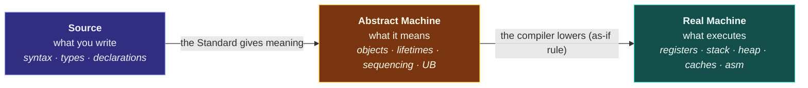
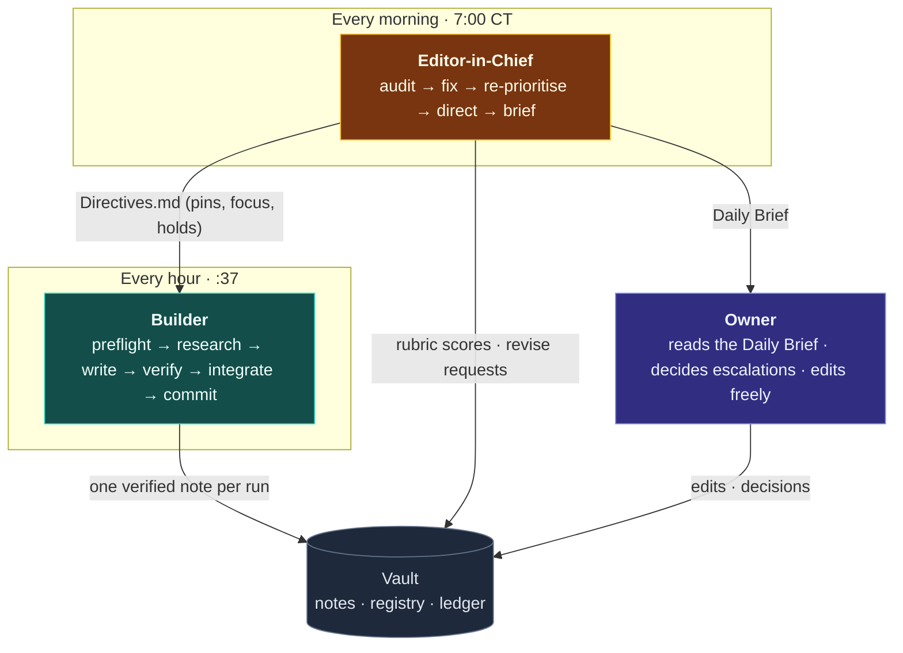

# Charter: Strategy of the CPP Compendium

> [!essence] Mission
> Build a **conceptual atlas of C++**. It explains every feature as the solution to a problem, shows the machinery that makes the solution work, and connects each idea to the whole. The Compendium does not replace the books. It is the map that makes them readable.

## 1 · Why this exists

C++ is usually taught as a list of features: syntax first, rules second, and reasons rarely. So learners memorise without understanding. They can use `std::move` but can't say what moved. They can write `virtual` but can't say what a call costs. The Compendium turns this around:

1. **Problem before feature.** Every note opens with the pressure that forced the feature into existence.
2. **Mechanism before rule.** A rule is presented as a consequence of how the abstract machine and the real machine work, never as a bare commandment.
3. **Map before territory.** Each domain is framed as a whole before its parts are filled in. The reader always knows where they are.

## 2 · Reader

The primary reader is the vault's owner. They are a *learner-builder*: studying C++ formally (COSC coursework), designing curricula (the **CPP Project Continuum**, 35 projects), and a systems thinker who wants the underlying model, not tips. Two secondary readers follow from that: the future students of that curriculum, and the Builder/Editor agents who maintain the vault and must be able to use it as their own reference.

The reader is assumed to be intelligent, not experienced. No note may assume knowledge that isn't linked as a prerequisite.

## 3 · The conceptual frame

Every note is written inside two fixed frames. They are the Compendium's "first principles", and they make hundreds of notes read as one work.

### 3.1 The Three Lenses

C++ code is always three things at once. Every Concept and Mechanism note shows all three.

| Lens | Question it answers | Note section |
|---|---|---|
| **Source** | What do I write, and what does the compiler accept? | *In Code* |
| **Abstract Machine** | What does the Standard say this *means*? | *Mechanics* |
| **Real Machine** | What does the hardware actually do? What does it cost? | *Under the Hood* |

Most confusion in C++ comes from mixing the lenses. For example, someone reasons about "the stack" (real machine) when the question is about lifetime (abstract machine). Notes name the lens they are speaking in.

### 3.2 The Five Tensions

Every design decision in C++ is a position taken on one or more of five permanent tensions. Every note says which tensions its topic resolves and how (tag `tension/<name>`).

| Tension | The pull in each direction | Canonical examples |
|---|---|---|
| `abstraction-vs-control` | High-level expression ⟷ direct command of the machine | zero-overhead principle, templates, inline |
| `value-vs-identity` | Objects as interchangeable values ⟷ objects as unique entities with addresses | copy/move, references, polymorphism |
| `compile-time-vs-run-time` | Decide early (fast, rigid) ⟷ decide late (flexible, costly) | templates vs virtual, constexpr, concepts |
| `safety-vs-performance` | Checked, defined behavior ⟷ unchecked speed | UB, bounds checks, `at()` vs `[]` |
| `compatibility-vs-evolution` | Never break old code ⟷ fix old mistakes | C heritage, arrays, implicit conversions |

## 4 · Product line

The Compendium publishes **eleven products**. Each has a fixed anatomy (see [[Framework]]) and a place in the vault.

| # | Product | Archetype | Purpose | Lives in |
|---|---|---|---|---|
| 1 | **Home and Atlas** | — | One-screen orientation; the whole language on one canvas | `Home`, `01 Maps/Atlas.canvas` |
| 2 | **Domain Maps** | `map` | The conceptual frame of a domain: its question, its core tension, its concept graph | `01 Maps/` |
| 3 | **Dossiers** | `concept` | Deep treatment of one idea through the Three Lenses | `02 Notes/<domain>/` |
| 4 | **Mechanism X-Rays** | `mechanism` | Step-by-step anatomy of a process (dispatch, lookup, linking, unwinding…) | `02 Notes/<domain>/` |
| 5 | **Idiom Cards** | `idiom` | A reusable solution shape: intent, structure, consequences | `02 Notes/<domain>/` |
| 6 | **Hazard Files** | `pitfall` | A failure mode: symptom → root cause → detection → fix → prevention | `02 Notes/<domain>/` |
| 7 | **Decision Guides** | `comparison` | X vs Y: a matrix and a decision flowchart | `02 Notes/<domain>/` |
| 8 | **Evolution Timelines** | `evolution` | What a standard changed, and why | `02 Notes/16 Evolution of C++/` |
| 9 | **Source Guides** | `guide` | How to read each book and reference, mapped to the Atlas | `03 Sources/` |
| 10 | **Paths and the Continuum Bridge** | `path` | Ordered routes through the Atlas, joined to the 35 practice projects | `04 Practice/` |
| 11 | **Management products** | system | Coverage, Ledger, Daily Brief, Directives, dashboards | `00 System/` |

**Planned future product lines** (the Editor opens them once the core Atlas passes 60% coverage):
- *Recall Decks*: export every `[!quiz]` into Anki-compatible decks for spaced repetition.
- *Printable Compendium*: a typeset PDF edition of reviewed notes, generated from the vault.
- *Deep Dives*: multi-note series on large subsystems (the memory model, overload resolution, the ranges library).
- *C++26 Watch*: tracking the new standard as implementations land.

## 5 · Operating model

Two scheduled agents run the Compendium, with the vault's owner as publisher.

- **Builder** (hourly): follows [[Run Protocol]]. It writes one new note (AUTHOR), repairs a sent-back note (REVISE), or raises the weakest note one level (DEEPEN, every 6th run).
- **Editor** (daily): follows [[Audit Protocol]]. It scores new work against the rubric, fixes or returns it, adjusts the queue through [[Directives]], promotes stable notes to *evergreen*, grows the registry, and publishes the Daily Brief.
- **Owner:** edits anything at any time. Agents never overwrite uncommitted human edits.

## 6 · Roadmap

| Phase | Waves | Target | Exit criterion |
|---|---|---|---|
| 1 · Frame | 0 | All 17 Domain Maps | Every domain has its question, tension and concept map |
| 2 · Spine | 1 | ~50 foundational notes + source guides | A learner can walk from "what is an object" to RAII and virtual dispatch |
| 3 · Proficiency | 2 | ~100 working-knowledge notes | Covers everything the Continuum's Tiers 1–5 exercise |
| 4 · Advanced | 3 | ~95 advanced notes | Templates, memory model, performance, design |
| 5 · Specialist | 4 | ~30 expert notes | Lock-free, SIMD, SFINAE, allocators, coroutines |
| 6 · Perpetual | — | Deepen, promote, extend | Registry grows (C++26, library deep-dives); new product lines open |

At about 24 Builder runs a day, the first pass of the Atlas completes in roughly two weeks. After that, the Compendium's value compounds through DEEPEN cycles and Editor promotions.

## 7 · Success metrics

Measured by `cc.py audit health` and reported in every Daily Brief:

| Metric | Target |
|---|---|
| Health score | ≥ 85 / 100 |
| Average rubric score of audited notes | ≥ 17 / 21 |
| Code blocks that compile and behave as claimed | 100% |
| Copy-guard hits (verbatim book text) | 0 |
| Orphan notes (no inbound links) | 0 |
| Evergreen share of written notes (after phase 3) | ≥ 40% |

## 8 · Non-negotiables

1. **Correctness over coverage.** A wrong note is worse than a missing one. If in doubt, verify against cppreference or the draft standard, or leave the claim out.
2. **Paraphrase and cite; never reproduce.** The books are for research. Notes are original writing with precise citations. The copy-guard enforces this.
3. **Every code claim is compiled.** If a note says something compiles, runs, prints or is UB, a verified snippet demonstrates it.
4. **Never destroy human work.** Agents commit uncommitted edits as they are, and never revert or rewrite a note the owner is editing.
5. **Version-label everything.** Every feature carries the standard that introduced or changed it (C++98 … C++26).
