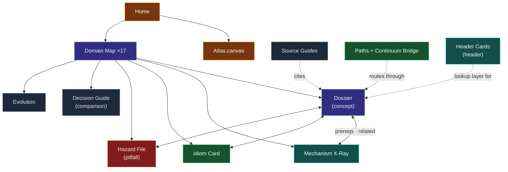
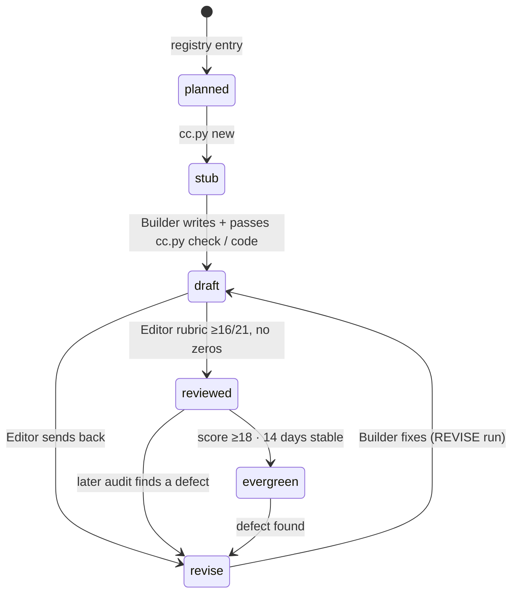

# Framework: Structure of the Knowledge Base

> [!essence] The Framework defines what a note *is*: its archetype, anatomy, metadata, location, links and life cycle. The machine-readable half lives in `tools/data/` (`topics.yaml`, `archetypes.yaml`, `domains.yaml`) and is enforced by `cc.py check`.

## 1 · Ontology



**Topic.** One registry entry (`tools/data/topics.yaml`) = one note. The registry holds *intent* (what the Compendium will contain). The note's frontmatter holds *state*.
**Domain.** One of 17 regions (D00–D16) plus Sources (SRC), Practice (PRX) and Standard Headers (HDR). Each domain answers one question (see `domains.yaml` and Home).
**Archetype.** The note's form. Choose the archetype by the *question the reader brings*:

| Reader's question | Archetype | Product |
|---|---|---|
| "What is X, and why does it exist?" | `concept` | Dossier |
| "What exactly happens when…?" | `mechanism` | Mechanism X-Ray |
| "How do experts usually solve…?" | `idiom` | Idiom Card |
| "Why did this break, and how do I stop it?" | `pitfall` | Hazard File |
| "Should I use X or Y?" | `comparison` | Decision Guide |
| "What changed in C++NN?" | `evolution` | Evolution Timeline |
| "How do I read / use this resource?" | `guide` | Source or Tool Guide |
| "In what order should I learn this?" | `path` | Learning Path |
| "What is this whole area about?" | `map` | Domain Map |
| "What's the exact signature / recipe in `<header>`?" | `header` | Header Card |

## 2 · Anatomy per archetype

Every note begins with frontmatter, then an `# H1` equal to the title, then an `> [!essence]` callout: one or two sentences that would survive if everything else were deleted. The H2 sections below are **required and in this order** (enforced). Sections may contain H3 subsections.

### `concept`: Dossier (≥ 1100 words · ≥1 diagram · ≥1 table · ≥2 C++ blocks · ≥3 quiz)
| Section | Lens | Contents |
|---|---|---|
| The Problem | — | The pressure that forced this idea into existence. Derive it: *constraint → consequence → design*, using an `[!principle]` callout. Name the tension(s). |
| Mental Model | — | ONE model the reader can carry: a diagram plus a short analogy, stated with its limits. |
| Mechanics | Abstract machine | Precise rules in plain language; tables for rule sets; `[!standard]` callouts for exact wording, paraphrased with a section reference. |
| Under the Hood | Real machine | Layout, codegen, cost. Box diagrams or annotated assembly (use `cc.py asm`). |
| In Code | Source | 2–4 minimal, compiled examples with numbered annotations. |
| Pitfalls | — | `[!trap]` / `[!ub]` callouts linking to Hazard Files. |
| Evolution | — | What each standard changed (table or list), newest last. |
| Connections | — | Prerequisites, what this enables, siblings, Continuum projects. |
| Check Yourself | — | ≥3 folded `[!quiz]-` items: one recall, one explain-why, one predict-the-output/spot-the-bug. |
| Sources | — | Book citations with section and page; web references. |

### `mechanism`: Mechanism X-Ray (≥ 1000 words · ≥2 diagrams · ≥2 C++ blocks · ≥3 quiz)
The Problem · Mental Model · **Step by Step** (numbered stages, each with its input, its transformation and its output, plus a sequence or flow diagram) · Under the Hood · In Code · **Consequences** (what the mechanism explains: costs, rules, and pitfalls it produces) · Connections · Check Yourself · Sources

### `idiom`: Idiom Card (≥ 900 words · ≥1 diagram · ≥1 table · ≥2 C++ blocks · ≥3 quiz)
**Intent** (one sentence) · The Problem (the forces in play) · **Structure** (a class or flow diagram of the parts) · In Code (canonical version plus a modern-C++ version) · **Consequences** (benefits ⟷ costs table) · **Variations** · Connections · Check Yourself · Sources

### `pitfall`: Hazard File (≥ 700 words · ≥1 diagram · ≥1 table · ≥2 C++ blocks · ≥2 quiz)
**Symptom** (what the programmer observes) · **Root Cause** (the abstract-machine rule that is violated) · **Minimal Reproduction** (a `// cc: ub` or `// cc: ill-formed` block where applicable) · **Detection** (a table of compiler warning / sanitizer / static analysis / review, and what each catches) · **Fix** · **Prevention Rules** (`[!rule]` callouts, linked to the Core Guidelines where they apply) · Connections · Check Yourself · Sources

### `comparison`: Decision Guide (≥ 800 words · ≥1 diagram · ≥1 table · ≥1 C++ block · ≥2 quiz)
**The Question** · **At a Glance** (a matrix: rows are criteria, columns are contenders; mark each cell ✓ / ✗ / ~ with a few words) · **Deep Dive** (one H3 per contender) · **Decision Guide** (a mermaid decision flowchart) · In Code · Connections · Check Yourself · Sources

### `map`: Domain Map (≥ 700 words · ≥1 diagram · ≥1 table)
**Why This Domain Exists** (the domain's question, derived from first principles) · **The Core Tension** (which of the Five Tensions dominate, and how C++ resolves them here) · **Concept Map** (a mermaid graph of the domain's ~8–15 central ideas and their dependencies) · **Learning Route** (an ordered walk with reasons) · **Key Ideas** (5–9 statements the reader should be able to defend) · **Index** (auto-block `<!-- cc:auto:domain-index:Dxx -->`) · Sources

### `evolution`: Evolution Timeline (≥ 800 words · ≥1 diagram · ≥1 table · ≥2 C++ blocks)
Context · Headline Features · **Feature Map** (a table of feature × problem solved × Compendium link) · **Before and After** (paired code) · Impact · Connections · Sources

### `guide` (≥ 600 words · ≥1 table)
Purpose · How to Use It · **Coverage Map** (resource section → Compendium notes) · Connections · Sources

### `path` (≥ 500 words · ≥1 diagram · ≥1 table)
Destination · Route (ordered notes with a *why this next* for each) · Milestones (Continuum projects as checkpoints) · Connections

### `header`: Header Card (≥ 600 words · ≥1 diagram · ≥3 C++ blocks)
A lookup card for one standard header, or a tight family such as `<format>`/`<print>`. Its shape comes from the owner's original reference sheets. Required, in order: **Quick Reference** (signature listing in `// cc: fragment` blocks, one row per member: `expression // input | operation | result (version)`) · **Patterns** (task-shaped recipes, each a compiled block; use `// cc: stmts` for statement-only snippets) · **Key Concepts** (one H3 per rule) · **Best Practices** (numbered, imperative) · **Related Headers** · **Connections** (hub, concept notes, sibling cards) · Sources. Optional sections sit between them: *Class Hierarchy*, decision or matrix tables, *Pitfalls*, *Choosing a Tool*. Frontmatter adds `header: "<name>"`. Cards teach *how*; they link the Dossier for *why* instead of re-deriving it, so no `[!principle]` callout is required. Every card still states its version history in a `[!standard]` callout under the essence.

## 3 · Frontmatter schema

```yaml
---
id: value-categories              # = registry id (stable forever)
title: Value Categories           # = file name = registry title
aliases: [lvalue, rvalue]         # search / link synonyms (may contain :: and <>)
type: concept                     # archetype
domain: D04                       # domain code
tier: 2                           # 1 foundational · 2 proficient · 3 advanced · 4 expert
status: draft                     # stub → draft → (revise ↔) reviewed → evergreen
standard: C++11                   # standard that introduced / last reshaped the topic
prereqs: ["[[Object Lifetime]]"]  # must-know-first (wikilinks)
related: ["[[Move Semantics]]"]   # siblings / what this enables
practice: [22, 25]                # CPP Project Continuum project numbers
tags: [type/concept, domain/d04, tier/2, tension/value-vs-identity]
created: 2026-09-23
updated: 2026-09-23
reviewed: 2026-09-24              # Editor only
score: 18                         # Editor only: rubric total /21
rubric: {accuracy: 3, ...}        # Editor only
revise_notes: "..."               # Editor only, while status = revise
---
```

## 4 · Naming and places

- **File name = title.** Titles are human phrases, not slugs: `Value Categories`, `Pointers vs References`, `unique_ptr`. The characters `: / \ ? * < > | "` are illegal (Windows). Spell library names without `std::` in titles and put the qualified spelling in `aliases` (`"std::move"`).
- **Maps** use the prefix `Map — `; **source guides** use `Guide — `; **paths** use `Path — `; **header cards** use `Header — ` plus the header name without brackets (`Header — iostream`; a family: `Header — map and set`), with the bracketed spelling in `aliases` (`"<iostream>"`).
- **Folders:** `01 Maps/` · `02 Notes/NN Domain Name/` · `03 Sources/` · `04 Practice/` · `05 Headers/` · `00 System/` (protocols, templates, dashboards, ledger, briefs). `__RESOURCES__/` holds the books and the header-card PDF exports (`std-headers-pdf/`, regenerated by `cc.py export-pdf`); it is git-ignored.
- **One note per topic.** If a topic outgrows ~3500 words, the Editor splits it in the registry.

## 5 · Linking rules

1. **Link on first mention** of any registered topic in each section where it matters. Link the canonical title, not an alias: `[[Value Categories|rvalue]]`.
2. **Frontier links are allowed.** Linking a planned (not yet written) registry title is legitimate: it shows in the graph as an unresolved node, marking the frontier. Links to titles that are neither written nor registered are errors.
3. **Connections section:** `Prerequisites → This → Enables`, plus siblings and practice. Keep `prereqs`/`related` frontmatter in sync.
4. **Back-weave:** when a note is written, add a link to it from at least two existing notes where a reader would benefit (usually its prerequisites' *Connections* sections and its Domain Map).
5. **No orphans.** Every written note has at least one inbound link (checked in `audit health`).

## 6 · Tags

`type/<archetype>` · `domain/<code>` · `tier/<n>` · `tension/<name>` (from the Five Tensions) · `std/<c++NN>` for features tied to a standard · `system/...` for system pages. Keep tags few and structural. Topics belong in links, not tags.

## 7 · Life cycle



## 8 · Depth tiers and waves

- **Tier** says how deep the *topic* is (1 foundational to 4 expert). It sets the note's register: tier 1 builds intuition carefully, tier 4 assumes the prerequisites and goes straight to precision.
- **Wave** says *when* it gets written: 0 frame, 1 spine, 2 proficiency, 3 advanced, 4 specialist. The Builder's queue is ordered by wave, then Editor focus, then prerequisite readiness, then domain balance.

## 9 · Machine-checked conventions (summary of `cc.py check`)

| Check | Level |
|---|---|
| Frontmatter present, valid, consistent with the registry | error |
| All required sections present | error |
| `[!essence]` callout at the top | error |
| Minimum words / diagrams / tables / C++ blocks / quizzes | error |
| Every wikilink resolves to a note or a registered topic | error |
| No 12-word run copied verbatim from a book | error |
| `[!principle]` callout present (first-principles derivation) | warn |
| At least 4 distinct links | warn |
| Sources: book citation with location + web reference + at least 3 entries | warn |
| Code blocks ≤ 60 lines | warn |
| `cc.py code`: every C++ block compiles / behaves as its directives claim | error at `finish` |
