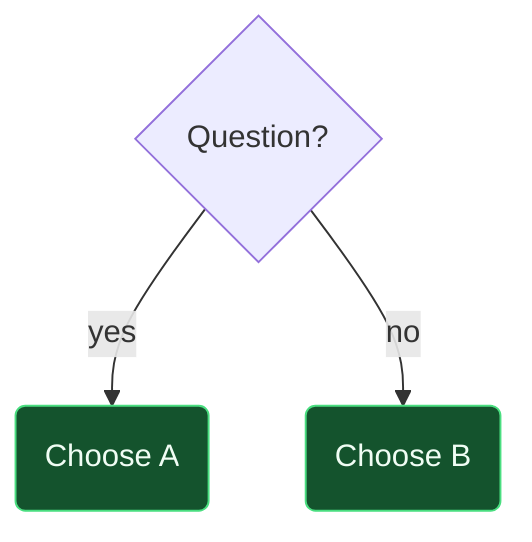

# {{title}}

> [!essence]
> 

## The Question
<!-- The decision the reader faces, and why it matters. -->

## At a Glance
| Criterion | A | B |
|---|---|---|
|  | ✓ | ✗ |

## Deep Dive
### A
### B

## Decision Guide

## In Code

## Connections
- 

## Check Yourself
> [!quiz]- 
> 

> [!quiz]- 
> 

## Sources
- 
