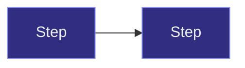

# {{title}}

> [!essence]
> 

## Destination

## Route

```mermaid
flowchart LR
    A["Step"]:::concept --> B["Step"]:::concept
    classDef concept fill:#312e81,stroke:#818cf8,color:#eef2ff
```

| # | Note | Why this next |
|---|---|---|

## Milestones

## Connections
- 
