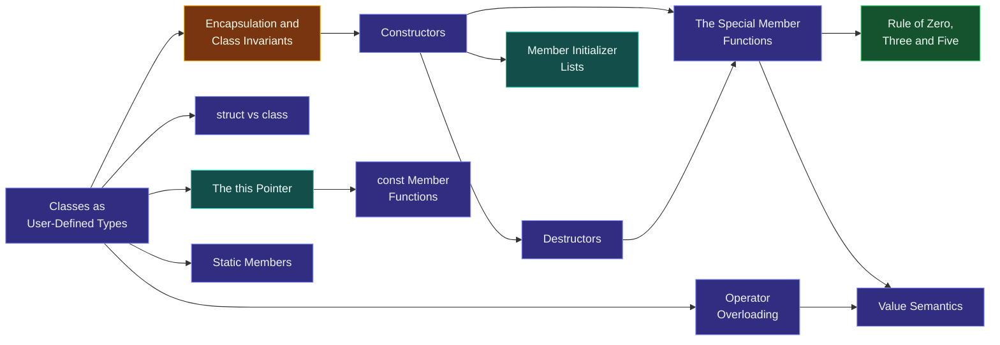

# Map — Classes & Encapsulation

> [!essence]
> *How do we build new types that protect their own invariants?* A class bundles representation with the only code trusted to change it, so that no matter how many ways a program touches an object, it can never observe that object in a state its own rules forbid.

## Why This Domain Exists

[[Map — Functions|The previous domain]] gave a program a way to name and reuse computation, but a free function has no privileged relationship with the data it works on. Anyone who can see a `Vector`'s representation — its size, its pointer to elements — can also misuse it, and a function that forgets to check a precondition corrupts the data with no local trace of the mistake. Data on its own, laid out as a plain aggregate ([[The C++ Object Model — What an Object Is|an object]] built from [[Map — Types & Values|ordinary types]]), carries no rule about which combinations of its members are meaningful.

> [!principle] The invariant problem, from first principles
> 1. **Constraint.** An object's *meaning* often depends on a relationship among its members — a `Vector`'s size can never exceed its capacity; a `Date`'s month is never outside `1..12`. A plain aggregate enforces no such relationship: any code holding the type's definition can read or write every member independently.
> 2. **Consequence.** When every piece of code that touches an object's representation must independently keep that relationship true, a single omission anywhere in the program — not necessarily near the object's declaration — breaks the object, and the resulting bug surfaces far from its cause.
> 3. **Requirement.** The language needs a unit that (a) bundles representation with the only code trusted to change it, (b) makes that representation unreachable from anywhere else, and (c) guarantees the relationship — the **invariant** — holds the instant an object exists, and again after every operation that claims to preserve it.
> 4. **Design.** C++ answers with the **class**: data members are `private` by default, reachable only through member functions and declared `friend`s ([[Encapsulation and Class Invariants]]). A **constructor** is the sole means of bringing an object into existence, and its job is to *establish* the invariant, not merely to fill in fields (Tour §4.3, p. 45); every subsequent public member function may then assume the invariant on entry and must leave it holding on exit.
> 5. **Price.** A class now carries obligations a free function never had: it must decide what copying, moving, comparing and destroying it mean, and every member function becomes a place the invariant must be re-verified, not just a place data gets written. This domain's content is how C++ discharges those obligations for (close to) zero run-time cost.

## The Core Tension

> [!tension] abstraction ⟷ control
> Encapsulation asks a class's users to stop reasoning about representation and start reasoning about interface — [[Encapsulation and Class Invariants|the point of hiding data]] in the first place. But nothing is hidden from the compiler or the machine: a member-function call is an ordinary function call with one extra, invisible argument, [[The this Pointer and Member Function Calls|the `this` pointer]] (Primer §7.1, p. 258), and a class's size is still just the sum of its members' sizes plus padding. The abstraction is free to *use*; it is never free to *build*.

> [!tension] value ⟷ identity
> Every class this domain builds must answer a question a free function never faced: when you copy me, do you get an independent value, or a second name for the same identity? [[The Special Member Functions|Five compiler-generated operations]] — copy constructor, copy assignment, move constructor, move assignment, destructor — make that answer explicit, and [[Rule of Zero, Three and Five|the idiom that governs them]] is this domain's central piece of design advice. [[Map — Ownership & Move Semantics|The next domain]] takes the identity side of that answer and builds ownership on top of it.

## Concept Map

Arrows read "is needed to understand".

**Encapsulation and Class Invariants is the hub.** Classes as user-defined types feeds into it; constructors, destructors, the `this` pointer and `const` member functions are the mechanics that establish and maintain it; the special member functions and the idiom that governs them decide whether the resulting type behaves as a value or an identity; and operator overloading is how that value, once decided, joins the language's own notation.

## Learning Route

1. [[Classes as User-Defined Types]]: the vocabulary shift — a class is a type you define, complete with its own operations, not just a bundle of fields with a name.
2. [[Encapsulation and Class Invariants]]: the domain's central idea — what an invariant is, and why hiding representation is what makes enforcing one possible at all.
3. [[struct vs class]]: the one mechanical difference behind two keywords for the same kind of thing — default access, nothing more.
4. [[Constructors]]: how an object is born already satisfying its invariant, and what it means for construction to fail.
5. [[Member Initializer Lists and Initialization Order]]: the exact order data members are built in — declaration order, never initializer-list order — and why getting it wrong is a trap, not an error.
6. [[Destructors]]: construction's matching half — what runs, when, and why it never runs at all if the constructor threw.
7. [[The this Pointer and Member Function Calls]]: what a member-function call actually passes under the hood, and why a `static` member has none of it.
8. [[const Member Functions and mutable]]: how `const` on a member function changes the type of `this`, and the narrow, deliberate escape hatch `mutable` provides.
9. [[Static Members]]: state and operations that belong to the class itself, shared by every object of it, not to any one instance.
10. [[The Special Member Functions]]: the five operations — copy, move (each a constructor and an assignment), and destroy — every class has, whether you wrote them or not.
11. [[Rule of Zero, Three and Five]]: the idiom that turns "which special members does this class need?" from a judgment call into a mechanical decision.
12. [[Operator Overloading]] → [[Comparisons and the Spaceship Operator]]: letting a class join the language's own notation, and the C++20 operator that can generate the other five comparisons from one definition.
13. [[Value Semantics]]: what it means, in the end, for an object to behave like a value rather than an identity — the question the whole domain has been building toward.
14. [[Conversion Operators and explicit]]: when a class is allowed to stand in for another type, and how `explicit` closes the door on conversions nobody asked for.
15. [[Friends]]: the narrow, named exception to encapsulation — granted by the class itself, never taken from outside it.
16. [[Aggregates and Designated Initializers]]: the classes simple enough to skip constructors entirely, initialized member-by-member instead.
17. Advanced layer: [[When the Compiler Generates Special Members]] — the exact rules the compiler follows to declare, define or delete each special member function on your behalf.

## Key Ideas

1. **A class is a type whose author controls both its representation and its operations.** Members default to `private` (Primer §7.2, p. 268); only member functions and designated `friend`s can name the representation directly, so every place the invariant could be broken is enumerable by reading the class body, not the whole program.
2. **A constructor's job is to establish the invariant, not merely to fill in fields.** If it cannot — the arguments given are unusable — it throws, and because a thrown constructor means the object's lifetime never began, its destructor never runs either ([[RAII]]); an object that exists is always in a state its own invariant permits.
3. **Every non-static member function receives a hidden pointer to the object it acts on.** The implicit `this` is `Sales_data* const` by default and `const Sales_data* const` inside a `const` member function (Primer §7.1, p. 258); a `static` member function has no `this` at all, because it isn't tied to any one object.
4. **A class either has value semantics or identity semantics, and the special member functions are where that choice gets made.** Deleting the copy constructor and copy assignment operator is how a class declares "I am not a value, I am an identity" ([[unique_ptr]]); leaving them to copy every member is how it declares the opposite.
5. **If a class needs to write even one special member function by hand, it probably needs to account for all five.** This is the Rule of Three/Five; its dual, the Rule of Zero, says the better fix is usually to hold any resource through a member that is itself RAII, so the compiler-generated members are already correct (PPP §17.9; [[RAII]]).
6. **Operator overloading lets a user-defined type join the language's own notation, but it does not change what an operator means for built-in types.** `operator+` on a class resolves through the same overload-resolution rules as any other function call (Primer §14.1, p. 552), so a type that overloads `[]` pays exactly the cost of the function call it resolves to — no more.
7. **`struct` and `class` name the same kind of thing; only the default access (and default inheritance) differ.** A `struct`'s members are `public` by default, a `class`'s are `private` by default (Primer §7.2, p. 269) — a style signal about whether the type is "just data" or an encapsulated abstraction, not a difference the compiler otherwise enforces.

| Idea | Developed in |
|---|---|
| What a class is, and why it's private by default | [[Classes as User-Defined Types]] · [[Encapsulation and Class Invariants]] · [[struct vs class]] |
| Bringing an object into being, and keeping it valid | [[Constructors]] · [[Member Initializer Lists and Initialization Order]] · [[Destructors]] |
| The hidden machinery of a member-function call | [[The this Pointer and Member Function Calls]] · [[const Member Functions and mutable]] · [[Static Members]] |
| Value or identity: the special members decide | [[The Special Member Functions]] · [[Rule of Zero, Three and Five]] · [[Value Semantics]] |
| Joining the language's own notation | [[Operator Overloading]] · [[Comparisons and the Spaceship Operator]] · [[Conversion Operators and explicit]] |
| The narrow, named exceptions | [[Friends]] · [[Aggregates and Designated Initializers]] · [[When the Compiler Generates Special Members]] |

## Index

<!-- cc:auto:domain-index:D06 -->
**Tier 1 · Foundational**
- ○ [[Classes as User-Defined Types]] · *concept*
- ○ [[Encapsulation and Class Invariants]] · *concept*
- ○ [[Constructors]] · *concept*
- ○ [[Destructors]] · *concept*
- ○ [[struct vs class]] · *comparison*
- ○ [[Member Initializer Lists and Initialization Order]] · *mechanism*
- ○ [[The this Pointer and Member Function Calls]] · *mechanism*
- ○ [[const Member Functions and mutable]] · *concept*
- ○ [[Static Members]] · *concept*

**Tier 2 · Proficient**
- ○ [[The Special Member Functions]] · *concept*
- ○ [[Rule of Zero, Three and Five]] · *idiom*
- ○ [[Operator Overloading]] · *concept*
- ○ [[Value Semantics]] · *concept*
- ○ [[Friends]] · *concept*
- ○ [[Comparisons and the Spaceship Operator]] · *concept*
- ○ [[Conversion Operators and explicit]] · *concept*
- ○ [[Aggregates and Designated Initializers]] · *concept*

**Tier 3 · Advanced**
- ○ [[When the Compiler Generates Special Members]] · *mechanism*

`█░░░░░░░░░` 1/19 written · legend ○ planned ◐ draft ● reviewed ★ evergreen ⟲ revise
<!-- cc:end -->

## Sources

- Tour §4.3 "Invariants" (p. 45): what a class invariant is, and whose job it is to establish it.
- Tour ch. 6 "Essential Operations" §6.1 (p. 72): the special member functions, generated by the compiler as needed unless you say otherwise.
- Primer §7.1 "Defining Abstract Data Types" (p. 258, p. 262): the exact type of the implicit `this` pointer, and a constructor's job.
- Primer §7.2 "Access Control and Encapsulation" (p. 268, p. 269, p. 270): private by default, the `struct`/`class` convention, and the two benefits encapsulation buys.
- Primer §14.1 "Basic Concepts" (p. 552): what operator overloading changes, and what it deliberately leaves alone.
- PPP §17.9 "Our Vector so far": the Rule of Zero and the Rule of All (three/five), stated as two popular rules of thumb.
- cppreference, *Classes* · *Special member functions* · *Constructors*: https://en.cppreference.com/w/cpp/language/classes · https://en.cppreference.com/w/cpp/language/default_constructor · https://en.cppreference.com/w/cpp/language/constructor
- Draft standard `[class.mem]`, `[class.ctor]`, `[class.dtor]`: https://eel.is/c++draft/class.mem
