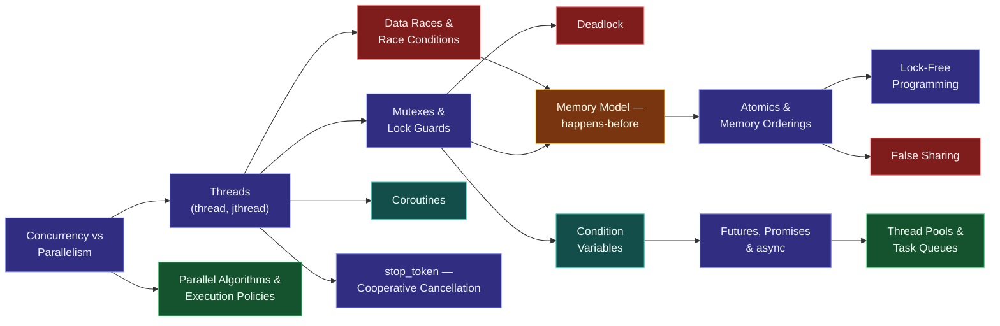

# Map — Concurrency

> [!essence]
> *How do multiple threads of execution share memory without corrupting it?* A modern machine can run several instruction streams at once, but the ordinary rules of the abstract machine — the ones that let you reason about a program one statement at a time — describe only a single stream. This domain is what C++ adds so that two threads touching the same memory don't have to guess.

## Why This Domain Exists

[[Map — Performance & the Machine|A later domain]] asks how to get more work out of one core; this one asks a question that comes first: what does it even *mean* for two cores to touch the same object? Before C++11 the Standard said nothing — multithreading was something the operating system and the compiler's goodwill made possible, not something the language defined.

> [!principle] From "more cores" to "a memory model", in four steps
> 1. **Constraint.** Hardware stopped getting faster per core around the mid-2000s; it kept getting *wider* instead, adding cores. To use them, a program must run more than one instruction stream at the same time.
> 2. **Consequence.** The sequential abstract machine's guarantees — that statements happen in the order the "as-if" rule permits, that a write is simply "there" for the next read — say nothing about a *second* stream reading or writing the same memory location while the first is running. Two unsynchronized threads touching one object isn't a slow program or a wrong value; the Standard makes it a **data race**, and a data race is undefined behavior ([[Data Races and Race Conditions]]), because the optimizer and the hardware are both free to assume it never happens.
> 3. **Requirement.** A language that lets programs use multiple cores needs three things it didn't need before: a way to launch and name independent instruction streams ([[Threads — thread and jthread]]); a precise answer to *when a write by one thread becomes visible to a read by another* ([[The C++ Memory Model — happens-before]]); and tools that make a chosen sequence of operations indivisible from every other thread's point of view ([[Mutexes and Lock Guards]], [[Atomics]]).
> 4. **Design.** C++11 shipped all three at once: `thread`, a formal memory model, and the synchronization primitives built on it. Everything above ordinary sequential code — [[Futures, Promises and async|futures and async]], [[Parallel Algorithms and Execution Policies|parallel algorithms]] (C++17), [[Coroutines]] (C++20) — is a task-based layer built *on top of* that foundation, so most code never names a thread or an atomic directly (Tour §18.1, p. 237; §18.2, p. 238).

**Price.** Synchronization is not free, and the tax is structural, not incidental. Pikus's reading of Amdahl's Law makes the shape of it precise: for a program that is a fraction *p* parallel and (1 − *p*) serial, adding processors speeds up only the parallel part — if just 1/256th of the runtime is spent serialized (inside a lock, or contending for one shared variable), a 256-processor machine still tops out at roughly half its theoretical throughput, no matter how the rest is optimized (Pikus ch. 6, "What is needed to use concurrency effectively?", p. 201). This domain's content — locks, atomics, lock-free structures, task-based abstractions — is the set of tools for keeping that serialized fraction as small as correctness allows.

## The Core Tension

> [!tension] safety ⟷ performance
> An ordinary, unsynchronized read or write is the fastest access the hardware can do — and the moment a second thread might touch the same object, it is also undefined behavior. C++ does not resolve this by making every access safe by default (that would tax single-threaded code, which is the common case) or by making the fast path legal for shared data (that would make correctness unverifiable). Instead it draws a line: private data gets full hardware speed; shared data must be named as shared — `atomic`, or protected by a `mutex` — and pays for the ordering it declares it needs, no more ([[Memory Orderings]]).

> [!tension] abstraction ⟷ control
> The library spans the whole spectrum on purpose. `thread`, `mutex` and explicit `atomic` orderings sit close to the operating system: you decide how many threads exist and exactly what each one waits for, built directly on the same facilities the OS itself offers (Tour §18.2, p. 238). `async`, the parallel algorithms and coroutines are task-based: you describe *what* should happen concurrently and the implementation picks how many threads to use. Stroustrup's advice for the domain is a direct statement of the tension: "work at the highest level of abstraction that you can afford" (Tour §18.7, p. 253) — reach for a raw thread only when no higher layer fits.

## Concept Map

Arrows read "is needed to understand".

**The memory model** is the hub: data races violate it, mutexes and atomics are how you satisfy it, and everything downstream — lock-free code, false sharing, even how much a compiler may reorder your loads and stores — is a consequence of exactly what it does and doesn't promise.

## Learning Route

1. [[Concurrency vs Parallelism]]: fixes the vocabulary first — running many tasks at once and running one task faster on many cores are different questions with different answers.
2. [[Threads — thread and jthread]]: the unit everything else schedules, waits for and synchronizes.
3. [[Data Races and Race Conditions]]: the failure mode that exists the moment two threads share memory with no discipline at all — every later topic is a way to prevent it.
4. [[Mutexes and Lock Guards]] → [[Deadlock]]: the basic serialization tool, and the price of holding more than one at a time.
5. [[Condition Variables]] → [[Futures, Promises and async]]: coordinating threads around a shared predicate, then around a result, without hand-rolled polling.
6. [[The C++ Memory Model — happens-before]]: the hub — the exact rule for which of another thread's writes you are guaranteed to see.
7. [[Atomics]] → [[Memory Orderings]]: lock-free access to a single object, and how much of the memory model's ordering you choose to pay for.
8. [[Lock-Free Programming Basics]] and [[False Sharing]]: the payoff atomics make possible, and a real-hardware cost the abstract machine doesn't mention.
9. [[Thread Pools and Task Queues]]: the idiom that amortizes the one cost every thread shares — it is expensive to create.
10. [[Cooperative Cancellation with stop_token]]: asking a running thread to stop without killing it out from under its own stack.
11. [[Parallel Algorithms and Execution Policies]] and [[Coroutines]]: the two highest layers — hide threads inside a standard algorithm call, or replace OS threads with cooperative suspension entirely.

## Key Ideas

1. **A data race is undefined behavior, not an observable bug.** Two threads touching one memory location without synchronization, at least one of them a write, isn't "the wrong value" — the Standard makes no claim about the program's behavior at all, which licenses the optimizer to assume it never happens ([[Data Races and Race Conditions]]).
2. **Synchronization is what makes one thread's write visible to another thread's read.** The memory model's *happens-before* relation is the only thing that connects two threads' timelines; without a synchronizing operation linking them, "earlier in wall-clock time" does not mean "visible" ([[The C++ Memory Model — happens-before]]).
3. **A mutex buys correctness by making a thread wait**, so the same tool that prevents a race causes [[Deadlock]] the moment two threads acquire two mutexes in different orders — the fix is a total order on lock acquisition, not a faster lock.
4. **"Indivisible" and "ordered" are separate guarantees.** An atomic operation is indivisible by definition, but the default ordering (`seq_cst`) additionally buys a single total order across every atomic in the program; relaxing it in [[Memory Orderings]] keeps the indivisibility and sells back only the ordering you can prove you don't need.
5. **Amdahl's Law, not the number of cores, sets the ceiling.** A program that spends even a small fraction of its time serialized — inside a lock, or contending for one shared variable — caps its own speedup regardless of how many threads you add; the discipline of this domain is shrinking that fraction, not growing the thread count.
6. **The library gives you both ends of the abstraction spectrum on purpose.** `thread` and `atomic` are systems-level and put you in charge of ordering; `async`, the parallel algorithms and coroutines are task-based and let the implementation choose the thread count — the domain's own advice is to reach for the highest layer that solves the problem.
7. **Some costs never appear in the language's model at all.** [[False Sharing]] makes two threads' independent atomics contend as if they touched shared data, purely because they sit on the same cache line — the memory model is silent about it because cache lines aren't part of the abstract machine.
8. **A future carries an obligation, not just a value.** A `std::future` produced by `std::async` with the default launch policy can block in its own destructor if nobody has retrieved its result yet — the same RAII discipline that governs ordinary objects governs pending task results too.

| Idea | Developed in |
|---|---|
| The vocabulary: tasks, threads, parallelism | [[Concurrency vs Parallelism]] · [[Threads — thread and jthread]] |
| What goes wrong with no discipline | [[Data Races and Race Conditions]] · [[Deadlock]] |
| Blocking synchronization | [[Mutexes and Lock Guards]] · [[Condition Variables]] · [[Futures, Promises and async]] |
| The foundation everything else satisfies | [[The C++ Memory Model — happens-before]] |
| Lock-free synchronization | [[Atomics]] · [[Memory Orderings]] · [[Lock-Free Programming Basics]] |
| Real-machine costs | [[False Sharing]] |
| Task-based layers | [[Thread Pools and Task Queues]] · [[Cooperative Cancellation with stop_token]] · [[Parallel Algorithms and Execution Policies]] · [[Coroutines]] |

## Index

<!-- cc:auto:domain-index:D12 -->
**Tier 1 · Foundational**
- ○ [[Concurrency vs Parallelism]] · *comparison*

**Tier 2 · Proficient**
- ○ [[Threads — thread and jthread]] · *concept*
- ○ [[Data Races and Race Conditions]] · *pitfall*
- ○ [[Mutexes and Lock Guards]] · *concept*
- ○ [[Deadlock]] · *pitfall*
- ○ [[Condition Variables]] · *mechanism*
- ○ [[Futures, Promises and async]] · *concept*

**Tier 3 · Advanced**
- ○ [[The C++ Memory Model — happens-before]] · *mechanism*
- ○ [[Atomics]] · *concept*
- ○ [[Thread Pools and Task Queues]] · *idiom*
- ○ [[Cooperative Cancellation with stop_token]] · *concept*
- ○ [[False Sharing]] · *pitfall*
- ○ [[Parallel Algorithms and Execution Policies]] · *concept*

**Tier 4 · Expert**
- ○ [[Memory Orderings]] · *mechanism*
- ○ [[Lock-Free Programming Basics]] · *concept*
- ○ [[Coroutines]] · *mechanism*

`█░░░░░░░░░` 1/17 written · legend ○ planned ◐ draft ● reviewed ★ evergreen ⟲ revise
<!-- cc:end -->

## Sources

- Pikus ch. 6 "Concurrency and Performance", §"What is needed to use concurrency effectively?" (p. 200–201): Amdahl's Law and why reducing shared-data contention, not adding threads, is the actual lever.
- Pikus ch. 8 "Concurrency in C++", §"Concurrency support in C++11" (p. 294–295) and §"Concurrency support in C++17" (p. 296): what the Standard added, wave by wave — thread, mutex, condition_variable, atomic, async in C++11; scoped_lock, shared_mutex, hardware interference sizes and parallel algorithms in C++17.
- Tour ch. 18 "Concurrency", §18.1 "Introduction" (p. 237) and §18.2 "Tasks and threads" (p. 238): concurrency for throughput or responsiveness, and the memory model as the reason avoiding data races is enough to reason about a concurrent program naively.
- Tour §18.7 "Advice" (p. 253): "work at the highest level of abstraction that you can afford."
- cppreference, *Memory model* and *Multi-threaded executions and data races*: https://en.cppreference.com/w/cpp/language/memory_model · https://en.cppreference.com/w/cpp/language/multithread
- Draft standard, `[intro.multithread]`: https://eel.is/c++draft/intro.multithread
