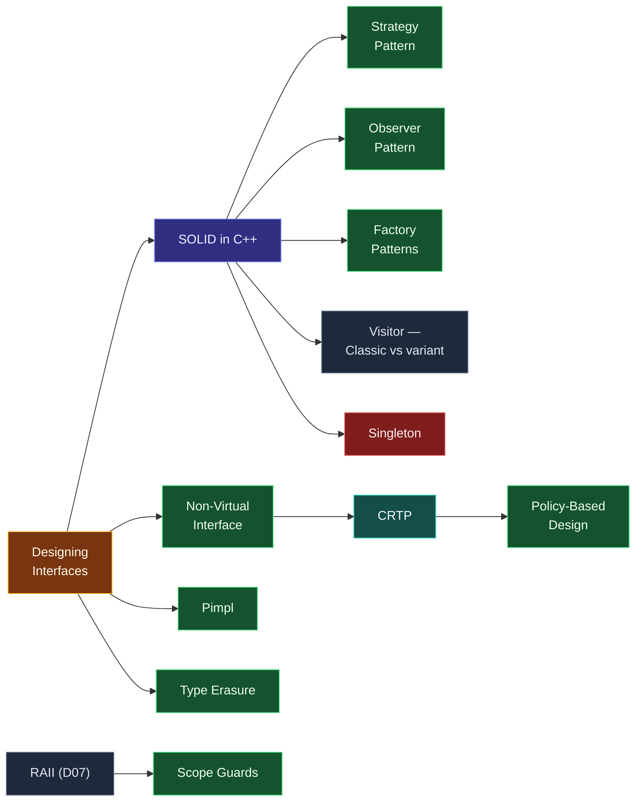

# Map — Design & Idioms

> [!essence]
> Which recurring shapes of solution survive contact with real programs? This domain doesn't add new language features; it names the arrangements of the features you already have — interfaces, virtual dispatch, RAII, templates — that keep solving the same handful of forces, and it prices each one honestly enough that you reach for it only when the force is actually present.

## Why This Domain Exists

[[Map — Inheritance & Polymorphism|One earlier domain]] gave you [[Virtual Dispatch — vptr and vtable|dynamic dispatch]]; [[Map — Ownership & Move Semantics|another]] gave you [[RAII]] and move semantics. Those are raw materials, not designs. The same virtual function can be wired into a dozen different class arrangements, and only a few of those arrangements solve any given problem well.

> [!principle] From a recurring problem to a named shape
> 1. **Constraint.** A handful of problems recur across unrelated programs: vary a behavior without editing the caller, decouple who creates an object from who uses it, tell several interested parties about one change, hide an implementation so it can change without forcing every caller to recompile. No single feature — a class, a virtual function, a template — solves any of these by itself; each is only a building block.
> 2. **Consequence.** Left unnamed, every programmer reassembles a shape for these problems from the same blocks, slightly differently each time. Two solutions to the identical force then look unrelated on the page: a reviewer cannot recognize the shape and must re-derive its trade-offs from scratch, every time.
> 3. **Requirement.** The recurring shapes need names, a fixed cast of participants, and an honest statement of what each shape costs — so that naming the shape also names its price.
> 4. **Design.** An **idiom** (a *pattern*, when several collaborating classes are involved) is exactly this: a named arrangement of ownership and dispatch built from the primitives the earlier domains supplied — [[Strategy Pattern|Strategy]], [[Observer Pattern|Observer]] and [[Factory Patterns|Factory]] are three such arrangements. C++ additionally lets the same shape be resolved at compile time instead of run time — [[CRTP]] in place of a virtual base, [[Policy-Based Design]] in place of an injected object — because the language exposes control over *when* dispatch happens, not only *whether* it happens.
> 5. **Price.** A name is not a license. Every idiom buys structure at a cost: an indirection, a template-instantiation blow-up, a hidden allocation, or, in [[Singleton — and Why to Avoid It|Singleton's]] case, global mutable state wearing a design pattern's clothes. This domain's real content is the prices, not the shapes — which is why its question is phrased as *survival*: a shape earns its place only when the force it names is genuinely present and its price is genuinely worth paying.

## The Core Tension

> [!tension] compile-time ⟷ run-time
> Every idiom here answers the same question twice: *when is the varying behavior selected?* [[Strategy Pattern|Strategy]], [[Observer Pattern|Observer]] and [[Factory Patterns|Factory]] select it at run time, through a [[Virtual Dispatch — vptr and vtable|vtable]]: one binary, and callers plug in new behavior without recompiling anything. [[CRTP]] and [[Policy-Based Design]] select it at compile time, through template instantiation: no indirection and no vtable, but every combination of behaviors is a distinct type, fixed for good once the program is built. [[Type Erasure]] tries to keep the run-time flexibility of the first group while presenting the value semantics of the second.

> [!tension] abstraction ⟷ control
> An idiom is an abstraction boundary, and this domain fixes that boundary in two different places. [[Non-Virtual Interface|NVI]] fixes it inside one class: the public surface is non-virtual and fixed, the customization point is a private virtual function. [[Pimpl]] fixes it at the compilation boundary: callers see a pointer to a type whose definition lives in a `.cpp` file they never include. Both buy the freedom to change what's behind the boundary without disturbing callers; both pay for it, in an extra call or an extra allocation and a rebuild rule of their own.

## Concept Map

Arrows read "is needed to understand".

**Designing Interfaces** is the hub: every idiom in this domain is, at bottom, a specific answer to "what should this boundary look like?" [[SOLID in C++|SOLID]] names the forces that the classic run-time patterns satisfy; [[Non-Virtual Interface|NVI]] leads toward the compile-time branch through [[CRTP]] and [[Policy-Based Design]]; [[Scope Guards]] is the domain's simplest member, a direct application of [[RAII]] from the ownership domain.

## Learning Route

1. [[Designing Interfaces — Easy to Use Correctly]]: fixes what "good" means for the interfaces every idiom below tries to produce.
2. [[SOLID in C++]]: names the forces — single responsibility, open/closed, dependency inversion among them — that the specific patterns exist to satisfy.
3. [[Scope Guards]]: the simplest idiom in the domain, a direct application of [[RAII]] to an arbitrary cleanup action, and a safe first example of "idiom" as a concept.
4. [[Strategy Pattern]]: the canonical run-time answer to the Open/Closed Principle — vary behavior by injecting an interface instead of editing a class.
5. [[Observer Pattern]]: the notification counterpart to Strategy — decouple a subject from the parties that must react when it changes.
6. [[Factory Patterns]]: closes the loop on Dependency Inversion by decoupling *what gets created* from *what uses it*.
7. [[Singleton — and Why to Avoid It]]: looks like it solves "exactly one instance, globally reachable" but violates the principles the last three patterns uphold — learn its shape to recognize and refuse it, not to reach for it.
8. [[Non-Virtual Interface]]: tightens the virtual interfaces Strategy, Observer and Factory all rely on, separating the promise (public, non-virtual) from the customization point (private, virtual).
9. [[Pimpl]]: moves the same interface/implementation split to the compilation boundary, trading an indirection for a stable ABI and a faster rebuild.
10. [[Visitor — Classic vs variant]]: tests whether the classic double-dispatch shape still earns its keep against `std::variant` and `std::visit`.
11. [[CRTP]]: takes NVI's "fixed interface, customizable step" idea and resolves the customization at compile time instead of run time.
12. [[Policy-Based Design]]: generalizes CRTP-style static customization into independent, composable axes of behavior.
13. [[Type Erasure]]: buys back the run-time value semantics Strategy and Factory have, without paying for inheritance.

## Key Ideas

1. **An idiom answers one specific recurring force — reach for it only when that force is actually present.** [[Strategy Pattern|Strategy]] answers "vary behavior without touching callers"; picking it because the code needs that, not because the name is familiar, is what keeps the shape from becoming ceremony.
2. **Most idioms in this domain exist in two versions, one on each side of the compile-time ⟷ run-time tension.** [[Strategy Pattern|Strategy]] dispatches through a vtable at run time; [[CRTP]] dispatches through template instantiation at compile time — the same shape, opposite cost profile.
3. **[[SOLID in C++|SOLID]] names the forces; the patterns are instances of satisfying them.** The Open/Closed Principle motivates [[Strategy Pattern|Strategy]]; the Dependency Inversion Principle motivates [[Factory Patterns|Factory]].
4. **A pattern survives contact with real code only if its price gets paid back.** [[Singleton — and Why to Avoid It|Singleton]] is the domain's cautionary case: it buys global access at the cost of hidden coupling and state that resists testing.
5. **Interface and implementation separate at two different boundaries.** [[Non-Virtual Interface|NVI]] separates them inside one class (public non-virtual, private virtual); [[Pimpl]] separates them across a compilation boundary, behind a pointer to a type that rebuilds on its own.
6. **Type erasure buys value semantics for unrelated types at the cost of an indirection per call**, extending "program to an interface" past inheritance to types that never agreed to share a base class.
7. **A comparison earns its place by a real trade-off, not nostalgia.** [[Visitor — Classic vs variant|Visitor's]] classic virtual double dispatch stays open to new operations at the cost of no exhaustiveness check; `std::variant` plus `std::visit` inverts that trade, closing the type set but catching a missed case at compile time.

| Idea | Developed in |
|---|---|
| What makes an interface good | [[Designing Interfaces — Easy to Use Correctly]] |
| The forces behind the patterns | [[SOLID in C++]] |
| Run-time vs. compile-time customization | [[Strategy Pattern]] · [[CRTP]] · [[Policy-Based Design]] |
| Notification and creation shapes | [[Observer Pattern]] · [[Factory Patterns]] |
| The anti-pattern | [[Singleton — and Why to Avoid It]] |
| Interface/implementation boundaries | [[Non-Virtual Interface]] · [[Pimpl]] |
| Value semantics without inheritance | [[Type Erasure]] |
| Classic vs. modern dispatch | [[Visitor — Classic vs variant]] |
| The base idiom | [[Scope Guards]] |

## Index

<!-- cc:auto:domain-index:D15 -->
**Tier 2 · Proficient**
- ○ [[Designing Interfaces — Easy to Use Correctly]] · *concept*
- ○ [[Scope Guards]] · *idiom*
- ○ [[SOLID in C++]] · *concept*
- ○ [[Strategy Pattern]] · *idiom*
- ○ [[Observer Pattern]] · *idiom*
- ○ [[Factory Patterns]] · *idiom*
- ○ [[Singleton — and Why to Avoid It]] · *idiom*

**Tier 3 · Advanced**
- ○ [[Pimpl]] · *idiom*
- ○ [[CRTP]] · *idiom*
- ○ [[Non-Virtual Interface]] · *idiom*
- ○ [[Visitor — Classic vs variant]] · *comparison*

**Tier 4 · Expert**
- ○ [[Type Erasure]] · *idiom*
- ○ [[Policy-Based Design]] · *idiom*

`█░░░░░░░░░` 1/14 written · legend ○ planned ◐ draft ● reviewed ★ evergreen ⟲ revise
<!-- cc:end -->

## Sources

- PPP ch. 12 "Class Design" §12.1 "Design principles" (p. ch12): interface design built up from first principles around a `Shape` hierarchy.
- Tour §5.3 "Abstract Types" (p. 60): the abstract-class-as-interface idiom that every pattern in this domain builds on.
- Tour §5.6 "Advice" (p. 69): "Use abstract classes as interfaces when complete separation of interface and implementation is needed" [CG: C.122] — the design rule this whole domain elaborates.
- Primer §15.4 "Abstract Base Classes" (p. 609): pure virtual functions and abstract base classes, in C++11 terms.
- C++ Core Guidelines, I.25 "Prefer empty abstract classes as interfaces to class hierarchies": https://isocpp.github.io/CppCoreGuidelines/CppCoreGuidelines#ri-abstract
- C++ Core Guidelines, I.3 "Avoid singletons": https://isocpp.github.io/CppCoreGuidelines/CppCoreGuidelines#ri-singleton
