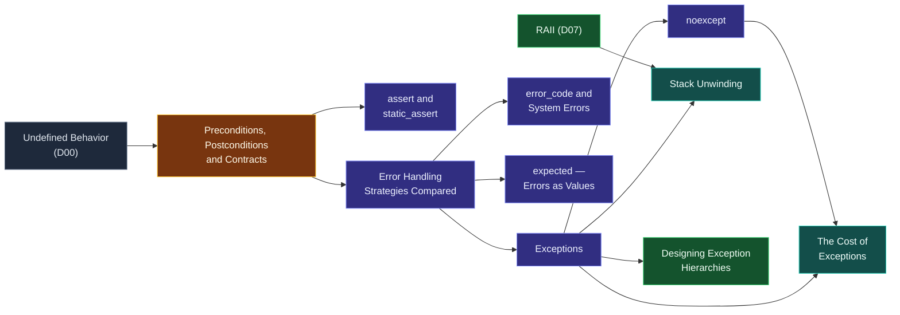

# Map — Errors & Contracts

> [!essence]
> *What happens when an operation cannot do what it promised?* Every interface — a function signature, a constructor, an operator — is a contract: it names what must be true before it runs and what it guarantees when it returns. This domain is the machinery C++ gives you for the moment a contract breaks: report it up the call stack, hand it back as an ordinary value, refuse the input outright, or — if nobody checked — let undefined behavior take over.

## Why This Domain Exists

> [!principle] The four responses, from first principles
> 1. **Constraint.** A function's implementation can only do its job under conditions it assumes: valid inputs, enough memory, a file that exists, an object already in a legal state. Some of those conditions the function can verify itself; others are simply outside its control.
> 2. **Consequence.** When one of those conditions is false, the function cannot produce the result its signature promises. Continuing anyway doesn't fail loudly — it silently produces a wrong answer that looks like a right one, which every caller downstream then trusts.
> 3. **Requirement.** Something must carry "this failed, and here is why" out of the point of failure to a place equipped to respond, and it must do so without making the far more common case — nothing fails — pay for that possibility.
> 4. **Design.** C++ hands the choice of channel to the interface's designer rather than fixing one for the whole language. [[Exceptions]] propagate automatically through however many frames separate the failure from a handler, via [[Stack Unwinding]], for failures the immediate caller usually can't act on. [[error_code and System Errors|Error codes]] and [[expected — Errors as Values|expected<T, E>]] return failure as an ordinary value, for failures the immediate caller is expected to check on the spot. [[assert and static_assert|Assertions]] state the promise itself and check it — sometimes at compile time, sometimes only in debug builds — rather than reporting a failure after the fact. And a documented precondition with no check at all is a deliberate bet: the cost of verifying it on every call is judged worse than the risk of [[Undefined Behavior]] on the rare call that violates it.
> 5. **Price.** No channel is free of trade-offs. Exceptions cost nothing on the path that never throws but a great deal on the one that does ([[The Cost of Exceptions]]); error codes cost discipline, since nothing forces a caller to check one; assertions cost nothing in a release build — which also means they check nothing there; and an unchecked precondition costs nothing at all, until the one call where it was wrong, at which point the abstract machine no longer bounds what happens next. [[Error Handling Strategies Compared|Choosing among them]] is a design decision made once per interface, not a syntax preference made once per program.

## The Core Tension

> [!tension] safety ⟷ performance
> Checking a contract costs something on every call, whether or not the contract is ever broken; not checking costs nothing until the one call where it mattered. [[assert and static_assert|Assertions]] resolve this by making the check removable — compiled out entirely in release builds. Exceptions resolve it by making the cost asymmetric: table-based unwinding means a `try` block that never throws pays almost nothing at run time, and the expense concentrates on the rare path that actually throws ([[The Cost of Exceptions]]). Leaving a precondition unchecked resolves it by paying nothing at all, at the price of [[Undefined Behavior]] if the bet is wrong. The domain doesn't pick a winner; it hands each interface designer the knobs to pick per call site.

> [!tension] compile-time ⟷ run-time
> Some broken promises are knowable before the program ever runs — a type too small for the value it must hold, a template instantiated on the wrong kind of argument. `static_assert` catches these for free, because the check is arithmetic the compiler is already doing ([[assert and static_assert]]). Everything else this domain covers — a malformed input file, a negative size read from a user, a socket that refuses to connect — can only be known while the program executes, which is why [[Exceptions]], [[error_code and System Errors|error codes]] and [[expected — Errors as Values|expected]] all exist downstream of that split.

## Concept Map

Arrows read "is needed to understand".

**Contracts are the hub.** Undefined behavior, established in the previous domain, is the baseline every contract is checked against; assertions test a contract directly; and the moment a contract is broken and can't simply be ignored, [[Error Handling Strategies Compared|choosing a response]] fans out into the three concrete channels — exceptions, error codes, and `expected` — each with its own machinery, and each earning its own note.

## Learning Route

1. [[Preconditions, Postconditions and Contracts]]: names what a "broken promise" actually is — a function's precondition, a postcondition, or a class's invariant — before anything can be said about responding to one.
2. [[Error Handling Strategies Compared]]: the decision framework: which of exceptions, error codes, assertions or termination fits a given interface, and why.
3. [[Exceptions]]: the language's default channel for a failure the immediate caller usually can't act on.
4. [[assert and static_assert]]: the cheapest check there is — compiled out of release builds, or evaluated entirely at compile time.
5. [[noexcept]]: a function's counter-promise not to use the exception channel at all, enforced by termination rather than the type system.
6. [[Stack Unwinding]]: the machinery a `throw` actually runs — which destructors fire, in what order, and why [[RAII]] is what makes that safe.
7. [[Designing Exception Hierarchies]]: how to structure what you throw so a handler can catch at the right granularity.
8. [[The Cost of Exceptions]]: what the "free when not thrown" claim actually costs, measured.
9. [[expected — Errors as Values]]: a return-value channel with the type safety of exceptions and the explicitness of error codes.
10. [[error_code and System Errors]]: the C-heritage channel underneath the standard library's own I/O- and OS-facing failures.

## Key Ideas

1. **Every interface is a contract, and undefined behavior is what happens when nobody checks it.** [[Undefined Behavior]] isn't a separate failure mode from a broken [[Preconditions, Postconditions and Contracts|precondition]]; it is the default response when checking that precondition wasn't judged worth its run-time cost.
2. **Exceptions and error codes solve different placement problems, not the same problem twice.** An error code works when the immediate caller can act on it in one place; [[Exceptions]] exist because most failures have to cross frames the caller can't see through, where re-checking a code at every one of them is exactly what gets skipped under deadline pressure.
3. **Stack unwinding is what makes "throw and let go" safe rather than reckless.** Between a `throw` and its `catch`, [[Stack Unwinding]] runs the destructor of every fully-constructed automatic object on the frames it exits — which is why [[RAII]], not hand-written cleanup code, is the foundation exception-safe code is built on.
4. **`noexcept` is a promise enforced by termination, not by the type system.** The compiler does not verify that a [[noexcept]] function can't throw; if one does anyway, `std::terminate` runs before unwinding ever reaches the caller, so a mistaken `noexcept` turns a recoverable error into an unrecoverable one.
5. **The cost of exceptions is asymmetric by design.** Table-based unwinding means a `try` block that never throws costs essentially nothing at run time beyond binary size; [[The Cost of Exceptions|the expense concentrates entirely on the path that actually throws]] — the opposite of an `if (error)` check repeated on every call whether or not it ever fires.
6. **`assert` and a caught exception check the same kind of thing at different points in a program's life.** [[assert and static_assert|assert]] is a debug-build tripwire for "this should be logically impossible here," usually compiled out of release builds entirely; an exception is a run-time response a released program is still expected to make.
7. **`expected<T, E>` puts the failure back in the return type.** [[expected — Errors as Values]] gives error reporting the type safety of a checked value and the cost model of an ordinary return, at the price that every caller must check it explicitly — nothing propagates it automatically the way an uncaught exception does.

| Idea | Developed in |
|---|---|
| What a broken promise is | [[Preconditions, Postconditions and Contracts]] · [[Undefined Behavior]] |
| Choosing a channel | [[Error Handling Strategies Compared]] |
| The exception channel | [[Exceptions]] · [[Stack Unwinding]] · [[Designing Exception Hierarchies]] · [[The Cost of Exceptions]] |
| Declaring "won't throw" | [[noexcept]] |
| Checking without exceptions | [[assert and static_assert]] |
| The value channel | [[expected — Errors as Values]] · [[error_code and System Errors]] |

## Index

<!-- cc:auto:domain-index:D11 -->
**Tier 1 · Foundational**
- ○ [[Error Handling Strategies Compared]] · *comparison*
- ○ [[Exceptions]] · *concept*
- ○ [[assert and static_assert]] · *concept*

**Tier 2 · Proficient**
- ○ [[Stack Unwinding]] · *mechanism*
- ○ [[Designing Exception Hierarchies]] · *idiom*
- ○ [[noexcept]] · *concept*
- ○ [[expected — Errors as Values]] · *concept*
- ○ [[Preconditions, Postconditions and Contracts]] · *concept*

**Tier 3 · Advanced**
- ○ [[error_code and System Errors]] · *concept*
- ○ [[The Cost of Exceptions]] · *mechanism*

`█░░░░░░░░░` 1/11 written · legend ○ planned ◐ draft ● reviewed ★ evergreen ⟲ revise
<!-- cc:end -->

## Sources

- Tour ch. 4 "Error Handling," §4.2 "Exceptions" (p. 44), §4.3 "Invariants" (p. 45), §4.4 "Error-Handling Alternatives" (p. 46), §4.5.3 "noexcept" (p. 50): the exceptions-vs-error-codes-vs-termination decision, and the case for RAII over hand-written try-blocks.
- Primer §5.6 "Try Blocks and Exception Handling" (p. 193) and §18.1 "Exception Handling," including the `noexcept` specifier (p. 780): the mechanics, in C++11 terms.
- PPP ch. 4 "Errors!," §4.6 "Exceptions" and §4.7.3.1 "Preconditions": error handling built up from first principles, before the standard-library exception hierarchy is available.
- Pikus ch. 12 "Design for Performance," §"Errors and undefined behavior" (p. 420): error handling framed explicitly as an interface contract, and "error handling must be cheap" stated as a performance requirement.
- cppreference, *Exceptions* · *noexcept specifier* · *std::expected* · *Contract assertions*: https://en.cppreference.com/w/cpp/language/exceptions · https://en.cppreference.com/w/cpp/language/noexcept_spec · https://en.cppreference.com/w/cpp/utility/expected · https://en.cppreference.com/w/cpp/language/contracts
- Draft standard `[except]`, `[except.spec]`: https://eel.is/c++draft/except
