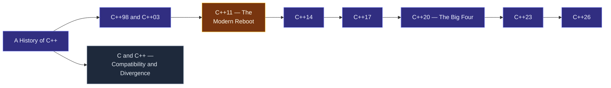

# Map — Evolution of C++

> [!essence]
> C++ has been standardized eight times since 1998, and in every revision the committee has treated one rule as close to inviolable: don't break the code already out there. This domain is the history of that constraint — how a language that started as "C with Classes" in 1979 keeps adding power for forty-odd years without discarding what came before, and where its frontier sits today.

## Why This Domain Exists

[[Map — What C++ Is|The first domain]] fixed what a C++ program *means*: the abstract machine, the as-if rule, the boundary the Standard draws around undefined behavior. That meaning cannot stand still — new hardware, new problems and better designs keep arriving — but it also cannot simply change, because it is a promise already made to code that exists.

> [!principle] The evolution problem, from first principles
> 1. **Constraint.** Millions of programs, built over five decades by organizations that will never coordinate with each other, depend on C++ meaning today what it meant when they were written and linked. Nobody — not even the standards committee — has an inventory of which obscure feature some critical, decades-old system relies on.
> 2. **Consequence.** If a new standard could freely redefine or delete a construct, every recompile against a newer toolchain becomes a bet: code that was correct yesterday might silently do something else, or refuse to build, tomorrow. Vendors could not promise stability to their own customers, and the incentive to ever upgrade a toolchain would collapse.
> 3. **Requirement.** Change must therefore be judged not only by "is this a better design" but by "does this preserve the meaning of every well-formed program that already compiles." Removal has to be earned, not simply decided.
> 4. **Design.** The ISO committee (WG21) makes this explicit policy: deprecate before removing, and only remove after years of warning (§19.2.9 lists what was actually taken out — trigraphs, `auto_ptr`, exception specifications — and it is a short list for fifty years of history). New capability arrives as opt-in syntax layered beside the old, not as a replacement for it. Since 2011 the committee has also shipped on a fixed three-year cycle rather than an open-ended one, so no single release is ever trusted to carry every feature anyone wants.
> 5. **Price.** The language almost never subtracts, only adds. `NULL` sits next to `nullptr`; raw `new`/`delete` sit next to smart pointers; three generations of "how to write a loop" all still compile. Reading C++ means recognizing which era a piece of code belongs to, not just what it does — and every standard leaves that pile one layer taller.

> [!history] The shape of the timeline
> "C with Classes" begins in 1979; C++ is named in 1983 and released commercially in 1985 (Tour §19.1.1, p. 256). The first ISO standard, C++98, is ratified 22–0 in 1998, with a bug-fix revision (C++03) in 2003 (Tour §19.1.3, p. 260). C++11 follows only after a 13-year gap — caused partly by a mistaken belief that ISO required a waiting period before new work could start (Tour §19.1.3, p. 260) — and after C++11 the committee deliberately adopts Herb Sutter's "train model": ship every three years, alternating an intentionally minor release with an intended-major one (Tour §19.1.3, p. 261). WG21 finished resolving ballot comments on C++26 at its March 2026 meeting in London, headlined by static reflection, contracts and the `std::execution` framework; cppreference records its final draft as N5050 (2026-06-01), and WG21's working draft has already moved on toward a C++29 revision (cppreference, *History of C++*).

## The Core Tension

> [!tension] compatibility ⟷ evolution
> Every proposal WG21 accepts is a trade against every program that already compiles. Favor compatibility absolutely and the language calcifies, unable to fix its own early mistakes (`NULL`, array decay, implicit narrowing conversions all persist for exactly this reason). Favor evolution freely and the ecosystem fractures into incompatible dialects, the fate the committee has spent forty years engineering around. C++'s answer is additive change plus a formal, slow deprecation path — see [[A History of C++]] for how that policy itself was learned the hard way, and [[C++11 — The Modern Reboot|C++11]] for the moment the release process was redesigned to make it sustainable.

> [!tension] abstraction ⟷ control
> Look at what each standard actually adds — move semantics, `constexpr`, [[Concepts and Constraints|concepts]], [[Coroutines|coroutines]], reflection — and a second pattern appears: nearly every feature buys the programmer a higher-level way to say something the language could already express by hand, at zero (or near-zero) run-time cost. Evolution in C++ is overwhelmingly evolution of abstraction *without* surrendering control of the machine, which is why each new standard is judged partly on what it costs, not only on what it expresses.

## Concept Map

Arrows read "is needed to understand". The chain is chronological; the branch is a sibling relationship, not a step in the sequence.

**C++11 is the hinge.** Everything before it is the language finding its first stable form; everything after it is the train model in motion, one scheduled release after another, each declared minor or major before a line of it is written.

## Learning Route

1. [[A History of C++]]: the pre-standard decade — why C++ exists, what "C with Classes" lacked, and how thirteen years of informal circulation (the ARM, three editions of *The C++ Programming Language*) produced the base document for standardization. Fixes the vocabulary the rest of the domain assumes.
2. [[C++98 and C++03]]: the first ISO standard and its 2003 bug-fix. Establishes the STL-based standard library and the C++ that every later standard is measured against.
3. [[C and C++ — Compatibility and Divergence]]: best read right after C++98, while the shape of the young standard library is fresh — it explains why C++ is close to, but not exactly, a superset of C, and why the two languages are siblings rather than parent and child.
4. [[C++11 — The Modern Reboot]]: the second standard, thirteen years later, and the one that changes the most at once — move semantics, `auto`, lambdas, a memory model for concurrency. Also the point where the release *process* itself was redesigned.
5. [[C++14]]: a deliberately small release whose job was finishing what C++11 couldn't ship on time — proof that the train model tolerates an intentionally minor stop.
6. [[C++17]]: scheduled as a major release, shipped as a medium one, because concepts, modules and coroutines weren't ready. Shows that a fixed date protects the schedule, not the scope.
7. [[C++20 — The Big Four]]: the features C++17 deferred, now finished — modules, concepts, coroutines, ranges. As large an upgrade as C++11 was.
8. [[C++23]]: refinement of the C++20 base (`std::expected`, deducing `this`) rather than a new architectural layer — the "minor" half of the next train pair.
9. [[C++26]]: the current edge as of this Atlas — static reflection, contracts and `std::execution` — and the point where "where is it going" stops being history and starts being the working draft toward C++29.

## Key Ideas

1. **C++ evolves under a compatibility constraint stronger than almost any other systems language still under active standardization.** The committee removes a feature only after years of deprecation warning, and the removed list after fifty years of history is still short: trigraphs, `auto_ptr`, exception specifications, and a handful of others.
2. **Standardization has usually formalized existing practice more than it has invented new language.** C++98 codified the STL, RTTI and templates that had already circulated for years through the ARM and Stroustrup's own compiler releases; the committee ratifies more often than it originates.
3. **The "train model" turned an unpredictable process into a scheduled one.** The thirteen-year gap between C++98 and C++11 pushed WG21 to adopt a fixed three-year cadence in 2011, alternating deliberately between releases meant to be minor and releases meant to be major.
4. **A release's intended size and its actual size can diverge.** C++17 was planned as major and shipped medium because concepts, modules and coroutines weren't ready; C++20 absorbed all three once they matured. The schedule buys punctuality, not scope.
5. **Nearly every accepted feature is an abstraction over something the language could already do by hand, and standardization asks what it costs, not only what it expresses.** [[Move Semantics]] is a compiler-recognizable pattern for avoiding a copy that a careful programmer could already write manually; the language made the pattern nameable and checkable.
6. **C and C++ are siblings, not parent and child.** Both descend from Classic C but have evolved independently since the early 1980s; each has adopted features the other lacks, so moving code between them is translation, not simple recompilation — see [[C and C++ — Compatibility and Divergence]].
7. **A language can grow for decades without its community agreeing on how to use it.** The 2015 C++ Core Guidelines project exists because standardizing a feature does not standardize its idiomatic use — see [[Map — Design & Idioms]] for the idioms that project tried to canonize.
8. **The frontier keeps moving on the same terms.** C++26 (reflection, contracts, `std::execution`, finalized by WG21 in March 2026) inherits the identical pressure that shaped every standard before it: add the abstraction a new generation of programs needs, without retracting a promise already made to the last one.

| Idea | Developed in |
|---|---|
| The compatibility constraint and deprecation policy | [[A History of C++]] · [[C++98 and C++03]] |
| The train model and its schedule | [[C++11 — The Modern Reboot]] · [[C++14]] · [[C++17]] |
| Major features by standard | [[C++20 — The Big Four]] · [[C++23]] · [[C++26]] |
| C's relationship to C++ | [[C and C++ — Compatibility and Divergence]] |
| Idiomatic use vs. standardized syntax | [[Map — Design & Idioms]] |

## Index

<!-- cc:auto:domain-index:D16 -->
**Tier 1 · Foundational**
- ○ [[A History of C++]] · *evolution*
- ○ [[C++11 — The Modern Reboot]] · *evolution*
- ○ [[C++98 and C++03]] · *evolution*

**Tier 2 · Proficient**
- ○ [[C++20 — The Big Four]] · *evolution*
- ○ [[C++14]] · *evolution*
- ○ [[C++17]] · *evolution*
- ○ [[C++23]] · *evolution*
- ○ [[C and C++ — Compatibility and Divergence]] · *comparison*

**Tier 3 · Advanced**
- ○ [[C++26]] · *evolution*

`█░░░░░░░░░` 1/10 written · legend ○ planned ◐ draft ● reviewed ★ evergreen ⟲ revise
<!-- cc:end -->

## Sources

- Tour ch. 19 "History and Compatibility" §19.1 "History" (pp. 255–262): the timeline, the ISO standardization process, the train model.
- Tour §19.1.1 "Timeline" (p. 256–257): 1979–2020 milestones, from "C with Classes" to C++20.
- Tour §19.1.3 "The ISO C++ Standards" (p. 260–261): X3J16/WG21 formation, the C++98 and C++11 ratification votes, "billions of lines... must not break," and the adoption of the three-year train model.
- Tour §19.2.9 "Removed and Deprecated Features" (p. 267): the deprecation policy and the actual (short) list of removed features.
- Tour §19.3.1 "C and C++ Are Siblings" (p. 268–269): the family tree and why C++ is not a strict superset of C.
- PPP §0.3 "ISO standard C++": portability and guarantees framed for a learner meeting the Standard for the first time.
- cppreference, *History of C++*: https://en.cppreference.com/w/cpp/language/history — confirms the C++98/03/11/14/17/20/23 final-draft dates and records C++26's final draft (n5050, 2026-06-01) and the in-progress C++29 draft (n5054, 2026-07-16).
- Draft standard, Annex D "Compatibility features" (deprecated features): https://eel.is/c++draft/depr
- See [[Guide — A Tour of C++ (3rd ed)]] for why this domain leans on Chapter 19 specifically: the Tour's main chapters deliberately avoid dating individual features, concentrating that bookkeeping in the one chapter this map cites throughout.
