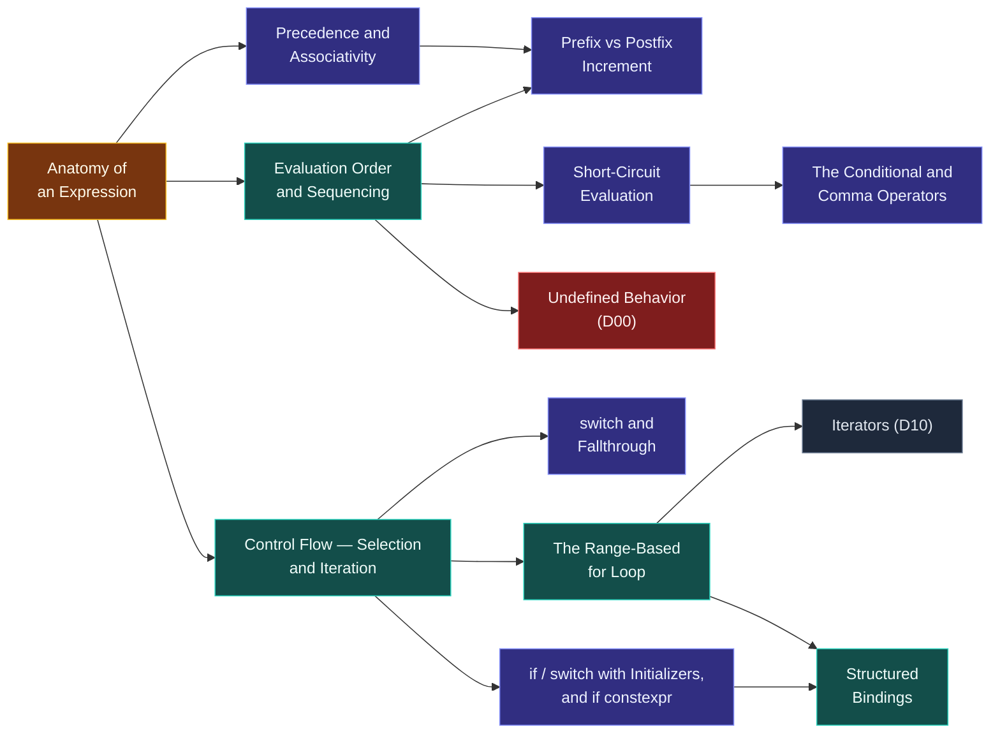

# Map — Expressions & Control

> [!essence]
> *How does a program compute a value and decide what to do next?* Every line of C++ is either an expression combining values into a new one, or a statement that picks which expressions run and how many times. This domain is the grammar underneath both: the rules that turn a string of operators into one value, and the rules that turn a condition into a choice.

## Why This Domain Exists

[[Map — Types & Values|The previous domain]] fixed what a value *is*: a type's set of legal bit patterns and the operations defined on them. A type with no way to combine its values is inert. A program needs a notation for *doing* something with a value — adding two numbers, comparing two strings, choosing between two paths — and a way to repeat or skip that doing based on what happened.

> [!principle] From values to decisions
> 1. **Constraint.** A processor executes one instruction at a time, in an order the hardware and compiler are free to rearrange as long as the final answer doesn't change (the as-if rule, [[Map — What C++ Is]]). Source code, though, is written as nested expressions with no explicit instruction order at all: `f() + g() * h()`.
> 2. **Consequence.** Two different questions get conflated if the language doesn't separate them: *which* operands combine with *which* operator (a parsing question, fixed at compile time) and *when* each one actually runs (a scheduling question, left to the compiler and the machine). Answering both with a single rule would either over-constrain the optimizer or under-constrain the programmer.
> 3. **Requirement.** The language must fix the first question completely — precedence and associativity must give one unambiguous parse tree for every expression — while leaving the second as open as possible, so the compiler can reorder, interleave, or vectorize operand evaluation for speed.
> 4. **Design.** C++ answers with [[Anatomy of an Expression|an expression grammar]]: [[Precedence and Associativity|precedence and associativity]] pin down the parse tree; [[Evaluation Order and Sequencing|evaluation order]] is left unspecified everywhere the result doesn't depend on it, and pinned down only where it must be (`&&`, `||`, `?:`, `,`, function-call boundaries). [[Control Flow — Selection and Iteration|Statements]] then sequence and repeat expressions explicitly, in program order, because *deciding what runs next* is exactly the one thing that cannot be left to the optimizer's discretion.
> 5. **Price.** Because most evaluation order is unspecified rather than banned, code that silently depends on one particular order is not a compile error and not a crash — it is undefined behavior ([[Undefined Behavior]]), a promise the compiler is entitled to hold you to without ever telling you that you broke it.

## The Core Tension

> [!tension] safety ⟷ performance
> An expression like `a[i] = i++` looks like it has an obvious meaning, but the Standard refuses to give it one: guaranteeing an order here would cost every optimizer that reorders loads and stores the freedom to do so. C++'s answer is to guarantee order only at the four places named above and at full-expression boundaries, and to call everything else undefined rather than merely implementation-defined. That is a harsher line than most languages draw — Java and C# pick a defined left-to-right order and occasionally pay for it in missed optimizations — but it matches C++'s wider bet that the programmer, not the runtime, absorbs the cost of speed.

> [!tension] abstraction ⟷ control
> `if`, `while`, `for`, and `switch` read as natural-language decisions, but each compiles to a comparison and a conditional jump whose real cost — a branch the CPU must predict before it knows the answer — is invisible at the source level ([[Map — Performance & the Machine]]). Most of the domain keeps that abstraction convenient: [[The Range-Based for Loop|range-`for`]] hides the iterator dance entirely. `if constexpr` breaks the pattern on purpose — it reaches through the abstraction and tells the compiler to delete the untaken branch before it ever becomes a jump, trading a general-purpose `if` for a zero-overhead, compile-time one.

## Concept Map

Arrows read "is needed to understand".

**An expression is the hub.** Control-flow statements test expressions; evaluation order and short-circuiting govern how an expression's own pieces combine; and everything else in the domain is either a shape of expression or the statement-level machinery that decides which expressions run, and how many times.

## Learning Route

1. [[Anatomy of an Expression]]: fixes the vocabulary — operand, operator, result — that every later section assumes.
2. [[Precedence and Associativity]]: the compile-time rule that turns a flat string of operators into one parse tree, before anything is evaluated.
3. [[Evaluation Order and Sequencing]]: separates *which* value an expression produces (fixed by step 2) from *when* each part of it runs (mostly left open), and names the four operators that pin it down.
4. [[Short-Circuit Evaluation]]: the practical payoff of one of those four guarantees — `&&` and `||` don't just skip work, they make `p != nullptr && *p` a *safe* idiom, not a lucky one.
5. [[Prefix vs Postfix Increment]]: a concrete comparison built entirely on the sequencing rules just learned — why `++i` can be cheaper than `i++`, and why using either alongside a second read of `i` in the same expression is exactly the hazard step 3 warned about.
6. [[Control Flow — Selection and Iteration]]: the statement-level view — `if`, `while`, `for`, `do`-`while`, `switch` — that sequences and repeats the expressions above in program order.
7. [[switch and Fallthrough]]: the one control statement whose default behavior still matches 1970s C, and the discipline — and C++17's `fallthrough` attribute — it takes to use safely.
8. [[The Range-Based for Loop]]: the modern replacement for a hand-written iterator loop — the same mechanism as [[Iterators|D10's iterators]], spelled once.
9. [[if and switch with Initializers, and if constexpr]]: C++17's rewrite of selection statements — scope a helper variable to the statement itself, or move the branch to compile time entirely.
10. [[Structured Bindings]]: names the pieces of a multi-part initializer, most often the pair a map lookup or a container insertion just handed you inside the initializer from step 9.
11. [[The Conditional and Comma Operators]]: two operators that are themselves miniature control flow — a branch and a sequence point — written with expression syntax instead of statement syntax.

## Key Ideas

1. **An expression's parse and its evaluation order are two separate promises.** Precedence and associativity fix which operands each operator combines — a compile-time, purely syntactic fact — while the Standard leaves *when* each part actually executes almost entirely unspecified, so the compiler can reorder operand evaluation for speed without ever changing the parsed result ([[Anatomy of an Expression]], [[Evaluation Order and Sequencing]]).
2. **Relying on an unspecified order is undefined behavior, not a style question.** Writing to an object and reading it again in the same expression without an intervening sequencing rule — `i = i++ + 1` — has no defined outcome at all; two builds of the same compiler are free to disagree, and neither is wrong.
3. **Only four operators promise an order: `&&`, `||`, `?:`, and `,`.** Each sequences its first operand's side effects completely before its second operand begins, which is what turns short-circuiting into a guarantee a program can depend on for correctness, not just a common optimization ([[Short-Circuit Evaluation]]).
4. **`switch` falls through by default because C did.** A `case` label is a jump target, not a scope boundary, so execution keeps going into the statements under the next label unless a `break` stops it; the `fallthrough` attribute (C++17) exists solely to tell the compiler — and the next reader — that a missing `break` was deliberate ([[switch and Fallthrough]]).
5. **A range-`for` loop is a hand-written iterator loop, spelled once.** It expands to `begin()`/`end()` calls and a dereference-then-increment loop the compiler writes for you; it is sugar over [[Iterators|D10's iterator model]], not a different mechanism ([[The Range-Based for Loop]]).
6. **C++17 let selection statements own their setup.** `if (auto it = m.find(k); it != m.end())` scopes the lookup variable to the statement itself, closing off the classic "helper variable leaks past the `if` it was for" pitfall that plain `if` always had.
7. **`if constexpr` deletes the untaken branch, not just skips it.** Because the discarded branch is never instantiated, it does not even need to compile for the type actually in use — a compile-time decision with no runtime jump, and the one place in this domain where control flow costs nothing at run time.
8. **Structured bindings name pieces of one object, not independent variables.** `auto [it, ok] = m.insert(v)` binds `it` and `ok` as aliases into a single hidden object created from the initializer; they cannot be redeclared or reseated the way two ordinary declarations could be ([[Structured Bindings]]).

| Idea | Developed in |
|---|---|
| Parsing vs. scheduling an expression | [[Anatomy of an Expression]] · [[Precedence and Associativity]] · [[Evaluation Order and Sequencing]] |
| The guaranteed-order operators | [[Short-Circuit Evaluation]] · [[The Conditional and Comma Operators]] · [[Prefix vs Postfix Increment]] |
| Selecting and repeating | [[Control Flow — Selection and Iteration]] · [[switch and Fallthrough]] · [[The Range-Based for Loop]] |
| C++17's rewrite of selection | [[if and switch with Initializers, and if constexpr]] · [[Structured Bindings]] |

## Index

<!-- cc:auto:domain-index:D03 -->
**Tier 1 · Foundational**
- ○ [[Anatomy of an Expression]] · *concept*
- ○ [[Precedence and Associativity]] · *concept*
- ○ [[Control Flow — Selection and Iteration]] · *concept*
- ○ [[Short-Circuit Evaluation]] · *concept*
- ○ [[Prefix vs Postfix Increment]] · *comparison*
- ○ [[The Range-Based for Loop]] · *mechanism*
- ○ [[switch and Fallthrough]] · *concept*

**Tier 2 · Proficient**
- ○ [[Evaluation Order and Sequencing]] · *mechanism*
- ○ [[if and switch with Initializers, and if constexpr]] · *concept*
- ○ [[Structured Bindings]] · *mechanism*
- ○ [[The Conditional and Comma Operators]] · *concept*

`█░░░░░░░░░` 1/12 written · legend ○ planned ◐ draft ● reviewed ★ evergreen ⟲ revise
<!-- cc:end -->

## Sources

- Primer §4.1.3 "Order of Evaluation, Precedence, and Associativity" (p. 138): order of operand evaluation is independent of precedence and associativity; only `&&`, `||`, `?:` and `,` guarantee an order. §4.5 "Increment and Decrement Operators" (p. 148): prefer prefix over postfix. §4.7 "The Conditional Operator" (p. 151); §4.10 "Comma Operator" (p. 157); §4.12 "Operator Precedence Table" (p. 166). §5.3 "Conditional Statements" (p. 177): dangling else resolved by matching the closest unmatched `if`. §5.3.2 "The switch Statement" (p. 178). §5.4.3 "Range for Statement" (p. 187).
- Tour §1.8 "Tests" (p. 14): `if`, `switch`, `while`, `for` introduced together as the conventional selection/iteration set. §19.2 "C++ Feature Evolution" (p. 264): selection statements with initializers, structured bindings, `if constexpr` and the `fallthrough` attribute dated to C++17.
- PPP ch. 3 §3.3 "Expressions" and §3.4 "Statements" (Selection; Iteration); §3.7 shows the `fallthrough` attribute making an intentional fallthrough explicit.
- Pikus, "Optimization of complex conditions" (p. 97–99): branch prediction and speculative execution are what a compiled `if` actually costs on real hardware, and why an unpredictable condition can rival the cost of a cache miss.
- cppreference, *Order of evaluation* · *Operator precedence* · *`if`* · *`switch`* · *range-`for`*: https://en.cppreference.com/w/cpp/language/eval_order · https://en.cppreference.com/w/cpp/language/operator_precedence · https://en.cppreference.com/w/cpp/language/if · https://en.cppreference.com/w/cpp/language/switch · https://en.cppreference.com/w/cpp/language/range-for
- Draft standard `[intro.execution]`, `[stmt.select]`, `[stmt.iter]`: https://eel.is/c++draft/intro.execution
