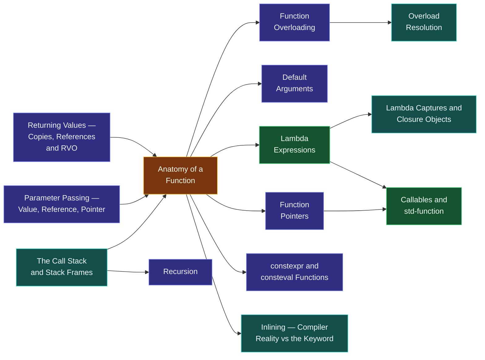

# Map — Functions

> [!essence]
> A function is a promise with a shape: give me arguments of these types, in this order, and I will hand back a value of that type, having done the same work every time you ask. This domain is about what it costs to keep that promise — on paper, in the compiler, and on the stack — and what freedom the promise buys in return.

## Why This Domain Exists

[[Map — Expressions & Control|Expressions and statements]] compute and branch, but written out flat they cannot scale: a calculation used in ten places means either ten copies of the same code or a way to say "do that" once and invoke it many times, with different data each time.

> [!principle] The naming problem, from first principles
> 1. **Constraint.** A computation that is useful once is usually useful again, with different inputs. Source text, though, is static: the same characters mean the same thing everywhere they appear.
> 2. **Consequence.** Without a way to parameterise and re-invoke a chunk of computation, "reuse" can only mean copy-and-paste — and copies drift: a fix applied to one no longer reaches the other nine.
> 3. **Requirement.** The language needs a unit that (a) has a name and a fixed *type* — a return type plus a sequence of parameter types the compiler can check before any call runs; (b) accepts data that varies per invocation; (c) can hand a result back; and (d) returns control to the exact instruction after the call, no matter how deep the call nests or recurses.
> 4. **Design.** C++ answers with the **function**: a declaration gives its [[Anatomy of a Function|name, parameters and return type]] as a checked contract, and every call is real-machine work — an **activation record** pushed onto the [[The Call Stack and Stack Frames|call stack]], holding the arguments, the locals and the address to jump back to. [[Parameter Passing — Value, Reference, Pointer|Passing an argument]] and [[Returning Values — Copies, References and RVO|returning a value]] both reuse the language's ordinary initialization rules, so the same value-vs-reference choice that governs a variable declaration governs a function boundary too. [[Function Overloading|One name]] can cover a family of related operations, chosen at compile time by [[Overload Resolution|overload resolution]]; and a [[Lambda Expressions|lambda]] lets you write a small, nameless function inline, at the point where it's needed.
> 5. **Price.** The stack that makes calls cheap is finite, so unchecked [[Recursion|recursion]] overflows it. Choosing how an argument or a result crosses the function boundary is now a design decision with real costs — a copy, an alias with a lifetime to respect, or a raw address. And overload resolution is a compile-time search over conversions: it always picks *a* best match, which is not always the match you expected.

## The Core Tension

> [!tension] abstraction ⟷ control
> A function name hides real-machine work: pushing an activation record, copying or aliasing arguments, jumping and jumping back. [[Anatomy of a Function|The abstraction]] is free to use — the zero-overhead principle applies here as everywhere — but never free to build: something still has to reserve stack space, place arguments where the calling convention expects them, and restore the caller's context. [[Inlining — Compiler Reality vs the Keyword|Inlining]] is this tension made visible: it erases the call machinery entirely when the compiler judges it worthwhile, keyword or no keyword.

> [!tension] value ⟷ identity
> Every parameter and every return type restates the value-vs-identity choice from [[Map — Objects, Memory & Lifetime|the previous domain]] at a function's boundary. [[Parameter Passing — Value, Reference, Pointer|Passing by value]] hands the callee an independent copy; passing by reference or pointer hands it an alias to the caller's object, with the caller's lifetime now a promise the callee must not outlive. [[Returning Values — Copies, References and RVO|Returning]] asks the same question in reverse, and [[Lambda Captures and Closure Objects|a lambda's captures]] ask it once per captured variable.

## Concept Map

Arrows read "is needed to understand".

**Anatomy of a Function is the hub.** The call stack explains what a call *is* on the real machine; parameter passing and returning values are the initialization rules applied at the function boundary; overloading, default arguments and lambdas are ways to multiply or lighten a function's interface; and function pointers, closures and `std::function` converge on one question — what, exactly, is a "callable" in C++?

## Learning Route

1. [[Anatomy of a Function]]: the vocabulary — declaration vs. definition, the function's *type* (return type + parameter types), and why a signature is checked before a single call runs.
2. [[The Call Stack and Stack Frames]]: the real-machine picture behind every call — the activation record, and what "return" actually restores.
3. [[Parameter Passing — Value, Reference, Pointer]]: three ways an argument reaches the callee, and the value-vs-identity choice each one makes.
4. [[Returning Values — Copies, References and RVO]]: the mirror question for what comes back, and the optimization that can erase the copy the language notionally requires.
5. [[Function Overloading]]: one name, several signatures, resolved before the program runs.
6. [[Overload Resolution]]: exactly how the compiler ranks candidates and picks the "best" one — the mechanism overloading depends on.
7. [[Default Arguments]]: a lighter alternative to overloading when only a suffix of the parameters needs a different value.
8. [[Recursion]]: the call stack turned into a control-flow tool, and the reason it has a depth limit.
9. [[Lambda Expressions]]: a function value written inline, without a name, for the common case of "a function used exactly once, right here."
10. [[Lambda Captures and Closure Objects]]: what a lambda actually *is* — a compiler-generated class instance — and why captured references carry the same lifetime hazards as any other reference.
11. [[Function Pointers]]: the older way to hold "a function" as data, and the calling-convention machinery it exposes.
12. [[Callables and std-function]]: unifying function pointers, lambdas and function objects behind one type-erased interface, at a small run-time cost.
13. [[constexpr and consteval Functions]]: functions the compiler can (or must) run itself, collapsing the compile-time-vs-run-time choice into a single body.
14. [[Inlining — Compiler Reality vs the Keyword]]: why `inline` is a linkage rule, not a performance switch, and what actually decides whether a call disappears.
15. [[Attributes — nodiscard, maybe_unused, likely]]: annotating a function's contract for the compiler and the reader, without changing its behavior.

## Key Ideas

1. **A function's type is its signature, not its body.** The return type and the sequence of parameter types are fixed and checked at the call site before a single instruction of the body runs ([[Anatomy of a Function]]).
2. **Calling a function is real-machine work, and the stack it uses is finite.** Each call pushes an activation record — arguments, locals, the return address — and pops it on return; [[Recursion|unchecked recursion]] exhausts that stack exactly like an unbounded loop exhausts time ([[The Call Stack and Stack Frames]]).
3. **Argument passing is ordinary initialization, applied at a boundary.** Pass-by-value copies; pass-by-reference or pass-by-pointer aliases the caller's object, and the callee must not let that alias outlive what it names ([[Parameter Passing — Value, Reference, Pointer]]).
4. **Returning a value is initialization too, and the compiler is allowed to skip the copy.** Copy elision and RVO let the result be constructed directly in the caller's storage, so "return by value" is not automatically "return by copy" ([[Returning Values — Copies, References and RVO]]).
5. **Overloading is resolved once, at compile time, by ranking conversions — not by a run-time dispatch.** [[Overload Resolution]] always produces a single best match if one exists; the surprise is never that no function was chosen, but that the "best" one wasn't the one you had in mind.
6. **A lambda is sugar for a class with `operator()`.** Each capture becomes a data member initialized when the lambda is created, so a lambda that captures by reference inherits every lifetime rule that applies to references generally ([[Lambda Captures and Closure Objects]]).
7. **Not every callable is a function, and `std::function` hides that difference on purpose.** Function pointers, lambdas and function objects are distinct types that merely share a calling *shape*; `std::function` erases the distinction behind one indirection, at the cost of a possible heap allocation ([[Callables and std-function]]).
8. **`inline` is a linkage keyword the optimizer mostly ignores.** Whether a call site is actually replaced by the callee's body is a cost-based decision the compiler makes on its own, independent of whether you wrote the keyword ([[Inlining — Compiler Reality vs the Keyword]]).

| Idea | Developed in |
|---|---|
| What a function *is* | [[Anatomy of a Function]] · [[The Call Stack and Stack Frames]] |
| Crossing the function boundary | [[Parameter Passing — Value, Reference, Pointer]] · [[Returning Values — Copies, References and RVO]] |
| One name, many signatures | [[Function Overloading]] · [[Overload Resolution]] · [[Default Arguments]] |
| The stack as a control-flow tool | [[Recursion]] |
| Functions as values | [[Lambda Expressions]] · [[Lambda Captures and Closure Objects]] · [[Function Pointers]] · [[Callables and std-function]] |
| Compile time vs. the optimizer's judgment | [[constexpr and consteval Functions]] · [[Inlining — Compiler Reality vs the Keyword]] · [[Attributes — nodiscard, maybe_unused, likely]] |

## Index

<!-- cc:auto:domain-index:D05 -->
**Tier 1 · Foundational**
- ○ [[Anatomy of a Function]] · *concept*
- ○ [[The Call Stack and Stack Frames]] · *mechanism*
- ○ [[Parameter Passing — Value, Reference, Pointer]] · *comparison*
- ○ [[Function Overloading]] · *concept*
- ○ [[Default Arguments]] · *concept*
- ○ [[Recursion]] · *concept*
- ○ [[Lambda Expressions]] · *concept*

**Tier 2 · Proficient**
- ○ [[Returning Values — Copies, References and RVO]] · *concept*
- ○ [[Function Pointers]] · *concept*
- ○ [[Lambda Captures and Closure Objects]] · *mechanism*
- ○ [[Callables and std-function]] · *comparison*
- ○ [[constexpr and consteval Functions]] · *concept*
- ○ [[Inlining — Compiler Reality vs the Keyword]] · *mechanism*
- ○ [[Attributes — nodiscard, maybe_unused, likely]] · *concept*

**Tier 3 · Advanced**
- ○ [[Overload Resolution]] · *mechanism*

`█░░░░░░░░░` 1/16 written · legend ○ planned ◐ draft ● reviewed ★ evergreen ⟲ revise
<!-- cc:end -->

## Sources

- Tour §1.3 "Functions" (p. 4): the anatomy of a declaration, argument-passing-as-initialization, and a function's type.
- PPP §7.4 "Function call and return" (function activation record, function call implementation): the call stack made concrete, pass-by-value vs. pass-by-reference compared side by side.
- PPP §3.5 "Functions": the first, gentler pass at why functions exist and how to write one.
- Primer §6.2 "Argument Passing" (p. 209) and §6.4 "Overloaded Functions" (p. 230): the exact rules for by-value and by-reference parameters, and how overload sets are formed.
- Pikus, "Copying of return values" (p. 327): return value optimization explained as a real compiler transformation, not folklore.
- cppreference, *Functions* · *Overload resolution* · *Lambda expressions*: https://en.cppreference.com/w/cpp/language/functions · https://en.cppreference.com/w/cpp/language/overload_resolution · https://en.cppreference.com/w/cpp/language/lambda
- Draft standard `[dcl.fct]`, `[over.match]`: https://eel.is/c++draft/dcl.fct
