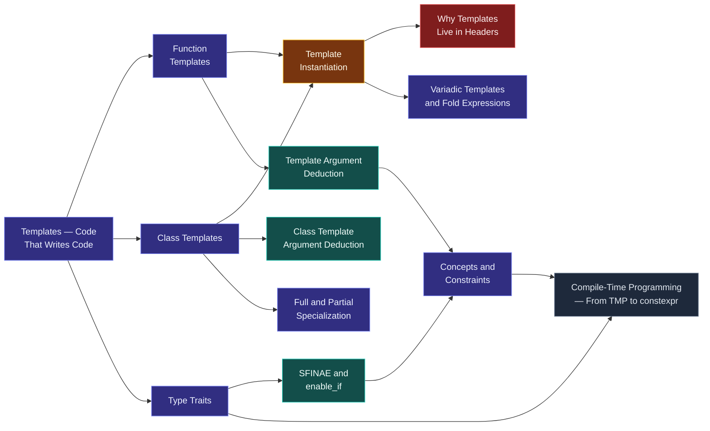

# Map — Generic Programming

> [!essence]
> How can a `sort` written once work — at zero extra run-time cost — on `int`, on `std::string`, and on a type invented next year, without those types sharing so much as a common base class? C++'s answer is to write the function *at compile time*, once per type it is actually asked to handle. This domain is templates: the mechanism, its machinery, and the discipline that keeps "any type" honest about which types it really means.

## Why This Domain Exists

[[Map — Inheritance & Polymorphism|The previous domain]] gave C++ a way to write one algorithm that serves many types chosen while the program runs, but that power has a fixed price: every call through a base pointer pays an indirect branch, and every type in the family must trace back to a common base someone remembered to write. Neither condition always holds. A `sort` should work on `int`, on `std::string`, and on a `Matrix` nobody related by inheritance — and it should run exactly as fast as a version hand-written for each, with no shared base and no indirection.

> [!principle] Constraint → Consequence → Requirement → Design → Price
> 1. **Constraint.** The compiler produces machine code before the program runs, and machine code is concrete: an `add` instruction is generated for operands of a known size and representation. There is no instruction for "add any addable type."
> 2. **Consequence.** Without help, "one algorithm, many unrelated types" forces a choice between writing the logic once per type by hand — correct but repetitive, and the copies drift — or forcing every type through a common interface via inheritance, which couples types that have nothing else to do with each other and pays a run-time indirection even where the exact type is known at every call site.
> 3. **Requirement.** The language needs a way to write an algorithm's logic exactly once in source, and have the compiler — not the programmer, not the runtime — produce a distinct, fully concrete version of it for each type it is actually used with, built from whatever operations that type happens to supply rather than an interface it was forced to inherit.
> 4. **Design.** A template ([[Templates — Code That Writes Code]]) is that logic, parameterized over a type not yet known. [[Template Instantiation|Instantiation]] is the compiler substituting a real type in and compiling the result as an ordinary function or class, once per distinct set of arguments actually used. [[Concepts and Constraints|Concepts]] let the template's author state, and the compiler check, exactly which operations a type must supply before instantiation is even attempted.
> 5. **Price.** Nothing is shared at run time: every instantiation is a full, separate copy, so compile time and object-code size grow with the number of distinct types actually used, not with the size of the source (Pikus, "Lifting knowledge from runtime to compile time," p. 366). And because instantiation needs the template's actual body, not just its declaration, that body typically has to live where every user of it can see it: the header ([[Why Templates Live in Headers]]).

## The Core Tension

> [!tension] compile time ⟷ run time
> This domain is C++'s **compile-time** answer to the question [[Map — Inheritance & Polymorphism|the previous domain]] answered at run time: "one piece of code, many types." Virtual dispatch resolves the choice while the program executes, by reading an object's vptr; templates resolve it while the program is *built*, generating a separate, fully specialized definition per type before a single instruction runs ("Templates provide (compile-time) parametric polymorphism," Tour §8.2, p. 104). [[Static vs Dynamic Polymorphism]] compares the two directly.

> [!tension] abstraction ⟷ control
> A template lets you write `sum(container, seed)` once and have it work for `vector<int>`, for `list<Matrix>`, or for a type invented next year — full abstraction over "the type." But nothing is hidden from the machine: each instantiation is compiled as if you had hand-written that exact function for that exact type, so the abstraction costs nothing at run time. The price moves entirely to compile time and object-code size ([[Template Instantiation]]; Pikus, p. 366).

## Concept Map

Arrows read "is needed to understand."

**Template Instantiation** is the hub. Function and class templates both funnel into it; specialization, CTAD and variadic packs elaborate what instantiation can produce; the header-visibility rule is its direct consequence; and constraints, traits and SFINAE — the compile-time question-asking layer — feed the discipline that keeps instantiation from failing deep and unreadably.

## Learning Route

1. [[Templates — Code That Writes Code]]: fixes what a template *is* — a compile-time recipe, not a running piece of code. Everything after this specializes, constrains, or exploits that idea.
2. [[Function Templates]]: the simplest instance — one parameterized function, deduced from its call.
3. [[Class Templates]]: the same idea for types; every standard container is one.
4. [[Template Instantiation]]: the mechanism underneath both — the hub of this domain, and the reason templates behave the way they do at compile and link time.
5. [[Why Templates Live in Headers]]: the first consequence of instantiation worth knowing before it causes a linker error.
6. [[Concepts and Constraints]]: names the requirements a template argument must meet, and moves failures from deep inside a template body to the call site.
7. [[Non-Type Template Parameters]]: parameters that are values, not types — `std::array<int, 4>`'s `4`.
8. [[Template Argument Deduction]]: exactly how the compiler works out a function template's arguments from a call, including where it can't.
9. [[Full and Partial Specialization]]: hand-writing a different body for a specific argument or family of arguments, once the general template isn't enough.
10. [[Variadic Templates and Fold Expressions]]: templates that take an arbitrary number of arguments, and the C++17 syntax that folds them into an expression.
11. [[Class Template Argument Deduction]]: template argument deduction's C++17 counterpart for a class template's constructor call.
12. [[Type Traits]]: compile-time predicates and transformations on types, the vocabulary constraints and metaprogramming are built from.
13. [[SFINAE and enable_if]]: the pre-concepts idiom for constraining a template — and the reason concepts were worth adding.
14. [[Two-Phase Lookup and Dependent Names]]: how a compiler can type-check a template body before it knows the template arguments, and why `typename` and `template` sometimes have to say so explicitly.
15. [[Compile-Time Programming — From TMP to constexpr]]: closes the domain by naming the whole spectrum — ordinary templates, traits, SFINAE and concepts are all instances of computing something before the program runs.

## Key Ideas

1. **A template is not code — it is a recipe the compiler follows to write code**, once for every distinct set of arguments it is asked to produce. Nothing executes until a caller supplies concrete types; only then does the compiler generate and compile an ordinary, fully-typed function or class ([[Templates — Code That Writes Code]]).
2. **Generic programming resolves "many types" at compile time; polymorphism resolves it at run time — the same requirement, opposite prices.** [[Map — Inheritance & Polymorphism|Virtual dispatch]] pays one indirect call per invocation and hides the concrete type behind a common interface; a template pays in object-code size, one instantiation per type used, and buys a fully inlined, type-specific body with no indirection at all (Primer ch. 16, p. 651; Tour §8.2, p. 104).
3. **A template's definition, not merely its declaration, must be visible wherever it is instantiated.** The compiler cannot generate code for `Blob<string>` from a forward declaration alone — it needs the body — which is why template code lives in headers instead of being compiled once into a `.o` and linked ([[Why Templates Live in Headers]]; Primer §16.1.5, p. 675).
4. **Concepts name the requirements a template argument must satisfy, and move a category of error from instantiation time to the call site.** Before C++20, an unmet requirement failed deep inside a template body, often pages of error text from the caller's actual mistake; a `requires` clause rejects the call at the interface, with the compiler able to say what is missing ([[Concepts and Constraints]]; Tour §8.2.1, p. 105).
5. **Every distinct set of template arguments produces a distinct type or function; instantiations do not share code by default.** `vector<int>` and `vector<double>` are unrelated types that happen to share a source template — this buys zero-overhead specialization and costs compiled size, which is why turning a run-time configuration value into a compile-time template parameter is a real, name-able optimization, not a curiosity (Pikus, "Lifting knowledge from runtime to compile time," p. 366).
6. **Before concepts, templates were constrained by convention and enforced with two workarounds: type traits and SFINAE.** [[Type Traits]] answer compile-time questions about a type; [[SFINAE and enable_if|SFINAE]] uses a failed substitution to quietly remove an overload from consideration instead of erroring — the same job [[Concepts and Constraints|concepts]] now do directly and readably.
7. **Template argument deduction and class template argument deduction are the same idea at two levels.** Deduction reads a function call's arguments to infer its template parameters; CTAD (C++17) does the same for a class template's constructor call, so `std::pair p{1, 2.0}` needs no explicit `<int, double>` ([[Template Argument Deduction]] · [[Class Template Argument Deduction]]).
8. **Templates are C++'s general mechanism for moving computation from run time to compile time**, stretching from an ordinary function template through variadic packs and metaprogramming to `constexpr` functions a compiler can evaluate outright — one continuum, not a set of unrelated features ([[Compile-Time Programming — From TMP to constexpr]]).

| Idea | Developed in |
|---|---|
| What a template is | [[Templates — Code That Writes Code]] · [[Function Templates]] · [[Class Templates]] |
| The compile-time vs. run-time trade | [[Map — Inheritance & Polymorphism|Virtual Dispatch]] · [[Static vs Dynamic Polymorphism]] |
| How a template becomes real code | [[Template Instantiation]] · [[Why Templates Live in Headers]] |
| Naming what a type must supply | [[Concepts and Constraints]] · [[Type Traits]] · [[SFINAE and enable_if]] |
| Working out the arguments | [[Template Argument Deduction]] · [[Class Template Argument Deduction]] |
| Beyond the general case | [[Full and Partial Specialization]] · [[Non-Type Template Parameters]] · [[Variadic Templates and Fold Expressions]] |
| The whole spectrum | [[Compile-Time Programming — From TMP to constexpr]] |

## Index

<!-- cc:auto:domain-index:D09 -->
**Tier 1 · Foundational**
- ○ [[Templates — Code That Writes Code]] · *concept*
- ○ [[Function Templates]] · *concept*

**Tier 2 · Proficient**
- ○ [[Class Templates]] · *concept*
- ○ [[Template Instantiation]] · *mechanism*
- ○ [[Why Templates Live in Headers]] · *pitfall*
- ○ [[Concepts and Constraints]] · *concept*
- ○ [[Non-Type Template Parameters]] · *concept*

**Tier 3 · Advanced**
- ○ [[Template Argument Deduction]] · *mechanism*
- ○ [[Full and Partial Specialization]] · *concept*
- ○ [[Variadic Templates and Fold Expressions]] · *concept*
- ○ [[Class Template Argument Deduction]] · *mechanism*
- ○ [[Type Traits]] · *concept*

**Tier 4 · Expert**
- ○ [[SFINAE and enable_if]] · *mechanism*
- ○ [[Two-Phase Lookup and Dependent Names]] · *mechanism*
- ○ [[Compile-Time Programming — From TMP to constexpr]] · *concept*

`█░░░░░░░░░` 1/16 written · legend ○ planned ◐ draft ● reviewed ★ evergreen ⟲ revise
<!-- cc:end -->

## Sources

- Primer ch. 16 "Templates and Generic Programming," opening (p. 651) and §16.1 "Defining a Template" (p. 652); §16.1.5 "Controlling Instantiations" (p. 675): the C++11 rules, including why a template's definition must be visible at its point of instantiation.
- Tour ch. 8 "Concepts and Generic Programming," §8.1 "Introduction" (p. 103) and §8.2 "Concepts" (p. 104): templates as compile-time parametric polymorphism, and concepts as their constraint language.
- PPP §18.1 "Templates": templates introduced from a working `Vector`, first-principles style — types as template parameters before concepts are named as such.
- Pikus, "Lifting knowledge from runtime to compile time" (p. 366): the real-machine case for turning a runtime configuration value into a compile-time template parameter, and the code-size price it pays.
- cppreference, *Templates* · *Constraints and concepts*: https://en.cppreference.com/w/cpp/language/templates · https://en.cppreference.com/w/cpp/language/constraints
- Draft standard `[temp]`, `[temp.point]`: https://eel.is/c++draft/temp
