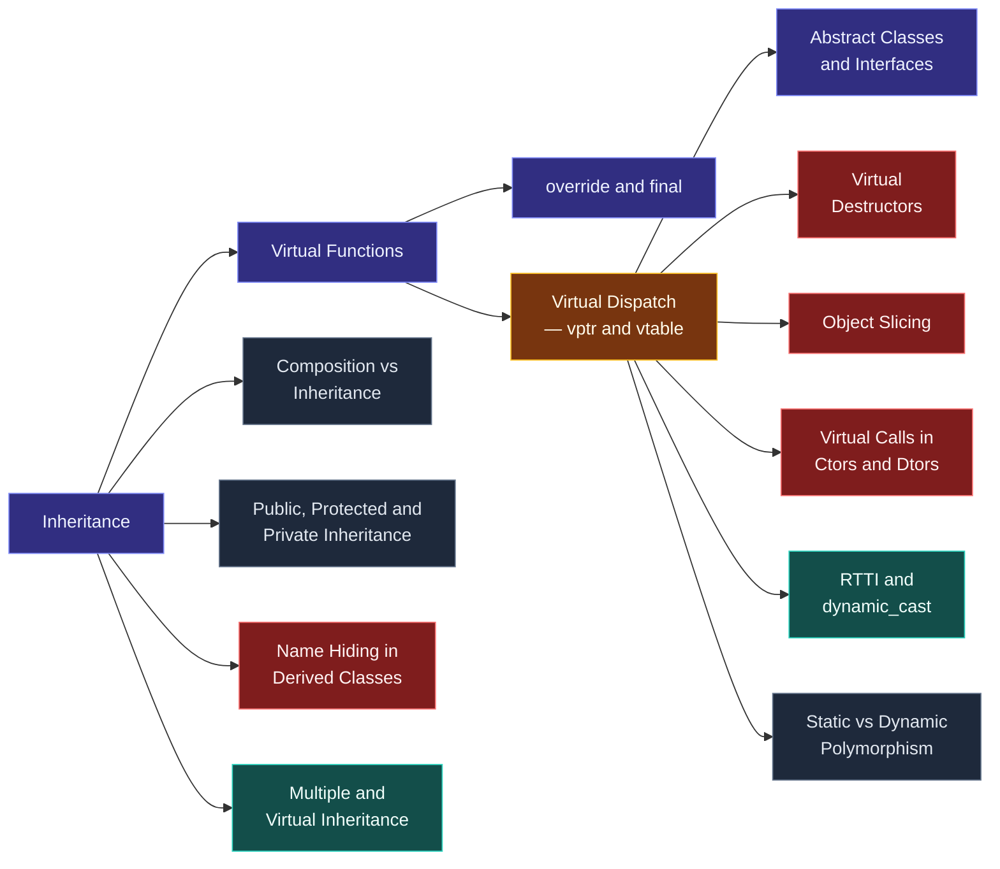

# Map — Inheritance & Polymorphism

> [!essence]
> How can a function compiled today call the right code for a type invented tomorrow? [[Inheritance]] lets a new type declare "I am a kind of you" to an existing one; [[Virtual Functions]] let a call made through that relationship pick its target from the object's *actual* type, at run time. This domain is the discipline of building that relationship honestly, and the long list of things that go wrong when it is built carelessly.

## Why This Domain Exists

[[Map — Classes & Encapsulation|The previous domain]] gave a class the tools to protect its own invariants, but each class it builds this way is closed: only that class's own members know how to work with it. A real program wants to write an algorithm once — draw every shape on a canvas, serialize every asset to a file — and keep it working as new kinds of shape or asset are added later, often in code the algorithm's author never saw.

> [!principle] Constraint → Consequence → Requirement → Design → Price
> 1. **Constraint.** A function is translated once, before the program runs, and can name only the types and functions visible to the compiler at that moment. Yet a caller wants `render(shapes)` to keep working as new shape types are added in files `render` was never recompiled against.
> 2. **Consequence.** Without a shared way to ask "the right operation for whatever this actually is", every new type forces every caller to change — a `switch` on a type tag, or a chain of `if (typeid(...) == ...)`. Callers become coupled to the exact list of types in existence, which is the opposite of what encapsulation was supposed to buy.
> 3. **Requirement.** The language needs two things: a way to say that one type *is a kind of* another, so a single reference or pointer can stand for any of them, and a way to mark specific operations as *allowed to vary* by which kind actually shows up — resolved without the caller ever naming the kind.
> 4. **Design.** [[Inheritance]] builds a derived type that reuses and extends a base type's interface, and — used publicly — states an is-a relationship: anywhere a `Shape` is expected, any `Circle` will do. [[Virtual Functions]] mark which of the base's operations a derived type is allowed to override; [[Virtual Dispatch — vptr and vtable|virtual dispatch]] is the mechanism that, given only a `Shape&`, finds `Circle::area()` at run time, in constant time, even for a `Circle` compiled into a library the caller never linked against directly.
> 5. **Price.** Every object of a polymorphic type carries one hidden pointer, and every virtual call costs an indirect branch and usually blocks inlining ([[Virtual Dispatch — vptr and vtable]]). The is-a promise is easy to break by accident — through slicing, a missing virtual destructor, or a hierarchy pushed past the point where inheritance still fits — which is why most of this domain's notes are about keeping the promise honest.

## The Core Tension

> [!tension] compile time ⟷ run time
> This domain is C++'s **run-time** answer to "one piece of code, many types": decide, for each call, which override to run by reading the object's own vptr while the program executes ([[Virtual Dispatch — vptr and vtable]]). [[Map — Generic Programming|Templates]] are the **compile-time** answer: generate a separate, fully specialized function per type before the program ever runs. [[Static vs Dynamic Polymorphism]] compares them directly; most real C++ code needs both, for different reasons.

> [!tension] value ⟷ identity
> A `Shape` object is polymorphic only through its **identity** — an address the vptr can be read from. Copy a `Circle` into a `Shape` *value* and only the `Shape` part comes along: the constructor that runs is `Shape`'s, and the result's vptr says `Shape` ([[Object Slicing]]). [[Map — Objects, Memory & Lifetime|The value/identity split]] that governs ordinary objects has a sharp edge here — polymorphism survives only through a pointer or reference to the *same* object, never through a copy.

## Concept Map

Arrows read "is needed for".

**Virtual Dispatch** is the hub. Inheritance and virtual functions feed into it; the interface forms (abstract classes) and the failure modes (slicing, missing virtual destructors, construction-time calls, name hiding) all follow from how it works; and the domain closes by naming its compile-time alternative.

## Learning Route

1. [[Inheritance]]: fixes what "is-a" means and how a derived class reuses and extends a base's interface. Everything after this modifies, exploits, or repairs that relationship.
2. [[Composition vs Inheritance]]: learn when *not* to reach for inheritance, right after learning what it buys you.
3. [[Public, Protected and Private Inheritance]]: the access-control axis of inheritance — is-a, implemented-in-terms-of, or something narrower.
4. [[Virtual Functions]]: the declaration that lets one call vary by an object's dynamic type.
5. [[override and final]]: compiler-checked control over which functions actually override, and which overriding stops.
6. [[Virtual Dispatch — vptr and vtable]]: the mechanism underneath 4–5, and the hub of this domain — how a call reads the right address from the object itself.
7. [[Abstract Classes and Interfaces]]: pure virtual functions taken to their limit — a type that supplies no implementation at all, only a contract.
8. [[Virtual Destructors]]: the one virtual function almost every polymorphic base needs, and why omitting it is undefined behavior.
9. [[Object Slicing]]: what a `Shape` *value* (not a pointer or reference) does to a `Circle` — the value/identity tension made concrete.
10. [[Name Hiding in Derived Classes]]: a non-virtual, compile-time surprise — declaring a name in a derived class hides every overload of that name in the base.
11. [[Virtual Calls in Constructors and Destructors]]: why a virtual call made from a base's own constructor can never reach a derived override.
12. [[RTTI and dynamic_cast]]: recovering the exact dynamic type when the interface a pointer exposes isn't enough.
13. [[Multiple and Virtual Inheritance]]: combining more than one base, the diamond problem, and why most guidelines restrict it.
14. [[Static vs Dynamic Polymorphism]]: closes the domain by naming its opposite — what [[Map — Generic Programming|templates]] do instead, and when to prefer each.

## Key Ideas

1. **Public inheritance means "is-a", and only public inheritance should mean that.** Anywhere a `Shape&` is accepted, any publicly-derived `Circle` must behave like one (the Liskov substitution principle), because the caller holds only the base interface and has no way to check further.
2. **A virtual call is resolved through the object's own vptr, not through the pointer's or reference's declared type.** The declared type only fixes which *slot* the call reads; the object's vptr — set by its own constructor — decides which address sits in that slot, so the same call site dispatches differently for every dynamic type that flows through it ([[Virtual Dispatch — vptr and vtable]]).
3. **Only a pointer or reference carries dynamic type across a call; a value slices it away.** Assigning or passing a `Circle` into a `Shape` invokes `Shape`'s copy constructor, which builds a `Shape` object with `Shape`'s own vptr — the derived part, and the behavior that came with it, is gone ([[Object Slicing]]).
4. **Deleting a base pointer through a non-virtual destructor is undefined behavior.** `delete` must run the destructor chain for the object's actual dynamic type, and only a *virtual* destructor is looked up through the vtable at the delete site rather than baked in as a fixed address ([[Virtual Destructors]]).
5. **During construction and destruction, an object's vptr matches whichever constructor or destructor body is currently running — never the final, most-derived class.** A virtual call made from a base constructor cannot reach a derived override, because from the object's own point of view the derived part doesn't exist yet ([[Virtual Calls in Constructors and Destructors]]).
6. **Declaring a name in a derived class hides every overload of that name from the base, virtual or not.** Name lookup is a compile-time, static-type process that stops at the first class declaring the name; it has nothing to do with whether that name happens to be virtual ([[Name Hiding in Derived Classes]]).
7. **Inheritance and templates both let one algorithm serve many types; they differ only in when the choice is made.** Virtual dispatch decides per call, at run time, and pays with an indirect branch; templates decide per instantiation, at compile time, and pay with code size — the same zero-overhead trade [[Map — What C++ Is|this Atlas keeps returning to]] ([[Static vs Dynamic Polymorphism]]).
8. **Prefer composition; reserve public inheritance for a genuine, stable is-a relationship.** A derived class is coupled to every implementation detail its base class ever changes, so a "has-a" relationship (a `Car` has an `Engine`) should almost always be composition, not inheritance ([[Composition vs Inheritance]]).

| Idea | Developed in |
|---|---|
| The is-a relationship and its cost | [[Inheritance]] · [[Composition vs Inheritance]] · [[Public, Protected and Private Inheritance]] |
| Making a call vary by dynamic type | [[Virtual Functions]] · [[override and final]] · [[Virtual Dispatch — vptr and vtable]] |
| Interfaces with no implementation | [[Abstract Classes and Interfaces]] |
| Failure modes of the promise | [[Object Slicing]] · [[Virtual Destructors]] · [[Virtual Calls in Constructors and Destructors]] · [[Name Hiding in Derived Classes]] |
| Recovering the dynamic type | [[RTTI and dynamic_cast]] |
| Beyond a single base | [[Multiple and Virtual Inheritance]] |
| The compile-time alternative | [[Static vs Dynamic Polymorphism]] |

## Index

<!-- cc:auto:domain-index:D08 -->
**Tier 1 · Foundational**
- ○ [[Inheritance]] · *concept*
- ○ [[Virtual Functions]] · *concept*
- ○ [[Abstract Classes and Interfaces]] · *concept*
- ○ [[Virtual Destructors]] · *pitfall*
- ○ [[Object Slicing]] · *pitfall*
- ○ [[override and final]] · *concept*

**Tier 2 · Proficient**
- ● [[Virtual Dispatch — vptr and vtable]] · *mechanism*
- ○ [[Composition vs Inheritance]] · *comparison*
- ○ [[Public, Protected and Private Inheritance]] · *comparison*
- ○ [[RTTI and dynamic_cast]] · *mechanism*
- ○ [[Name Hiding in Derived Classes]] · *pitfall*

**Tier 3 · Advanced**
- ○ [[Virtual Calls in Constructors and Destructors]] · *pitfall*
- ○ [[Multiple and Virtual Inheritance]] · *mechanism*
- ○ [[Static vs Dynamic Polymorphism]] · *comparison*

`█░░░░░░░░░` 2/15 written · legend ○ planned ◐ draft ● reviewed ★ evergreen ⟲ revise
<!-- cc:end -->

## Sources

- Primer ch. 15 "Object-Oriented Programming" §15.3 "Virtual Functions" (p. 605), §15.4 "Abstract Base Classes" (p. 609) and §15.5 "Access Control and Inheritance" (p. 611); ch. 18 §18.3 "Multiple and Virtual Inheritance" (p. 802): the rules in full, in C++11 terms.
- Tour ch. 5 "Classes" §5.3 "Abstract Types" (p. 60), §5.4 "Virtual Functions" (p. 62) and §5.5 "Class Hierarchies" (p. 63), with the design advice of §5.6 (p. 69): the modern, minimal account.
- PPP ch. 12 "Class Design" §12.2 "Shape" and §12.3 "Base and derived classes": inheritance and virtual functions built up from a working `Shape` hierarchy, first principles style.
- Pikus, § "Function inlining" (p. 357): what a virtual call costs on real hardware, and when "virtual functions are slow" is and isn't a justified claim.
- cppreference, *Derived classes* · *Virtual function specifier* · *Abstract class*: https://en.cppreference.com/w/cpp/language/derived_class · https://en.cppreference.com/w/cpp/language/virtual · https://en.cppreference.com/w/cpp/language/abstract_class
- Draft standard `[class.derived]`, `[class.virtual]`, `[class.abstract]`: https://eel.is/c++draft/class.derived · https://eel.is/c++draft/class.virtual · https://eel.is/c++draft/class.abstract
