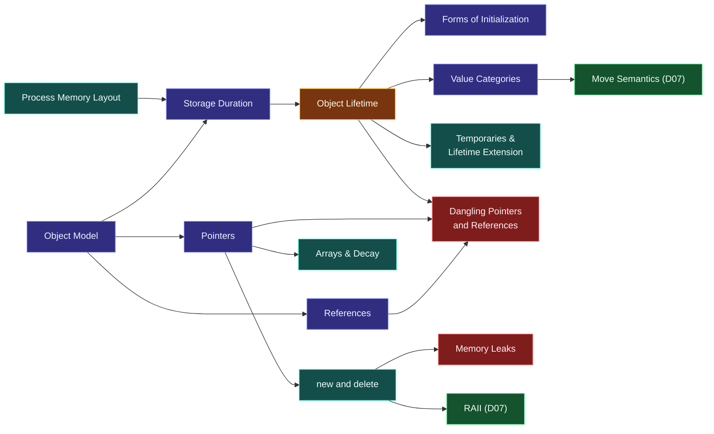

# Map — Objects, Memory & Lifetime

> [!essence]
> *Where does an object live, how long does it live, and who can reach it?* Every C++ program answers these three questions for every object. It answers some of them explicitly and the rest by accident. This domain makes the answers explicit, and nearly every serious C++ bug is a wrong answer to one of them.

## Why This Domain Exists

A program computes with **objects**: regions of storage that hold values of a type ([[The C++ Object Model — What an Object Is]]). Take away a language's conveniences, and three facts remain that any language must handle:

> [!principle] The three questions, from first principles
> 1. **Where?** An object needs *storage*: bytes somewhere. Storage comes from different places with different costs. The stack is almost free to allocate from but limited to a scope. The heap is flexible but needs an allocator call. Static storage lasts forever but exists only once. So C++ exposes the choice as [[Storage Duration]].
> 2. **How long?** Storage alone is not an object. An object's [[Object Lifetime|lifetime]] begins when its initialization completes and ends when its destructor starts (or its storage is released). Between those moments its value is meaningful; outside them it isn't, even if the bytes are still there.
> 3. **Who can reach it?** Code reaches objects through **names** (bound at compile time), **references** (aliases) and **pointers** (addresses held in other objects) ([[Pointers vs References]]). Each is a claim that *this object is alive right now*, and the language does not check that claim.
>
> Most languages hide the first two answers behind a garbage collector and make the third always safe. C++ exposes all three because hiding them costs time, memory and predictability. The domain's content is the set of rules, tools and idioms that let you give correct answers at zero overhead.

## The Core Tension

> [!tension] safety ⟷ performance
> C++ doesn't track who points at what, doesn't check bounds, and doesn't collect garbage. Every object costs exactly its bytes, and every access is a machine address. The price: **lifetime errors are undefined behavior**, not exceptions ([[Undefined Behavior]]). The domain's answer is to make safety *structural* rather than *checked*. Scope-bound lifetimes and [[RAII]] ensure release; clear ownership ([[Ownership — Who Releases What]]) and non-owning observers of shorter lifetime ensure access stays valid. Sanitizers catch what escapes.

> [!tension] value ⟷ identity
> An object is both a *value* (its contents, which can be copied or moved) and an *identity* (its address, which others may hold). Copying preserves the value and creates a new identity. References share the identity. [[Value Categories]] tell the compiler, expression by expression, whether identity still matters or the value may be pilfered.

## Concept Map

Arrows read "is needed to understand".

**Lifetime** is the hub. Storage feeds into it; initialization, value categories and temporaries elaborate it; the hazards are violations of it; and the next domain ([[Map — Ownership & Move Semantics]]) automates it.

## Learning Route

1. [[The C++ Object Model — What an Object Is]]: fixes the vocabulary (object, storage, type, value). Everything after depends on it.
2. [[Process Memory Layout — Stack, Heap, Static]]: the *real-machine* picture, so the abstract rules have something concrete to attach to.
3. [[Storage Duration]]: the Standard's four answers to *where* (automatic, static, thread, dynamic).
4. [[Object Lifetime]]: *how long*, the hub of the domain.
5. [[References]] → [[Pointers]] → [[Pointers vs References]]: *who can reach it*, and the contract each access path makes.
6. [[Dynamic Memory — new and delete]]: manual lifetime, and the reason [[RAII]] exists.
7. [[Dangling Pointers and References]] and [[Memory Leaks]]: the two ways the answers go wrong: an observer too long, an owner never ending.
8. [[Value Categories]] → [[Temporaries and Lifetime Extension]]: the expression-level view of lifetime that powers move semantics.
9. [[The Forms of Initialization]]: exactly when and how a lifetime begins.
10. Advanced layer: [[Object Representation, Padding and Layout]] (including hidden members such as the [[Virtual Dispatch — vptr and vtable|vptr]]) → [[Strict Aliasing and Type Punning]] → [[Placement new and Manual Lifetime]] → [[Allocators and pmr Memory Resources]].

## Key Ideas

1. **An object is not its bytes.** Storage can exist before an object's lifetime begins and after it ends. Only inside the lifetime may the value be used.
2. **Storage duration picks the *where*, scope or ownership picks the *when*.** Automatic objects die at `}`; dynamic ones die when an owner says so.
3. **Every pointer or reference is an unchecked claim that its target is alive.** Keep observers inside the lifetime of what they observe.
4. **Ownership must be singular and visible.** Exactly one party releases each resource, and the type system should show who ([[unique_ptr]]).
5. **Lifetime errors are undefined behavior.** They don't fail predictably. Find them with ASan and design them out structurally.
6. **Categories are about expressions, lifetimes are about objects.** [[Value Categories]] describe whether an *expression's* object may be reused; they never change when the object dies.
7. **Most memory management should be invisible.** Containers, smart pointers and RAII types hold the `new` and `delete`. Application code rarely writes either.

| Idea | Developed in |
|---|---|
| Objects vs storage | [[The C++ Object Model — What an Object Is]] · [[Object Lifetime]] |
| Where objects live | [[Storage Duration]] · [[Process Memory Layout — Stack, Heap, Static]] |
| Access paths and their contracts | [[Pointers vs References]] · [[nullptr and Null Pointers]] |
| Failure modes | [[Dangling Pointers and References]] · [[Memory Leaks]] · [[Double Free and Mismatched new-delete]] · [[Reading Uninitialized Variables]] |
| Expression-level lifetime | [[Value Categories]] · [[Temporaries and Lifetime Extension]] |
| Structural safety | [[RAII]] · [[Memory Safety in C++ — Threats and Defenses]] |

## Index

<!-- cc:auto:domain-index:D04 -->
**Tier 1 · Foundational**
- ○ [[The C++ Object Model — What an Object Is]] · *concept*
- ○ [[Process Memory Layout — Stack, Heap, Static]] · *mechanism*
- ○ [[Storage Duration]] · *concept*
- ○ [[Object Lifetime]] · *concept*
- ○ [[References]] · *concept*
- ○ [[Pointers]] · *concept*
- ○ [[Dynamic Memory — new and delete]] · *mechanism*
- ○ [[Reading Uninitialized Variables]] · *pitfall*
- ○ [[Pointer Arithmetic and Arrays]] · *mechanism*
- ● [[Pointers vs References]] · *comparison*
- ○ [[nullptr and Null Pointers]] · *concept*
- ○ [[Built-in Arrays and Array-to-Pointer Decay]] · *mechanism*
- ○ [[Memory Leaks]] · *pitfall*
- ● [[Dangling Pointers and References]] · *pitfall*

**Tier 2 · Proficient**
- ● [[Value Categories]] · *concept*
- ○ [[The Forms of Initialization]] · *comparison*
- ○ [[Double Free and Mismatched new-delete]] · *pitfall*
- ○ [[Temporaries and Lifetime Extension]] · *mechanism*
- ○ [[C-Style Strings]] · *concept*
- ○ [[Object Representation, Padding and Layout]] · *mechanism*
- ○ [[Memory Safety in C++ — Threats and Defenses]] · *concept*

**Tier 3 · Advanced**
- ○ [[Strict Aliasing and Type Punning]] · *pitfall*
- ○ [[Trivial, Standard-Layout and Aggregate Types]] · *concept*
- ○ [[Placement new and Manual Lifetime]] · *mechanism*

**Tier 4 · Expert**
- ○ [[Allocators and pmr Memory Resources]] · *concept*

`██░░░░░░░░` 4/26 written · legend ○ planned ◐ draft ● reviewed ★ evergreen ⟲ revise
<!-- cc:end -->

## Sources

- Primer ch. 2 "Variables and Basic Types" (p. 31) and ch. 12 "Dynamic Memory" (p. 449): the rules, in C++11 terms.
- Tour ch. 1 "The Basics" §1.5 "Scope and Lifetime" (p. 9) and ch. 15 "Pointers and Containers" (p. 195): the modern discipline.
- PPP ch. 15 "Vector and Free Store" and ch. 16 "Arrays, Pointers, and References": memory built up from first principles.
- Pikus ch. 4 "Memory Architecture and Performance" (p. 113): what the storage choice costs on real hardware.
- cppreference, *Object* · *Lifetime* · *Storage duration*: https://en.cppreference.com/w/cpp/language/object · https://en.cppreference.com/w/cpp/language/lifetime · https://en.cppreference.com/w/cpp/language/storage_duration
- Draft standard `[intro.object]`, `[basic.life]`, `[basic.stc]`: https://eel.is/c++draft/basic.life
