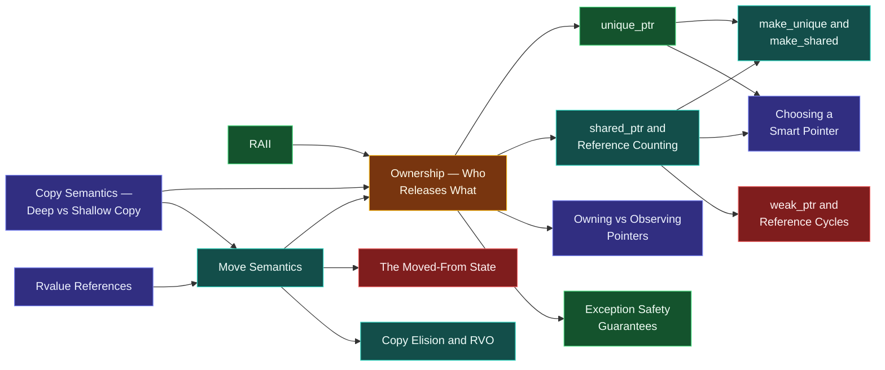

# Map — Ownership & Move Semantics

> [!essence]
> *Who is responsible for releasing this resource, and what happens to that responsibility when the object holding it is copied, returned, or stored somewhere else?* [[RAII]] answered *when* a resource is released — at scope exit. This domain answers *who* releases it, and gives the language a way to hand that responsibility off without duplicating the resource itself.

## Why This Domain Exists

[[Map — Objects, Memory & Lifetime|Storage and lifetime]] explain when an object's bytes are valid. A **resource** — heap memory, a file handle, a mutex, a socket — rides inside an object but obeys a stricter rule: it must be released **exactly once**, by **exactly one** party, no matter how many objects end up referring to it.

> [!principle] Constraint → Consequence → Requirement → Design → Price
> 1. **Constraint.** [[RAII]] ties release to a destructor call, and a program can copy an object as freely as it likes — `Buffer b2 = b1;` compiles for almost any class with no special work.
> 2. **Consequence.** If copying a `Buffer` just copies its raw pointer member, `b1` and `b2` now both believe they own the same heap block. Both destructors will call `delete` on it: the second call is a **double free**, undefined behavior ([basic.life]). If instead the compiler suppressed the copy, moving data between functions and containers would require an explicit, deep-copying escape hatch everywhere, even where the source object was about to be destroyed anyway and copying it was pure waste.
> 3. **Requirement.** The language needs two distinct operations where it used to have one: a *duplicate* that produces a fully independent second resource, and a *transfer* that hands the existing resource to a new owner and leaves the old one empty. And it needs a way to tell, at the call site, which one applies — ideally for free, without the programmer writing `std::move` everywhere by hand.
> 4. **Design.** C++11 ([[Map — Evolution of C++|the standard that reset the language]]) splits **copy** from **move** as distinct, separately-defined operations ([[Copy Semantics — Deep vs Shallow Copy]], [[Move Semantics]]), and gives the compiler a way to *see* which one an expression calls for: an **rvalue reference** ([[Rvalue References]]) binds only to expressions that provably have no other user, so overload resolution silently prefers the move constructor whenever the source is about to disappear anyway — a temporary, or an object passed through `std::move`. Ownership itself becomes a type: [[unique_ptr]] embodies "exactly one owner", [[shared_ptr and Reference Counting]] embodies "however many owners agree to share, tracked by a count".
> 5. **Price.** Every class with a resource member must now decide what its copy means (deep copy, or forbid it) and what its move means (steal the resource, leave the source in [[The Moved-From State|a valid-but-empty state]]). Shared ownership buys flexibility at the cost of an atomic increment/decrement per copy and the risk of a reference cycle that never reaches zero ([[weak_ptr and Reference Cycles]]).

## The Core Tension

> [!tension] value ⟷ identity
> A `std::vector<int>` is usually treated as a **value**: assign it, return it, pass it — you expect an independent copy of its contents. But underneath, it holds an **identity**: one specific heap allocation. Copying that identity is expensive and, for a resource that cannot be duplicated (a file handle, a mutex), impossible. Move semantics let an object *act* like a value at the call site while the compiler quietly transfers the identity underneath — the same value/identity split that [[Map — Objects, Memory & Lifetime|the previous domain]] introduced with [[Value Categories]], now doing real work.

> [!tension] safety ⟷ performance
> A deep copy is always safe and always correct, but for a large buffer it is O(*n*) work to throw away a moment later. `shared_ptr`'s reference count is always safe under single-threaded sharing, but it costs an atomic operation on every copy whether or not you needed shared ownership — the same [[Map — Concurrency|atomic]] the concurrency domain uses to make a single counter safe across threads, paid here even when there is only one. This domain's tools — move, `unique_ptr`, `shared_ptr` — are C++'s answer to *safe by default, cheap when the default is unnecessary*: the [[Map — What C++ Is|zero-overhead principle]] applied to ownership.

## Concept Map

Arrows read "is needed to understand".

**Ownership** and **Move Semantics** are the domain's twin hubs: ownership names who releases a resource; move semantics is the mechanism that lets that responsibility change hands without a deep copy. Everything else either implements one of the two (`unique_ptr`, `shared_ptr`, rvalue references) or is a consequence of them (the moved-from state, reference cycles, copy elision, exception safety).

## Learning Route

1. [[RAII]] — already establishes that release happens at scope exit. This domain asks the next question: whose scope?
2. [[Ownership — Who Releases What]] — names singular vs. shared ownership explicitly and is the hub every other note in the domain refers back to.
3. [[Copy Semantics — Deep vs Shallow Copy]] — shows concretely why the compiler's default (bitwise) copy breaks singular ownership, motivating everything that follows.
4. [[Rvalue References]] — the language feature that lets the compiler distinguish "this value has a future" from "this value is about to be destroyed anyway".
5. [[Move Semantics]] — turns that distinction into a transfer of ownership instead of a duplicate.
6. [[The Moved-From State]] — the price of move: an object left alive but deliberately unspecified, and what you may still do with it.
7. [[Copy Elision and RVO]] — sometimes the compiler skips the copy *and* the move, because it never needed a second object at all.
8. [[unique_ptr]] — the concrete type that enforces "exactly one owner" in code, at zero run-time cost.
9. [[Owning vs Observing Pointers]] — separates the one party that releases a resource from the many parties merely allowed to look at it.
10. [[shared_ptr and Reference Counting]] — shared ownership, for when singular ownership genuinely doesn't fit the problem.
11. [[weak_ptr and Reference Cycles]] — the failure mode shared ownership introduces, and its non-owning fix.
12. [[make_unique and make_shared]] — the exception-safe, allocation-efficient way to create both smart pointers.
13. [[Choosing a Smart Pointer]] — a decision guide, now that raw pointers, `unique_ptr` and `shared_ptr` are all on the table.
14. [[Exception Safety Guarantees]] — the payoff: what clear ownership plus RAII buys a function when something throws halfway through it.

## Key Ideas

1. **Every resource has exactly one release event, so it must have exactly one owner at a time.** Two owners racing to release the same resource is a double free; zero owners is a leak — [[Ownership — Who Releases What]] makes that owner explicit in the type rather than a convention in someone's head. That same discipline, generalized beyond one resource to an arbitrary cleanup action, is [[Scope Guards|the simplest idiom]] in [[Map — Design & Idioms|the design domain]].
2. **Copying and moving are different operations with different costs, and something has to tell the compiler which one applies.** A copy duplicates state so both copies are independent; a move transfers state and empties the source, which is why moving a `std::vector<int>` is O(1) while copying it is O(*n*).
3. **An rvalue reference doesn't mean "temporary" — it means "provably has no other user."** [[Rvalue References]] bind to such expressions and license [[Move Semantics]] to steal their resources instead of copying them, whether the expression is a literal temporary or an lvalue cast with `std::move`.
4. **A moved-from object is not destroyed, only emptied.** Its lifetime continues and its destructor still runs later, but the library guarantees only "a valid but unspecified state," so [[The Moved-From State]] limits what you may do with it in between to destruction and reassignment.
5. **`unique_ptr` costs nothing at run time; `shared_ptr` costs a reference count.** The zero-overhead principle applies to ownership too: default to [[unique_ptr]] and reach for [[shared_ptr and Reference Counting]] only when two independent parts of the program must genuinely both keep the resource alive.
6. **A pointer is not automatically an owner.** [[Owning vs Observing Pointers]] separates the one party responsible for release from the many parties allowed to observe; a function parameter should almost always observe, not own.
7. **Shared ownership can leak by mutual agreement.** Two `shared_ptr`s that point at each other keep each other's count above zero forever, even when nothing outside the pair can reach either one; [[weak_ptr and Reference Cycles]] is the deliberately non-owning way to break that cycle.
8. **The compiler will skip your move if it can skip the object entirely.** [[Copy Elision and RVO]] means returning a local by value is often free — not because a move was optimized away, but because the Standard permits the return object to be constructed directly in the caller's storage, no second object ever existing.
9. **Ownership and RAII together turn a mid-function exception from a lifetime hazard into a non-event.** Because every resource is already tied to some object's scope, [[Exception Safety Guarantees]] fall out of the same destructor calls that stack unwinding was always going to make.

| Idea | Developed in |
|---|---|
| Who owns, and why it must be singular by default | [[Ownership — Who Releases What]] · [[unique_ptr]] |
| Copy vs move as distinct operations | [[Copy Semantics — Deep vs Shallow Copy]] · [[Rvalue References]] · [[Move Semantics]] |
| The cost of the moved-from state | [[The Moved-From State]] · [[Copy Elision and RVO]] |
| Shared ownership and its failure mode | [[shared_ptr and Reference Counting]] · [[weak_ptr and Reference Cycles]] |
| Choosing between the tools | [[Owning vs Observing Pointers]] · [[make_unique and make_shared]] · [[Choosing a Smart Pointer]] |
| The payoff under exceptions | [[Exception Safety Guarantees]] |

## Index

<!-- cc:auto:domain-index:D07 -->
**Tier 1 · Foundational**
- ○ [[Ownership — Who Releases What]] · *concept*
- ● [[RAII]] · *idiom*
- ○ [[Copy Semantics — Deep vs Shallow Copy]] · *comparison*
- ○ [[unique_ptr]] · *concept*

**Tier 2 · Proficient**
- ○ [[Owning vs Observing Pointers]] · *comparison*
- ○ [[Rvalue References]] · *concept*
- ○ [[Move Semantics]] · *concept*
- ○ [[shared_ptr and Reference Counting]] · *mechanism*
- ○ [[move and forward — Casts, Not Actions]] · *mechanism*
- ○ [[The Moved-From State]] · *pitfall*
- ○ [[Copy Elision and RVO]] · *mechanism*
- ○ [[weak_ptr and Reference Cycles]] · *pitfall*
- ○ [[Choosing a Smart Pointer]] · *comparison*
- ○ [[make_unique and make_shared]] · *concept*
- ○ [[Exception Safety Guarantees]] · *concept*

**Tier 3 · Advanced**
- ○ [[Forwarding References and Reference Collapsing]] · *mechanism*
- ○ [[Copy-and-Swap]] · *idiom*
- ○ [[noexcept and Why Move Must Not Throw]] · *mechanism*

`█░░░░░░░░░` 2/19 written · legend ○ planned ◐ draft ● reviewed ★ evergreen ⟲ revise
<!-- cc:end -->

## Sources

- Primer §13.6 "Moving Objects" (p. 532–533): rvalue references and why they can only bind to temporaries. §12.1.5 "unique_ptr" (p. 470–471): transferring ownership with `release`/`reset`. §12.1 "Dynamic Memory and Smart Pointers" (p. 465): `shared_ptr` assuming ownership from a `unique_ptr`.
- Tour §15.2 "Pointers" (p. 198–199): `unique_ptr` and `shared_ptr` as RAII handles, and `make_shared`/`make_unique`. §6.2 "Copy and Move" (p. 74): the language-level contrast between the two operations.
- PPP §18.5 "Resource-management pointers": `unique_ptr` and `shared_ptr` motivated from a hand-written resource-owning class.
- Pikus, "Smart pointers for concurrent programming" (p. 233): the measured cost of `shared_ptr`'s atomic reference count versus a non-owning raw pointer.
- cppreference, *std::move* · *std::unique_ptr* · *std::shared_ptr* · *std::make_unique*: https://en.cppreference.com/w/cpp/utility/move · https://en.cppreference.com/w/cpp/memory/unique_ptr · https://en.cppreference.com/w/cpp/memory/shared_ptr · https://en.cppreference.com/w/cpp/memory/unique_ptr/make_unique
- Draft standard `[basic.life]`, `[class.copy.elision]`: https://eel.is/c++draft/basic.life · https://eel.is/c++draft/class.copy.elision
