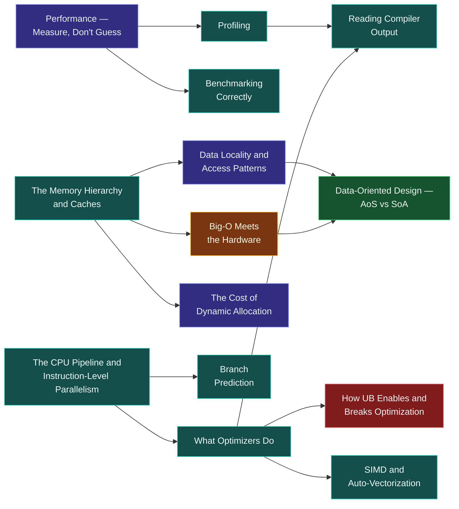

# Map — Performance & the Machine

> [!essence]
> What does the hardware actually do with our code, and how do we make it fast? Correctness is a property of the abstract machine; speed is a property of a specific CPU, cache and compiler. This domain is the second model you need once the first one — the one every earlier domain assumed — is no longer enough.

## Why This Domain Exists

> [!principle] From contract to hardware, first principles
> 1. **Constraint.** [[Map — What C++ Is|The abstract machine]] binds only *observable behavior*; it says nothing about how quickly a conforming execution reaches it. Real hardware is also not the flat, uniform machine that "one statement, one unit of work" reasoning assumes: an address that misses every cache costs roughly a hundred times what one sitting in L1 costs, and instructions overlap in a pipeline instead of running one at a time.
> 2. **Consequence.** Two programs can be equally correct, equally simple, and identical in Big-O, yet differ in wall-clock time by an order of magnitude, because the machine charges for *cache misses, mispredicted branches and stalled pipelines* — costs that are invisible in the source text and absent from an operation count.
> 3. **Requirement.** Making code fast therefore needs a second model alongside correctness: a model of what a real CPU and its memory system do with a compiled program, and a disciplined way to find where that model predicts trouble before rewriting anything.
> 4. **Design.** This domain supplies that model in two halves — the *memory* side ([[The Memory Hierarchy and Caches|hierarchy]], [[Data Locality and Access Patterns|locality]], [[The Cost of Dynamic Allocation|allocation cost]]) and the *execution* side ([[The CPU Pipeline and Instruction-Level Parallelism|pipeline]], [[Branch Prediction|branch prediction]], [[What Optimizers Do|compiler optimization]]) — bound together by a method, [[Performance — Measure, Don't Guess|measure, don't guess]], that keeps intuition honest against both.
> 5. **Price.** The model is real-machine, not abstract-machine: its numbers depend on which CPU, which compiler and which flags produced them. A conclusion earned on one machine is a hypothesis on the next, so it must be re-measured rather than assumed to still hold.

## The Core Tension

> [!tension] abstraction ⟷ control
> This domain is where the [[Map — What C++ Is|zero-overhead principle]] is tested against reality. The promise is that a range-`for` over a `std::vector<int>` costs no more than the equivalent loop over a raw array — but that equivalence only holds when the compiler can *prove* it, which is exactly what [[What Optimizers Do]] and, at its most demanding, [[SIMD and Auto-Vectorization]] are about. Reasoning that stays entirely inside the abstraction ("this should be O(1)") is necessary but not sufficient; the domain's discipline is to also read what the compiler actually emitted ([[Reading Compiler Output]]).

> [!tension] safety ⟷ performance
> The Standard's contract licenses the compiler to assume undefined behavior never happens, and this domain shows that license doing real work: [[How UB Enables and Breaks Optimization]] turns "this signed addition never overflows" into a branch the compiler deletes, or a loop bound it assumes is always reached. The same license that makes the fast path possible is the reason one unchecked precondition can silently remove a check the programmer thought was still there.

## Concept Map

Two hardware facts — the memory hierarchy and the instruction pipeline — flow through measurement and compiler behavior into the decisions that make code fast. Arrows read "is needed to understand".

**Big-O meeting the hardware is the hub.** It is the point where an asymptotic argument, taken from software theory, has to answer to a real memory system — which is why it feeds directly into [[Data-Oriented Design — AoS vs SoA|the layout discipline]] that acts on that answer. The memory hierarchy and the CPU pipeline are the two independent hardware facts everything else explains the cost of; measurement and compiler-reading are the tools that keep either explanation honest.

## Learning Route

1. [[Performance — Measure, Don't Guess]]: sets the discipline before any hardware fact does — don't change what you haven't profiled, and don't trust a change you haven't benchmarked.
2. [[Profiling]]: turns the mindset into a habit by finding where time actually goes, as opposed to where it looks like it should go.
3. [[Benchmarking Correctly]]: the complementary tool for testing whether one specific change is faster, free of the pitfalls (dead-code elimination, cold caches, noisy machines) that make naive timing lie.
4. [[The Memory Hierarchy and Caches]]: the single hardware fact behind most performance surprises — some memory is roughly a hundred times slower to reach than other memory.
5. [[Data Locality and Access Patterns]]: the direct consequence — code that respects the hierarchy's shape runs faster while computing exactly the same result.
6. [[Big-O Meets the Hardware]]: reconciles asymptotic complexity with the hierarchy, explaining why an algorithm with a worse bound can still win in practice. The hub of the domain.
7. [[The Cost of Dynamic Allocation]]: a concrete, everyday case where hierarchy and locality costs hide behind one innocuous-looking call.
8. [[Data-Oriented Design — AoS vs SoA]]: the layout discipline that applies locality deliberately to a whole data structure rather than one access at a time.
9. [[The CPU Pipeline and Instruction-Level Parallelism]]: the second hardware axis — not where data lives, but how instructions overlap in execution.
10. [[Branch Prediction]]: the pipeline's most visible failure mode, and why an unpredictable branch costs far more than its one instruction suggests.
11. [[What Optimizers Do]]: how the compiler reshapes code under the as-if rule to exploit both the hierarchy and the pipeline before a single instruction runs.
12. [[Reading Compiler Output]]: the practical skill of checking what the optimizer actually did, rather than guessing from the source text.
13. [[How UB Enables and Breaks Optimization]]: the sharp edge where [[Map — What C++ Is|the D00 contract]] and this domain meet — undefined behavior as optimization license, and as a way to erase code you meant to keep.
14. [[SIMD and Auto-Vectorization]]: the payoff case, where hierarchy, pipeline and compiler analysis combine so one instruction processes several data items at once.

## Key Ideas

1. **Measurement precedes optimization.** Modern pipelines and multi-level caches make source-level intuition about "hot" code unreliable, so which lines to change is a question for a sampling profiler or hardware counters, not for reading the code.
2. **Latency dominates over instruction count.** A DRAM access costs on the order of a hundred times an L1 hit, so an algorithm's Big-O bound describes an operation count, not a wall-clock time, once its working set outgrows the cache that holds it.
3. **The cache line, not the byte, is the unit of transfer.** The CPU never fetches a single field from memory; it pulls the whole 64-byte line containing it (on x86), so touching one member of an object also pulls in its neighbors, for better or for worse.
4. **A branch costs only when it is mispredicted.** The pipeline speculatively executes past every branch and discards the wrong path silently, so a predictable branch (a loop's back-edge) is nearly free while a data-dependent one stalls the pipeline on every miss.
5. **The compiler optimizes under the as-if rule, not the code as literally written.** It may reorder, fuse, or delete operations as long as the result matches some execution of the abstract machine — which is exactly why undefined behavior gives it license to assume the impossible path is never taken.
6. **Layout shapes cache behavior more than algorithm choice does.** An array of structs scatters the one field a loop actually touches across cache lines full of fields it doesn't need; a structure of arrays makes every byte fetched relevant, which is why a "worse" algorithm on the right layout regularly beats a "better" one on the wrong layout.
7. **Dynamic allocation costs more than its instruction count suggests.** A single `new` may take a lock, walk a free list and touch memory that is cold in the cache, so allocating inside a hot loop hides contention and cache-miss costs that a cycle count of the call itself won't show.
8. **Vectorization requires proving independence, not requesting it.** The compiler emits SIMD instructions only when it can show that loop iterations don't alias and don't depend on each other, which is why auto-vectorization silently fails on ordinary-looking code that a human can see is parallel.

| Idea | Developed in |
|---|---|
| Measurement discipline | [[Performance — Measure, Don't Guess]] · [[Profiling]] · [[Benchmarking Correctly]] |
| Memory cost model | [[The Memory Hierarchy and Caches]] · [[Big-O Meets the Hardware]] |
| Layout as a lever | [[Data Locality and Access Patterns]] · [[Data-Oriented Design — AoS vs SoA]] · [[The Cost of Dynamic Allocation]] |
| Execution-time hazards | [[The CPU Pipeline and Instruction-Level Parallelism]] · [[Branch Prediction]] |
| The compiler's contract | [[What Optimizers Do]] · [[Reading Compiler Output]] · [[How UB Enables and Breaks Optimization]] |
| The payoff | [[SIMD and Auto-Vectorization]] |

## Index

<!-- cc:auto:domain-index:D13 -->
**Tier 1 · Foundational**
- ○ [[Performance — Measure, Don't Guess]] · *concept*

**Tier 2 · Proficient**
- ○ [[The Memory Hierarchy and Caches]] · *mechanism*
- ○ [[Benchmarking Correctly]] · *idiom*
- ○ [[Profiling]] · *concept*
- ○ [[Data Locality and Access Patterns]] · *concept*
- ○ [[Reading Compiler Output]] · *guide*
- ○ [[Big-O Meets the Hardware]] · *concept*

**Tier 3 · Advanced**
- ○ [[The CPU Pipeline and Instruction-Level Parallelism]] · *mechanism*
- ○ [[Branch Prediction]] · *mechanism*
- ○ [[What Optimizers Do]] · *mechanism*
- ○ [[Data-Oriented Design — AoS vs SoA]] · *comparison*
- ○ [[The Cost of Dynamic Allocation]] · *concept*
- ○ [[How UB Enables and Breaks Optimization]] · *mechanism*

**Tier 4 · Expert**
- ○ [[SIMD and Auto-Vectorization]] · *mechanism*

`█░░░░░░░░░` 1/15 written · legend ○ planned ◐ draft ● reviewed ★ evergreen ⟲ revise
<!-- cc:end -->

## Sources

- Tour §1.9 "Mapping to Hardware" (p. 17): the direct correspondence between C++'s basic abstractions and machine memory, the seed of this domain's question.
- Tour §13.7 "Advice" (p. 183): urges checking, by measurement, whether a vectorized or parallel version of an algorithm actually pays off before adopting it — the same discipline this domain opens with.
- Pikus ch. 3 "CPU Architecture, Resources, and Performance" (p. 72, p. 92): instruction-level parallelism and branch prediction, developed from measured micro-benchmarks.
- Pikus ch. 4 "Memory Architecture and Performance" (p. 118): the cache hierarchy and why memory access, not computation, dominates real running time.
- Pikus ch. 5 "Threads, Memory, and Concurrency" (p. 176): the 64-byte x86 cache line and the false-sharing cost it produces.
- cppreference, *The as-if rule* and *Undefined behavior*: https://en.cppreference.com/w/cpp/language/as_if · https://en.cppreference.com/w/cpp/language/ub
- C++ Core Guidelines, *Per: Performance*: https://isocpp.github.io/CppCoreGuidelines/CppCoreGuidelines#per-performance
