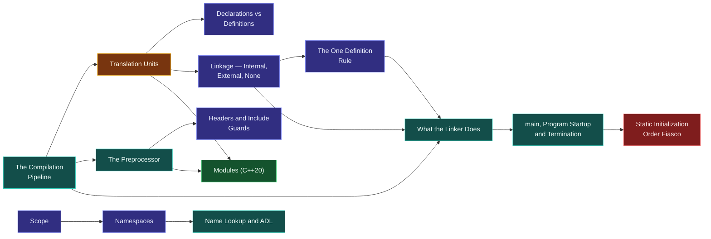

# Map — Program Structure & Build

> [!essence]
> How does text in many files become one running program? Every answer C++ gives — declarations, headers, linkage, the One Definition Rule, the linker — exists because a compiler can only ever look at one translation unit at a time, and a real program refuses to fit in one.

## Why This Domain Exists

[[Map — What C++ Is|The previous domain]] fixed what a conforming compiler owes a program: reproduce its observable behavior, leave the rest to the abstract machine. This domain asks a more mundane question first: before a compiler can owe you anything, it has to be handed a *program* — and no real program is one file.

> [!principle] The five-step derivation
> 1. **Constraint.** A C++ compiler processes one **translation unit** at a time — the token sequence left after preprocessing a single source file (`[lex.phases]`, phase 7, "Compiling"). It has no memory of any other file it has compiled before or will compile after. Real software, meanwhile, is too large for one file, written by more than one person, and reuses code (the standard library, other libraries) that was compiled somewhere else entirely, at another time.
> 2. **Consequence.** If translation unit `A.cpp` calls a function whose body lives in `B.cpp`, the compiler pass over `A.cpp` cannot see that body — it may not even see `B.cpp` exist. Yet `A.cpp` must still type-check the call, and the finished program must still contain exactly one machine-code implementation of that function for `A.cpp`'s call to land on.
> 3. **Requirement.** The language needs: a way to tell one translation unit that a name exists and what its type is, without showing its implementation (a **declaration**); a rule guaranteeing that a name with real effect has exactly one implementation across the *whole program*, not per file (the **One Definition Rule**); a visibility mechanism so independently written units don't collide on ordinary names (**scope**, **namespaces**, **linkage**); and a late-stage tool that stitches separately compiled object files into one executable by matching every unresolved reference to exactly one definition's address (**the linker**).
> 4. **Design.** C++ splits every name's story into a *declaration* (what the compiler needs to check a use) and a *definition* (what creates the thing) — "declared many times, defined exactly once" (Primer §2.2.2, p. 45). Translation units share declarations by literally pasting header text into each other through the **preprocessor** (Primer §2.6, p. 77), a mechanism inherited from C and older than C++ itself. **Linkage** decides which other translation units may even see a name; the **One Definition Rule** then binds every unit that does see it to agree. Phase 9, "Linking" (`[lex.phases]`), collects every translation unit's object code and resolves every cross-unit reference into one program image.
> 5. **Price.** Because `#include` is blind text substitution, not a C++-aware import, a header pasted into 101 translation units is *reparsed* 101 times (Tour §3.2, p. 32), and two headers can silently change each other's meaning depending on which is `#include`d first. The One Definition Rule is a promise the compiler mostly cannot check by itself — violating it across translation units is undefined behavior, not a caught error. C++20 Modules exist because the preprocessor's price finally outgrew its simplicity.

## The Core Tension

> [!tension] compatibility ⟷ evolution
> The `#include` model was already old when C++ inherited it from C in the early 1970s (Tour §3.2, p. 32), and nothing in this domain has been allowed to break it since. Headers, macros, and the preprocessor's blind text-pasting persist in every C++ codebase written today, disadvantages and all. [[Modules (C++20)]] are the domain's own resolution: a *compiled*, checkable interface that coexists with headers rather than replacing them, because forty years of `#include`-based code cannot simply be declared illegal.

> [!tension] abstraction ⟷ control
> A header is a hand-maintained promise: nothing stops its declarations from lying about the corresponding definition, and the compiler only finds out at [[What the Linker Does|link time]] — or, worse, never, when the mismatch is merely undefined behavior. Modules trade that raw, C-level control (paste anything, anywhere) for a compiler-checked boundary: only what a module explicitly exports is visible outside it. Every rule in this domain sits somewhere on that line between "the compiler enforces the interface" and "the programmer is trusted to."

## Concept Map

Arrows read "is needed to understand".

**Translation Units are the hub.** The pipeline produces one; the preprocessor decides what text lands inside one before the compiler ever sees it; scope, namespaces and linkage govern what a unit can see of another; the ODR and the linker are how many units become one program; and Modules are this domain's own rewrite of the weakest link — the preprocessor's blind paste.

## Learning Route

1. [[The Compilation Pipeline]]: fixes the vocabulary — preprocess, compile, assemble, link — that every other note in this domain names one stage of.
2. [[Translation Units]]: the actual object the middle of that pipeline hands the compiler. The hub of the domain.
3. [[Declarations vs Definitions]]: why a program spanning more than one translation unit needs two different kinds of statement about the same name.
4. [[The Preprocessor]] → [[Headers and Include Guards]]: how declarations are actually shared between translation units — by pasting text, before a single C++ rule has fired.
5. [[Scope]] → [[Namespaces]] → [[Name Lookup and ADL]]: once a name exists, who can see it, and how the compiler resolves which one you mean.
6. [[Linkage — Internal, External, None]] → [[The One Definition Rule]]: which translation units may see a given name, and the whole-program promise every unit that does see it must keep.
7. [[What the Linker Does]]: the tool that turns the ODR's promise into a concrete machine address.
8. [[main, Program Startup and Termination]]: where the linked program actually begins, and what the runtime does before your first line of `main` executes.
9. [[Static Initialization Order Fiasco]]: the one ordering question program startup deliberately leaves unanswered across translation units.
10. [[inline — Meaning Beyond Inlining]]: the ODR's one sanctioned exception, and the only reason a function body may legally live in a header.
11. [[Name Mangling and extern C]]: how the linker's flat, one-name-one-symbol world survives function overloading, and how C++ calls C.
12. [[Static vs Shared Libraries]]: what "linking" means once the linker's own output becomes an input to somebody else's link — the exact invocation a build system such as [[CMake Fundamentals|CMake]] exists to generate consistently ([[Map — Tooling & Engineering]]).
13. [[Modules (C++20)]]: replaces the preprocessor's blind text-paste with a compiled, checkable interface — the domain's own answer to its central tension.

## Key Ideas

1. **A translation unit, not a source file, is what the compiler actually type-checks.** By the end of translation phase 4 every `#include`d header has been pasted in, every macro expanded, and every conditional block resolved into one flat token sequence — the translation unit — before phase 7 ("Compiling") applies a single rule of C++ grammar to it (`[lex.phases]`).
2. **Declarations and definitions answer different questions.** A declaration tells the compiler a name's type, enough to check a call against it; a definition is the one place that creates the name's storage or body, and while a name may be *declared* many times across many translation units, it must be *defined* exactly once in the whole program (Primer §2.2.2, p. 45).
3. **The preprocessor performs text substitution, not compilation.** `#include` pastes a header's characters into the including file before the compiler's grammar rules apply at all, which is why a header pulled into 101 translation units is reparsed from scratch 101 times, and why two headers can change each other's meaning depending on include order (Tour §3.2, p. 32).
4. **Linkage decides who can see a name; the One Definition Rule decides what happens once they do.** A name with internal linkage is invisible outside its own translation unit and so may be freely redefined elsewhere; a name with external linkage must resolve to exactly one definition across the entire program, and a program that violates this is ill-formed with no diagnostic required.
5. **The linker resolves addresses; it does not understand code.** [[What the Linker Does|The linker]] matches every unresolved external reference left in an object file to exactly one definition supplied by some other object file or library and rewrites that reference into a real address — a "link-time error" is nothing more than a reference the linker could not match to exactly one candidate (PPP §4.4 "Link-time errors").
6. **Startup order is guaranteed within a translation unit and unspecified between them.** Objects with static storage duration are initialized in the order they are defined *within* one translation unit, but the Standard does not fix the relative order across *different* translation units — the exact gap [[Static Initialization Order Fiasco]] exploits.
7. **`inline` is the ODR's one sanctioned exception, not a request to the optimizer.** An inline function or variable may have an identical definition repeated in every translation unit that uses it without violating the One Definition Rule — the only reason a non-template function body may legally live in a header at all.
8. **Modules answer the domain's founding question a second, stricter way.** Where a header shares an interface by having its text re-parsed inside every including translation unit, a C++20 module compiles its interface once and exposes only what it explicitly `export`s — trading the preprocessor's blind substitution for a boundary the compiler itself checks (Tour §3.2, p. 31).

| Idea | Developed in |
|---|---|
| What the compiler actually processes | [[The Compilation Pipeline]] · [[Translation Units]] |
| Sharing an interface across files | [[Declarations vs Definitions]] · [[The Preprocessor]] · [[Headers and Include Guards]] |
| Who can see a name | [[Scope]] · [[Namespaces]] · [[Name Lookup and ADL]] |
| The cross-file promise and its enforcement | [[Linkage — Internal, External, None]] · [[The One Definition Rule]] · [[What the Linker Does]] |
| Where execution begins | [[main, Program Startup and Termination]] · [[Static Initialization Order Fiasco]] |
| The ODR's exceptions and the linker's edges | [[inline — Meaning Beyond Inlining]] · [[Name Mangling and extern C]] · [[Static vs Shared Libraries]] |
| Replacing the pipeline's weakest link | [[Modules (C++20)]] |

## Index

<!-- cc:auto:domain-index:D01 -->
**Tier 1 · Foundational**
- ○ [[The Compilation Pipeline]] · *mechanism*
- ○ [[Translation Units]] · *concept*
- ○ [[The Preprocessor]] · *mechanism*
- ○ [[Headers and Include Guards]] · *idiom*
- ○ [[Declarations vs Definitions]] · *comparison*
- ○ [[Scope]] · *concept*
- ○ [[Namespaces]] · *concept*

**Tier 2 · Proficient**
- ○ [[Linkage — Internal, External, None]] · *concept*
- ○ [[The One Definition Rule]] · *concept*
- ○ [[What the Linker Does]] · *mechanism*
- ○ [[main, Program Startup and Termination]] · *mechanism*
- ○ [[inline — Meaning Beyond Inlining]] · *concept*
- ○ [[Static vs Shared Libraries]] · *comparison*

**Tier 3 · Advanced**
- ○ [[Name Mangling and extern C]] · *mechanism*
- ○ [[Name Lookup and ADL]] · *mechanism*
- ○ [[Static Initialization Order Fiasco]] · *pitfall*
- ○ [[Modules (C++20)]] · *concept*

`█░░░░░░░░░` 1/18 written · legend ○ planned ◐ draft ● reviewed ★ evergreen ⟲ revise
<!-- cc:end -->

## Sources

- Primer §2.2.2 "Variable Declarations and Definitions" (p. 45) and §6.1.3 "Separate Compilation" (p. 207): declarations vs. definitions, and "declared many times, defined exactly once."
- Tour §3.2 "Separate Compilation" (p. 30–32; translation unit defined p. 32): header files, the translation-unit model, and the four disadvantages of `#include` that Modules address.
- PPP ch. 1 §1.3 "Compilation" and §1.4 "Linking": the compiler/linker pipeline built up from the first program a reader compiles.
- PPP ch. 4 §4.4 "Link-time errors" and §4.7 "Avoiding and finding errors": where in the pipeline a missing or duplicate definition actually surfaces.
- cppreference, *Phases of translation* · *Definitions and ODR* · *Scope*: https://en.cppreference.com/w/cpp/language/translation_phases · https://en.cppreference.com/w/cpp/language/definition · https://en.cppreference.com/w/cpp/language/scope
- Draft standard `[lex.phases]` (the nine translation phases, phase 9 = linking), `[basic.def.odr]` (the One Definition Rule), `[basic.link]` (linkage): https://eel.is/c++draft/lex.phases
