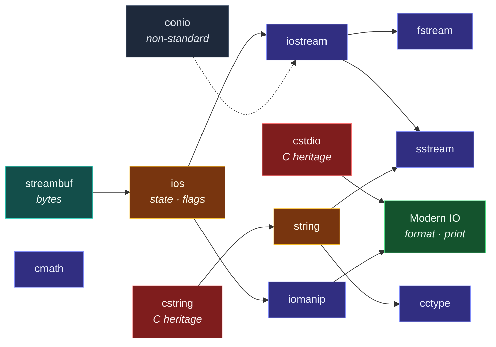

# Map — Standard Headers

> [!essence]
> *Where does each standard facility live, and what exactly does its header promise?* C++ ships almost nothing in the core language. Strings, I/O, containers and math all come from **headers**, and each header is a contract: include it, and a specified set of names becomes available with specified behavior. The **Header Cards** are the Compendium's lookup layer. There is one card per header (or per tight family of headers), always in the same shape: signature listing, task recipes, key rules, best practices. Each card links back to the Dossiers that explain *why*. Read a Dossier to understand an idea; keep a card open to get it right at the keyboard.

## Why This Domain Exists

> [!principle] Constraint → Consequence → Design
> 1. **Constraint:** The zero-overhead principle keeps the core language small. You pay only for what you use, so strings, streams, containers and math are *library*, not language ([[The C++ Design Philosophy]]).
> 2. **Consequence:** The library is split into headers, so a translation unit parses only what it names ([[The Compilation Pipeline]]). Every facility therefore has an address (`std::getline` lives in `<string>`, `std::setw` in `<iomanip>`), and a precise contract: preconditions, invalidation rules, the version that introduced each member.
> 3. **Design:** One card per header with a *fixed anatomy*, so the eye always knows where to look: *Quick Reference* for "what's the signature?", *Patterns* for "how do I do X?", *Key Concepts* for "what's the rule?", *Best Practices* for "what should I do by default?".
> 4. **Price:** Headers grew historically, not by design. C's `<cstdio>`, `<cstring>` and `<cctype>` sit beside their C++ successors `<iostream>`, `<string>` and `<format>`. The same task often has three homes, so every card carries a "choosing a tool" table or a *Related Headers* block that resolves the choice.

The cards began as the owner's own quick-reference sheets (September 2026). The Compendium adopted them on 2026-09-23. Since then the Builder writes new cards and the Editor audits them like every other note.

## The Core Tension

> [!tension] compatibility ⟷ evolution
> C++ never removes a header that real code includes. `<cstdio>`, `<cstring>` and `<cctype>` carry C's contracts into C++ unchanged: null-terminated buffers with no length, `int` parameters that must hold `unsigned char` values, format strings checked by nobody. The modern replacements (`<string>`, `<string_view>`, `<charconv>`, `<format>`, `<print>`) fix those contracts, but the old ones remain one `#include` away. Most of the undefined behavior these cards warn about comes from the C-heritage headers. The cards mark the old contract, the trap and the modern alternative side by side.

> [!tension] abstraction ⟷ control
> The stream headers trade speed for generality: locale lookup, virtual dispatch through `streambuf`, formatting state that persists between calls. `<charconv>` and `<format>` take the opposite position: no locale, no virtual calls, no hidden state. Neither is wrong. The *Choosing a Tool* tables in [[Header — sstream]], [[Header — Modern IO]] and [[Header — cstdio]] say which to use when.

## Concept Map

Arrows read "builds on". Solid cards exist; the container, utility and concurrency families are registered and arrive with their Dossiers.



The stream family is one architecture seen at three layers: [[Header — streambuf]] moves bytes, [[Header — ios]] holds state and format flags, and [[Header — iostream]], [[Header — fstream]] and [[Header — sstream]] attach that machinery to a device. Knowing the layer tells you which card to open.

## Learning Route

1. [[Header — string]]: the type every other card passes around. Learn the member list and the invalidation rules first.
2. [[Header — iostream]]: console I/O and the `>>`-then-`getline` trap every beginner meets.
3. [[Header — iomanip]]: aligned, precise output, and which manipulators are *sticky*.
4. [[Header — fstream]]: the same interface over files; open modes and the mode matrix.
5. [[Header — sstream]]: the same interface over strings; parsing and building text.
6. [[Header — ios]]: the layer underneath: stream state, flags, and why `fail` differs from `bad`.
7. [[Header — cctype]]: character classification and the `unsigned char` rule that prevents undefined behavior.
8. [[Header — cmath]]: math functions, classification, and comparing floating-point values.
9. [[Header — cstdio]] and [[Header — cstring]]: the C heritage. Read them to maintain old code safely, not to write new code.
10. [[Header — Modern IO]]: `std::format`, `std::print`, synchronized and span streams, the direction all output is moving.
11. [[Header — streambuf]]: custom buffers, the expert layer beneath every stream.
12. [[Header — conio (non-standard)]]: only if you maintain Turbo C-era or coursework code; the card's portable replacements are the real lesson.

## Key Ideas

1. **A header is a contract, not a file.** The Standard specifies which names each header declares. An implementation may pull in more, but relying on a *transitive* include breaks on the next compiler, so include what you use.
2. **C headers come in two spellings.** `<cstring>` declares its names in `std::` (and possibly also globally); `<string.h>` does the reverse. Prefer the `<cxxx>` form and write `std::strlen`.
3. **Every member has a version.** Cards label C++11/14/17/20/23/26 additions, because "compiles on my machine" often means "my compiler defaults to a newer standard".
4. **Streams are layered.** State and format live in `ios_base`/`basic_ios`, formatting in `istream`/`ostream`, bytes in `streambuf`. Each layer has its own card.
5. **The old and the new coexist: choose deliberately.** `printf` / `<<` / `std::format`, `atoi` / `stoi` / `from_chars`, `strcpy` / `std::string`. The cards' selection tables settle each choice.
6. **The dangerous contracts are the C ones.** Signed `char` into `<cctype>`, unterminated buffers into `<cstring>`, mismatched specifiers into `<cstdio>`: each is [[Undefined Behavior]], not an error message.
7. **Headers are becoming modules.** C++23 adds `import std;` and `import std.compat;`: the same contracts, parsed once instead of per translation unit ([[Modules (C++20)]]).

**Where to look: the owner's question router**

| Question | Card | Section |
|---|---|---|
| "Why does my `getline` read an empty line?" | [[Header — iostream]] | the `>>`-then-`getline` trap |
| "How do I make a column line up?" | [[Header — iomanip]] | aligned table output |
| "Why is my `setw` only working once?" | [[Header — iomanip]] | stickiness table |
| "What does `ios::ate` do vs `ios::app`?" | [[Header — fstream]] | open mode matrix |
| "How do I read a whole file into a string?" | [[Header — fstream]] | slurp pattern |
| "Is `strncpy` safe?" | [[Header — cstring]] | the `strncpy` trap |
| "How do I split a string?" | [[Header — string]] / [[Header — sstream]] | splitting |
| "Why doesn't `0.1 + 0.2 == 0.3`?" | [[Header — cmath]] | comparing floats |
| "Why does `isalpha` crash on accented text?" | [[Header — cctype]] | the cast, always |
| "How do I run work in the background while `main` keeps going?" | [[Header — thread and stop_token]] | main keeps working while a background loop runs |
| "Why did my program abort when a `std::thread` went out of scope?" | [[Header — thread and stop_token]] | joinable at destruction → `std::terminate` |
| "How do I tell a thread to stop?" | [[Header — atomic]] / [[Header — thread and stop_token]] | stop flag · `jthread` + `stop_token` |
| "How do I count from many threads without a mutex?" | [[Header — atomic]] | counter incremented from many threads |
| "How long did this take?" | [[Header — chrono]] | measuring how long something takes |
| "How do I convert milliseconds to seconds?" | [[Header — chrono]] | converting between units · rounding |
| "What's the difference between `fail` and `bad`?" | [[Header — ios]] | state flag decision table |
| "How do I reset a `stringstream`?" | [[Header — sstream]] | the two-step reset |
| "How do I make `cout` write to a socket?" | [[Header — streambuf]] | custom buffers |
| "Why is my `printf` crashing?" | [[Header — cstdio]] | `printf` is not type-safe |
| "How do I print from multiple threads?" | [[Header — Modern IO]] | `osyncstream` |
| "How do I format my own type?" | [[Header — Modern IO]] | custom `formatter` |
| "Which header do I include in my `.hpp`?" | [[Header — Modern IO]] | `<iosfwd>` |
| "How do I read a key without pressing Enter?" | [[Header — conio (non-standard)]] | portable replacements |

**Standard version summary** (across the written cards)

```text
C++11   move semantics on streams; string paths for fstream; stoi/to_string;
        cbrt/hypot/round/isnan and the classification family; isblank; io_errc
C++14   std::quoted; ""s literals; gets removed
C++17   filesystem::path in fstream; string_view; charconv; special math functions;
        3-argument hypot
C++20   std::format; syncstream; stringstream view()/move-str(); <numbers>;
        starts_with/ends_with; lerp
C++23   std::print/println; spanstream; string::contains; resize_and_overwrite;
        ios::noreplace; range formatting; import std
C++26   strstream removed; println() with no arguments; runtime_format
```

**Compiler flags worth using with these headers**

```text
-std=c++20                     Or c++23 where the toolchain supports it
-Wall -Wextra -Wpedantic       The baseline
-Wformat=2                     Catches printf/scanf mismatches
-Wshadow -Wconversion          Catches quiet correctness bugs (e.g. tolower's int into char)
-fsanitize=address,undefined   Finds the buffer and UB bugs the C-heritage headers invite
-D_GLIBCXX_ASSERTIONS          libstdc++ bounds checks in debug builds
```

## Index

<!-- cc:auto:domain-index:HDR -->
**Tier 1 · Foundational**
- ◐ [[Header — iostream]] · *header*
- ◐ [[Header — iomanip]] · *header*
- ◐ [[Header — fstream]] · *header*
- ◐ [[Header — sstream]] · *header*
- ◐ [[Header — string]] · *header*
- ◐ [[Header — cctype]] · *header*
- ◐ [[Header — cmath]] · *header*
- ○ [[Header — vector]] · *header*
- ○ [[Header — array]] · *header*
- ○ [[Header — algorithm]] · *header*
- ○ [[Header — memory]] · *header*
- ○ [[Header — utility]] · *header*
- ○ [[Header — map and set]] · *header*
- ○ [[Header — random]] · *header*
- ○ [[Header — exception and stdexcept]] · *header*
- ○ [[Header — cstdlib]] · *header*
- ○ [[Header — cstdint]] · *header*
- ○ [[Header — cassert]] · *header*

**Tier 2 · Proficient**
- ◐ [[Header — ios]] · *header*
- ◐ [[Header — cstdio]] · *header*
- ◐ [[Header — Modern IO]] · *header*
- ◐ [[Header — cstring]] · *header*
- ◐ [[Header — conio (non-standard)]] · *header*
- ○ [[Header — numeric]] · *header*
- ○ [[Header — unordered_map and unordered_set]] · *header*
- ○ [[Header — deque, list and forward_list]] · *header*
- ○ [[Header — iterator]] · *header*
- ○ [[Header — limits]] · *header*
- ○ [[Header — queue and stack]] · *header*
- ○ [[Header — optional, variant and any]] · *header*
- ○ [[Header — tuple]] · *header*
- ○ [[Header — functional]] · *header*
- ◐ [[Header — chrono]] · *header*
- ○ [[Header — span]] · *header*
- ○ [[Header — charconv]] · *header*
- ○ [[Header — ranges]] · *header*
- ○ [[Header — filesystem]] · *header*
- ○ [[Header — initializer_list]] · *header*
- ○ [[Header — compare]] · *header*
- ○ [[Header — expected]] · *header*
- ○ [[Header — bitset]] · *header*
- ◐ [[Header — thread and stop_token]] · *header*
- ○ [[Header — mutex and shared_mutex]] · *header*
- ○ [[Header — condition_variable]] · *header*
- ○ [[Header — future]] · *header*

**Tier 3 · Advanced**
- ◐ [[Header — streambuf]] · *header*
- ○ [[Header — bit]] · *header*
- ○ [[Header — regex]] · *header*
- ○ [[Header — type_traits]] · *header*
- ○ [[Header — concepts]] · *header*
- ◐ [[Header — atomic]] · *header*
- ○ [[Header — system_error]] · *header*
- ○ [[Header — new]] · *header*
- ○ [[Header — locale]] · *header*
- ○ [[Header — complex and valarray]] · *header*
- ○ [[Header — source_location and stacktrace]] · *header*

**Tier 4 · Expert**
- ○ [[Header — coroutine]] · *header*

`███░░░░░░░` 17/58 written · legend ○ planned ◐ draft ● reviewed ★ evergreen ⟲ revise
<!-- cc:end -->

## Sources

- Tour §9.3 "Standard-Library Organization" (p. 121): headers, namespaces and the `std` module.
- Tour §3.2 "Separate Compilation" (p. 30): what `#include` does and why modules improve on it.
- cppreference, *C++ Standard Library headers*: https://en.cppreference.com/w/cpp/header
- Draft standard `[headers]` (library headers, the `<cname>` vs `<name.h>` rule): https://eel.is/c++draft/headers
- P2465R3, *Standard Library Modules std and std.compat*: https://wg21.link/p2465r3
- cppreference, *Compiler support*: https://en.cppreference.com/w/cpp/compiler_support
- Origin: the owner's `CPP_REFERENCE_INDEX` (September 2026), expanded into this Domain Map.
