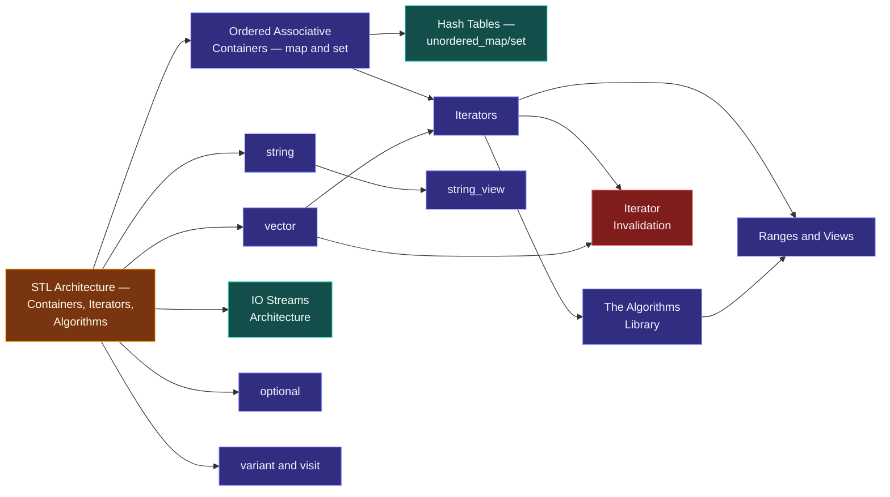

# Map — Standard Library

> [!essence]
> Which solved problems ship with the language, and how are they composed? Every program needs a growable sequence, a way to search and sort it, and a way to move text in and out — and if every program invented these privately, no two programs would interoperate. The standard library answers this not with new syntax but with ordinary C++: templates and classes that any programmer could have written, disciplined into one shared, zero-overhead vocabulary.

## Why This Domain Exists

[[Map — Generic Programming|The previous domain]] gave C++ a way to write an algorithm once and have the compiler generate a full, concrete version for each type it is actually used with, at no run-time cost over a hand-written version. That mechanism is necessary but not sufficient: a language feature only becomes useful once somebody uses it to solve the recurring problems every program has.

> [!principle] Constraint → Consequence → Requirement → Design → Price
> 1. **Constraint.** Almost every non-trivial program needs the same handful of things: a place to hold a collection of values that can grow, a way to search, sort and transform that collection, and a way to read and write text. These are not language features — the core language has no `vector`, no `sort`, no `cout` (Tour §9.2, p. 120: the library is layered on top of a small core language).
> 2. **Consequence.** Without a shared answer, every program (and every team inside a program) invents its own growable array, its own sort, its own string-building routine — each differently tested, differently bug-ridden, and incompatible with every other team's version. A function that returns "a sequence of names" has no common type to return it as.
> 3. **Requirement.** The shared answer must cost nothing beyond what a hand-written version would cost (Tour §9.2, p. 121: helpful to nearly every programmer, no significant overhead over a simpler purpose-built version, easy to learn in simple cases), and it must be *extensible* — users need to be able to add their own containers and algorithms without asking the standards committee (Tour §9.2, p. 120).
> 4. **Design.** C++ answers with a library, not new syntax, built from the same templates and classes any programmer has access to. The STL layer ([[STL Architecture — Containers, Iterators, Algorithms]]) separates *containers* (how data is stored), *algorithms* (what is done to it) and [[Iterators]] (the handle that lets an algorithm walk any container without knowing its layout). Because the seam is the iterator, N containers and M algorithms need roughly N+M implementations, not N×M (PPP §19.6, ch. 19: the STL is "a framework for dealing with data as sequences of elements"). The same generic machinery, applied to characters, gives [[string]]; applied to bytes moving to and from a device, gives [[IO Streams Architecture|streams]].
> 5. **Price.** None of this is free of cost elsewhere. Templates must be instantiated from a full definition the compiler can see, so most of the library lives in headers, not in a compiled `.lib` ([[Why Templates Live in Headers]]). And because the standard library never removes a facility real code depends on, each generation of "the right way to do X" sits beside the last: `<cstdio>` beside `<iostream>` beside `<format>` ([[Map — Standard Headers]]). Knowing *which* layer to reach for is now part of the skill.

## The Core Tension

> [!tension] abstraction ⟷ control
> A generic `std::sort` over `vector<int>::iterator` must compile to the same machine code a programmer would write by hand for that exact case — that is the zero-overhead principle, and the library is the proof that C++ can deliver on it (PPP §0.6, ch. 0: "elegant, flexible, and type-and-resource-safe, yet efficient facilities"). The price is paid at compile time and in tooling: because everything is a template, the full definition must be visible everywhere it's used, and a misuse can produce an error message many lines deep in library internals rather than one line at the call site.

> [!tension] compatibility ⟷ evolution
> The library has never deleted a header a real program includes. `<cstdio>` and `<cstring>` carry C's contracts unchanged into C++20; `<iostream>` layers a type-safe, extensible alternative on top in C++98; `<format>` and `<print>` (C++20/23) fix problems in `iostream` itself without removing it. `vector<bool>` has been a bit-packed, non-conforming specialization since C++98 and cannot be fixed without breaking existing code. The result: the same task — printing a number, storing a sequence — usually has two or three standard-approved homes, and picking the current-best one is a judgment call the library itself does not make for you ([[Map — Standard Headers]] works this tension header by header).

## Concept Map

Arrows read "is needed to understand."

**STL Architecture** is the hub: it is the design decision (containers/iterators/algorithms as three separate, composable pieces) that every concrete container, and every algorithm, is an instance of. [[Iterators]] is the load-bearing idea underneath — containers exist to be iterated, algorithms exist to consume iterators, and the domain's central hazard ([[Iterator Invalidation]]) is what happens when that handle outlives its guarantee. [[Ranges and Views]] is where the architecture is pushed furthest: a composable pipeline over iterators without a container in sight.

## Learning Route

1. [[STL Architecture — Containers, Iterators, Algorithms]]: the frame. Read this first — every other note in the domain is one piece of the three-part design it describes.
2. [[vector]]: the default container, and the concrete case every abstract claim about iterators and algorithms can be checked against.
3. [[Iterators]]: the handle that decouples "how is this stored" from "what do I do with it," demonstrated on the container you already know.
4. [[The Algorithms Library]]: the payoff — `find`, `sort`, `transform` written once, over any iterator range, not once per container.
5. [[How vector Grows — Capacity and Amortized Cost]] → [[Iterator Invalidation]]: the mechanism behind `vector`'s cost model, then the hazard it creates for any iterator, pointer or reference held across a mutation.
6. [[string]]: the same vocabulary — contiguous storage, iterators, capacity — specialized to characters, plus the text-specific operations layered on top.
7. [[Ordered Associative Containers — map and set]] → [[Hash Tables — unordered_map and unordered_set]]: the lookup family, first by comparison (ordered, `O(log n)`), then by hash (unordered, amortized `O(1)`).
8. [[IO Streams Architecture]]: the same generic-and-extensible philosophy applied to input and output instead of storage — read this to see the pattern repeat in an unrelated domain.
9. [[string_view]] → [[Ranges and Views]]: the non-owning, composable layer added once containers and algorithms had proven the split was right (C++17, C++20).
10. [[optional]] → [[variant and visit]]: vocabulary types that answer "maybe nothing" and "one of several known types" without a hand-rolled sentinel or a manual tagged union.
11. Advanced layer: [[pair and tuple]], [[span]], [[chrono — Durations, Clocks, Time Points]], [[format and print]], [[Container Adaptors — stack, queue, priority_queue]], [[Small String Optimization]], [[any]].

## Key Ideas

1. **The library is ordinary C++, not a language extension.** Every container and algorithm is built from templates, classes and operator overloading available to any programmer; nothing in `<vector>` or `<algorithm>` needs compiler magic that user code couldn't also use ([[Map — Generic Programming]]).
2. **Containers, iterators and algorithms are deliberately three separate pieces.** [[Iterators]] are the seam between "how data is stored" and "what is done to it," so `find` works unmodified on a `vector`, a `list` or a `map` (PPP ch. 19, "STL").
3. **Zero overhead is the design criterion, not a happy accident.** Because templates instantiate one concrete version per type actually used, a call to generic `std::sort` compiles down to the same code a sort hand-written for that exact type would (Tour §9.2, p. 121; Map — Generic Programming §Price).
4. **An iterator's validity is a promise the type system does not check.** [[Iterator Invalidation]] is undefined behavior, not a caught error: operations that reallocate, insert or erase silently invalidate iterators, pointers and references into the container (Primer §9.4, p. 355, on why contiguous storage makes `vector` especially prone to this).
5. **Every container manages its own storage through RAII.** Application code that uses `vector` or `map` never calls `new` or `delete` directly; the container's destructor releases every element it owns ([[RAII]], [[Map — Objects, Memory & Lifetime]]).
6. **The library only ever adds a layer; it never removes one.** `<cstdio>`, `<iostream>` and `<format>`/`<print>` all still compile today, because each new attempt at "the right way to do I/O" had to coexist with, not replace, the last ([[Map — Standard Headers]]).
7. **Non-owning views are the newest answer to an old problem.** [[string_view]], [[span]] and [[Ranges and Views]] let code describe "a sequence" or "a piece of text" without taking ownership of it — cheaper to pass, but only valid as long as the underlying object is (mirrors D04's safety ⟷ performance tension).

| Idea | Where it is developed |
|---|---|
| Why the library is a library, not syntax | [[STL Architecture — Containers, Iterators, Algorithms]] · [[Map — Generic Programming]] |
| Containers vs. iterators vs. algorithms | [[Iterators]] · [[The Algorithms Library]] · [[vector]] |
| Lookup by comparison vs. by hash | [[Ordered Associative Containers — map and set]] · [[Hash Tables — unordered_map and unordered_set]] |
| The domain's central hazard | [[Iterator Invalidation]] · [[How vector Grows — Capacity and Amortized Cost]] |
| Text and IO as the same architecture, reused | [[string]] · [[IO Streams Architecture]] · [[string_view]] |
| The non-owning, composable layer | [[Ranges and Views]] · [[span]] |
| Vocabulary types | [[optional]] · [[variant and visit]] · [[pair and tuple]] |

## Index

<!-- cc:auto:domain-index:D10 -->
**Tier 1 · Foundational**
- ○ [[STL Architecture — Containers, Iterators, Algorithms]] · *concept*
- ○ [[vector]] · *concept*
- ○ [[Iterators]] · *concept*
- ○ [[string]] · *concept*
- ○ [[array]] · *concept*
- ○ [[Ordered Associative Containers — map and set]] · *concept*
- ○ [[The Algorithms Library]] · *concept*
- ○ [[IO Streams Architecture]] · *mechanism*
- ○ [[Stream State and Robust Input]] · *idiom*
- ○ [[File IO]] · *concept*
- ○ [[Random Number Generation]] · *concept*
- ○ [[String Streams]] · *concept*

**Tier 2 · Proficient**
- ○ [[How vector Grows — Capacity and Amortized Cost]] · *mechanism*
- ○ [[Sequence Containers Compared]] · *comparison*
- ○ [[Hash Tables — unordered_map and unordered_set]] · *mechanism*
- ○ [[Iterator Invalidation]] · *pitfall*
- ○ [[Container Adaptors — stack, queue, priority_queue]] · *concept*
- ○ [[Iterator Categories and Concepts]] · *concept*
- ○ [[Erase-Remove and erase_if]] · *idiom*
- ○ [[Ranges and Views]] · *concept*
- ○ [[string_view]] · *concept*
- ○ [[format and print]] · *concept*
- ○ [[optional]] · *concept*
- ○ [[variant and visit]] · *concept*
- ○ [[span]] · *concept*
- ○ [[pair and tuple]] · *concept*
- ○ [[chrono — Durations, Clocks, Time Points]] · *concept*

**Tier 3 · Advanced**
- ○ [[Small String Optimization]] · *mechanism*
- ○ [[any]] · *concept*

`░░░░░░░░░░` 1/30 written · legend ○ planned ◐ draft ● reviewed ★ evergreen ⟲ revise
<!-- cc:end -->

## Sources

- Tour ch. 9 "A Tour of the Standard Library: Containers and Algorithms" §9.2 "Standard-Library Components" (p. 120) and §9.3 "Standard-Library Organization" (p. 121): what the library covers and why it qualified for inclusion.
- PPP ch. 19 "Vectors and Arrays" §19.6 "vector, list, and string": the STL as "a framework for dealing with data as sequences of elements." PPP ch. 21 "Algorithms" §21.1 "Standard-library algorithms."
- Primer Part II "The C++ Library" (p. 307) and §9.1 "Overview of the Sequential Containers" (p. 326), §9.4 "How a vector Grows" (p. 355): the container library's operation hierarchy and vector's contiguous-storage rationale, in C++11 terms.
- cppreference, *Containers library* · *Algorithms library* · *Ranges library*: https://en.cppreference.com/w/cpp/container.html · https://en.cppreference.com/w/cpp/algorithm.html · https://en.cppreference.com/w/cpp/ranges.html
