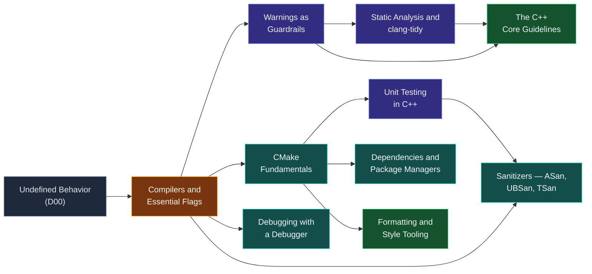

# Map — Tooling & Engineering

> [!essence]
> *Which tools turn correct-looking code into verified, maintainable software?* A compiler is only obliged to reject what the grammar and a fixed list of rules make ill-formed. Almost everything else that makes a program *good* — free of undefined behavior, tested against its own claims, built the same way twice, readable to the next person — is left to a toolchain that sits outside the language entirely. This domain is that toolchain: what each tool actually checks, when it checks it, and what it costs to run.

## Why This Domain Exists

[[Map — What C++ Is|The language's own contract]] binds a conforming compiler to the *observable behavior* of a well-formed program and nothing more. That contract has a narrow escape hatch, and this domain lives entirely inside it.

> [!principle] The five-step derivation
> 1. **Constraint.** The Standard requires a diagnostic only for programs that are *ill-formed* — a syntax error or a semantic rule the compiler can check locally. A huge second category, undefined behavior, is explicitly exempted: "implementations are not required to diagnose undefined behavior" (cppreference, *Undefined behavior*), even though a UB-triggering program looks exactly like a correct one until the day it isn't.
> 2. **Consequence.** A program that compiles without a single error can still read past the end of an array, race two threads on the same variable, leak every allocation it makes, or simply compute the wrong answer for an input nobody tried. None of that shows up as a compiler error, because none of it is required to.
> 3. **Requirement.** Since silence from the compiler is not proof of correctness, verifying a program needs instruments that look at *different things at different times*: some extend the compiler's own pass over the text without ever running it; some watch one real execution and catch what only shows up when the program actually runs; some just state, once, what "correct" means for a piece of code so the question can be re-asked automatically after every change; and some make the raw act of turning many files into one program, on more than one machine, tractable at all.
> 4. **Design.** [[Compilers and Essential Flags|The compiler itself]] is the base of the toolchain — asked nicely (`-Wall -Wextra`), it reports far more than the bare minimum the Standard demands ([[Warnings as Guardrails]]). [[Static Analysis and clang-tidy|Static analysis]] and [[The C++ Core Guidelines|the Core Guidelines]] push that same compile-time reasoning further, checking rules the grammar itself can't express. [[Debugging with a Debugger|A debugger]] and [[Sanitizers — ASan, UBSan, TSan|sanitizers]] instead watch one concrete run, catching exactly the class of bug the first category is structurally blind to — the one that only exists once data actually flows through the program. [[Unit Testing in C++|Unit tests]] fix a definition of "correct" once and re-check it forever. [[CMake Fundamentals|A build system]] and [[Dependencies and Package Managers|a package manager]] solve the purely mechanical problem underneath all of it: producing the same build, with the same dependencies, on every machine that needs one. [[Formatting and Style Tooling|A formatter]] removes the one disagreement in this list that was never about correctness at all.
> 5. **Price.** None of this is free, and none of it is required. Warnings need `-Wall` turned on; a sanitizer build runs at a measured slowdown over a release build and so can never simply *be* the release build; static analysis trades false positives for its earliness; a test only ever catches the one behavior it was written to check, never the ones nobody thought to assert. A team that skips all of it pays nothing today and the whole bill later, at the moment "it compiled" turns out to have meant nothing.

## The Core Tension

> [!tension] compile-time ⟷ run-time
> Half this domain's tools never run the program at all. [[Warnings as Guardrails|Warnings]], [[Static Analysis and clang-tidy|static analysis]] and [[The C++ Core Guidelines|Core Guidelines]] checkers reason over the source text itself, so they can flag *every* path a human could ever trigger, cheaply, before the first test runs — at the cost of judging code they never actually execute, which is exactly why they produce false positives a human must adjudicate. The other half only sees what one real execution does: [[Debugging with a Debugger|a debugger]], [[Sanitizers — ASan, UBSan, TSan|a sanitizer]] and a [[Unit Testing in C++|unit test]] report a bug only once some input has actually walked the buggy path — precise, because a fault reported this way is real, not merely possible, but blind to every path that specific run never took. Stroustrup framed the Core Guidelines project itself as needing to be "backed up... with static analysis tools" (Tour §19.1, p. 262) precisely because advice alone, unchecked at either time, doesn't change what ships.

> [!tension] safety ⟷ performance
> A sanitizer build is a second build, not a flag on the one you ship: AddressSanitizer's own documentation states its typical instrumented slowdown at 2× (Clang, *AddressSanitizer*), and the sanitizer runtime itself is explicitly "not meant to be linked against production executables" (Clang, *AddressSanitizer*). [[Sanitizers — ASan, UBSan, TSan|Sanitizers]] buy certainty about a specific run's memory and thread safety at a cost no release configuration can absorb, which is why this domain's answer is never "always on" but "on somewhere in the pipeline, before the code that matters ships."

## Concept Map

Arrows read "is needed to understand".

**The compiler is the hub.** Every other tool here is either the compiler doing more work when asked (warnings, static analysis, sanitizer instrumentation) or a program built to drive the compiler consistently (CMake, package managers) or to watch what its output does (a debugger, a test run). Undefined behavior, established in [[Map — What C++ Is|the first domain]], is the reason any of this is necessary at all: it is the gap every tool here exists to close, no two of them the same way.

## Learning Route

1. [[Compilers and Essential Flags]]: the base tool. Every other note in this domain is either the compiler asked to do more, or another program invoked around it.
2. [[Warnings as Guardrails]]: the cheapest of those "do more" modes — the same compilation pass, made to report what it already noticed.
3. [[CMake Fundamentals]]: once a program needs more than one file compiled and linked with consistent flags, something has to drive the compiler the same way every time.
4. [[Debugging with a Debugger]]: when the program's *behavior* is wrong, not just its text, a debugger lets you watch one run instead of guessing from the source.
5. [[Sanitizers — ASan, UBSan, TSan]]: an instrumented run that doesn't just show you behavior but automatically names the exact undefined-behavior or data-race rule a debugger would only reveal by luck.
6. [[Static Analysis and clang-tidy]]: moves some of what a debugger or sanitizer finds only after running the program back to compile time, at the price of tolerating false positives.
7. [[The C++ Core Guidelines]]: the rulebook that decides which of those static warnings are worth having, and gives each one a name and a rationale.
8. [[Unit Testing in C++]]: states, once, what "correct" means for a piece of code, so every tool above it has something fixed to check against on every future change.
9. [[Formatting and Style Tooling]]: removes the one disagreement in this domain that was never about correctness, so review time goes to the rest.
10. [[Dependencies and Package Managers]]: the last piece — once your own code is verified, almost every real program still needs other people's, built and versioned by a tool rather than by hand.

## Key Ideas

1. **A clean compile is not evidence of correctness.** The Standard requires a diagnostic for what is *ill-formed*, not for what is merely undefined; most undefined behavior compiles with zero errors and, without extra flags, zero warnings too.
2. **Warnings extend the same pass the compiler already runs, for free.** `-Wall -Wextra` (or `/W4`) ask the front end to report constructs it already parsed and judged suspicious, at no run-time cost — a check that exists only because the programmer explicitly asked for it (Primer §1.2, p. 5).
3. **Static tools and dynamic tools trade false positives for false negatives, in opposite directions.** [[Static Analysis and clang-tidy|Static analysis]] and the [[The C++ Core Guidelines|Core Guidelines]] checkers reason about code that never executes, so they can flag every path a human could trigger — at the cost of flagging some that can't actually happen; [[Sanitizers — ASan, UBSan, TSan|sanitizers]] and [[Debugging with a Debugger|debuggers]] watch the one path a specific run actually took, so every report is real — at the cost of seeing nothing about the paths that run never touched.
4. **A build system exists because "compile this file" doesn't scale to "build this project."** [[CMake Fundamentals|CMake's]] job is to generate the exact compiler invocations — every flag, every include path, every library, in the right order — that a person would otherwise have to retype correctly, identically, on every platform.
5. **A unit test is a warning that only ever fires on the one bug it names.** Unlike a compiler warning or a static-analysis rule, which generalizes across every piece of code matching a pattern, [[Unit Testing in C++|a test]] catches only the specific behavior its assertions describe — which is why it complements the pattern-based tools rather than replacing them.
6. **Every verification tool in this domain is optional, off by default, and unevenly available.** Warnings need `-Wall`; a sanitizer needs an instrumented build accepted to cost a measured slowdown over release (2× is typical for AddressSanitizer); a debugger needs debug symbols; a package manager needs a manifest someone wrote. None of it fires unless a build system, or a person, deliberately turns it on.
7. **Formatting tools resolve a dispute that has no correct answer, only a chosen one.** [[Formatting and Style Tooling|clang-format]] enforces one consistent layout mechanically, so code review time is spent on behavior, not on where a brace goes.

| Idea | Developed in |
|---|---|
| Why a clean compile isn't enough | [[Compilers and Essential Flags]] · [[Warnings as Guardrails]] |
| Compile-time verification | [[Static Analysis and clang-tidy]] · [[The C++ Core Guidelines]] |
| Run-time verification | [[Debugging with a Debugger]] · [[Sanitizers — ASan, UBSan, TSan]] |
| Fixing "correct" so it can be re-checked | [[Unit Testing in C++]] |
| Building the same thing, every time | [[CMake Fundamentals]] · [[Dependencies and Package Managers]] |
| Removing the argument that isn't about correctness | [[Formatting and Style Tooling]] |

## Index

<!-- cc:auto:domain-index:D14 -->
**Tier 1 · Foundational**
- ○ [[Compilers and Essential Flags]] · *guide*
- ○ [[Warnings as Guardrails]] · *idiom*
- ○ [[CMake Fundamentals]] · *guide*
- ○ [[Debugging with a Debugger]] · *guide*

**Tier 2 · Proficient**
- ○ [[Sanitizers — ASan, UBSan, TSan]] · *guide*
- ○ [[Static Analysis and clang-tidy]] · *guide*
- ○ [[Unit Testing in C++]] · *guide*
- ○ [[The C++ Core Guidelines]] · *guide*
- ○ [[Formatting and Style Tooling]] · *guide*

**Tier 3 · Advanced**
- ○ [[Dependencies and Package Managers]] · *guide*

`█░░░░░░░░░` 1/11 written · legend ○ planned ◐ draft ● reviewed ★ evergreen ⟲ revise
<!-- cc:end -->

## Sources

- Primer §1.2 "A First Look at Input/Output" (p. 5): recommends compiling with `-Wall` (GNU) or `/W4` (Microsoft) to surface problematic constructs the compiler is not otherwise required to flag.
- PPP §2.10 "Type deduction: auto": "figure out how to enable warnings... and adhere to them," and the book's own reliance on the C++ Core Guidelines and a rule checker for its type-safety claims.
- PPP §4.7 "Avoiding and finding errors": surveys unit-testing frameworks (Boost.Test, Catch2, CTest, Google Test) as the standard way to attach an expected result to a code example and re-check it automatically.
- Tour §19.1 "History" (p. 262): the C++ Core Guidelines project, started in 2015, explicitly paired coding rules with "static analysis tools and a tiny support library" rather than advice alone; §1.10 "Advice" (p. 19) shows the Guidelines' rule-citation convention (`[CG: ES.23]`) this Compendium follows for tooling notes that touch them.
- Pikus ch. 5 "Threads, Memory, and Concurrency" (p. 195): only an instrumented tool such as Thread Sanitizer (TSan) can find certain memory-order bugs on hardware whose native ordering happens to hide them.
- Pikus ch. 11 "Undefined Behavior and Performance" (p. 390, p. 392): frames the UB sanitizer (UBSan) as an optional, run-time-cost validation tool distinct from the compiler's own (silent) exploitation of UB for optimization.
- cppreference, *Undefined behavior*: implementations are not required to diagnose undefined behavior, even though many simple cases are — https://en.cppreference.com/w/cpp/language/ub
- Clang documentation, *AddressSanitizer*: typical instrumented slowdown of 2×; the runtime "is not meant to be linked against production executables" — https://clang.llvm.org/docs/AddressSanitizer.html
- C++ Core Guidelines (isocpp/CppCoreGuidelines, GitHub): the guidelines this domain's [[The C++ Core Guidelines|Core Guidelines note]] and every rule-checker in it ultimately point back to — https://github.com/isocpp/CppCoreGuidelines/blob/master/CppCoreGuidelines.md
- CMake documentation, *CMake Tutorial*: the build-system model [[CMake Fundamentals]] follows, from a single executable target to multi-target, dependency-aware builds — https://cmake.org/cmake/help/latest/guide/tutorial/index.html
