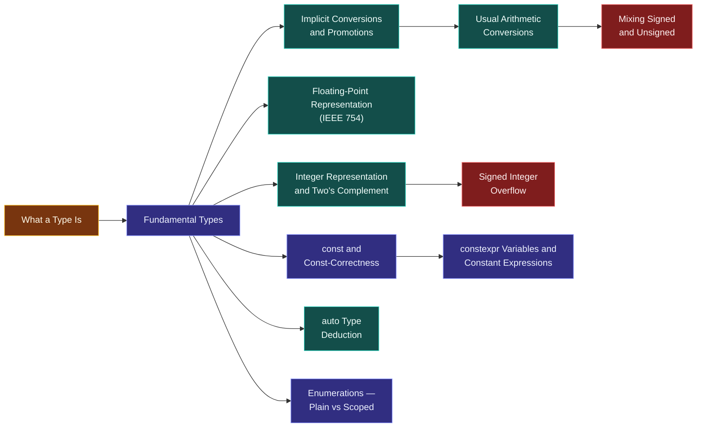

# Map — Types & Values

> [!essence]
> *How are meaning and operations attached to raw bits?* A byte in memory is just a pattern; the type is the compile-time contract that says which values that pattern may represent, which operations on it mean something, and how many bits it takes. This domain is the machinery behind that contract, and the seams — conversions, overflow, `const` — where it shows.

## Why This Domain Exists

[[Map — What C++ Is|The previous domain]] established the contract itself: the Standard fixes the *observable behavior* of an abstract machine, and the compiler is free to produce whatever real-machine code reproduces it (the as-if rule). That contract has to attach to something concrete before a single line of a program can run.

> [!principle] From bits to types
> 1. **Constraint.** Hardware stores and moves fixed-width groups of bits. A byte in memory carries no built-in announcement of whether it is part of a number, a character, or an address.
> 2. **Consequence.** Without an agreed meaning, the same bits could be added, compared, or dereferenced as anything, and most of those interpretations would be nonsense — or would fault the machine.
> 3. **Requirement.** Something must fix, for every piece of storage, which values are legal, which operations are defined on it, and how many bits it occupies — and it must do this before the program runs, so the fix costs nothing while the program is running.
> 4. **Design.** C++ makes that fixed triple — *values × operations × representation* — the **type** ([[What a Type Is]]). A name's type is attached at compile time, checked by the compiler, and never carried as a tag in memory.
> 5. **Price.** Because the tag exists only at compile time, nothing at run time re-checks it. Moving a value from one type to another is just reinterpreting bits under a fixed rule ([[Implicit Conversions and Promotions]]), and some of those rules silently lose information or leave the abstract machine with no defined answer at all ([[Signed Integer Overflow]]).

## The Core Tension

> [!tension] safety ⟷ performance
> A C++ type carries no runtime marker, and the compiler enforces its rules only while compiling; once built, an `int` is four bytes with no memory of having been checked. That buys types that cost nothing to use, but the two places C's arithmetic model can go wrong — [[Signed Integer Overflow|signed overflow]] and unchecked [[Mixing Signed and Unsigned|signed/unsigned mixing]] — go wrong silently or undefined, rather than being caught. [[const and Const-Correctness|const]] and [[constexpr Variables and Constant Expressions|constexpr]] push part of that checking back to compile time without adding a byte at run time.

> [!tension] compatibility ⟷ evolution
> C++ inherited C's fundamental types, its implicit conversion rules, and its plain `enum`, all designed for 1970s hardware with no type-safety agenda. Later standards cannot remove any of it without breaking existing code, so they add narrower, safer siblings next to the old ones: [[Enumerations — Plain vs Scoped|enum class]] beside `enum`, the mandatory [[Narrowing Conversions and Brace Initialization|narrowing check]] of `{}` initialization beside `=`, [[The Named Casts|the four named casts]] beside a C-style `(int)x`. The old forms stay legal, and are usually still what a beginner reaches for first.

## Concept Map

Arrows read "is needed to understand".

**What a type is** sits at the root: everything else in the domain is either a kind of type, a rule for moving between types, or a way one of those rules goes wrong. Once a value has a type, [[Map — Expressions & Control]] asks how it combines with others and how a program chooses what runs next.

## Learning Route

1. [[What a Type Is]]: fixes the vocabulary — a type as a set of values, a set of operations, and a representation. Nothing after this makes sense without it.
2. [[Fundamental Types]]: the built-in vocabulary — `bool`, the character types, the integer types, the floating-point types — and their guaranteed minimum sizes.
3. [[Integer Representation and Two's Complement]]: the real-machine picture behind every `int`, and why C++20 finally made one representation mandatory.
4. [[Floating-Point Representation (IEEE 754)]]: the real-machine picture behind `double`, and why equality on floats is not what it looks like.
5. [[Implicit Conversions and Promotions]]: how the compiler silently changes an operand's type before evaluating an expression.
6. [[Usual Arithmetic Conversions]]: the exact ranking implicit conversions follow to give both sides of `+`, `<`, `==` the same type.
7. [[Mixing Signed and Unsigned]]: the pitfall the usual arithmetic conversions create when a comparison quietly promotes a negative `int` to a huge `unsigned`.
8. [[Signed Integer Overflow]]: the pitfall integer representation creates — unlike unsigned wraparound, signed overflow has no defined answer at all.
9. [[Narrowing Conversions and Brace Initialization]]: the one implicit conversion the compiler will refuse, if you ask with `{}` instead of `=`.
10. [[Comparing Floating-Point Values]]: the sibling pitfall on the floating-point side — two computations that "should" match usually don't, bit for bit.
11. [[const and Const-Correctness]] → [[Top-Level vs Low-Level const]] → [[constexpr Variables and Constant Expressions]]: the ladder from "this name can't be reassigned" to "the compiler can prove this value before the program runs."
12. [[auto Type Deduction]] → [[decltype and decltype(auto)]]: naming a type without spelling it — once from a value, once from an expression's declared type.
13. [[The Named Casts]]: the escape hatches from the type system, ranked from safest to most dangerous.
14. [[Enumerations — Plain vs Scoped]]: a closed, named set of values, and the C legacy — implicit conversion to `int`, leaking names — that `enum class` fences off.
15. [[Type Aliases (typedef and using)]] → [[Strong Types]]: naming an existing type, then wrapping it so the compiler stops two same-typed quantities from being interchanged by accident.
16. Specialist layer: [[sizeof, alignof and Alignment]] (what a type costs in bytes and placement), [[Literals and User-Defined Literals]] (spelling a value with its type attached), [[Characters, Encodings and the char Types]] (why `char` is not "a letter"), [[Bitwise Operations and the bit Header]] (treating an integer as a bit pattern on purpose), [[volatile — What It Does Not Mean]] (the qualifier most often mistaken for thread safety).

## Key Ideas

1. **A type is a triple, not a label.** It fixes a set of legal values, a set of operations defined on them, and a bit-level representation ([[What a Type Is]]); change any one of the three and it is a different type even if the spelling looks the same.
2. **The type tag exists only at compile time.** The compiler uses a variable's declared type to choose which instructions an operation lowers to, then discards the type; at run time an `int` is four bytes with no marker saying "I am an int."
3. **Two's complement is now the only legal signed representation.** Before C++20 the Standard allowed three representations for negative integers, all implementation-defined; P0907R4 narrowed that to two's complement for every conforming compiler, though [[Signed Integer Overflow|overflow]] is still undefined, not wraparound.
4. **Most conversions between types are silent.** `char` becomes `int`, `int` becomes `double`, `double` becomes `int`: each is a fixed rule applied without being asked ([[Implicit Conversions and Promotions]]), and `{}` initialization is the one place the compiler will refuse to apply it if it would lose information ([[Narrowing Conversions and Brace Initialization]]).
5. **Comparing a signed and an unsigned value converts the signed one to unsigned first.** A negative `int` compared against an `unsigned` becomes a huge positive number before the comparison runs, because the [[Usual Arithmetic Conversions]] rank unsigned above signed at equal width ([[Mixing Signed and Unsigned]]).
6. **`const` is a compile-time promise about a name, not a property of storage.** It restricts what you may write *through that name*; it says nothing about whether the same bytes can still change some other way ([[const and Const-Correctness]]).
7. **`constexpr` asks the compiler to prove a value, not just to freeze it.** A `const` variable may still be initialized at run time; a `constexpr` variable must be computable before the program starts, or the declaration is ill-formed ([[constexpr Variables and Constant Expressions]]).
8. **`enum class` fixes two things plain `enum` got wrong.** Its enumerators don't implicitly convert to `int`, and they live inside the enumeration's own scope instead of leaking into the surrounding one ([[Enumerations — Plain vs Scoped]]).

| Idea | Developed in |
|---|---|
| What a type fixes | [[What a Type Is]] · [[Fundamental Types]] |
| Real-machine representation | [[Integer Representation and Two's Complement]] · [[Floating-Point Representation (IEEE 754)]] |
| Silent conversions | [[Implicit Conversions and Promotions]] · [[Usual Arithmetic Conversions]] · [[Narrowing Conversions and Brace Initialization]] |
| Failure modes | [[Signed Integer Overflow]] · [[Mixing Signed and Unsigned]] · [[Comparing Floating-Point Values]] |
| Compile-time guarantees | [[const and Const-Correctness]] · [[Top-Level vs Low-Level const]] · [[constexpr Variables and Constant Expressions]] |
| Naming and closed sets | [[Type Aliases (typedef and using)]] · [[Enumerations — Plain vs Scoped]] · [[Strong Types]] |

## Index

<!-- cc:auto:domain-index:D02 -->
**Tier 1 · Foundational**
- ○ [[What a Type Is]] · *concept*
- ○ [[Fundamental Types]] · *concept*
- ○ [[const and Const-Correctness]] · *concept*
- ○ [[Integer Representation and Two's Complement]] · *mechanism*
- ○ [[Implicit Conversions and Promotions]] · *mechanism*
- ○ [[Narrowing Conversions and Brace Initialization]] · *concept*
- ○ [[auto Type Deduction]] · *mechanism*
- ○ [[Type Aliases (typedef and using)]] · *concept*
- ○ [[Enumerations — Plain vs Scoped]] · *comparison*

**Tier 2 · Proficient**
- ○ [[Signed Integer Overflow]] · *pitfall*
- ○ [[Floating-Point Representation (IEEE 754)]] · *mechanism*
- ○ [[Comparing Floating-Point Values]] · *pitfall*
- ○ [[Usual Arithmetic Conversions]] · *mechanism*
- ○ [[Mixing Signed and Unsigned]] · *pitfall*
- ○ [[The Named Casts]] · *comparison*
- ○ [[Top-Level vs Low-Level const]] · *comparison*
- ○ [[constexpr Variables and Constant Expressions]] · *concept*
- ○ [[sizeof, alignof and Alignment]] · *mechanism*
- ○ [[decltype and decltype(auto)]] · *mechanism*
- ○ [[Literals and User-Defined Literals]] · *concept*
- ○ [[Characters, Encodings and the char Types]] · *concept*
- ○ [[Bitwise Operations and the bit Header]] · *concept*

**Tier 3 · Advanced**
- ○ [[Strong Types]] · *idiom*
- ○ [[volatile — What It Does Not Mean]] · *pitfall*

`░░░░░░░░░░` 1/25 written · legend ○ planned ◐ draft ● reviewed ★ evergreen ⟲ revise
<!-- cc:end -->

## Sources

- Primer §2.2.1 (p. 43): list initialization rejects a conversion that might lose information — the definition of narrowing used throughout the domain. §2.4.3 (p. 64): top-level const. §2.4.4 (p. 66): constexpr variables must be initialized by a constant expression. §4.2 (p. 140): the definition of overflow. §19.3 (p. 832): scoped vs. unscoped enumerations.
- Tour §1.4 (p. 8): narrowing conversions are allowed and applied through `=`, rejected through `{}`. §2.4 (p. 25): `enum class`.
- PPP §2.10 "Type deduction: auto": the widening/narrowing distinction stated in first-principles terms.
- Pikus, "Undefined behavior and C++ optimization" (p. 380): why the compiler is entitled to assume signed arithmetic never overflows, and what that assumption costs when it's wrong.
- cppreference, *Fundamental types* · *Implicit conversions* · *constexpr specifier*: https://en.cppreference.com/w/cpp/language/types · https://en.cppreference.com/w/cpp/language/implicit_conversion · https://en.cppreference.com/w/cpp/language/constexpr
- WG21 P0907R4, "Signed Integers are Two's Complement": http://wg21.link/P0907R4 — the paper that removed the other two legal representations for C++20.
- Draft standard `[basic.fundamental]`, `[conv]`, `[expr.arith.conv]`, `[dcl.constexpr]`: https://eel.is/c++draft/basic.fundamental
