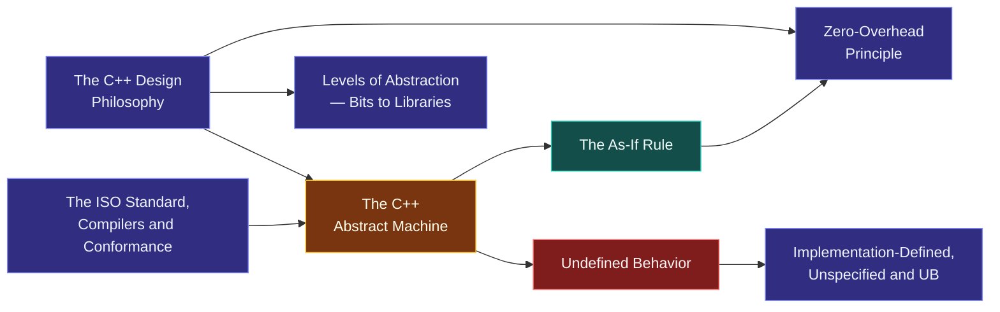

# Map — What C++ Is

> [!essence]
> Every C++ program is a promise made three times over: to the programmer who reads the source, to the compiler that must give it meaning, and to the machine that will execute it. This domain is that promise's fine print — what it guarantees, what it deliberately leaves open, and what keeping it costs.

## Why This Domain Exists

> [!principle] The contract, from first principles
> 1. **Constraint.** Real machines differ — register counts, pointer widths, instruction sets, cache hierarchies. A language's rules cannot be written in terms of one specific machine without becoming meaningless the moment the hardware changes.
> 2. **Consequence.** If the rules instead define a program's meaning only informally, or only by reference to "what compilers typically do," then two compilers — or the same compiler at two optimization levels — are free to disagree about what a program does, because nothing pins either of them to a shared, checkable meaning.
> 3. **Requirement.** The language needs one hypothetical machine, specified precisely enough that "what this program does" has a single answer, general enough that no real hardware is privileged, and explicit about which of a program's actions are simply none of its business.
> 4. **Design.** The Standard defines the [[The C++ Abstract Machine|abstract machine]] (`[intro.abstract]`): a machine that exists only on paper, whose *observable behavior* — its accesses to `volatile` objects and the data and prompts it exchanges with the outside world — every conforming compiler must reproduce. [[The As-If Rule]] then lets a real compiler do anything it likes internally — reorder, delete, invent intermediate computations — as long as that reproduction still holds. Whatever the abstract machine leaves unconstrained is [[Undefined Behavior]]: not a flaw in the language, but the explicit absence of a promise.
> 5. **Price.** Nothing enforces the contract at run time. Violating an unstated precondition doesn't raise an error — it forfeits the guarantee for the *entire* execution, not just the offending line, because the compiler was free to assume, while optimizing, that the violation could never happen. Most of the rest of this Atlas is, one way or another, a strategy for keeping this contract without paying for a checker nobody asked for.

## The Core Tension

> [!tension] abstraction ⟷ control
> [[The C++ Design Philosophy]] takes a side before a single feature is designed: you should be able to write in objects, types and expressions instead of registers and addresses, but never be charged for that convenience, and never be stopped from dropping to the hardware's level when you need to. [[Zero-Overhead Principle|Zero overhead]] is this tension resolved twice over — in abstraction's favor at compile time (the high-level code exists), and in control's favor at run time (it costs nothing extra to have written it that way).

> [!tension] safety ⟷ performance
> The abstract machine defines meaning only for programs that respect its preconditions. Stepping outside one is not a checked failure but [[Undefined Behavior]] — the compiler is licensed to assume it never happens and to optimize on that assumption. That license is exactly why UB-driven optimizations can look absurd from inside the broken program: the compiler was never obligated to reason about that path at all. Later domains, starting with [[Map — Objects, Memory & Lifetime]], show how to buy safety back *structurally* instead of asking the abstract machine to check anything.

## Concept Map

Arrows read "is needed to understand".

**The abstract machine is the hub.** The design philosophy and the Standard/compiler relationship both feed it; the as-if rule and undefined behavior are its two operating consequences — one enabling optimization, the other bounding it — and the three-way behavior taxonomy refines what "the Standard doesn't say" actually means. Two domains put the contract to work next: [[Map — Program Structure & Build]] asks how source text becomes a running instance of this machine, and [[Map — Types & Values]] asks how meaning gets attached to the bits that instance manipulates.

## Learning Route

1. [[The C++ Design Philosophy]]: the values — direct hardware mapping, zero overhead, "trust the programmer" — that every later design choice in the language traces back to.
2. [[Zero-Overhead Principle]]: the philosophy's sharpest, most testable consequence, and the standard every new library feature is still held to.
3. [[Levels of Abstraction — From Bits to Libraries]]: how that philosophy is delivered in layers, each hiding the one beneath it without hiding its cost.
4. [[The ISO Standard, Compilers and Conformance]]: who writes the rules (the Standard, via WG21) versus who implements them (GCC, Clang, MSVC) — and why "compiles here" and "is legal C++" are different claims.
5. [[The C++ Abstract Machine]]: the formal object the Standard actually defines. The hub of the domain.
6. [[The As-If Rule]]: the mechanism that reconciles the abstract machine's fixed meaning with a real compiler's freedom to transform the program however it likes.
7. [[Undefined Behavior]]: what the contract deliberately leaves unsaid, and why the silence is load-bearing rather than an oversight.
8. [[Implementation-Defined, Unspecified and Undefined Behavior]]: the three-way split hiding inside "the Standard doesn't pin this down" — and why only one of the three is dangerous.

## Key Ideas

1. **The Standard defines a machine, not a computer.** [[The C++ Abstract Machine]] is a hypothetical, parameterized interpreter (`[intro.abstract]`); any real CPU running your program is only ever one "corresponding instance" of it, so a rule stated for the abstract machine binds every conforming implementation at once.
2. **Only observable behavior is contractual.** The Standard enumerates exactly what a conforming compiler must reproduce — `volatile` accesses, and the data and prompts exchanged with the outside world — and nothing else; where a variable actually lives, which register holds it, and whether a loop is literally executed iteration by iteration are all left open.
3. **The as-if rule is what makes zero overhead *legal*, not merely desirable.** [[The As-If Rule]] permits any transformation — inlining, reordering, deleting a computation whose result is never used — provided the reproduced observable behavior still matches; without this rule, "execute the code as written" would forbid nearly every optimization that exists.
4. **Undefined behavior is an absent precondition, not a punishment.** [[Undefined Behavior]] means the Standard imposes zero requirements on the rest of the execution once an unstated precondition is broken (signed overflow, dereferencing a stale pointer); compilers exploit exactly this by assuming, during optimization, that the violating path is unreachable.
5. **"Unpredictable" comes in three legally distinct sizes.** [[Implementation-Defined, Unspecified and Undefined Behavior]] separates behavior a compiler must fix and document (`sizeof(int)`), behavior it may vary silently among a bounded menu of outcomes (argument evaluation order), and behavior with no defined outcome at all — treating the first two like the third overstates the danger, and the reverse understates it.
6. **Zero overhead is a promise about the feature you didn't use.** [[Zero-Overhead Principle]] binds every abstraction the language adds: if you don't use it, you pay nothing for its existence; if you do, you could not have hand-coded the equivalent noticeably better. It is a constraint enforced on new features, not an average observed after the fact.
7. **The Standard and the compiler are separate authorities, and each can be wrong.** [[The ISO Standard, Compilers and Conformance]] means "does this compile on GCC" and "is this legal C++" are different questions with different answers — every mainstream compiler ships documented extensions, and each has shipped, and later fixed, genuine conformance bugs.

| Idea | Developed in |
|---|---|
| Why a hardware-independent machine at all | [[The C++ Design Philosophy]] · [[The C++ Abstract Machine]] |
| What a compiler is actually bound to reproduce | [[The As-If Rule]] · [[The C++ Abstract Machine]] |
| What happens when a program breaks the contract | [[Undefined Behavior]] · [[Implementation-Defined, Unspecified and Undefined Behavior]] |
| The cost model the rest of the language inherits | [[Zero-Overhead Principle]] · [[Levels of Abstraction — From Bits to Libraries]] |
| Who defines "legal C++" versus who runs it | [[The ISO Standard, Compilers and Conformance]] |

## Index

<!-- cc:auto:domain-index:D00 -->
**Tier 1 · Foundational**
- ○ [[The C++ Design Philosophy]] · *concept*
- ○ [[Zero-Overhead Principle]] · *concept*
- ○ [[Levels of Abstraction — From Bits to Libraries]] · *concept*
- ○ [[The C++ Abstract Machine]] · *concept*
- ○ [[Undefined Behavior]] · *concept*
- ○ [[The ISO Standard, Compilers and Conformance]] · *concept*

**Tier 2 · Proficient**
- ○ [[The As-If Rule]] · *mechanism*
- ○ [[Implementation-Defined, Unspecified and Undefined Behavior]] · *comparison*

`█░░░░░░░░░` 1/9 written · legend ○ planned ◐ draft ● reviewed ★ evergreen ⟲ revise
<!-- cc:end -->

## Sources

- Pikus §"Micro-benchmarking and compiler optimizations" (p. 55): defines *observable behavior* precisely; (p. 56): states the as-if rule in those terms.
- Pikus ch. 11 "Undefined Behavior and Performance," §"What is undefined behavior?" (p. 372, taxonomy on p. 373) and §"Why have undefined behavior?" (p. 376): the performance rationale for leaving behavior undefined rather than implementation-defined.
- Tour §1.9 "Mapping to Hardware" (p. 16): the direct-hardware-mapping half of the design philosophy, worked through an example.
- Tour §1.4 "Types, Variables, and Arithmetic" (p. 6): implementation-defined type sizes as the everyday face of the abstract machine's parameters.
- Primer §2.1 "Primitive Built-in Types" (p. 36): the caution against relying on implementation-defined behavior, and what "nonportable" costs in practice.
- cppreference, *Undefined behavior* · *The as-if rule*: https://en.cppreference.com/w/cpp/language/ub · https://en.cppreference.com/w/cpp/language/as_if
- Draft standard `[intro.abstract]` — the abstract machine, the as-if rule (footnote), observable behavior: https://eel.is/c++draft/intro.abstract
