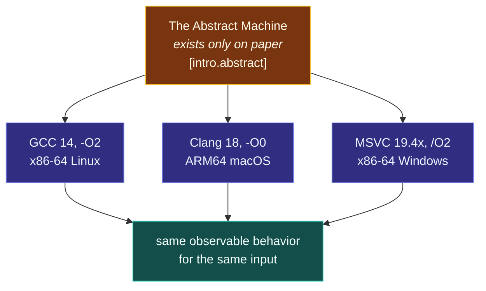

# The C++ Abstract Machine

> [!essence]
> A C++ program's meaning is defined against a machine that exists only on paper — the **abstract machine** (`[intro.abstract]`) — never against any specific CPU. Any real compiler, operating system and processor together form only one **corresponding instance** of that machine, and every instance is bound to reproduce the same **observable behavior** for the same input. Nothing else about what happens while a program runs is a promise.

## The Problem

Real hardware disagrees with itself. Register counts, pointer widths, cache hierarchies and instruction sets differ across chips, and the same source file, handed to two compilers — or to one compiler at two optimization levels — can legitimately produce two different sequences of machine instructions.

> [!principle] Constraint → Consequence → Design
> 1. **Constraint:** No two real machines execute a program identically, and a language's rules cannot be stated in terms of one specific machine without becoming meaningless the moment the hardware or the compiler changes.
> 2. **Consequence:** If "what this program does" were defined only by watching one particular compilation run on one particular chip, then two compilers — or the same compiler at `-O0` and `-O2` — would be free to disagree about the program's meaning, because nothing pins either of them to a shared, checkable answer.
> 3. **Requirement:** The language needs one hypothetical machine, specified precisely enough that "did this implementation get it right" has a single answer, general enough that no real chip is privileged, and explicit about exactly which slice of a running program the language actually controls — so every other slice is legitimately up for grabs.
> 4. **Design:** The Standard defines that machine (`[intro.abstract]`): a **parameterized**, **nondeterministic** abstract machine that exists only in the text of the document. *Parameterized* because some of its properties — `sizeof(int)`, padding in class layout — are left open, to be fixed and documented by each implementation as **implementation-defined behavior**. *Nondeterministic* because some of its operations, such as the order in which function-call arguments are evaluated, have more than one legal outcome (**unspecified behavior**). A conforming implementation is never required to copy this machine's internal structure; it is required only to reproduce its **observable behavior**. [[The As-If Rule|The as-if rule]] simply names the permission this already implies: since only the reproduction has to match, a real compiler may get there by any means it likes.
> 5. **Price:** Nothing about what happens *inside* a running program is contractual — not where a variable lives, not which register holds it, not whether a loop whose result nobody uses executes even once. And where the abstract machine states no rule at all for a given operation, the program has stepped outside the contract entirely: that is [[Undefined Behavior|undefined behavior]], and the license to assume it never happens is exactly what an optimizer exploits for everything that follows it.

> [!tension] abstraction ⟷ control
> The abstract machine is where "write in high-level terms" and "never pay extra for it" both become checkable claims instead of slogans. "High-level" is safe precisely because only *observable* behavior is promised — the compiler is free to translate a class, a loop or a whole function however it likes underneath that promise. "No extra cost" is safe for the same reason: everything the contract does not mention is fair game for the optimizer to shrink, reorder or delete. [[The C++ Design Philosophy]] states the ambition; this machine is what makes it a rule a compiler can be checked against.

## Mental Model



> [!model] A recipe and three kitchens, and where it breaks
> The abstract machine is a recipe that fixes the finished dish precisely — its taste, its texture, what the diner is served (the observable behavior) — without dictating knife technique, cooking order, or which burner does the work. Three different kitchens (GCC, Clang, MSVC, each on its own hardware) can plate a dish indistinguishable from the recipe's and all count as having followed it, even if one chopped ingredients it later threw away unused, and another fired every burner at once. **Where it breaks:** a recipe describes one deterministic dish. The abstract machine's rules also license genuine nondeterminism — more like a recipe that says "sauté the onions first, or the garlic first; the diner is never told which," and either kitchen is still correct.

## Mechanics

The Standard sorts everything a program might do into four buckets. Only the first is a promise every implementation must keep identically.

| Category | What it means | Example | Clause |
|---|---|---|---|
| **Observable behavior** (contractual) | Must be reproduced by every conforming implementation, for the same input | Ordering of accesses to `volatile` objects · data delivered for a file's contents · a prompt shown before the program waits for input | `[intro.abstract]` ¶8 |
| **Parameters** (implementation-defined) | Vary between implementations, but each must fix one value and document it | `sizeof(int)` · padding inside a class layout | `[intro.abstract]` ¶2 |
| **Nondeterministic aspects** (unspecified) | A bounded menu of legal outcomes; the Standard doesn't say which | Order of evaluating a function call's arguments | `[intro.abstract]` ¶3 |
| **Undefined** | No requirement stated at all | Modifying a `const` object · signed integer overflow | `[intro.abstract]` ¶4 |

A real toolchain — compiler, OS, CPU together — is called a **corresponding instance** of the abstract machine once its documentation fixes every parameter (`[intro.abstract]` ¶2). Two different corresponding instances of the same program are only obligated to agree on row one of that table.

> [!standard] The as-if rule is a footnote, not a separate mechanism
> `[intro.abstract]` footnote 5 states it directly: an implementation "is free to disregard any requirement of this document as long as the result is as if the requirement had been obeyed, as far as can be determined from the observable behavior of the program." It is not a second rule bolted onto the abstract machine — it is what "reproduce only the observable behavior" already means, made explicit because the consequence (an implementation "need not evaluate part of an expression if it can deduce that its value is not used") surprises people the first time they see it. See [[The As-If Rule]] for the mechanism worked through in detail.

> [!standard] C++26 bounds how far one undefined operation reaches — through C++23, it didn't
> Through C++23, a conforming implementation had to match the abstract machine's observable behavior only up to the point where the program hit an undefined operation; after that point it "may produce arbitrary additional observable behavior," with no stated limit on how much of the *rest* of the execution that covers. The C++26 working draft (what `eel.is` now shows) adds **observable checkpoints** and a **defined prefix**: an operation is still guaranteed only if it happens before every undefined operation reaches an observable checkpoint, narrowing "arbitrary behavior forever after" to "arbitrary behavior after the last checkpoint that could have caught it." A call to `std::observable_checkpoint` and parts of contract-assertion evaluation are checkpoints. See `[intro.abstract]` ¶6 (https://eel.is/c++draft/intro.abstract) and cppreference's *as-if rule* page, §"until/since C++26" (https://en.cppreference.com/w/cpp/language/as_if), for the two wordings side by side.

## Under the Hood

> [!machine] The compiler owes you the answer, not the arithmetic
> GCC 11.4, x86-64 Linux, `-O2` (this vault's toolchain; no sanitizers). Two builds of the same checksum loop, differing only in whether the result is ever used:

```text
 SOURCE, AS WRITTEN                          MACHINE CODE, AS EMITTED
 ┌──────────────────────────────┐            ┌────────────────────────────┐
 │ for (i = 0; i < 8; ++i)       │  result    │ discarded  →  main:        │
 │   total += d[i]*d[i];         │  discarded │                xor eax,eax │
 │ checksum(d, 8);   // unused   │  ────────▶ │                ret         │
 └──────────────────────────────┘            └────────────────────────────┘
 ┌──────────────────────────────┐            ┌────────────────────────────┐
 │ for (i = 0; i < 8; ++i)       │  result    │ printed →  loop inlined,   │
 │   total += d[i]*d[i];         │  printed   │            call printf,   │
 │ printf("%ld\n", checksum(…)); │  ────────▶ │            same 8 terms    │
 └──────────────────────────────┘            └────────────────────────────┘
```

The two programs below are identical except for that one line. In the first, the entire loop and the call to `checksum` vanish — `main` compiles to nothing but a return:

```nasm
main:
  xor eax, eax
  ret
```

In the second, printing the value makes it observable, so the same arithmetic must actually happen somewhere; GCC inlines the loop straight into `main` rather than emitting a call:

```nasm
main:
  sub rsp, 40
  mov rdx, rsp
  mov rax, rsp
.L8:
  mov DWORD PTR [rax], edi
  lea rcx, [rsp+32]
  add rax, 4
  add edi, 1
  cmp rax, rcx
  jne .L8
  xor esi, esi
.L9:
  mov eax, DWORD PTR [rdx]
  add rdx, 4
  imul eax, eax
  cdqe
  add rsi, rax
  lea rax, [rsp+32]
  cmp rdx, rax
  jne .L9
  mov edi, OFFSET FLAT:.LC0
  xor eax, eax
  call printf
```

Neither build "executes the loop as written." The first proves the loop was never obligated to run at all; the second proves that once the result is observable, *some* computation producing the right number is obligated — inlined, unrolled, reordered, or otherwise, at the compiler's discretion.

## In Code

**1 · A computation nobody looks at is not a promise**

```cpp
long checksum(const int* data, int n) {
    long total = 0;
    for (int i = 0; i < n; ++i) total += data[i] * data[i];  // ①
    return total;
}

int main(int argc, char**) {
    int data[8];
    for (int i = 0; i < 8; ++i) data[i] = argc + i;
    checksum(data, 8);   // ② result discarded: not observable behavior
}
```
1. `data` is filled from `argc`, so the compiler cannot know the values at compile time — the elimination below isn't just constant folding.
2. Nothing reads the return value, and `checksum` has no side effect (no I/O, no `volatile` access). The **Under the Hood** box shows GCC removing the call, and the loop with it, entirely.

**2 · Made observable, the same computation must show up somewhere**

```cpp
#include <cstdio>

long checksum(const int* data, int n) {
    long total = 0;
    for (int i = 0; i < n; ++i) total += data[i] * data[i];
    return total;
}

int main(int argc, char**) {
    int data[8];
    for (int i = 0; i < 8; ++i) data[i] = argc + i;   // ①
    std::printf("%ld\n", checksum(data, 8));           // ②
}
// expect: 204
```
1. With no arguments, `argc == 1`, so `data = {1,2,...,8}` and the checksum is `1²+2²+...+8² = 204`.
2. Printing the result forces it into the observable-behavior list (data delivered to the host to be written to the standard output stream). The compiler may still compute it however it likes — inline, unrolled, vectorized — but the printed number must be `204` on every conforming implementation.

**3 · Crossing an undefined operation forfeits the guarantee, not just the one expression**

```cpp
// cc: ub
#include <cstdio>

bool wrapped_past_max(int x) {
    return x + 1 < x;   // signed overflow at INT_MAX: undefined, not "wraps to negative"
}

int main() {
    std::puts(wrapped_past_max(2147483647) ? "wrapped" : "did not wrap");
}
```
`x + 1 < x` looks like a wraparound check, but signed overflow has no defined result in C++ (`[intro.abstract]` ¶4), in every standard through C++23. A compiler is entitled to assume `x + 1 > x` always, fold the comparison to `false`, and print `"did not wrap"` unconditionally at higher optimization levels — the opposite of what the source seems to test for. This vault's toolchain, GCC 11.4 with `-O2` and no sanitizers, does exactly that (see Sources); never treat a `cc: ub` block's printed output, on any build, as a language guarantee.

## Pitfalls

> [!trap] Watching a debugger step through code is not observable behavior
> Single-stepping a `-Og` build and seeing a line "skipped," or a variable that never shows a value, is not evidence about the language — it's evidence about what one debug build happened to keep. `[intro.abstract]` never lists debugger visibility among the things an implementation must reproduce. Reason about a program from its actual outputs, not from what a stepper shows.

> [!ub] An undefined operation can poison everything textually after it
> Once execution reaches an operation the abstract machine gives no rule for, an implementation (through C++23; narrower from C++26 on, see the `[!standard]` callout above) may produce arbitrary additional observable behavior for the rest of that execution. That's why a single unchecked signed overflow, or one read through a dangling pointer, can appear to corrupt output that has nothing to do with the broken expression: the compiler was licensed to optimize the surrounding code on the assumption the violation never happens. See [[Undefined Behavior]].

## Evolution

| Standard | Change | Why |
|---|---|---|
| **C++98** | Abstract machine, observable behavior and the as-if rule codified (`[intro.abstract]`) | Give "correct C++ implementation" a definition no single vendor owns |
| C++11 | Multi-threaded execution added to the model (`[intro.races]`); volatile-ordering guarantee scoped to a single thread | A purely sequential abstract machine could not describe concurrent programs |
| C++14 | Calls to the replaceable `operator new`/`operator delete` exempted from the as-if rule | Let programs rely on a custom allocator actually being invoked, even though eliding the call would otherwise be legal |
| **C++26** (working draft) | *Observable checkpoints* and a *defined prefix* bound how far an undefined operation's license reaches; a new *erroneous behavior* category (`[defns.erroneous]`) gives some former UB (e.g. reading an uninitialized `int`) a diagnose-or-terminate response instead | Make ordinary mistakes bounded and debuggable without weakening optimization everywhere else |

## Connections

- **Prerequisites:** none — this is one of the two roots of [[Map — What C++ Is]], alongside [[The C++ Design Philosophy]], which motivates *why* a hardware-independent contract is needed before this note defines *what* it is.
- **Enables:** [[The As-If Rule]] (the permission the contract already implies) · [[Undefined Behavior]] (what the contract deliberately leaves unsaid) · [[Implementation-Defined, Unspecified and Undefined Behavior]] (the three-way split behind "not pinned down").
- **Siblings:** [[The C++ Design Philosophy]] (the values this machine exists to serve) · [[The ISO Standard, Compilers and Conformance]] (who is bound by it, and how a real compiler can still get it wrong).
- **Domain:** [[Map — What C++ Is]].
- **Practice:** no Continuum project is registered against this note yet; it underlies the reasoning behind all of them.

## Check Yourself

> [!quiz]- What exactly must every conforming implementation reproduce identically, and what does that deliberately leave open?
> Only the program's *observable behavior*: volatile-object accesses in program order, data delivered to be written to files, and prompts shown before the program waits for input (`[intro.abstract]` ¶8). Everything else — where a value lives, which instructions compute it, whether a loop with an unused result runs at all — is left to the implementation.

> [!quiz]- Why doesn't stepping through a build in a debugger tell you anything about what the C++ Standard actually promises?
> Because debugger-visible state (which line is "current," whether a variable still holds a value) is not on the observable-behavior list in `[intro.abstract]` ¶8. A variable or a whole call can vanish between two lines in a debug session simply because the compiler proved the result unused — that's a fact about one build's codegen, not about the language.
> See [[The As-If Rule]].

> [!quiz]- In example 2, if you delete the `printf` call but keep everything else, what would an `-O2` build do to the loop, and why?
> It would disappear, the same way example 1's does: with no volatile access, no I/O and no other observer, the checksum's result is no longer part of the program's observable behavior, so nothing in `[intro.abstract]` obligates the compiler to compute it at all.

> [!quiz]- Two implementations both conform to the Standard, compile the same well-formed program, and run it on the same input. Must they produce the same instruction sequence? Must they produce the same printed output?
> Not the instruction sequence — that's never contractual. The printed output, yes, *provided* the program never executes an operation the abstract machine leaves undefined; if it does, `[intro.abstract]` no longer obligates either implementation to agree on anything after that point (see the Pitfalls above).

## Sources

- Pikus, "Micro-benchmarking and compiler optimizations" (pp. 55–56): names *observable behavior*, gives its three-part definition, and states the as-if rule in the same passage — the example this note's Under the Hood section is built from (independently written, not the book's own program).
- Tour §1.9 "Mapping to Hardware" (p. 16): the direct-hardware-mapping half of the model that motivates why the language needs a machine parameterized over real hardware rather than tied to one.
- Primer §2.1 "Primitive Built-in Types," "Advice: Avoid Undefined and Implementation-Defined Behavior" (p. 36): the everyday cost of code that quietly depends on a parameter or steps outside the contract.
- cppreference, *The as-if rule*: https://en.cppreference.com/w/cpp/language/as_if — worked GCC/Clang/MSVC example; the until/since C++26 wording split cited above.
- cppreference, *Undefined behavior*: https://en.cppreference.com/w/cpp/language/ub
- Draft standard `[intro.abstract]`: https://eel.is/c++draft/intro.abstract — abstract machine, corresponding instance, observable behavior, the as-if rule (footnote 5), observable checkpoints and defined prefix (C++26 working draft).
- Draft standard `[intro.defs]` §3.66 `[defns.undefined]`: https://eel.is/c++draft/intro.defs
- C++ Core Guidelines, *In.aims*: https://isocpp.github.io/CppCoreGuidelines/CppCoreGuidelines#ss-aims — the zero-overhead principle, resting on the same as-if permission this note derives.
- See [[Map — What C++ Is]] for how this note's claims fit the domain's wider argument, and [[Guide — cppreference, the Draft Standard and the Core Guidelines]] for the precedence order used when sources disagree.
