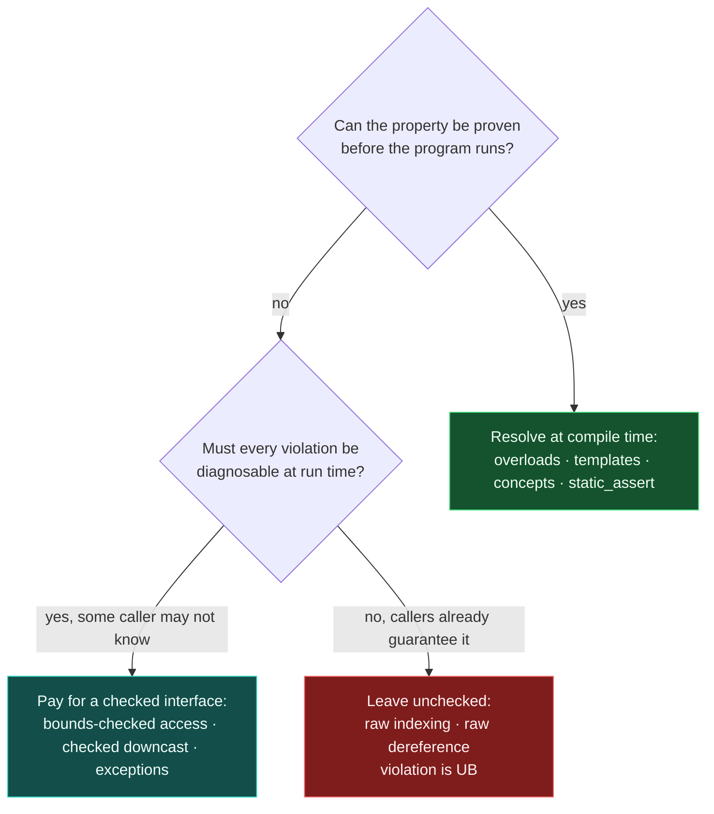

# The C++ Design Philosophy

> [!essence]
> C++ rests on two non-negotiable demands fixed since 1979: **direct, efficient access to the machine**, and **abstraction mechanisms that cost nothing you didn't ask for**. Every later feature — templates, RAII, move semantics, concepts — is a fresh answer to the same question: how do you let a programmer write in higher-level terms without ever silently taxing the code that doesn't use them?

## The Problem

> [!principle] Constraint → Consequence → Design
> 1. **Constraint:** By the late 1970s, systems programming — kernels, device drivers, real-time control — needed C's model: a direct, predictable translation to machine instructions with no hidden runtime. Languages that offered real data abstraction and class hierarchies, such as Simula, carried automatic memory management and dynamic-dispatch machinery that cost time and space a systems programmer could not spend.
> 2. **Consequence:** A programmer who wanted classes, inheritance, or a type-checked interface had to leave the domain where predictable performance mattered. A programmer who stayed in that domain gave up every organizing abstraction beyond structs and free functions, hand-writing resource acquisition, cleanup and dispatch at every call site.
> 3. **Requirement:** The language must let a programmer declare an abstraction and still get code that costs no more than the lower-level code they would otherwise have hand-written for the same task — never a fixed runtime tax merely for having named the idea.
> 4. **Design:** Starting from "C with Classes" in 1979, Bjarne Stroustrup built the new language directly on top of C's translation model, object layout and calling convention, rather than inventing a new virtual machine. Abstraction facilities — classes, later templates, RAII — were designed to resolve as much as possible at compile time, and the decision to check an operation's precondition was left to the interface's designer, not mandated by the language.
> 5. **Price:** Static type safety and bounds safety are things a well-designed interface can buy, not things the language enforces everywhere. Where no one paid for a check, violating an unstated precondition is [[Undefined Behavior|undefined behavior]], not a diagnosed error. And the language still carries C's array-decay, implicit-conversion and preprocessor legacy as the toll of staying source- and link-compatible with the systems code already deployed when it arrived.

> [!tension] abstraction ⟷ control
> The first pillar (direct hardware access) and the second (zero-overhead abstraction) are the same tension stated twice: C++ refuses to make you choose between writing at a level you can reason about and paying only for what the hardware actually has to do. [[Zero-Overhead Principle]] is where this gets a name and a testable definition.

> [!tension] safety ⟷ performance
> "Trust the programmer" is a performance decision disguised as a slogan: checking every precondition at run time (array bounds, null dereferences, use of a moved-from object) costs cycles that not every program can spare, so C++ leaves the choice to the interface — `operator[]` versus `.at()` — instead of the language.

## Mental Model

```text
   what you write: classes · templates · RAII · exceptions · concepts
                             ▲
                ┌────────────┴────────────┐
                │ PILLAR 2 — zero-overhead │
                │ "no more than the hand-  │
                │  written equivalent"     │
                │  (PPP §0.2; Core Guide-  │
                │  lines In.aims)          │
                └────────────┬────────────┘
                             │ stated IN TERMS OF pillar 1:
                             │ remove it, and "no more
                             │ expensive than ___" has
                             │ nothing left to compare to
                ┌────────────┴────────────┐
                │ PILLAR 1 — direct map to │
                │ hardware (Tour §1.9)     │
                └────────────┬────────────┘
                             ▼
     the machine C already targeted: registers, memory,
                one instruction at a time
```

> [!model] A promise stated in terms of another promise, not two pillars side by side
> The diagram is a dependency, not two independent supports: pillar 2 rests directly on pillar 1. "No more expensive than the hand-written equivalent" means something only because pillar 1 already guarantees a hand-written, direct-to-hardware equivalent exists to measure against. **Where a two-pylons picture would mislead:** real pylons are structurally independent — knock one out and the other still stands. Knock out pillar 1 and pillar 2's promise has nothing left to compare itself to; it does not stand alone.

## Mechanics

| Situation | Rule | Example |
|---|---|---|
| Adding a new abstraction (a class, a template) | It must cost nothing beyond the equivalent hand-written low-level code when unused, and be no worse than that code when used | A destructor call inserted at scope exit is a direct function call, not a scan by a garbage collector |
| An operation has an unstated precondition | The Standard may leave violating it undefined rather than mandate a runtime check, so no caller pays for a check it didn't request | `std::vector::operator[]` performs no bounds check; `.at()` does |
| A rule could be enforced by the compiler or left to convention | Prefer compile-time checking to run-time checking wherever both are possible | Overload resolution and `static_assert` run before the program does |
| A new feature versus an existing C construct | Keep C's translation-unit, build and object-layout model even where it constrains the new feature | Ordinary classes carry no hidden vtable unless a `virtual` function asks for one |

The four rows above are one recurring decision, not four unrelated ones. Every time a feature needs a precondition enforced, C++ asks the same question:



Green is cheapest (settled before the program runs); teal runs, but only because an interface asked for the check; red is the unchecked default, priced in [[Undefined Behavior]] rather than in cycles. Nothing routes to red by default — a caller has to *pick* the unchecked interface, the same way `.at()` and `operator[]` are two functions, not two modes of one.

> [!standard] The zero-overhead principle, in the language the C++ Core Guidelines use to state it
> "What you don't use, you don't pay for" — and, symmetrically, what you do use, you get at least as cheaply as if you had hand-coded it with lower-level constructs (C++ Core Guidelines, *In.aims*). This is a design constraint checked against every proposed feature, not an empirical average measured after the fact — see [[Zero-Overhead Principle]] for the mechanism that makes it enforceable rather than aspirational.

Zero-overhead abstractions are legal to *optimize into nothing* specifically because [[The As-If Rule|the as-if rule]] (`[intro.abstract]`) lets a compiler replace any code with anything that reproduces the same observable behavior. The philosophy states the goal; the as-if rule is the license the abstract machine grants to reach it.

## Under the Hood

> [!machine] Pillar 1: one expression, one instruction
> Tour's example — `x + y` compiles to a single machine operation — still holds. GCC 11.4, `-O2`, x86-64:
> ```nasm
> add(int, int):
>   lea  eax, [rdi+rsi]   ; computes rdi + rsi in one instruction, without touching the flags
>   ret
> ```
> `lea` (load effective address) is doing ordinary integer addition here — a common compiler trick, but still exactly one instruction for one expression.

> [!machine] Pillar 2: an abstraction that costs nothing
> A one-member wrapper class with an inline accessor, compiled next to the raw field access it wraps (GCC 11.4, `-O2`, x86-64):
> ```nasm
> direct_access(Point const&):
>   mov  eax, DWORD PTR [rdi]
>   ret
> wrapped_access(Wrapper const&):
>   mov  eax, DWORD PTR [rdi]
>   ret
> ```
> The two functions are byte-for-byte identical. `Wrapper::getX()` did not compile to a call, a bounds check, or an extra load: the abstraction is entirely a compile-time fiction that the optimizer erased once it did its job of naming the operation for the reader.

> [!machine] Pillar 2, the hard case: exceptions cost nothing until thrown
> `log_value` is declared but not defined, so the compiler cannot know whether it throws or inline around it. One function calls it with a `try`/`catch`, one without. GCC 14.2, Compiler Explorer, x86-64 Linux, `-O2`:
> ```nasm
> no_try(int):
>   push rbx
>   mov  ebx, edi
>   call log_value(int)
>   lea  eax, [rbx+rbx]
>   pop  rbx
>   ret
> with_try(int):
>   push rbx
>   mov  ebx, edi
>   call log_value(int)
>   lea  eax, [rbx+rbx]
>   pop  rbx
>   ret
> ; --- everything below is moved to a separate .cold partition,
> ; --- reached only if log_value actually threw ---
>   call __cxa_begin_catch
>   call __cxa_end_catch
>   or   eax, -1
>   ret
>   call _Unwind_Resume
> ```
> `no_try` and `with_try` are identical on the path every call actually takes: same six instructions, same registers. The `catch` clause's code moves to a `.cold` section the CPU never fetches unless `log_value` throws. GCC, Clang and MSVC's `/EHsc` mode all build this table-based ("zero-cost") model, though the Standard mandates only `try`/`catch` *behavior*, not this mechanism (Itanium ABI, *Exception Handling*). Pillar 2 holds on the path that doesn't use the feature: adding a `catch` cost `with_try` nothing. The price moves elsewhere — unwind tables that exist whether or not anything throws, and a throwing path far slower than the `return` it replaces.

> [!machine] Pillar 2's other price: one copy of the code per type
> A template is a recipe, not a function: the compiler emits one specialization *per type actually used*, each optimal for that type but each its own copy. `triple<T>` called with `int` and with `double` (GCC 11.4, `-O2`, `-c`, symbols demangled):
> ```text
>  ONE DEFINITION                        TWO OBJECT-FILE BODIES
>  template<typename T>                  triple<int>(int)        8 bytes
>  T triple(T x)          ───T=int──────▶  leal (%rdi,%rdi,2),%eax
>    { return x + x + x; }               triple<double>(double) 11 bytes
>  (never itself compiled)──T=double────▶  addsd/movapd (SSE)
> ```
> `nm` reports both as weak (`W`) symbols the linker may fold across translation units but never across types: `int`'s body uses one integer `lea`; `double`'s uses SSE addition, because that is what each type's `+` actually compiles to. Neither instantiation is slower than a hand-written `triple_int`/`triple_double` would be — pillar 2 holds per call — but a template used with ten types ships (up to) ten function bodies where a single dynamically-typed routine would ship one. The cost pillar 2 promises not to charge is *runtime* cost; compile time and binary size were never part of the bargain (Pikus, *Function inlining* p. 352, on the sibling trade-off of weighing inlined code bloat against call overhead).

> [!machine] Pillar 2's third price, observed: typeinfo and a vtable exist whether or not anyone asks
> `Plain` declares no virtual function; `Poly` declares one, otherwise identical, each built as its own translation unit so neither optimizes away. GCC 11.4 (local toolchain), `-O2`, x86-64, `nm -C` on the two object files:
> ```text
> rtti_cost_plain.o   — no vtable, no typeinfo symbol: there is nothing to name
> rtti_cost_poly.o
>   0000000000000028 V vtable for Poly              ; 40 bytes
>   0000000000000010 V typeinfo for Poly             ; 16 bytes
>   0000000000000006 V typeinfo name for Poly        ;  6 bytes
> ```
> `sizeof(Plain) == 4`; `sizeof(Poly) == 16` — the extra 8 bytes are the vptr every `Poly` carries, plus padding. Nothing here ever calls `dynamic_cast` or `typeid` on a `Poly`, yet the compiler emits the vtable and typeinfo a caller elsewhere might need — weak (`V`) symbols the linker can fold across translation units, never remove from a binary that defines the class. Pillar 2 is a promise about the path that *executes*, not about what a class's mere declaration puts in the binary.

## In Code

**1 · Trust the programmer: safety is bought at the interface, not forced by the language**

```cpp
#include <iostream>
#include <stdexcept>
#include <vector>

int main() {
    std::vector<int> v{10, 20, 30};
    try {
        std::cout << v.at(9) << '\n';   // ①
    } catch (const std::out_of_range&) {
        std::cout << "checked: rejected\n";
    }
}
// expect: checked: rejected
```
1. `.at()` pays for a bounds check on every call and reports the violation as a catchable exception. This is the interface *asking* for safety.

```cpp
// cc: ub
#include <iostream>
#include <vector>

int main() {
    std::vector<int> v{10, 20, 30};
    std::cout << v[9] << '\n';   // ①
}
```
1. `operator[]` performs no bounds check. Reading past the end is undefined behavior, not a guaranteed crash or a guaranteed wrong value — the price of never charging the many callers who already know the index is valid.

**2 · Zero-overhead resource management: cleanup with no collector**

```cpp
#include <iostream>

class LoggedResource {
public:
    explicit LoggedResource(const char* name) : name_(name) {
        std::cout << "acquire " << name_ << '\n';
    }
    ~LoggedResource() { std::cout << "release " << name_ << '\n'; }   // ①
private:
    const char* name_;
};

int main() {
    std::cout << "start\n";
    {
        LoggedResource r("file handle");   // ②
        std::cout << "using resource\n";
    }                                       // ③ destructor runs here, deterministically
    std::cout << "end\n";
}
// expect: start
// expect: acquire file handle
// expect: using resource
// expect: release file handle
// expect: end
```
1. The destructor is an ordinary function the compiler is obligated to call — no tracing, no collector, no pause.
2. Construction happens exactly where the object is defined.
3. Destruction happens exactly at scope exit, in reverse order of construction. The point in the source text *is* the point in the machine's execution.

`LoggedResource` is the pattern in miniature; see [[RAII]] for the full idiom, including how it survives exceptions and moves.

**3 · Prefer compile-time checking: a strong type turns a mistake into a compile error**

```cpp
#include <iostream>

class Meters {
public:
    explicit constexpr Meters(double v) : value_(v) {}   // ①
    constexpr double value() const { return value_; }
private:
    double value_;
};

void set_altitude(Meters m) { std::cout << m.value() << " m\n"; }

int main() {
    set_altitude(Meters{120.0});   // ②
}
// expect: 120 m
```
1. `explicit` blocks an implicit `double → Meters` conversion.
2. The caller must say what unit it means. Nothing is checked at run time because nothing needs to be: the type system settled the question before `main` ever runs.

```cpp
// cc: ill-formed
class Meters {
public:
    explicit constexpr Meters(double v) : value_(v) {}
    constexpr double value() const { return value_; }
private:
    double value_;
};

void set_altitude(Meters m);

int main() {
    set_altitude(120.0);   // error: no implicit double -> Meters conversion
}
```
Without `Meters`, `set_altitude(double)` would accept a raw number from any unit — feet, meters, a delta — and the mistake would surface only when the altitude was visibly wrong. Here it never compiles.

## Pitfalls

> [!trap] "Zero overhead" does not mean "free"
> It means *no more expensive than the hand-written equivalent*, and *nothing at all if unused*. A `std::vector` still allocates; a virtual call still indirects through a vtable. The promise is comparative, not absolute — see [[Zero-Overhead Principle]].

> [!ub] "Trust the programmer" is not "anything you write is safe"
> It means the language will not spend cycles checking a precondition for you unless the interface you chose does. Choosing the unchecked interface and then violating its precondition is undefined behavior squarely on you, not a language guarantee that the result will be merely "wrong but harmless." See [[Undefined Behavior]].

> [!trap] "Direct mapping to hardware" is not a portability guarantee
> The mapping is direct relative to *the abstract machine's* model of memory and instructions — but the concrete machine, `int`'s width, and the exact instructions chosen are still implementation-defined or unspecified. "Runs close to the metal" and "behaves identically on every metal" are different claims. See [[The C++ Abstract Machine]] and [[The ISO Standard, Compilers and Conformance]].

> [!trap] "Nothing until used" is a per-call-site promise, not a whole-binary one
> The `Plain`/`Poly` evidence above is the general case: GCC's own documentation justifies `-fno-rtti` as a way to "save some space," because `typeinfo` is generated for *every* class with a virtual function, not only the ones a program actually feeds to `dynamic_cast` or `typeid`. The exceptions example earlier shows the same shape of cost from the other direction — unwind tables exist for every function that could throw, not only the ones a given run does throw from. Zero overhead is a promise about the path actually *executed*; whether unused-capability *metadata* ships in the binary at all is a coarser, compiler-level decision, which is why `-fno-rtti` and `-fno-exceptions` exist as explicit opt-outs rather than happening automatically (GCC's names; Clang and MSVC expose the same trade differently).

> [!trap] "Templates cost nothing" conflates two different currencies
> Pillar 2 promises a *runtime-cost* bargain, and a template specialization keeps it — `triple<int>` is exactly the instruction a hand-written `int` version would be. It says nothing about *compile time or binary size*: each type instantiated adds another compiled copy (see the `nm` evidence in Under the Hood). A template used across many types can grow a binary in a way a single non-template or runtime-dispatched routine never would. "Costs nothing" and "the specific thing it costs nothing in" are not the same claim.

## Evolution

| Standard | Change | Why |
|---|---|---|
| 1979–1985 ("C with Classes" → Cfront) | Classes, virtual functions, references — translated straight into C source | Prove abstraction could be added without leaving C's compile, link and hardware model |
| **C++98** | First ISO standard: templates, exceptions, destructor-driven cleanup formalized as language rules | Fix the two pillars as guarantees every conforming compiler must honor identically, not one vendor's habit |
| C++11 | Move semantics; `constexpr` | Extend zero overhead to resource *transfer* (no copy-then-destroy tax) and push more computation to compile time |
| C++17 | Guaranteed copy elision | Remove even an *elidable* copy's cost for prvalues — elision had previously been only *permitted*, as an explicit exception to the as-if rule (`[class.copy.elision]`), not required |
| C++20 | Concepts | Move more interface-precondition checking into the compiler (P.5) without adding a runtime cost |
| C++26 | [[Preconditions, Postconditions and Contracts]]: `pre(...)`, `post(...)`, `contract_assert(...)` | Give the `.at()`-vs-`operator[]` choice a single built-in syntax instead of a per-library convention — and make the "pay for it or don't" decision an *evaluation semantic* (`ignore`, `observe`, `enforce`, `quick-enforce`) picked per build, not baked permanently into the interface. With `ignore`, a contract assertion has no effect at all: the oldest pillar-2 bargain, now written into the language itself rather than left to each library's own design |

## Connections

- **Prerequisites:** none. This is the root of [[Map — What C++ Is]] and of the Atlas: every later derivation in the Compendium eventually traces back to one of these two pillars.
- **Enables:** [[The C++ Abstract Machine]] (the formal object the Standard defines to make "direct mapping" and "zero overhead" checkable claims rather than slogans) · [[Zero-Overhead Principle]] (the testable version of pillar 2) · [[Levels of Abstraction — From Bits to Libraries]] (how the philosophy is delivered in layers) · [[The ISO Standard, Compilers and Conformance]] (who is bound by these rules, and how).
- **Illustrated by:** [[RAII]] and [[Virtual Dispatch — vptr and vtable]] — reviewed notes that link back here, and that this note links forward to at the point its own example demonstrates the same pillar (RAII in *In Code* §2, virtual dispatch in *Check Yourself* Q3).
- **Siblings:** [[The C++ Abstract Machine]] (draft) — the next link in the spine, and the formal object that makes "direct mapping" and "zero overhead" checkable claims about a defined machine rather than slogans about hardware in general.
- **Domain:** [[Map — What C++ Is]].
- **Practice:** no Continuum project isolates this note's claim; it is the reasoning every project already relies on.

## Check Yourself

> [!quiz]- What are the "two pillars" C++ rests on, and how does the Mental Model's bridge analogy describe the relationship between them?
> Efficient direct access to machine resources, and zero-overhead abstraction mechanisms (PPP §0.2). The analogy: two pylons under one deck — but unlike real pylons, the second pillar's promise ("no worse than hand-coding") is stated *in terms of* the first, so they aren't structurally independent even though the picture makes them look like it.

> [!quiz]- Why can't a language honor "trust the programmer" and "ideally, a program should be statically type safe" (Core Guidelines P.4) as absolutes at the same time?
> Static type safety everywhere would mean the language rejects or checks every operation whose safety can't be proven at compile time — which means charging every caller for checks, including the ones who already know their code is correct. "Trust the programmer" resolves the conflict by making safety an interface choice (`.at()` vs `operator[]`) rather than a language-wide mandate, so P.4 is an ideal to reach for at each interface, not a guarantee C++ itself provides.

> [!quiz]- In the `wrapped_access` / `direct_access` assembly, what would you expect to change if `Wrapper::getX()` were declared `virtual`, and which pillar does that change illustrate?
> The identical single `mov` would be replaced by an indirect call through the object's vtable pointer — extra memory access and a load-then-jump instead of one instruction. That's pillar 2 working correctly in the other direction: virtual dispatch costs something *because you asked for it* (dynamic behavior), and the language never pretends otherwise. See [[Virtual Dispatch — vptr and vtable]] for exactly what that indirect call costs and why.

> [!quiz]- `no_try` and `with_try` both call a function that might throw. Why is their assembly on the returned-normally path identical, and where did the `catch` clause's code go?
> Table-based ("zero-cost") exception handling puts nothing on the normal return path: no flag to test, no branch to skip. The `catch` clause's code — restoring the exception object, running the handler, returning `-1` — moves to a separate `.cold` section the CPU reaches only after an actual throw. The feature is free where it isn't used; the table itself still costs binary space, and it's an ABI design choice, not something the Standard requires.

> [!quiz]- `triple<T>` is instantiated with `int` and `double` in the same program. Does shipping two compiled bodies for one template definition contradict pillar 2?
> No — pillar 2 is a promise about the cost of *using* an abstraction on the path that runs, and each body is exactly what a programmer would have hand-written for that one type: nothing is slower for existing as a template. What it never promised was *one* copy: compile time and binary size sit outside the bargain, which is why a template instantiated across many types can still bloat a binary that a single non-generic function wouldn't.

## Sources

- PPP §0.2 "A philosophy of teaching and learning": states the two pillars — efficient direct access to machine resources, and zero-overhead abstraction mechanisms — as the foundation the whole book teaches from.
- Tour §1.9 "Mapping to Hardware" (p. 16): C++'s fundamental operations map to the hardware's own operations; `x+y` executes a single machine instruction.
- cppreference, *History of C++*: https://en.cppreference.com/w/cpp/language/history — "C with Classes" (1979) and Cfront (1985), which translated the new language straight into C, keeping it on C's build and hardware model from the start.
- C++ Core Guidelines, *In.aims*: https://isocpp.github.io/CppCoreGuidelines/CppCoreGuidelines#ss-aims — the zero-overhead principle, stated as a design constraint the guidelines themselves are held to.
- C++ Core Guidelines, P.1 "Express ideas directly in code," P.4 "Ideally, a program should be statically type safe," P.5 "Prefer compile-time checking to run-time checking": https://isocpp.github.io/CppCoreGuidelines/CppCoreGuidelines#rp-direct · #rp-typesafe · #rp-compile-time
- Draft standard `[intro.abstract]` (the as-if rule): https://eel.is/c++draft/intro.abstract — the license that makes a zero-overhead compilation of a used abstraction legal, not merely likely.
- Itanium C++ ABI, *Exception Handling*: https://itanium-cxx-abi.github.io/cxx-abi/abi-eh.html — the table-based unwinding convention GCC and Clang use, which is why a non-throwing call path costs nothing extra for having a `catch` nearby; the C++ Standard itself specifies only `try`/`catch` behavior, not this mechanism.
- GCC, *C++ Dialect Options*, `-fno-rtti`: https://gcc.gnu.org/onlinedocs/gcc/C_002b_002b-Dialect-Options.html#index-fno-rtti — states plainly that RTTI metadata is generated "for use by" `dynamic_cast`/`typeid` for every class with virtual functions, and that disabling it "saves some space" precisely because that metadata is otherwise unconditional; the source for the fourth Pitfall.
- Pikus, *Function inlining* (p. 352): the compiler weighs inlined code bloat against call overhead — the same shape of trade-off as one compiled body per template instantiation, the source for the fifth Pitfall and its `Under the Hood` evidence.
- `nm -C` on GCC 11.4 (local toolchain) output for `Plain`/`Poly`, two classes differing only in one `virtual`: the source for the third `Under the Hood` block and the fourth Pitfall's evidence (`.cache/scratch/rtti_cost_plain.cpp`, `rtti_cost_poly.cpp`).
- cppreference, *Contract assertions (since C++26)*: https://en.cppreference.com/w/cpp/language/contracts — evaluation semantics (`ignore`/`observe`/`enforce`/`quick-enforce`) and the "ignore has no effect" guarantee behind the Evolution table's C++26 row. Adopted into the C++26 Working Paper as `P2900R14` at the February 2025 Hagenberg meeting; C++26 itself was completed at the March 2026 London/Croydon meeting.
- See [[Guide — A Tour of C++ (3rd ed)]] and [[Guide — cppreference, the Draft Standard and the Core Guidelines]] for how these sources fit the rest of the Atlas.
