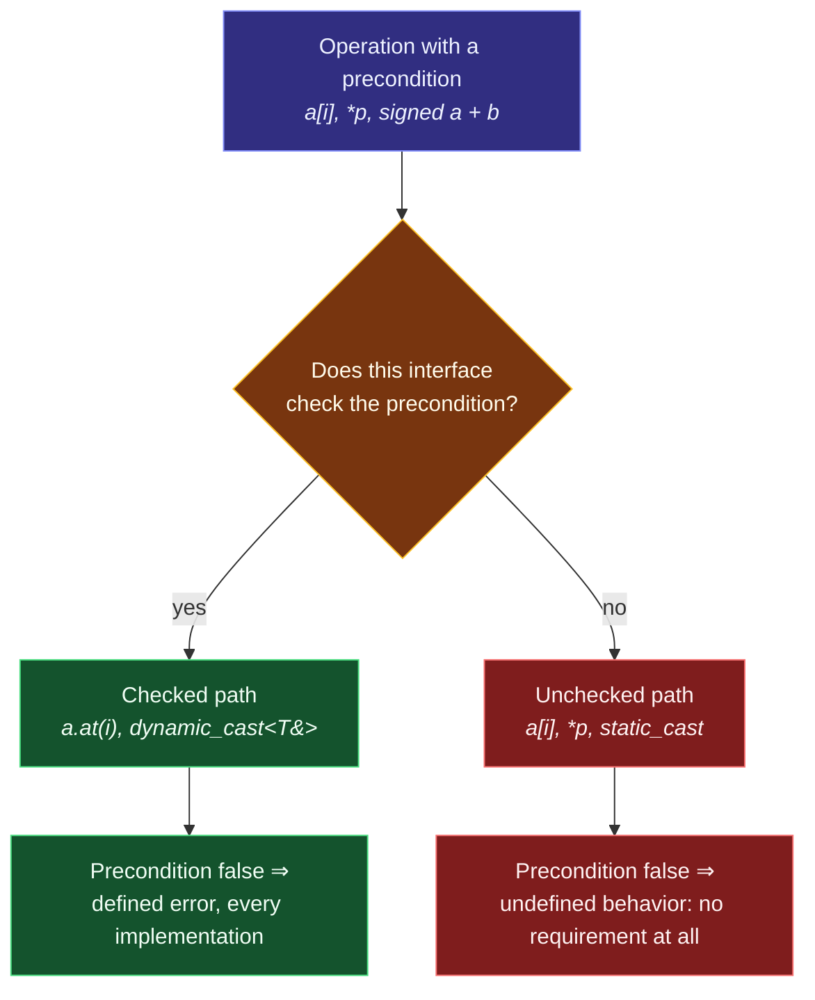

# Undefined Behavior

> [!essence]
> **Undefined behavior** is the Standard's silence, not a specific bad outcome: `[defns.undefined]` defines it as "behavior for which this document imposes no requirements." Once a program executes an operation the abstract machine gives no rule for, nothing about the rest of that execution is owed to the source text — because the compiler was free to have already assumed, anywhere in translation, that the operation could never happen.

## The Problem

Some operations only make sense under a precondition the type system cannot check for free: an index must stay inside the container, a pointer must still name a live object, two threads must not race on the same memory. C++ could react to a broken precondition the way a checked container does — insert a comparison and raise a defined error, every time, for every caller.

> [!principle] Constraint → Consequence → Design
> 1. **Constraint:** Checking a precondition costs something — a comparison, a branch the CPU must predict, sometimes a lock — every time the operation runs, whether or not that particular call was ever at risk of violating it.
> 2. **Consequence:** If the language guaranteed a defined, checked response to *every* broken precondition, no implementation could ever omit a check it cannot statically prove unnecessary. [[Zero-Overhead Principle|Zero overhead]] would then apply only to programs that already happen to be correct, not to the very code that verifies they are.
> 3. **Requirement:** The language needs a way to state an operation's precondition without forcing every implementation to enforce it, so a program that has already established the precondition by construction pays nothing to re-prove it at run time — while a program that has not is unambiguously, contractually in error.
> 4. **Design:** The Standard makes violating such a precondition **undefined behavior** (`[defns.undefined]`): "behavior for which this document imposes no requirements." Once one such operation executes, no requirement in the document binds anything about the rest of that execution. The optimizer may transform every dependent operation *as if* the precondition already holds, because a program for which it doesn't hold has, by definition, stepped outside the language the Standard describes.
> 5. **Price:** nothing polices the boundary from inside the language. An implementation may ignore the violation, produce some result "characteristic of the environment," or terminate with a diagnostic (`[defns.undefined]` note 1) — and it is free to have used the assumption that the violation can't happen to reshape code that runs *before* the violating operation textually appears, not only after it.

> [!tension] safety ⟷ performance
> Every unchecked precondition is safety traded for zero overhead: the language declines to pay for a guard so that correct programs never pay for one either. [[Map — What C++ Is]] names this trade as the domain's central bargain; this note is what happens on the far side of it, once the bargain is broken.

## Mental Model

> [!model] An unchecked precondition, not a guaranteed penalty
> Some interfaces post a bouncer at the door: `std::vector::at` checks the index and throws `std::out_of_range` every time, for every caller, whether the index was ever likely to be wrong. Others — `operator[]`, a raw pointer dereference, signed arithmetic — assume you checked already and let you straight through. Undefined behavior is what "no bouncer" means in practice: not that something *specific* goes wrong when the precondition is false, but that the interface never promised to notice.
> **Where it breaks:** a bouncer is a fixed feature of the building; whether a *particular build* of your program notices a broken precondition is not fixed at all. A hardened debug container, AddressSanitizer, or a hardware trap can catch exactly what the language itself declines to promise. The Standard's silence and one tool's willingness to fill it are two different things — see [[Compilers and Essential Flags]].



## Mechanics

| Situation | Rule | Example |
|---|---|---|
| A side effect on a scalar is unsequenced relative to another side effect, or a read, of the *same* memory location | UB, in every standard through the current working draft | `i = ++i + i++;` |
| A write to a scalar is unsequenced relative to a read/write pair that a later standard went on to order | UB through C++14; **well-defined since C++17** (see `[!standard]` below) | `i = i++ + 1;` |
| Signed integer arithmetic overflows its type | UB, every standard including the C++26 working draft | `INT_MAX + 1` |
| An out-of-range value is **converted** to a signed integer type | **Never UB** — implementation-defined through C++17, defined as reduction modulo 2ⁿ since C++20 (see `[!standard]` below) | `static_cast<std::int8_t>(200)` |
| An object is accessed through a glvalue of an unrelated type (strict aliasing) | UB (`[basic.lval]`) | reading a `float` object through an `int*` |
| An object is used outside its lifetime | UB (`[basic.life]`) | see [[Object Lifetime]], [[Dangling Pointers and References]] |
| A scalar with no determinate value is read | UB through C++23; **erroneous behavior** from C++26 (`[defns.erroneous]`, diagnose-or-terminate, not silent) | an uninitialized `bool` or `int` |
| Two threads access the same memory without synchronization and at least one access is a write | UB (`[intro.races]`) | an unmutexed shared counter |

> [!standard] C++17 fixed one specific double-write, not evaluation order in general
> Since C++17 (P0145R3, adopted 2016-06-24), in a simple or compound assignment `E1 = E2`, evaluating the right operand — including its side effects — is sequenced before evaluating the left operand. That single rule is enough to make `i = i++ + 1;` well-defined from C++17 on: the increment inside `i++` necessarily completes before the assignment writes its own result into `i`, so the two writes are no longer racing for order; the assignment's write simply happens last and wins. Evaluation order between *unrelated* subexpressions — the arguments of an ordinary function call, for instance — is still unspecified in every standard through C++23; the C++17 fix reaches assignment, subscripting and a handful of other named operators (`[expr.ass]`), not evaluation order generally.

> [!standard] Overflow and out-of-range conversion are different rules
> Signed integer **overflow** — the mathematical result of `+`, `-`, `*` and friends falling outside the type's range — has been undefined behavior in every C++ standard, including the current working draft; nothing has proposed changing it, because the optimizations it licenses (see Under the Hood) are still considered worth the danger. **Converting** an out-of-range value *into* a signed type — `static_cast<std::int8_t>(200)`, or an implicit narrowing conversion — is a different rule: cppreference's *Implicit conversions* page states it was implementation-defined through C++17 and has been defined as "the unique value of the destination type equal to the source value modulo 2ⁿ" since C++20, explicitly noting this "is different from signed integer arithmetic overflow, which is undefined." It has never been undefined. The Primer, written for C++11, calls this conversion "undefined" (p. 36) — that predates both the C++20 fix and the correct C++11 answer, which was already only implementation-defined, never UB.

## Under the Hood

> [!machine] A "defensive" check can vanish with no warning at all
> GCC 11.4, x86-64 Linux, `-O2`, no sanitizers (this vault's toolchain). The function below dereferences `p` first and checks it for null second — a common shape once a null check is bolted on after the line that already used the pointer:

```cpp
int use(int* p) {
    int v = *p;
    if (!p) return -1;
    return v;
}
```

GCC compiles the entire function to two instructions, under `-Wall -Wextra` with no diagnostic at all:

```nasm
use(int*):
        mov     eax, DWORD PTR [rdi]
        ret
```

The `if (!p)` branch, and the `return -1` it guards, are simply gone. The optimizer reasons backward from `*p`: dereferencing a null pointer is undefined behavior, so a well-defined execution can only reach that line with `p != nullptr` already true — which makes the later check unreachable-in-a-conforming-program, and therefore removable. The source looks like it defends against a null pointer; the compiled function does not check for one at all.

## In Code

**1 · An interface that checks its precondition versus one that trusts you**

```cpp
// cc: ub
#include <array>
#include <cstdio>

int main(int argc, char**) {
    std::array<int, 4> prices{10, 20, 30, 40};
    int index = argc + 9;              // ① 10 on an ordinary run: one past the end
    std::printf("%d\n", prices[index]); // ② unchecked: no requirement at all
}
```
```cpp
#include <array>
#include <cstdio>
#include <stdexcept>

int main(int argc, char**) {
    std::array<int, 4> prices{10, 20, 30, 40};
    int index = argc + 9;
    try {
        std::printf("%d\n", prices.at(index));   // ③ checked: every implementation
    } catch (const std::out_of_range& e) {
        std::printf("rejected: %s\n", e.what());
    }
}
// expect: rejected: array::at
```
1. `argc` is `1` with no extra arguments, so `index == 10` — four past the last valid position `3`.
2. `operator[]` has no bounds check in its contract (`[array.overview]` lists no such requirement). This vault's toolchain happened to print whatever integer sat past the array in memory on one run; a different run, compiler, or optimization level owes you nothing in particular, including that same garbage.
3. `at` performs the identical index arithmetic but checks it first, so the broken precondition becomes a thrown, catchable, *defined* error instead of silence.

**2 · The same expression, undefined in one standard and guaranteed in another**

```cpp
// cc: ub
// cc: std=c++14
#include <cstdio>

int main() {
    int i = 5;
    i = i++ + 1;              // ① two unsequenced writes to i, pre-C++17
    std::printf("%d\n", i);
}
```
```cpp
#include <cstdio>

int main() {
    int i = 5;
    i = i++ + 1;              // ② well-defined since C++17 — see Mechanics
    std::printf("%d\n", i);
}
// expect: 6
```
1. Under C++11/C++14 rules, `i++`'s side effect (the increment) and the assignment's side effect (the write of the sum) both target `i` with no ordering between them: exactly the case `[defns.undefined]` and the pre-C++17 sequence-point rules forbid.
2. Under C++17's rule for `E1 = E2`, the right operand's side effect is sequenced before the left operand is written, so the result is guaranteed: `i++` yields the old value `5` and bumps `i` to `6`; the assignment then overwrites `i` with `5 + 1 = 6` — the same number, arrived at through a now-defined order.

**3 · The same uninitialized read, two different answers from one compiler**

```cpp
// cc: ub
#include <cstdio>

int main(int argc, char**) {
    bool ready;                       // ① no value has been given yet
    if (argc > 100) ready = true;     // ② never true in an ordinary run
    if (ready)  std::puts("go");      // ③ reads an indeterminate bool
    if (!ready) std::puts("wait");    // ④ reads the same indeterminate bool again
}
```
1. `ready` is a local `bool` with automatic storage duration and no initializer: its value is indeterminate (`[dcl.init]`), not `false` by default.
2. On an ordinary run `argc == 1`, so this branch never executes and `ready` is never given a value.
3–4. A single logical variable is read twice; a naive reader expects exactly one of "go" or "wait" to print, since a `bool` can't be both true and false. Compiled with GCC 11.4, x86-64 Linux, this program prints `wait` at `-O0` and prints `go` at `-O1`, `-O2`, `-O3` and `-Os` — five conforming, silent, mutually contradictory answers from one compiler to one question, because `[defns.undefined]` imposes no requirement on either read.

## Pitfalls

> [!ub] A "successful" run proves nothing
> Nothing in `[defns.undefined]` requires a crash, an obviously wrong value, or any symptom at all. Code with UB can print exactly the expected output on every run you try, right up until a compiler upgrade, a different optimization level, or an unrelated change recompiles the same broken assumption into something that no longer holds. Passing tests is not evidence of correctness for code that has ever executed undefined behavior.

> [!trap] A silent sanitizer did not check the thing you were worried about
> AddressSanitizer and UndefinedBehaviorSanitizer each catch a specific, enumerated list of UB — heap/stack out-of-bounds access, signed overflow, null and misaligned pointer use, and similar — not "UB" as a whole. UBSan does not check strict-aliasing violations, and neither sanitizer proves the absence of a data race (that needs ThreadSanitizer, run separately). A clean sanitizer run rules out what that sanitizer instruments, not what the Standard leaves undefined. See [[Compilers and Essential Flags]].

## Evolution

| Standard | Change | Why |
|---|---|---|
| C++98 | Undefined behavior named and defined; a pre-C++11 *sequence-point* model bounds which unsequenced writes are illegal | Let an optimizer assume unchecked preconditions hold, without obligating any implementation to detect a violation |
| C++11 | Sequence points replaced by the finer-grained *sequenced-before* relation (`[intro.execution]`) | Needed to describe evaluation order once multi-threaded execution entered the abstract machine |
| **C++17** | `E1 = E2` and several other operators sequence the right operand's side effects before the left operand (P0145R3) | Made idioms like chained `<<` and `i = i++ + 1` well-defined instead of merely "usually working" |
| **C++20** | Converting an out-of-range value to a signed type is defined as modulo-2ⁿ reduction, not implementation-defined (P0907-class change; see cppreference *Implicit conversions*) | Every mainstream platform already used two's complement; codify what compilers already did — this was never UB, only implementation-defined |
| **C++26** (working draft) | *Erroneous behavior* (`[defns.erroneous]`) gives some historic UB — reading an uninitialized scalar of ordinary types — a diagnose-or-terminate response instead of an unbounded one | Make an extremely common mistake bounded and debuggable without weakening the UB-driven optimizations the rest of the language still relies on |

## Connections

- **Prerequisites:** [[The C++ Abstract Machine]] — the four-way taxonomy (observable, implementation-defined, unspecified, undefined) that this note zooms into.
- **Enables:** [[The As-If Rule]] (the same "assume it never happens" license, used for optimization rather than for danger) · [[Implementation-Defined, Unspecified and Undefined Behavior]] (places UB next to its two safer siblings) · [[Compilers and Essential Flags]] (the tools that catch some, never all, of it).
- **Hazards built on this note:** [[Dangling Pointers and References]] · [[Object Lifetime]] · [[Process Memory Layout — Stack, Heap, Static]].
- **Domain:** [[Map — What C++ Is]].
- **Practice:** no Continuum project is registered against this note yet; every project that touches raw pointers, arrays, or concurrency depends on the reasoning here.

## Check Yourself

> [!quiz]- What does `[defns.undefined]` actually say, and what does that definition *not* require (a crash? a specific wrong value?)
> "Behavior for which this document imposes no requirements." It requires nothing at all — not a crash, not a plausible-looking wrong value, not even that two runs of the same binary agree. Any of those can happen; none is owed.

> [!quiz]- Why does the Standard leave signed overflow undefined instead of defining it as wraparound, the way it defines unsigned overflow?
> Because assuming overflow never happens lets the compiler treat `x + 1 > x` as always true and similar comparisons as decidable at compile time — real optimizations Pikus's benchmarks show GCC and Clang actually perform. Defining wraparound (as C++20 did for *conversion*, not arithmetic) would make those optimizations unsound and has never been adopted for arithmetic overflow itself.

> [!quiz]- `int i = 5; i = i++ + 1;` — what is guaranteed under `-std=c++14`, and what is guaranteed under `-std=c++20`?
> Under C++14: nothing — the expression is undefined behavior, so any value, or no consistent value at all, is a conforming result. Under C++20: `i == 6`, guaranteed by the C++17 rule that sequences `E2`'s side effects before `E1` in an assignment (see the `[!standard]` callout in Mechanics).

> [!quiz]- In the null-check example, why does `-Wall -Wextra` give no warning when the compiler deletes the `if (!p)` check entirely?
> Because the deletion is not a mistake the compiler is flagging — it is a correct transformation under the assumption that the program is well-defined. Since `*p` already executed, a conforming execution can only have reached that point with `p` non-null, so the later check is provably dead code from the optimizer's point of view, not a suspicious one.

## Sources

- Pikus, ch. 11 "Undefined Behavior and Performance," §"What is undefined behavior?" (p. 372) and §"Why have undefined behavior?" (p. 376): the loop-termination and optimizer rationale behind leaving operations undefined rather than implementation-defined.
- Pikus §"Undefined behavior and C++ optimization" (pp. 377–378): the signed-overflow codegen comparison (`f(int)` vs `g(int)` vs `h(unsigned)`) that this note's Mechanics and quiz reasoning are built from, independently written and re-verified on this vault's toolchain rather than reproduced.
- Primer §2.1.2, "Advice: Avoid Undefined and Implementation-Defined Behavior" (p. 36) and §4.1.1 "Fundamentals" (p. 138): the C++11-era statement of unsequenced-evaluation UB; the Primer predates both the C++17 and C++20 fixes discussed above and, per the Style Guide's note on this book, is loose about the conversion case.
- cppreference, *Undefined behavior*: https://en.cppreference.com/w/cpp/language/ub
- cppreference, *Order of evaluation*, §"Undefined behavior": https://en.cppreference.com/w/cpp/language/eval_order
- cppreference, *Implicit conversions*, §"Integral conversions": https://en.cppreference.com/w/cpp/language/implicit_conversion
- Draft standard `[defns.undefined]`, `[defns.erroneous]`, `[defns.impl.defined]`, `[defns.unspecified]`: https://eel.is/c++draft/intro.defs
- P0145R3, *Refining Expression Evaluation Order for Idiomatic C++* (adopted for C++17): https://www.open-std.org/jtc1/sc22/wg21/docs/papers/2016/p0145r3.pdf
- See [[Map — What C++ Is]] for how this note's claims fit the domain's wider argument, and [[The C++ Abstract Machine]] for the taxonomy this note is one quarter of.
