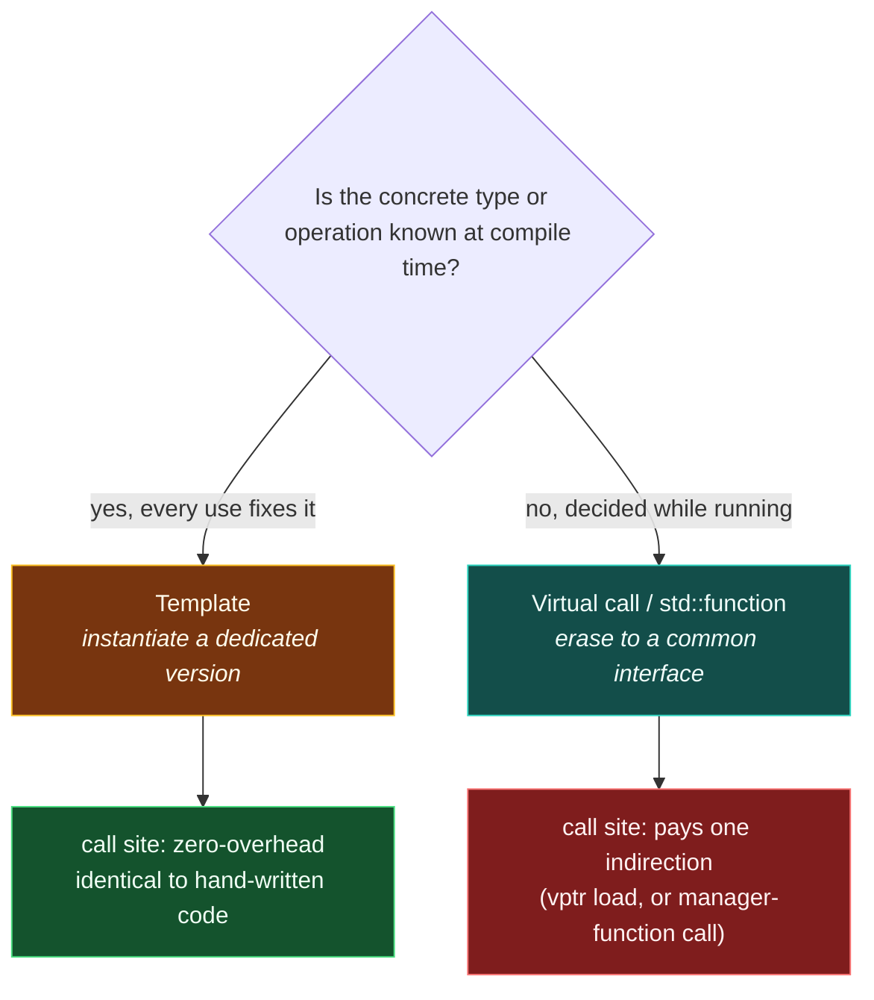

# Zero-Overhead Principle

> [!essence]
> A feature is **zero-overhead** only if two separate claims both hold: a program that never uses it pays nothing for its existence, and a program that does use it pays no more than a programmer who hand-wrote the specialized equivalent would have. [[The C++ Design Philosophy|Pillar 2]] states the ambition; this is the testable version — a constraint every proposed feature is checked against, not an average measured after the fact.

## The Problem

Almost every reusable abstraction — a generic `max`, a container, a comparator — needs to work with more than one type without being rewritten per type. The ordinary way to buy that generality is to decide, at run time, what you're holding: store a type tag, go through an interface pointer, box the value behind a common representation. Java's generics erase to `Object`; a C container of `void*` looks the same underneath. That decision costs something on every single use — an indirect jump, a check, a heap allocation for the box — even at a call site where the caller already knew the concrete type before the program ever ran.

> [!principle] Constraint → Consequence → Design
> 1. **Constraint:** A reusable abstraction must work for types its author never saw. The conventional way to achieve that — resolve "what am I holding, what do I do with it" at run time — adds an indirection and a discriminant that a specific call site, which already knows its concrete type at compile time, never needed.
> 2. **Consequence:** If that were the *only* mechanism C++ offered, every use of a generic container or algorithm — even in a program that instantiates it with one fixed type from start to finish — would carry a permanent, un-optimizable tax. A systems programmer bound by [[The C++ Design Philosophy|pillar 1]] would have to hand-write the specialized version just to get the performance the language was supposed to deliver, defeating the reuse the abstraction existed for.
> 3. **Requirement:** The language needs a second route to genericity — one where the compiler, seeing the concrete type at each call site, can produce code exactly as if that type had been hand-written into the abstraction from the start. And it must let the programmer *choose*, per abstraction, between that compile-time route and a run-time one, rather than forcing every generic facility through the same mechanism.
> 4. **Design:** Templates are that route. `template<class T> T max(T, T)` is not one function; every distinct `T` it is used with triggers a fresh [[Template Instantiation|instantiation]] — a complete, separately compiled function, as if `max` had been hand-written for that one `T`. By the time the optimizer sees `max<int>`, nothing marks it as having come from a template at all. [[Static vs Dynamic Polymorphism|Virtual dispatch]] and library-level [[Type Erasure]] (`std::function`, `std::any`) remain available for the cases that genuinely cannot be settled until run time — and there, the programmer pays for the indirection deliberately, because that call site asked for it.
> 5. **Price:** Monomorphization removes run-time cost, not all cost. Each instantiation is a real, separate body of code: a header used with ten types can place ten near-duplicate functions in the binary (code bloat), and the compiler redoes deduction and substitution in every translation unit that instantiates it (compile time). "Zero overhead" is a claim to verify feature by feature — nothing about writing a template *guarantees* the result is zero-overhead in practice; a template that allocates or type-erases internally is no better than the run-time mechanism it wraps.

> [!tension] compile-time ⟷ run-time
> A template resolves "what type, what operation" while the compiler still has the source text in front of it — before the program exists as a running thing. A virtual call or a type-erased wrapper defers exactly the same question to a moment when only an address and a jump remain. Neither choice is free: the compile-time route pays in binary size and build time, the run-time route pays in an indirection on every call. The zero-overhead principle doesn't abolish that trade — it insists the language never make the choice *for* you, and never charge you for the branch you didn't take.

## Mental Model

> [!model] The tollbooth that already knows who's coming
> A **template instantiation** is a tollbooth with no attendant: the toll was settled before the car exists, because the compiler already knows, from the source text, exactly which type is passing through — so it welds a dedicated lane straight through, no stop, no check. A **virtual call or `std::function`** is a staffed booth: every single crossing, an attendant looks at what actually arrived — loads a vtable pointer, or invokes a stored manager function — before deciding what happens next.
> **Where it breaks:** a real tollbooth can be staffed some days and not others. A C++ call site can't switch lanes at run time — the choice between "welded lane" and "staffed booth" is fixed once, in the source, by which language feature you reached for, not decided per car (per call) the way a real commuter chooses a lane each morning.



## Mechanics

> [!standard] The principle, stated precisely
> "You don't pay for what you don't use" and "what you do use is just as efficient as what you could reasonably write by hand." No feature should impose overhead, in time or space, greater than a programmer would have introduced without it (cppreference, *Zero-overhead principle*). It is not a normative rule the Standard itself states in one clause — it is the design constraint the C++ Core Guidelines record themselves as bound by (*In.aims*) and that WG21 checks new proposals against. cppreference names exactly two standard-library features that fail the first half even when unused: RTTI (`dynamic_cast`, `typeid`) and exceptions — every class with a virtual function carries `typeinfo` metadata, and every function that might throw carries unwind tables, whether or not the program ever exercises either. That's why `-fno-rtti` and `-fno-exceptions` exist as opt-outs rather than being automatic.

| Situation | Rule | Example |
|---|---|---|
| A function or class must work over more than one type | Prefer a template: the compiler emits a full, type-specific version per use ([[Template Instantiation]]) rather than one generic version that branches at run time | `template<class T> T max(T,T)` used with `int` compiles to the same instructions as a hand-written `int max(int,int)` |
| A small function is called often and its body is visible at the call site | Let it be inlined (in-class member definitions are implicitly `inline`; the call may vanish entirely) | `Screen::get()` defined inside the class body needs no call instruction once inlined (Primer §7.3, p. 273) |
| A value is needed where only a constant expression is legal, and every input is already known | Mark it `constexpr`; if the arguments are constants, the whole computation happens at compile time and only the result remains | `constexpr int square(int n){ return n*n; }` used as `std::array<int, square(4)>` needs no run-time multiply |
| An empty type (no data, e.g. a stateless policy or comparator) is stored purely so its type is available | Inherit from it privately instead of holding it as a data member; [[Empty Base Optimization]] lets the compiler give it zero size | A policy *base* costs 0 extra bytes; the same policy as a *member* costs at least one byte of padding, because two distinct objects can never share an address |
| The concrete type or behavior genuinely cannot be known until the program runs | Choose virtual dispatch or a type-erasing wrapper on purpose, and accept the indirection as the price of that runtime uniformity — this is not a violation of the principle, it's the other half of the choice in *The Problem* | `std::function<int(int)>` costs an indirect call and, for most implementations, more storage than a raw function pointer — because it was asked to hold *any* callable, decided at run time |

## Under the Hood

> [!machine] What you use costs what hand-written costs (GCC 11, `-O2`, x86-64 Linux, this vault's toolchain)
> A template instantiated with `int` and a hand-written `int`-only function, compiled side by side, produce **byte-identical** instruction sequences:
> ```nasm
> clamp_low_int(int, int):     ; hand-written: int clamp_low_int(int v, int lo)
>     cmp    edi, esi
>     mov    eax, esi
>     cmovge eax, edi
>     ret
> use_template(int, int):      ; calls clamp_low<int>(v, lo) from the template below
>     cmp    edi, esi
>     mov    eax, esi
>     cmovge eax, edi
>     ret
> ```
> Nothing distinguishes the instantiated call site from the hand-written function — not an extra instruction, not a different register, not a call that didn't get inlined. This is what "just as efficient as what you could reasonably write by hand" looks like as machine code, not as a slogan.

> [!machine] What you don't use isn't there at all (GCC 11, x86-64 Linux)
> ```cpp
> template <typename T>
> struct Box {
>     T value;
>     T get() const { return value; }
>     T twice() const { return value + value; }   // never called anywhere
> };
> int use_box(int n) { Box<int> b{n}; return b.get(); }
> ```
> Compiling this translation unit and listing its symbols (`nm -C`) shows exactly one function: `use_box(int)`. `Box<int>::get()` was inlined away and `Box<int>::twice()` — never called — was never instantiated at all. It isn't dead code the linker discarded later; the compiler never generated it in the first place, because nothing in this translation unit asked it to.

> [!machine] What you deliberately erase, you deliberately pay for (GCC 11 / libstdc++, x86-64 Linux)
> `sizeof(int(*)(int))` is 8 bytes; `sizeof(std::function<int(int)>)` holding the same free function is 32 bytes (libstdc++'s small-buffer layout — a different standard library could choose a different size, but not zero). Calling through each shows why:
> ```nasm
> call_fp(int(*)(int), int):        ; a raw function pointer: mov + jmp, three instructions
>     mov  rax, rdi
>     mov  edi, esi
>     jmp  rax
> call_fn(std::function<int(int)> const&, int):   ; std::function: stack frame, null check, indirect call through a manager function
>     sub  rsp, 24
>     ...
>     cmp  QWORD PTR [rdi+16], 0
>     je   .L8
>     ...
> ```
> The function pointer tail-calls in three instructions. `std::function` builds a stack frame, checks whether it's empty, and dispatches through a stored manager function — because it promised to hold *any* callable, decided at run time, not because the compiler failed to optimize it.

## In Code

**1 · A template instantiation is not distinguishable from hand-written code**

```cpp
// cc: norun — compiled and compared as assembly, not run for output (see Under the Hood)
template <typename T>
T clamp_low(T v, T lo) { return v < lo ? lo : v; }   // ①

int clamp_low_int(int v, int lo) { return v < lo ? lo : v; }   // ②

int use_template(int v, int lo) {
    return clamp_low<int>(v, lo);   // ③
}
```
1. The template, written once, for any `T` that supports `<`.
2. The hand-written, `int`-only equivalent — the baseline the principle measures against.
3. Instantiating `clamp_low<int>` here does not call into a shared, generic implementation; it materializes a distinct function that the optimizer treats exactly like ②.

**2 · An unused member of a class template generates no code**

```cpp
// cc: norun — compiled and inspected with `nm -C`, not run for output (see Under the Hood)
template <typename T>
struct Box {
    T value;
    T get() const { return value; }    // ①
    T twice() const { return value + value; }   // ②
};

int use_box(int n) {
    Box<int> b{n};
    return b.get();   // ③
}
```
1. Called below, so `Box<int>::get()` is instantiated (and here, inlined away entirely).
2. Never called anywhere in this program. A member function template is instantiated only when it is actually used (`[temp.inst]`); the compiler doesn't generate — let alone try to optimize away — a function nobody asked for.
3. The only symbol `nm -C` reports for this translation unit is `use_box(int)`.

**3 · Type erasure is a deliberate, visible cost — not an accident**

```cpp
#include <functional>

int add_one(int x) { return x + 1; }

int call_fp(int (*fp)(int), int x) { return fp(x); }             // ①
int call_fn(const std::function<int(int)>& fn, int x) { return fn(x); }   // ②
```
1. A raw function pointer: the type of the target is fixed at the call site, so calling through it is a direct indirect jump — no branch, no storage beyond the pointer itself.
2. `std::function` must be able to hold *any* callable with a compatible signature — a function pointer, a capturing lambda, a `bind` expression — decided at construction, possibly at run time. Supporting that generality costs a null check and a call through a stored manager function on every invocation (see Under the Hood). Reaching for `std::function` where a template parameter or a raw function pointer would do is exactly the mistake the next Pitfall names.

## Pitfalls

> [!trap] Not every C++ abstraction is zero-overhead
> The principle binds *the language's* choice of what to charge for a feature — it does not certify that every class in the standard library, or every template you write, happens to be free. `std::function`, `std::shared_ptr`'s control block, and `std::any` all trade compile-time genericity for run-time uniformity on purpose; that trade is a legitimate, deliberate cost, not a broken promise. Treating "it's in the standard library" as a synonym for "it's free" is the actual mistake.

> [!trap] Compile-time genericity has its own price: code size
> A template instantiated with ten distinct types is not one function costing nothing extra — it is (up to) ten separate function bodies in the binary, one per instantiation, each independently optimized. "Zero run-time overhead" and "zero cost" are different claims; the price the principle doesn't erase moves to binary size and to every translation unit's compile time. [[Why Templates Live in Headers|Where template definitions have to live]] is a direct consequence of how instantiation works, not an unrelated inconvenience.

> [!ub] Exceptions are the standard's own acknowledged exception, and it isn't fully settled
> cppreference names RTTI and exceptions as the two features that don't follow the principle even when unused — every function that might throw carries unwind-table metadata whether or not it ever does. This isn't a minor footnote: Herb Sutter's P0709 ("Zero-overhead deterministic exceptions," 2018–2019) proposed encoding failure in a function's return type instead, precisely to make error handling pay only where it's used — and as of this writing it has not been adopted into the Standard. Even the committee treats "zero-overhead exceptions" as an open problem, not a solved one.

## Evolution

| Standard | Change | Why |
|---|---|---|
| Pre-standard (1979–1990) | Templates added to "C with Classes"'s successor for generic containers and algorithms | Give the STL a way to be generic without forcing every container through a `void*` or a common base class |
| **C++98** | Templates and the zero-overhead principle formalized together as the mechanism and the standard it must meet | Fix "generic, but not slower" as a guarantee every conforming compiler owes, not one vendor's quality of implementation |
| C++11 | `constexpr` functions | Extend zero overhead from *type* genericity to *computation*: move work the compiler can already do onto the compiler, entirely |
| C++17 | Guaranteed copy elision for prvalues (`[class.copy.elision]`) | Remove even an elidable copy's cost from ordinary return-by-value, without needing a template or an optimizer heuristic to get there — see [[Value Categories]] |
| C++20 | Concepts constrain a template parameter and improve its error messages, entirely at compile time | Keep the compile-time route usable as templates grow more complex, without adding a run-time check anywhere |
| Proposed, not adopted | P0709 *Zero-overhead deterministic exceptions* (Sutter) | Make error propagation itself pay only where used — the one corner of the language cppreference already flags as not meeting the principle today |

## Connections

- **Prerequisites:** [[The C++ Design Philosophy]] — pillar 2 stated in general terms; this note is its testable, mechanism-level form.
- **Enables:** [[Templates — Code That Writes Code]] and [[Template Instantiation]] (the compile-time route this note's examples depend on) · [[Empty Base Optimization]] (zero overhead applied to class layout) · [[Static vs Dynamic Polymorphism]] and [[Callables and std-function]] (naming the run-time route and its cost explicitly) · [[Type Erasure]] (the idiom that generalizes Example 3).
- **Illustrated by:** [[RAII]] (deterministic cleanup that compiles to hand-written cleanup, no collector) · [[Virtual Dispatch — vptr and vtable]] (the cost you buy on purpose when compile-time resolution isn't possible).
- **Domain:** [[Map — What C++ Is]].
- **Practice:** no Continuum project is registered against this note yet; Example 1's instantiation-vs-hand-written comparison is a natural warm-up exercise before any template-heavy project.

## Check Yourself

> [!quiz]- What two separate claims does "zero-overhead" actually make, and why does a feature need to satisfy both?
> (1) A program that never uses the feature pays nothing for its existence. (2) A program that does use it pays no more than a hand-written equivalent. Satisfying only the first would still allow a used feature to be needlessly slow; satisfying only the second would still let an *unused* feature tax every program that merely links against it (as RTTI's `typeinfo` metadata does).

> [!quiz]- A colleague argues that because `std::function` is part of the standard library, using it instead of a template parameter must be "free" the way templates are. What's wrong with that reasoning?
> The zero-overhead principle governs what the *language* charges for a feature's existence, not a guarantee that every standard-library type is cost-free. `std::function` deliberately erases its callable's concrete type so it can be decided at run time — that erasure costs an indirect call and (for most implementations) storage a template parameter or raw function pointer wouldn't need. It's a legitimate trade for genuine runtime flexibility, not a violation, but it is not free.

> [!quiz]- Predict: does the compiler generate machine code for `Box<int>::twice()` in Example 2's translation unit, given that `twice()` is never called? Why or why not?
> No. A member function of a class template is instantiated only when it's actually used (`[temp.inst]`); `get()` is instantiated (and inlined) because `use_box` calls it, but nothing in the translation unit calls `twice()`, so the compiler never generates it — not even as dead code to be stripped later.

## Sources

- PPP §0.2 "A philosophy of teaching and learning": names "powerful (zero-overhead) abstraction mechanisms" as one of the two goals the whole book teaches from, alongside direct access to machine resources.
- Pikus, "Optimization and inlining" (p. 49): `std::sort` with a lambda comparator is "almost certainly inlined" because it's a template whose entire body lives in the header — the concrete basis for why instantiated templates carry no call overhead.
- cppreference, *Zero-overhead principle*: https://en.cppreference.com/w/cpp/language/Zero-overhead_principle.html — the exact two-part statement, and the naming of RTTI and exceptions as the two features that don't meet it even when unused.
- C++ Core Guidelines, *In.aims*: https://isocpp.github.io/CppCoreGuidelines/CppCoreGuidelines#ss-aims — the principle stated as a design constraint the guidelines themselves are held to.
- Draft standard `[temp.inst]` (implicit instantiation — a template member function is instantiated only when a use requires its definition): https://eel.is/c++draft/temp.inst
- Draft standard `[intro.abstract]` (the as-if rule, `[[The As-If Rule]]`'s normative source, which licenses zero-overhead codegen for a used abstraction): https://eel.is/c++draft/intro.abstract
- P0709R4, Sutter, *Zero-overhead deterministic exceptions: Throwing values*: https://www.open-std.org/jtc1/sc22/wg21/docs/papers/2019/p0709r4.pdf — proposed, not adopted; the committee's own open problem with today's exception mechanism.
- See [[Guide — A Tour of C++ (3rd ed)]] and [[Guide — cppreference, the Draft Standard and the Core Guidelines]] for how these sources fit the rest of the Atlas.
