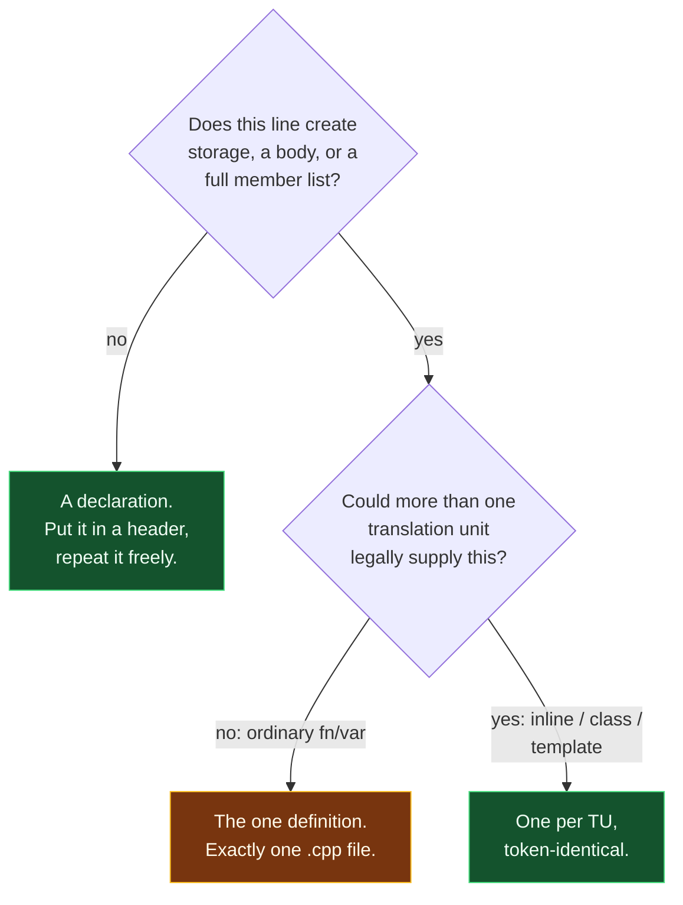

# Declarations vs Definitions

> [!essence]
> A **declaration** tells the compiler a name exists and what type it has — enough to type-check every later use. A **definition** is the one place that actually brings the name into being: it allocates a variable's storage, supplies a function's body, or lists a class's full member set. A name may be *declared* as many times as convenient, in as many files as need it, but *defined* exactly once in the whole program (with one relaxation, for classes, inline functions and templates). Confusing the two produces two very different failures: too many definitions is a compile- or link-time error the toolchain catches; too few is, for most kinds of entity, a link error — or, worse, no diagnostic at all.

## The Question

Every non-trivial C++ program is spread across more than one [[Translation Units|translation unit]], and each one is compiled as if the others didn't exist. So whenever a name — a variable, a function, a class, a template — shows up in source, the compiler needs an answer to a narrower question first: does *this* occurrence merely say the name exists and what its type is, or does it actually create the thing? The two occurrences can look almost identical — `int f(int);` versus `int f(int x){ return x; }` differ by a few characters — and using the wrong one in the wrong place is one of the first walls every C++ learner hits, because which failure it produces depends entirely on the toolchain's stage: a duplicate definition is usually caught by *this* compilation; a missing one usually isn't caught until the *linker* runs, and sometimes not even then.

> [!principle] Why the split exists
> 1. **Constraint.** [[Translation Units|A compiler processes one translation unit at a time]] and has no memory of any other file it has compiled or will compile. Yet a real program needs a name mentioned in `a.cpp` to reach a body written in `b.cpp`, and a header pasted into a hundred translation units must not thereby create a hundred conflicting copies of anything that has to be unique.
> 2. **Consequence.** If every mention of a name had to fully specify it — create its storage, supply its body — sharing a name across files would be impossible without duplicating it, and duplicating it would violate the requirement that, for most kinds of name, exactly one such entity exist in the finished program.
> 3. **Requirement.** The language needs two different speech acts: one that only states a name's type (cheap to repeat, harmless in a hundred files) and one that brings the entity into existence (must happen exactly once, or once per translation unit under tightly controlled conditions).
> 4. **Design.** C++ inherits the split from C. Primer states it directly: "A declaration makes a name known to the program... A definition creates the associated entity" (Primer §2.2.2, p. 45). The exact boundary is normative, not folklore: a declaration defines the entity it introduces *unless* it falls into an enumerated list of exceptions — an `extern` with no initializer, a function with no body, a bare `class S;`, and a handful of others (`[basic.def]` ¶1–2).
> 5. **Price.** The two categories are enforced at different times, by different tools. A second *definition* is, for most cases, a compile-time or link-time error the toolchain must report. A missing definition of a name that's actually used is, for most kinds of entity, undefined behavior with **no diagnostic required** (the exact multiplicity rule lives in [[The One Definition Rule]]) — the build can succeed and the program can run, wrongly, for a long time before anyone notices.

> [!tension] abstraction ⟷ control
> A declaration lets code be written against a name's interface without ever seeing its implementation — real abstraction, and the whole point of splitting the two apart. But the promise a declaration makes is one the compiler mostly cannot check: nothing stops a header from declaring a function whose only definition, in some other translation unit, disagrees about what it does. A hard mismatch (wrong return type) is caught at compile time; a subtler one is caught at link time, if at all; some categories of mismatch are UB with **no diagnostic required**. The declaration/definition split buys separate compilation at the price of trusting the programmer with a promise the toolchain only partly verifies.

## At a Glance

| Criterion | Declaration | Definition |
|---|---|---|
| **What it promises** | A name and its type — enough to check a *use* | The entity itself: storage, a body, or a full member list |
| **How many, per program** | As many as convenient, in as many files | Exactly one (ordinary functions/variables) — or one per translation unit, token-identical, for the ODR's class/inline/template exception |
| **Allocates storage / has a body?** | ✗ never | ✓ always |
| **Sufficient to *use* the name's type, or call a declared function** | ✓ yes | ✓ yes (a definition is also a declaration) |
| **Needed to *create* an object, reach a member, or actually link a call** | ✗ insufficient | ✓ required |
| **Missing, but used → what fails, and when** | — | Usually a **link** error ("undefined reference"); for some kinds, no diagnostic at all |
| **Duplicated → what fails** | Nothing, if all copies agree | A **compile** error (same file) or a **link** error / UB (different files, ordinary entities) |
| **Typical home** | A header, `#include`d everywhere it's needed | Exactly one `.cpp` file |

## Deep Dive

### Declarations: enough to check a use

A declaration's whole job is to let the rest of the translation unit — and, once shared through a header, every other translation unit — type-check a use of the name without seeing how it's implemented. PPP frames it the same way: what makes a line a declaration is that it brings a name into a scope and fixes a type for it; an initializer or a body is optional, and that optional part is exactly what turns it into something more (PPP §7.2 "Declarations and definitions"). Drop the optional part, and what's left is pure interface:

```cpp
extern int retry_limit;         // ① a variable: only its type is promised
int clamp(int value, int max);  // ② a function: only its signature is promised
class Sensor;                   // ③ a class: only its existence as a class is promised
```
1. `extern` is what turns a variable line into a declaration instead of a definition — drop it, and `int retry_limit;` at namespace scope *would* define the variable (see *Definitions*, next).
2. A function declaration is a definition with the body sliced off; parameter names are optional here because nothing under this line uses them yet (Primer §6.1.2, p. 206).
3. A bare `class Sensor;` — an *elaborated-type-specifier* — introduces the name and says "this is a class," nothing more (`[basic.def]` ¶2.5). Primer calls this a **forward declaration** (§7.3.3, p. 278–279).

A class declared this way but not yet defined is an **incomplete type**: the compiler knows `Sensor` names a class but not its size or members. Primer draws the boundary precisely: an incomplete type may be used to declare a pointer or a reference to it, or to declare (never define) a function taking or returning one, but never to create an object of that type or reach a member through it (Primer §7.3.3, p. 279). *In Code* §2 compiles exactly that boundary, both sides.

### Definitions: the one place that creates the entity

The Standard states the rule the opposite way from how most learners first meet it: every entity a declaration introduces is *also* a definition, **unless** the declaration matches one of an enumerated list of exceptions (`[basic.def]` ¶2). For everyday code, the exceptions that matter most are: a variable declared `extern` with no initializer; a function declared with no body; a class named only through `class S;`; and — one beginners hit early — a `static` data member named *inside* a class body, which is only ever a declaration there.

| Line | Declaration only, or definition? | Why |
|---|---|---|
| `extern int x;` | Declaration | `extern`, no initializer — `[basic.def]` ¶2.2 |
| `int x;` (namespace scope) | **Definition** | No `extern`: allocates storage, zero-initialized |
| `int f(int);` | Declaration | No function body — ¶2.1 |
| `int f(int x) { return x; }` | **Definition** | Has a body |
| `class S;` | Declaration | Elaborated-type-specifier — ¶2.5 |
| `class S { int a; };` | **Definition** | Full member list |
| `static int n;` inside the class body | Declaration | Non-inline static data member in a class definition — ¶2.3 |
| `int S::n = 0;` (outside the class) | **Definition** | The one place storage for `S::n` is created |

*In Code* §3 compiles the last two rows together, including the C++17 shortcut that collapses them into one line.

### Under the Hood: what actually lands in the object file

A declaration that nothing ever uses leaves no trace in the compiled output — there's nothing for the compiler to emit. A definition always does: storage for a variable, machine code for a function. Compiling a translation unit that only declares `counter` and `bump`, and never uses either, against one that defines both, then reading each object file's symbol table with `nm`, shows the difference directly (GCC 11.4.0, Ubuntu 22.04, local toolchain):

**Declared, never used:**
```cpp
extern int counter;      // ① declaration only: no storage here
int bump(int x);         // ② declaration only: no code here
int main() { return 0; } // neither name is used, so neither must exist yet
```

**Defined, and used:**
```cpp
int counter;                          // ③ definition: allocates storage
int bump(int x) { return ++counter; } // ④ definition: has a body
int main() { bump(0); }
```
1–2. Declared, never defined, never used: legal on their own — a translation unit doesn't have to finish every promise it makes, as long as nothing inside it calls one in.
3–4. The same two names, now defined and actually called.

```text
$ nm decl_only.o          $ nm def_present.o
0000000000000000 T main   0000000000000000 T _Z4bumpi
                           0000000000000000 B counter
                           0000000000000022 T main
```
The declaration-only object file has exactly one symbol: `main`. `counter` and `bump` were never emitted, because neither line created anything. Once both are *defined*, `bump` appears in `.text` (`T`, mangled as `_Z4bumpi`) and `counter` appears in `.bss` (`B`, uninitialized data). A declaration touches only the compiler's name lookup; a definition is the one that reaches the linker's symbol table.

> [!trap] "Declared but not defined" is a link-stage failure, not a compile-stage one
> Declare `static int max_retries;` inside a `Config` class and never define `Config::max_retries` outside it, then write a translation unit that only *takes its address* — that compiles cleanly. GCC 11.4.0 complains only at the very last step: `undefined reference to 'Config::max_retries'`, from `ld`, not from the compiler. The two-stage toolchain is exactly why this class of bug survives past the point most compile errors get caught — see [[The One Definition Rule]] for the exact rule this violates.

## Decision Guide



In words:

1. If a line doesn't allocate storage, supply a body, or list a class's members, it's a **declaration** — safe to repeat, and its natural home is a header shared by every translation unit that needs it.
2. If it does, and the entity is an ordinary (non-inline) function or variable, this is *the* **definition** — it belongs in exactly one `.cpp` file, matching [[The One Definition Rule]]'s whole-program requirement.
3. If the entity is a class, an inline function, an inline variable (C++17), or a template, the ODR relaxes to "one definition per translation unit, all token-identical" — which is exactly what makes it safe for the *same* class body or inline function to sit in a header and be `#include`d everywhere (see [[Translation Units]]).

## In Code

**1 · Declared many times, defined once**

```cpp
#include <iostream>

void greet();               // ① a declaration...
void greet();               // ② ...repeated: perfectly legal if consistent

void greet() {               // ③ the one definition
    std::cout << "hello\n";
}

extern int shared_total;     // ④ declares, does not define
int shared_total = 41;       // ⑤ defines: no extern, so this allocates storage

int main() {
    greet();
    std::cout << ++shared_total << '\n';
}
// expect: hello
// expect: 42
```
1–2. A function may be declared as many times as you like, in as many files as need it, as long as every declaration agrees (Primer §6.1.2, p. 206).
3. This line supplies a body — the definition.
4. `extern` with no initializer: a pure declaration (`[basic.def]` ¶2.2).
5. The same name, no `extern`: this is where `shared_total`'s storage is actually created.

**2 · An incomplete type: what a forward declaration allows, and what it doesn't**

**✗ Incomplete type, used by value:**
```cpp
// cc: ill-formed
class Sensor;              // forward declaration only: Sensor is incomplete

int main() {
    Sensor s;               // error: Sensor has incomplete type
}
```
Declaring a class without defining it produces a type the compiler cannot yet size — creating an object needs to know how much storage to reserve, and nothing here says that yet (Primer §7.3.3, p. 279).

**✓ Incomplete type, used only through a pointer or reference:**
```cpp
#include <iostream>

class Sensor;                 // ① incomplete from here...
Sensor* make_sensor();        // ② ...but a pointer's own size never depends on it
void log_id(const Sensor&);   // ③ ...neither does a reference parameter

struct Reading { Sensor* source = nullptr; };   // ④ nor a pointer member

class Sensor { int id = 7; };                    // ⑤ ...until this line: now complete
Sensor* make_sensor() { return new Sensor; }
void log_id(const Sensor&) { std::cout << "logged\n"; }

int main() {
    Reading r{make_sensor()};
    log_id(*r.source);
    delete r.source;
}
// expect: logged
```
1–4. A pointer, a reference, and a pointer *member* to an incomplete type are all fine: none of them needs to know `Sensor`'s size, only that the name exists.
5. The definition — `Sensor` is complete from this line on, and only now can code create one by value or reach a member through it.

**3 · A static data member: declared inside the class, defined outside it**

```cpp
#include <iostream>

struct Config {
    static int max_retries;               // ① declared here: no storage yet
    static constexpr int min_retries = 1; // ② C++17: implicitly inline — this line *is* the definition
};

int Config::max_retries = 5;               // ③ the one definition, outside the class

int main() {
    std::cout << Config::max_retries << ' ' << Config::min_retries << '\n';
}
// expect: 5 1
```
1. Inside a class body, a non-inline `static` data member is only ever declared — `[basic.def]` ¶2.3 names this exactly as one of the exceptions.
2. `constexpr` static data members are implicitly `inline` since C++17 (`[class.static.data]`), which is what lets the in-class initializer double as the definition — no out-of-class line needed for this one.
3. The line that finally allocates `max_retries`'s storage. Omit it, and the program still compiles — the failure surfaces only once something actually *uses* `max_retries`, and only at the link step (see the trap above).

## Connections

- **Prerequisites:** [[Translation Units]] — the reason "declared in many places, defined in one" is a rule worth having at all.
- **Deeper:** [[The One Definition Rule]] (the exact multiplicity rule for definitions, ordinary and inline/class/template alike) · [[Linkage — Internal, External, None]] (which translation units a declaration's name is even visible to) · [[The Compilation Pipeline]] (which stage catches which failure) · [[The Preprocessor]] and [[Headers and Include Guards]] (how a declaration actually gets pasted into every translation unit that needs it).
- **Siblings:** [[Scope]] (where a name is visible — orthogonal to whether it's declared or defined) · [[Anatomy of a Function]] (the declaration/definition split applied specifically to functions).
- **Domain:** [[Map — Program Structure & Build]].
- **Practice:** *Continuum #6 Function Library & Header Refactor* — split declarations into a header and definitions into `.cpp` files, and watch which mistakes the compiler catches and which only the linker does.

## Check Yourself

> [!quiz]- What's the one-sentence rule for how many times a name may be declared vs. defined?
> Declared as many times as convenient, as long as every declaration agrees; defined exactly once in the whole program — or, for a class, inline function, inline variable, or template, once per translation unit, with every copy token-for-token identical.

> [!quiz]- `int total;` sits at namespace scope, with no `extern`. Declaration, or definition?
> A definition. Without `extern`, a variable declaration at namespace scope also creates the entity: it allocates storage and, with no explicit initializer, is zero-initialized. `extern` is what would turn this into a pure declaration.

> [!quiz]- Why can a struct have a pointer to its own type as a member, but not a value member of its own type?
> A class counts as declared — and so becomes an incomplete type — as soon as its name has been seen, even before its body is finished. A pointer member needs only an address's worth of storage, which doesn't depend on the pointed-to type being complete; a value member would need the compiler to already know the size of the very class it's still defining.

> [!quiz]- A program declares `static int max_retries;` inside a `Config` class, never defines `Config::max_retries` outside it, and never uses it. Does it compile and link?
> Yes. An unused declaration never has to be backed by a definition. The failure only appears once something *odr-uses* `max_retries` — reads it, takes its address, and so on — and even then it's the linker that reports "undefined reference," not the compiler.

> [!quiz]- Two different `.cpp` files both write `int f(int) { return 1; }` — identical text. Does the program link?
> No. For an ordinary (non-inline) function, the One Definition Rule permits exactly one definition in the *entire program*, not one per translation unit. Token-for-token identical copies across translation units are only permitted for the specific exception list: inline functions, inline variables, class types, and templates.

## Sources

- Primer §2.2.2 "Variable Declarations and Definitions" (p. 45): the core rule — "A declaration makes a name known to the program... A definition creates the associated entity" — and the `extern` distinction. §6.1.2 "Function Declarations" (p. 206–207) and §6.1.3 "Separate Compilation" (p. 207–208): function declarations as headers, "declared multiple times, defined once." §7.3.3 "Class Declarations" (p. 278–279): forward declarations, incomplete types, and exactly what they permit. §7.6 "Static Class Members" (p. 303): in-class declaration of a static data member.
- PPP §7.2 "Declarations and definitions" (ch. 7 "Technicalities: Functions, etc."): the interface/implementation framing, and why a mutually recursive call chain needs a forward declaration.
- Tour §3.2 "Separate Compilation" (p. 32): the translation-unit model that motivates the whole split.
- cppreference, *Declarations*: https://en.cppreference.com/w/cpp/language/declarations · *Definitions and ODR*: https://en.cppreference.com/w/cpp/language/definition · *Incomplete type*: https://en.cppreference.com/w/cpp/language/incomplete_type
- Draft standard `[basic.def]` ¶1–2 (the exact "declaration is a definition unless..." list, with a worked example): https://eel.is/c++draft/basic.def · `[class.static.data]` (`constexpr` static data members implicitly `inline` since C++17): https://eel.is/c++draft/class.static.data
