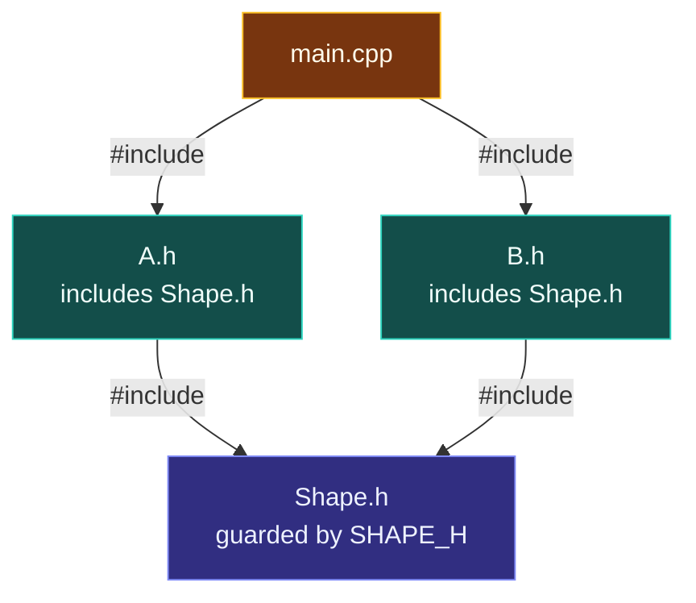
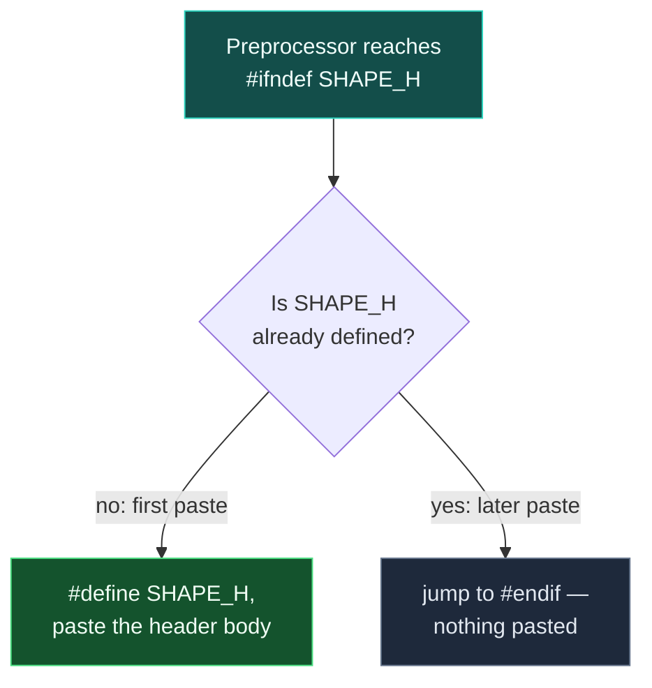

# Headers and Include Guards

> [!essence]
> A header's text can be pasted into the same translation unit more than once — directly, or transitively through two other headers that both include it — and a translation unit may hold **at most one** definition of a class, struct, enum or template. Wrap the header's body in `#ifndef GUARD` / `#define GUARD` / `#endif` (or the non-standard but near-universal `#pragma once`) so only the first paste survives.

## Intent

Make a header safe to `#include` any number of times in the same translation unit, so the author of some other file never has to track who already included what.

## The Problem

[[The Preprocessor|The preprocessor]] already fixed what `#include` does: it splices a file's characters into the including file, verbatim, before a single rule of C++ grammar has fired. This note asks what happens when that splicing reaches the same translation unit twice — which real programs do constantly, because headers routinely include other headers (Primer §2.6.3, p. 76).

> [!principle] Constraint → Consequence → Requirement → Design → Price
> 1. **Constraint.** `#include` has no memory: it never checks whether it has already pasted a given file into this translation unit. Headers `#include` other headers as a matter of course, so the *same* header can be reached by more than one path.
> 2. **Consequence.** If `A.h` and `B.h` both `#include "Shape.h"`, and some `main.cpp` includes both `A.h` and `B.h`, then by the end of translation phase 4 `main.cpp`'s translation unit contains `Shape.h`'s text **twice** — and no `#include` directive survives to point at the cause, because phase 4 already replaced every one of them with plain tokens. A translation unit may contain only one definition of a given class type, enumeration type or template, full stop: the rule that lets *different* translation units repeat an identical class definition does not apply to two copies pasted into the *same* one (cppreference, *Definitions and ODR*). Two pasted copies of `struct Shape { … };` are a redefinition error.
> 3. **Requirement.** A header's effect on a translation unit must depend on whether it has already had that effect there — decided by the preprocessor, using only tokens, before phase 7 ever sees a declaration.
> 4. **Design.** Wrap the header's body in a conditional-inclusion block (`[cpp.cond]`) keyed on a macro the header itself defines: `#ifndef GUARD` / `#define GUARD` / … / `#endif`. The first paste finds `GUARD` undefined, defines it, and lets the body through. Every later paste in the same translation unit finds `GUARD` already defined and jumps straight to `#endif` — the body, definitions and all, never happens again.
> 5. **Price.** The guard name lives in the one flat, translation-unit-wide macro namespace [[The Preprocessor|the preprocessor uses for everything]]. Two headers that pick the same guard name collide, and the second header's contents vanish silently rather than failing loudly (see *Consequences*). `#pragma once` trades that naming problem for non-standard status; only [[Modules (C++20)]] removes the need for a guard at all, because a module's interface is compiled once rather than re-pasted per translation unit.

> [!tension] compatibility ⟷ evolution
> A header guard defends a convention — repeated textual pasting — that is older than C++ itself, instead of fixing the pasting. [[Map — Program Structure & Build|This domain]] resolves the tension the same way everywhere in it: keep `#include` working exactly as it always has, and let [[Modules (C++20)]] be the opt-in replacement rather than a breaking one.

## Structure



The "diamond include" above is the ordinary case a guard defends against: neither `A.h` nor `B.h` did anything wrong, and `main.cpp` may not even know `Shape.h` is shared between them.



The guard's whole job is that decision diamond, evaluated once per `#include`, at translation phase 4, before any C++ grammar rule exists.

## In Code

**✗ No guard: the diamond include is ill-formed**

```cpp
// cc: ill-formed
#include <iostream>

// ---- Shape.h's contents, pasted once via "A.h" ----
struct Point { int x, y; };
// ---- Shape.h's contents, pasted again via "B.h" ----
struct Point { int x, y; };   // ① error: redefinition of 'struct Point'

int main() {
    Point p{3, 4};
    std::cout << p.x + p.y << '\n';
}
```
1. Two `#include "Shape.h"` directives are compressed into one file here to show their combined effect: by the end of phase 4, this translation unit contains `struct Point { … };` twice, and the One Definition Rule forbids even a byte-for-byte identical second copy *within one translation unit*. No `#include` line exists any more for the error to point at — only two ordinary-looking struct definitions.

**✓ Guarded: the same double paste survives**

```cpp
#include <iostream>

#ifndef POINT_H              // ① simulates a first  #include "Point.h"
#define POINT_H
struct Point { int x, y; };
#endif

#ifndef POINT_H              // ② simulates a second #include "Point.h"
#define POINT_H
struct Point { int x, y; };  // never reached: POINT_H is already defined
#endif

int main() {
    Point p{3, 4};
    std::cout << p.x + p.y << '\n';
}
// expect: 7
```
1. The first `#ifndef POINT_H` finds the macro undefined, so the preprocessor defines it and lets the struct definition through.
2. The second `#ifndef POINT_H` finds the macro **already** defined by ① and jumps straight to its `#endif`. The second `struct Point { … };` is never pasted, so phase 7 only ever sees one definition — exactly what two separate `#include "Point.h"` directives would produce in real files.

**`#pragma once`: the same guarantee, with no name to choose**

```cpp
// cc: fragment
#pragma once                 // ① one line, at the top of the header
struct Point { int x, y; };
```
1. `#pragma once` asks the compiler to track *which files* it has already processed for this translation unit — by file identity, not by a macro — and to skip a repeat outright. It needs no name, so it cannot collide with another header's guard, but it is not part of the Standard (see *Variations*). Its effect only shows up across *separate* physical files, so it cannot be exercised inside one single-file compile the way the two examples above can.

## Consequences

| Benefit | Cost |
|---|---|
| ✓ A header can be `#include`d any number of times in one translation unit without a redefinition error | ✗ The guard name must be unique across every header in the program; a collision silently discards the second header's contents (see the trap below) |
| ✓ Defends against the ordinary *diamond include* without anyone tracking who includes what | ✗ Three lines of boilerplate per header that carry no domain meaning |
| ✓ Fully standard conditional compilation (`[cpp.cond]`), unchanged since headers existed | ✗ Says nothing about order-dependent macros or an ODR violation *across* translation units — it only stops repeats *within* one |
| ✓ Resolved entirely at translation phase 4: zero run-time cost | ✗ `#pragma once` (see *Variations*) trades the naming problem for non-standard behavior |

**✗ Two unrelated headers, the same generic guard name**

```cpp
#include <iostream>

#ifndef HEADER_H              // ① "Point.h" picked a generic guard name
#define HEADER_H
struct Point { int x, y; };
#endif

#ifndef HEADER_H              // ② "Color.h" reused the SAME name by accident
#define HEADER_H
struct Color { int r, g, b; };  // never pasted: HEADER_H is already defined
#endif

int main() {
    Point p{1, 2};
    std::cout << p.x << '\n';
    // Color c{255, 0, 0};      // ③ error: 'Color' was never declared
}
// expect: 1
```
1. `HEADER_H` is undefined, so `Point`'s definition is pasted and the macro is defined.
2. The second header's `#ifndef HEADER_H` finds the name **already** defined — by the *first*, unrelated header — and skips straight past its own body. `Color` is never declared, and nothing here says why.
3. Uncommenting this line fails with an ordinary "not declared in this scope" error, reported far from the header that silently lost its contents.

> [!trap] A guard-name collision fails silently, somewhere else entirely
> The example above compiles and runs — that is the danger. Nothing fails at the point where `Color`'s declaration vanished; the failure surfaces later, wherever code tries to use `Color`, with an error that gives no hint that a header guard is to blame. This is why real headers base the guard's name on the header's own name (`Sales_data.h` → `SALES_DATA_H`) rather than on something generic like `HEADER_H` or `UTIL_H`.

> [!standard] Guard names are not exempt from the reserved-identifier rule
> Don't reach for `_POINT_H` or `__POINT_H__` to make a guard "more unique." Any identifier that begins with an underscore followed by an uppercase letter, or that contains a double underscore anywhere, is reserved to the implementation in every scope; defining one yourself is ill-formed, no diagnostic required (cppreference, *Identifiers*). `POINT_H` or `MYLIB_POINT_H_INCLUDED` are both fine — a single leading underscore in the *global* namespace is reserved too, so don't start there either.

## Variations

| Variation | Mechanism | Standardized? | Price |
|---|---|---|---|
| **Classic `#ifndef` / `#define` / `#endif`** | conditional compilation on a macro name (`[cpp.cond]`) | ✓ since C++98 (inherited from C) | needs one well-chosen, unique name per header |
| **`#pragma once`** | the compiler tracks file identity instead of a macro | ✗ not in the Standard, but GCC, Clang and MSVC all implement it | no name to collide, but "file identity" is implementation-defined (symlinks, case-insensitive filesystems and network mounts have occasionally confused it) |
| **[[Modules (C++20)]]** | the module's interface is compiled once and imported, not re-pasted per translation unit | ✓ C++20 | removes the guard problem entirely, at the cost of rewriting `#include` as `import` and losing macro export across the boundary |

## Connections

- **Prerequisites:** [[The Preprocessor]] — fixes *what* `#include` and conditional compilation can do; this idiom is one specific, disciplined arrangement of those primitives.
- **Related idioms:** [[Declarations vs Definitions]] (why headers exist to share declarations in the first place) · [[The One Definition Rule]] (the whole-program rule this idiom keeps one translation unit from violating on its own) · [[Modules (C++20)]] (the domain's own replacement for needing a guard at all).
- **Domain:** [[Map — Program Structure & Build]] · see [[Translation Units]] for exactly what "the same translation unit" means.
- **Practice:** *Continuum #6 Function Library & Header Refactor* — split a single-file program into headers and sources and add include guards by hand before reaching for `#pragma once`.

## Check Yourself

> [!quiz]- Why doesn't wrapping a header's body in `#ifndef`/`#endif` help if two *different* headers happen to choose the same guard name?
> The macro namespace is flat and shared across the whole translation unit, with no notion of which header defined which name. The second header's `#ifndef` finds the name already defined — by the *first* header, for an unrelated reason — and skips its own body entirely. Nothing pastes, and nothing the second header was supposed to declare exists, but no error appears until something later tries to use it.

> [!quiz]- A header is only ever `#include`d once, by the single `main.cpp` in a small program. Does it still need a guard?
> Yes. As soon as any other header starts including this one — directly, or (far more commonly) transitively through a third header — an unguarded header becomes a silent time bomb, and nothing about *this* file's own includes changes to warn you when that happens. Guards cost three lines; deciding case by case whether a given header is "safe for now" costs more than always writing them.

> [!quiz]- Predict: does replacing the guard macro `POINT_H` with `__POINT_H__` change what the ✓ example prints?
> No — it still prints `7` on most implementations, and that is exactly the trap. `__POINT_H__` contains a double underscore, so defining it is reserved to the implementation and therefore ill-formed, no diagnostic required, even though the program appears to run correctly today.

## Sources

- Primer §2.6.3 "Writing Our Own Header Files" (pp. 76–77): the header-guard example built around `SALES_DATA_H`, the advice to guard every header unconditionally rather than deciding case by case, and basing a guard's name on the header's own name in all uppercase.
- Primer §Defined Terms (p. 79): the glossary entry for a header guard, defined as a preprocessor variable whose job is stopping one file's declarations from landing twice in the same translation unit.
- Tour §3.2 "Separate Compilation" (pp. 30–32): headers as the traditional way to share an interface across translation units, and the costs of `#include`-based modularity that motivate [[Modules (C++20)]].
- PPP §7.7.2 "Header files": header files introduced alongside modules as the two standard ways C++ shares declarations across separately compiled files.
- cppreference, *Source file inclusion*: the `#ifndef`/`#define`/`#endif` guard pattern and `#pragma once` described as a non-standard pragma with similar effect: https://en.cppreference.com/w/cpp/preprocessor/include
- cppreference, *Definitions and ODR*: at most one definition of a class type, enumeration type or template is allowed in any one translation unit, with the "more than one identical definition" allowance scoped to different translation units, not repeats within one: https://en.cppreference.com/w/cpp/language/definition
- cppreference, *Identifiers*: the reserved-identifier rule (leading underscore followed by an uppercase letter, or any double underscore) that a guard name must avoid: https://en.cppreference.com/w/cpp/language/identifiers
- Draft standard `[cpp.cond]` (conditional inclusion directives) and `[basic.def.odr]` (the One Definition Rule): https://eel.is/c++draft/cpp.cond
