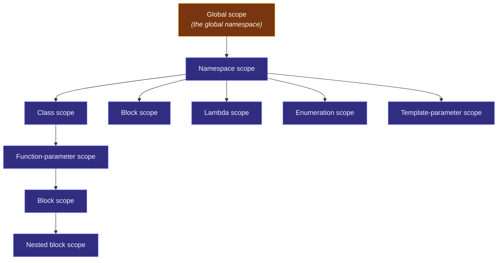

# Scope

> [!essence]
> A **scope** is a region of program text in which a declared name is visible under that declaration's meaning. Every name lives in exactly one of a fixed set of scope kinds — block, function-parameter, lambda, namespace, class, enumeration, template-parameter — each starting at a well-defined point and ending at a well-defined point. When scopes nest, an inner declaration of the same name doesn't erase the outer one: it **hides** it for the rest of the inner scope.

## The Problem

Program text is written as a flat stream of characters, but it is organized as nested regions: blocks inside functions, functions inside classes, classes inside namespaces. A compiler resolving the token `count` has to decide, at each point in that text, which declaration — if any — it refers to.

> [!principle] Constraint → Consequence → Design
> 1. **Constraint:** A name is only a token. The same short, useful word — `count`, `size`, `result` — is the natural name for a variable in dozens of unrelated functions across a program, and for a member in dozens of unrelated classes.
> 2. **Consequence:** If C++ had one flat pool of names, every one of those local helpers would need a distinct, awkward name (`sensor_count`, `sensor_module_count`, `sensor_module_v2_count`...) just to avoid colliding with a name used somewhere else in the same program.
> 3. **Requirement:** The language needs a way to let the same name mean different things in different parts of a program, resolved by a rule the compiler can apply using only the text visible up to that point — and a way to say, unambiguously, which of several same-named declarations a given use means.
> 4. **Design:** C++ carves program text into nested **scopes**. Each kind (block, namespace, class, …) is introduced at a syntactically fixed point and closes at a syntactically fixed point. A name is visible from its **point of declaration** to the end of the scope it belongs to. Look-up starts in the smallest enclosing scope and works outward, stopping at the first match — so an inner declaration **hides** an outer one of the same name rather than conflicting with it.
> 5. **Price:** Hiding is legal, which means it is also easy to do by accident — declaring a common name in an inner block silently cuts off access to an outer variable of the same name for the rest of that block. The point-of-declaration rule also creates a genuinely strange edge case: a variable's own name becomes visible partway through its own declaration, before its initializer has run.

> [!tension] abstraction ⟷ control
> A scope lets a name be a purely local implementation detail — a loop counter, a helper total — reusable anywhere without coordinating with the rest of the program. That is abstraction: the name's meaning is private to its region of text. The price is control: nothing stops an inner scope from reusing a name the programmer *meant* to keep referring to the outer one, and the language gives no warning by default. Every rule in this note is either a way of drawing that region's boundary precisely, or a way of reaching past it on purpose (`::`, `this->`, a qualified name).

## Mental Model

Scopes nest like rooms inside a house: a name declared in an inner room is invisible from the hallway, but the hallway's names are still reachable from inside the room — until the room declares its own name that hides the hallway's.

```text
 GLOBAL SCOPE (the global namespace)
┌────────────────────────────────────────────────────────┐
│ namespace game { ... }             NAMESPACE SCOPE      │
│ ┌──────────────────────────────────────────────────┐   │
│ │ class Sprite { ... };                CLASS SCOPE  │   │
│ │ ┌────────────────────────────────────────────┐    │   │
│ │ │ void Sprite::move(int dx) {   FN-PARAM SCOPE│    │   │
│ │ │   int x = dx;                  BLOCK SCOPE  │    │   │
│ │ │   { int step = 1; }         INNER BLOCK SCOPE│   │   │
│ │ │ }                                           │    │   │
│ │ └────────────────────────────────────────────┘    │   │
│ └──────────────────────────────────────────────────┘   │
└────────────────────────────────────────────────────────┘
```

Code inside `move` can see `dx`, `Sprite`'s members, `game`'s other names, and the global namespace — every scope it is nested inside. Code at global scope cannot see `x`, `dx`, or anything private to `Sprite`: visibility only flows outward-to-inward, from an outer scope in, never the reverse.



> [!model] The house analogy, and where it breaks
> A room hides its own furniture from the hallway, and a room can hold new furniture with the same name as something in the hallway without the hallway's own copy vanishing. **Where it breaks:** rooms in a house are physical and mutually exclusive — you occupy one at a time. Scopes are purely about *name visibility in the source text*, decided entirely at compile time. Two scopes can be "in" the same runtime moment (a class scope and the block scope of one of its member functions overlap in every call), and a scope with no objects at all still exists as a region of text — an empty namespace has a scope even though it holds nothing.

## Mechanics

**The kinds of scope.** Every declaration inhabits exactly one of these (cppreference, *Scope*; the global scope is the namespace scope of the unnamed global namespace):

| Kind | Introduced by | Extends to |
|---|---|---|
| **Block scope** | `{ }`, and the substatement of `if`/`switch`/`for`/`while`/`do` | The end of that block or (for an `if`/`for`/`while` condition variable) the whole controlled statement, including any `else` |
| **Function-parameter scope** | A parameter declaration | The end of the function definition (or, for a bare declaration, the end of that declarator) |
| **Lambda scope** (C++11; init-captures C++14) | `[captures]` of a lambda | The end of the lambda's `{ body }` |
| **Namespace scope** | A `namespace` definition, including the unnamed global namespace | The end of that namespace (the global namespace's "end" is the end of the program) |
| **Class scope** | A class or class-template definition | The end of the member specification, plus member function bodies defined outside it |
| **Enumeration scope** | An `enum class`/`enum struct` definition | The end of the enumerator list |
| **Template-parameter scope** | A template's parameter list | The end of the template declaration |

**Nesting and hiding.** A name declared in an inner scope that matches the spelling of a name in an enclosing scope does not redeclare, overload, or delete the outer one — it **hides** it for the rest of the inner scope. Overload resolution never crosses a scope boundary to compare candidates: lookup finds the nearest enclosing scope with a matching name and stops there, even if an outer scope holds a function that would have matched the call better (Primer §6.4, pp. 234–235). A hidden name is not gone — it is reachable again once the inner scope ends, or immediately, through an explicit qualifier: `::x` for the global scope, `Outer::x` for a namespace or class, `this->x` for a hidden data member.

> [!standard] Point of declaration
> A name becomes visible at its **locus**, not at the end of its declaration: for an ordinary variable, that is immediately after the declarator and *before* its initializer (`[basic.scope.pdecl]`). Two consequences follow directly from this. First, `int x = x;` inside a block that already has an outer `x` initializes the *inner* `x` from its own indeterminate value, not from the outer one — the inner name is already in scope by the time the initializer runs. Second, given `const int n = 2;`, the declaration `int n[n];` in an inner block is well-formed: the array *bound* `n` still refers to the outer constant (the locus of the inner `n` is after its declarator, i.e., after the `]`), while any *initializer* on that same line would see the inner `n`.

**Scope is not lifetime.** A `static` local variable has **block scope** — its name is invisible outside the function — but **static storage duration**: the object is constructed once, on first use, and destroyed only at program exit, long after any single call's block has ended (Primer §6.1.1, p. 205). The name's visibility and the object's existence are governed by two different rules; see [[Storage Duration]] and [[Object Lifetime]] for the lifetime side of that split.

## Under the Hood

> [!machine] Scope costs nothing at run time
> Scope is resolved entirely during name lookup, a compile-time activity — there is no run-time representation of "which scope am I in." The clearest evidence is that two block-scoped variables with disjoint lifetimes can occupy the **identical** stack address, because the compiler only has to keep an object's storage valid while its scope's control flow can still reach it. Compiling a function whose `if`-branch and `else`-branch each declare their own array in their own block scope (GCC 14.2, `-O2`, x86-64, Compiler Explorer):
> ```cpp
> void sink(int*);
> void demo(bool cond) {
>     if (cond) {
>         int a[64];   // block scope: only visible/live in the if-branch
>         a[0] = 1;
>         sink(a);
>     } else {
>         int b[64];   // block scope: only visible/live in the else-branch
>         b[0] = 2;
>         sink(b);
>     }
> }
> ```
> ```nasm
> demo(bool):
>         sub  rsp, 264      ; ONE 256-byte region, reserved once
>         test dil, dil
>         je   .L2
>         mov  rdi, rsp      ; a[] lives at [rsp]
>         mov  DWORD PTR [rsp], 1
>         call sink(int*)
>         add  rsp, 264
>         ret
> .L2:
>         mov  rdi, rsp      ; b[] lives at the SAME [rsp]
>         mov  DWORD PTR [rsp], 2
>         call sink(int*)
>         add  rsp, 264
>         ret
> ```
> `a` and `b` are two different names in two different, non-overlapping block scopes — and the compiler gives them the exact same address, because their scopes never coexist. The stack frame is sized once for the *whole function*; scope only ever decided which name was legal to write at each point in the source.

## In Code

**1 · Nested block scope and the global-scope operator**

```cpp
#include <iostream>

int level = 0;                   // ① global scope

int main() {
    int level = 1;                // ② block scope: hides ①
    {
        int level = 2;             // ③ inner block scope: hides ②
        std::cout << level << ' ';
    }
    std::cout << level << ' ' << ::level << '\n';   // ④
}
// expect: 2 1 0
```
1. `level` at namespace (global) scope.
2. A same-named local hides it for the rest of `main`.
3. An inner block hides that in turn, but only until `}`.
4. Back in the outer block, `level` means ②; `::level` reaches past every block scope straight to the global one.

**2 · Point of declaration: a trap and its fix**

**✗ UB — the name is in scope before its initializer runs:**
```cpp
// cc: ub
#include <iostream>

int main() {
    int x = 42;
    {
        int x = x;               // ① inner x is already in scope here
        std::cout << x << '\n';  // ② reads x's own indeterminate value: UB
    }
}
```
1. By the point-of-declaration rule, the inner `x` is visible immediately after its declarator — which is *before* `= x` runs, so the initializer reads the variable it is still initializing.
2. GCC 11.4.0 (`-Wall -Wextra`, local toolchain) catches exactly this: `'x' is used uninitialized`. The warning is real, verified evidence; what the program prints is not — an indeterminate `int` has no defined value, so this note makes no claim about the output.

**✓ Fix — give the inner variable its own name:**
```cpp
#include <iostream>

int main() {
    int x = 42;
    {
        int y = x;                // ① unambiguous: y is new, x still means the outer one
        std::cout << y << '\n';
    }
}
// expect: 42
```
1. There is no name collision, so there is nothing for the point-of-declaration rule to trap.

**3 · Confining a name to exactly where it's needed (C++17)**

```cpp
#include <iostream>
#include <optional>

std::optional<int> find_answer();

int main() {
    if (auto result = find_answer(); result.has_value()) {  // ① result's scope: the if AND the else
        std::cout << "found " << *result << '\n';
    } else {
        std::cout << "missing\n";                             // ② result is visible here too...
    }
    // result;                                                 // ③ ...but a use here would not compile
}

std::optional<int> find_answer() { return 42; }
// expect: found 42
```
1. The `if`'s init-statement (P0305R1) gives `result` its own block scope spanning the whole `if`/`else`, instead of leaking into the enclosing function.
2. Both branches can see it — that is the point of putting it in the `if`'s own scope rather than declaring it before the `if`.
3. Outside the `if`, `result`'s scope has ended; nothing after this point can name it.

**4 · Class scope: a parameter can hide a member**

```cpp
#include <iostream>

class Counter {
public:
    explicit Counter(int count) : count{count} {}  // ①
    void reset(int count) {
        count = count;              // ② bug: both sides name the parameter
    }
    void reset_fixed(int count) {
        this->count = count;        // ③ fix: qualify past the hiding parameter
    }
    int count;
};

int main() {
    Counter c{5};
    c.reset(99);
    std::cout << c.count << ' ';    // ④ still 5
    c.reset_fixed(99);
    std::cout << c.count << '\n';   // ⑤ now 99
}
// expect: 5 99
```
1. In a member-initializer, the name *before* the `{` is looked up as a member regardless of hiding (`[class.base.init]`); the name *inside* it is looked up in the constructor's ordinary scope, where the parameter hides the member. So `count{count}` correctly means "member `count`, from parameter `count`."
2. Inside the *body*, that special-cased lookup doesn't apply: the parameter hides the member for the whole function, so `count = count;` assigns the parameter to itself. The member is never touched — this is the naive expectation failing, not a typo.
3. `this->count` steps past the hiding parameter to reach the member explicitly.
4–5. `reset(99)` is a silent no-op; `reset_fixed(99)` is the version that actually works.

## Pitfalls

> [!trap] Shadowing the name you meant to use
> A same-named inner declaration is not an error, so reusing a common word like `count`, `data`, or `result` in a nested block silently cuts off access to the outer variable for the rest of that block — the compiler will not tell you by default. GCC and Clang's `-Wshadow` flags exactly this class of declaration; it is not part of `-Wall`/`-Wextra` and must be requested on its own.

> [!ub] Reading a name in its own initializer
> `int x = x;` (Example 2) compiles, and reads the variable's own uninitialized value, because the point-of-declaration rule puts the name in scope before its initializer executes. Undefined through C++23; erroneous behavior in C++26 (P2795R5): the read then yields an implementation-chosen value the compiler is encouraged to diagnose, but it is still a bug. See [[Reading Uninitialized Variables]]. See [[Dangling Pointers and References]] for the closely related family of bugs where a name is in scope but what it refers to is no longer valid.

> [!trap] A parameter or local hiding a data member
> Any parameter or local variable spelled the same as a data member hides that member for the rest of its own scope (Example 4). `this->` (or a class-qualified name) is the only way back to the member from inside that scope; a `count = count;`-shaped bug compiles cleanly and does nothing.

## Evolution

| Standard | Change | Why |
|---|---|---|
| C++98 | Scope defined in `[basic.scope]` alongside a separate concept, the *declarative region*; clause `§3.3` titled "Declarative regions and scopes" | The original wording distinguished the region where a name is *potentially* visible from the (possibly smaller) region where it actually is, after hiding |
| C++11 | Lambda expressions introduce their own scope for the function-call operator's body; range-`for` introduces a hidden scope for the range variable | New syntactic forms needed their own well-defined region of visibility |
| C++14 | Init-captures (`[x = expr]`) give a lambda's captures their own locus inside the lambda scope | A captured name with an initializer needed a point of declaration of its own |
| C++17 | `if` and `switch` gain an init-statement (P0305R1), confining a name to that statement's own block scope instead of leaking into the enclosing scope; structured bindings get precise point-of-declaration rules | Directly implements the Core Guidelines' "keep scopes small" (ES.5) without a manual extra `{ }` |
| C++20 | Range-`for` gains an init-statement (P0614R1); modules add an export boundary orthogonal to ordinary scope — a name's scope can be larger than what's visible through `import` | Extends the C++17 init-statement pattern; gives translation units a second, compiler-checked visibility mechanism alongside scope |
| Current draft (eel.is) | The separate "declarative region" concept has been retired from the *current* wording in favor of defining scope directly via each construct's *locus*; the clause is renumbered `§6.4` (it was `§6.3` in the published C++17 text) | A wording simplification, not a language change — the visible rules in this note are unchanged since C++98 |

## Connections

- **Prerequisites:** None formally required — scope is foundational vocabulary for the rest of this domain.
- **Enables:** [[Namespaces]] (namespace scope, in depth) → [[Name Lookup and ADL]] (the exact algorithm scope feeds into) · [[Linkage — Internal, External, None]] (a second, independent axis: which *translation units* can see a name, not just which *text region*).
- **Siblings:** [[Declarations vs Definitions]] (orthogonal: where a name is declared vs. what creates the entity) · [[Storage Duration]] and [[Object Lifetime]] (scope governs a *name*'s visibility; these govern an *object*'s existence — a `static` local shows the two can diverge).
- **Domain:** [[Map — Program Structure & Build]].

## Check Yourself

> [!quiz]- What's the difference between a name going out of scope and the object it named being destroyed?
> Scope is about the *name* — a purely compile-time, text-based question of where that spelling is legal to use. Lifetime is about the *object* — a run-time question of when it was constructed and destroyed. A `static` local variable's name has block scope (invisible outside its function) while the object it names has static storage duration (alive for the whole program): the name can go out of scope on every return from the function while the object underneath keeps existing.

> [!quiz]- Why does C++ let an inner scope redeclare a name from an outer scope, instead of making that an error?
> Because scopes exist precisely so that a name can be a local implementation detail — a loop counter or a helper total shouldn't have to be coordinated with every other use of that word in the program. Making redeclaration an error would defeat that purpose; the trade-off C++ makes instead is silent hiding, recoverable with `::` or a qualified name when you need the outer one.

> [!quiz]- Predict: what does this print? `int n = 10; { int n = n * 2; { int n = n + 1; std::cout << n; } }`
> This does not have a defined printed value — it's the same point-of-declaration trap as Example 2, three scopes deep. Each inner `n` is in scope (and hides the outer one) before its own initializer runs, so `n * 2` and `n + 1` each read an already-declared but not-yet-initialized `int`: undefined behavior through C++23 (erroneous behavior in C++26), not a computable number either way.

> [!quiz]- In Example 4, why does `reset_fixed` work when `reset` doesn't, even though both are one line?
> `reset`'s parameter `count` hides the member `count` for the entire function body, so `count = count;` assigns the parameter to itself — the member is never named. `reset_fixed` writes `this->count`, which is a qualified name and therefore not subject to hiding: it reaches the member explicitly regardless of what the parameter is called.

## Sources

- Primer §2.2.4 "Scope of a Name" (pp. 48–49): scope kinds (global/block scope), nested scopes, hiding by redeclaration in an inner scope.
- Primer §6.4 "Overloaded Functions" (pp. 234–235): the rule that inner-scope declarations hide outer ones outright rather than overloading with them.
- Primer §6.1.1 "Local Objects", subsection "Local `static` Objects" (p. 205): a `static` local's block scope vs. its static storage duration.
- Primer §7.4 "Class Scope" (p. 282): class scope as a distinct kind, and out-of-class member definitions entering it.
- Tour §1.5 "Scope and Lifetime" (p. 9): the four informal scope kinds (local, class, namespace, global) and their extents.
- PPP §7.3 "Scope" (ch. 7 "Technicalities: Functions, etc."): the scope taxonomy (global, module, namespace, class, local, statement) and "the main purpose of a scope is to keep names local."
- cppreference, *Scope*: https://en.cppreference.com/w/cpp/language/scope — the full modern taxonomy, point-of-declaration ("locus") rules, and the block-scope redeclaration-conflict rule.
- Draft standard `[basic.scope]` (scope kinds) and `[basic.scope.pdecl]` (point of declaration): https://eel.is/c++draft/basic.scope
- C++ Core Guidelines ES.5 "Keep scopes small" and ES.6 "Declare names in for-statement initializers and conditions to limit scope": https://isocpp.github.io/CppCoreGuidelines/CppCoreGuidelines
- WG21 P0305R1, *Selection statements with initializer*: https://wg21.link/p0305r1
