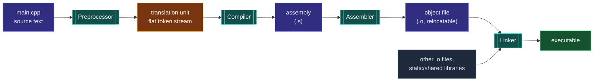
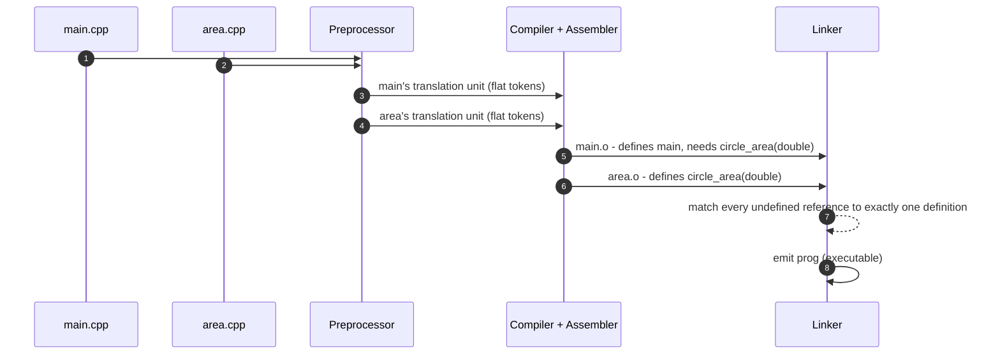

# The Compilation Pipeline

> [!essence]
> A C++ program does not go from source text to running code in one step. It passes through four narrowing stages — **preprocess, compile, assemble, link** — each of which hands the next a smaller, more machine-like artifact and forgets everything it can't express in that artifact. Almost every rule in this domain exists because of what gets thrown away at one of these boundaries.

## The Problem

`main.cpp` calls `circle_area(2.0)`. Its body — three lines of arithmetic — might live in the same file, in `area.cpp` two directories over, or inside a `.a` file shipped by a vendor who never saw your source tree. Somehow a single executable has to come out the other end, with that call actually reaching that body.

> [!principle] Constraint → Consequence → Requirement → Design → Price
> 1. **Constraint.** A CPU executes machine instructions for its own instruction set; it has no notion of `double`, `circle_area`, or a header file. C++ source text, meanwhile, is written to be read by a person and organized into files that are compiled independently, often by different people, sometimes years apart, and combined with library code whose source may not exist on the machine doing the building at all.
> 2. **Consequence.** Turning that text into instructions can't be one operation. Macro text has to be expanded before anything can be parsed as C++ grammar; a file has to be checked for type and syntax errors before it means anything at all; and a name used in one file but defined in another can only be resolved once *every* separately-produced piece is finally gathered in one place.
> 3. **Requirement.** The tooling needs distinct stages, each consuming exactly what the previous stage could produce and producing exactly what the next stage needs: something that turns raw text plus `#include`s into one flat, self-contained token stream; something that turns that stream into real machine instructions *for one file at a time*, tolerating names it can't yet resolve; and something that gathers every such file's instructions — plus whatever prebuilt libraries are needed — and turns the unresolved names into real addresses.
> 4. **Design.** C++ inherits a four-stage pipeline from C: the **preprocessor** expands `#include`s and macros into a **translation unit**; the **compiler** parses and type-checks that translation unit and emits **assembly**; the **assembler** turns assembly mnemonics into an **object file** — real machine code, but with a *symbol table* listing which names it defines and which it still needs; the **linker** collects every object file and library the program needs and rewrites every needed name into the address of exactly one defining name. The Standard describes this as nine **translation phases** ending in phase 7 ("Compiling"), phase 8 ("Instantiating templates") and phase 9 ("Linking") — `[lex.phases]` — but the four-tool, four-artifact shape is what every mainstream toolchain actually ships.
> 5. **Price.** Each boundary is a place where information is deliberately dropped. After preprocessing, macros and `#include`s are gone — the compiler never sees them, which is exactly why a macro-expansion bug is reported at the *expanded* location, not the macro's definition. After compiling one translation unit, the compiler has forgotten that unit exists by the time it compiles the next, so it cannot inline or optimize across files without extra help. After assembling, an object file carries names and addresses but no types — the one stage that ever sees the *whole* program, the linker, is also the one stage that can no longer tell a `double` from an `int`.

> [!tension] compatibility ⟷ evolution
> This exact shape — text pasted by a preprocessor, one file compiled at a time, addresses patched by a linker — is inherited from C and predates the first C++ standard. Every C++ compiler still ships it because decades of existing code depend on it. [[Modules (C++20)]] is this domain's attempt to keep the four artifacts (still compiled, still assembled, still linked) while replacing only the leakiest boundary: text-pasted headers become a compiled interface the compiler checks once instead of re-parsing per translation unit. See [[Map — Program Structure & Build]] for the domain-wide version of this tension.

## Mental Model



> [!model] A relay race with four runners who never meet
> Each runner (tool) only ever holds the baton (the artifact) handed off by the runner before them; no runner sees the whole track. The preprocessor never sees a type. The compiler never sees another file. The assembler never sees a comment or a name it must resolve elsewhere — it just trusts the compiler's output. Only the last runner, the linker, is standing at the finish line able to see every other runner's baton at once — and by then the batons are just addresses, so the linker can catch a *missing* baton but not a *wrong* one.
> **Where it breaks:** a relay baton is identical every leg; here each stage's artifact is a *different kind of object* (text → text → machine code → machine code with holes → machine code with no holes), so the analogy is about isolation between stages, not about the artifact staying the same.

## Step by Step



1. **Preprocess.** Input: one source file plus every file it `#include`s, recursively — each included file is itself run through phases 1–4 before being pasted in (`[lex.phases]`, phase 4). Transformation: macro expansion, textual inclusion, and conditional-compilation blocks (`#ifdef`/`#endif`) are resolved; by the end, every preprocessor directive is gone from the text. Output: one flat sequence of tokens — the **translation unit** — that no longer mentions `#include` or `#define` at all.
2. **Compile.** Input: the translation unit's token stream. Transformation: lexing, parsing against C++ grammar, full semantic analysis (type-checking every expression, resolving overloads and templates — phase 8, "Instantiating templates"), then optimization. A call to a function that is only *declared* here type-checks fine; the compiler does not require the body, only the checked type that declaration carries (see [[Anatomy of a Function]] for exactly what that type is and isn't). Output: assembly code for the target instruction set — still human-readable text, now describing registers and instructions instead of `double`s and function calls.
3. **Assemble.** Input: assembly text. Transformation: each mnemonic is encoded into its binary instruction; every name the assembly still refers to but doesn't define locally is recorded, not resolved. Output: an **object file** (`.o` / `.obj`) — real machine code, plus a *symbol table* splitting every name the file mentions into **defined** (this file provides code or data for it) and **undefined** (some other file must).
4. **Link.** Input: every object file the program needs, plus any static or shared libraries. Transformation: for every undefined symbol in every object file, find exactly one object or library that defines it, and patch the instruction that referenced it with that definition's real address (`[lex.phases]`, phase 9: "Translation units, instantiation units, and library components needed to satisfy external references are collected into a program image"). Output: one executable — the first artifact in the whole pipeline that has no unresolved names left, and the first that the operating system can actually run (see [[main, Program Startup and Termination]] for what happens the instant it does).

## Under the Hood

> [!machine] `#include` really does paste text (GCC 11, this vault's toolchain)
> A five-line `main.cpp` that only writes `#include <iostream>` and one `std::cout` line preprocesses (`g++ -E main.cpp`) to **32,262 lines** before phase 7 ever runs. Nothing about `<iostream>`'s declarations changed; the entire header (and everything *it* includes) was pasted in, character for character. Do this once with `g++ -E yourfile.cpp | wc -l` and the "reparsed per translation unit" cost in *The Problem* stops being an abstraction.

The object-file boundary is where "declared" and "defined" become visible as two different, checkable things. Compiling `area.cpp` (which defines `circle_area`) and `main.cpp` (which only declares it, via a shared header) separately and inspecting each object file's symbol table with `nm` shows exactly what phase 7 knew and didn't know:

```text
 area.o  (relocatable object)                main.o  (relocatable object)
+-----------------------------------+        +-----------------------------------+
| symbol table                      |        | symbol table                      |
|  T _Z11circle_aread               |        |  T main                           |
|    -- DEFINED here: 143 bytes     |        |  U _Z11circle_aread   <-- needed, |
|       of machine code             |        |       not supplied by this file   |
+-----------------------------------+        +-----------------------------------+
                     ^                                         |
                     +--------- linker: U in main.o -----------+
                                matched to T in area.o
```
`nm`'s own letters: `T` = defined in this file's text (code) section; `U` = undefined, a name this file uses but does not supply. `_Z11circle_aread` is the Itanium-ABI–mangled form of `circle_area(double)` — mangling is what lets the linker's flat, one-name-per-symbol world coexist with C++ overloading (see [[Name Mangling and extern C]]).

Linking `main.o` alone, without `area.o`, makes the missing match concrete:
```text
$ g++ main.o -o prog
/usr/bin/ld: main.o: in function `main':
main.cpp:(.text+0x15): undefined reference to `circle_area(double)'
```
Add `area.o` to the command and the same `U` finds its `T`, and `prog` runs and prints `12.5664`. No source file was reopened to do this — the linker never sees a `.cpp` file, only the object files' machine code and symbol tables ([[What the Linker Does]]).

## In Code

**1 · A translation unit can consist of nothing but a declaration**

```cpp
// This file compiles on its own: no body, no storage, nothing to run.
double circle_area(double radius);   // ①
```
1. A declaration with no definition still lets *this* translation unit's compiler pass succeed — it produces an object with no defined symbols and no undefined ones either, because nothing here ever calls it.

**2 · The matching definition, used from `main`**

```cpp
#include <iostream>

double circle_area(double radius) {          // ① the one definition
    return 3.14159 * radius * radius;
}

int main() {
    std::cout << circle_area(2.0) << '\n';   // ② same name, now backed by a body
}
// expect: 12.5664
```
1. In a real build this function's *declaration* would sit in a shared header and its *definition* here, in its own `.cpp` file — see the two-file trace in *Under the Hood*. The checker compiles this block as one self-contained translation unit, which is exactly how phase 7 sees it too: alone.
2. `12.5664` is `std::cout`'s default six-significant-digit rendering of `3.14159 x 2.0^2`, not a rounding of the constant itself.

**3 · The preprocessor runs before any C++ grammar rule fires**

```cpp
#include <iostream>

#define SQUARE(x) ((x) * (x))                // ① pure text substitution, phase 4

int main() {
    std::cout << SQUARE(2 + 3) << '\n';      // ② expands to ((2 + 3) * (2 + 3)) = 25
}
// expect: 25
```
1. `SQUARE` has no type, no scope, and no idea what an expression is — the preprocessor only ever manipulates tokens, before phase 7's parser exists to disagree.
2. A learner expecting "square of `2 + 3`" to mean "square of 5" (answer 25 either way, by luck) should instead try `SQUARE(2) + 3`: it expands to `((2) * (2)) + 3 = 7`, not `SQUARE(5) = 25` — proof that substitution is textual, not a function call.

**4 · What phase 7 alone can catch**

```cpp
// cc: ill-formed
double circle_area(double radius) { return 3.14159 * radius * radius; }
double circle_area(double radius) { return 3.14159 * radius * radius; }   // ①

int main() {}
```
1. Two definitions of the same function *in one translation unit* is a compile error the moment phase 7 sees the second one: `redefinition of 'double circle_area(double)'`. Spread the identical mistake across two `.cpp` files instead, and phase 7 passes *both* of them individually — only the linker, gathering every object file at once, reports it, and with a different message: `multiple definition of 'circle_area(double)'`. Same rule broken, two different stages catching it, because only one of those stages can see both files at once.

## Consequences

| Observed rule or failure | Explained by |
|---|---|
| A header `#include`d in 101 translation units is re-parsed 101 times, in full | Preprocessing is per-translation-unit text substitution, not a shared compiled artifact: [[The Preprocessor]] |
| "undefined reference to X" surfaces only at the very end of the build, never mid-compile | The compiler accepts any name backed by a matching *declaration*; only the linker, which runs last, checks that a *definition* actually exists anywhere: [[What the Linker Does]] |
| The identical duplicate-definition mistake is `redefinition of X` in one file but `multiple definition of X` across two | Phase 7 only ever sees one translation unit at a time; the promise that a name is defined exactly once program-wide is enforced across files only by the linker: [[The One Definition Rule]] |
| A function defined in another `.cpp` usually can't be inlined at its call site | Ordinary compilation optimizes one translation unit at a time — the callee's body isn't present to inline unless link-time optimization reopens several object files together: [[What Optimizers Do]] |
| A template's definition must be visible everywhere it's used, unlike an ordinary function's | Phase 8 ("Instantiating templates") needs the full definition inside the *same* translation unit that names the type it's instantiated for: [[Templates — Code That Writes Code]] |
| Two independently compiled object files can be linked with neither side ever seeing the other's source | Phase 9 needs only symbol names, addresses and relocations, not source text — the basis for shipping precompiled libraries: [[Static vs Shared Libraries]] |

## Connections

- **Prerequisites:** none — this is the domain's entry point.
- **Enables:** [[Translation Units]] (names the artifact phase 4 produces) · [[Declarations vs Definitions]] · [[The Preprocessor]] · [[What the Linker Does]] · [[main, Program Startup and Termination]] · [[Modules (C++20)]].
- **Siblings:** [[Compilers and Essential Flags]] (this note shows the compiler's stages; that one shows which flags to pass at each of them).
- **Domain:** [[Map — Program Structure & Build]].
- **Practice:** *Continuum #1 Hello, Compiler* — run `g++ -E`, `-S`, `-c` and a plain link separately on the same file and read each intermediate artifact before letting the driver hide them.

## Check Yourself

> [!quiz]- Why does a five-line file that only does `#include <iostream>` preprocess to tens of thousands of lines?
> `#include` is phase-4 text substitution: the preprocessor pastes the entire named header — and everything that header itself includes, recursively — into the translation unit before a single C++ grammar rule applies. Verified above with `g++ -E`: 32,262 lines from five.

> [!quiz]- Why is the identical duplicate-definition mistake a compile error in one file but a link error spread across two?
> The compiler (phase 7) only ever processes one translation unit at a time, so two definitions of the same function inside that one file collide immediately. Spread across two files, each file's compile succeeds on its own — the linker is the only stage that ever holds both object files at once, so it is the only stage that can notice `circle_area(double)` was defined twice.

> [!quiz]- Predict: a header declares `int scale(int);` and is `#include`d in `main.cpp`, but no `.cpp` file anywhere defines `scale`. What happens at each stage?
> Preprocessing succeeds (it's just text). Compiling `main.cpp` succeeds — the declaration is enough to type-check any call to `scale`. Linking fails with `undefined reference to 'scale(int)'`, because no object file's symbol table has a `T` entry to match `main.o`'s `U` entry.

> [!quiz]- `SQUARE(x)` is defined as `((x) * (x))`. Why does `SQUARE(2) + 3` print `7` rather than `25`?
> Macro expansion is blind text substitution, not a function call: `SQUARE(2) + 3` expands to `((2) * (2)) + 3`, which evaluates left to right as `4 + 3 = 7`. Getting `25` would require the preprocessor to understand that "the whole expression" should be squared — but the preprocessor has no concept of "the whole expression," only tokens.

## Sources

- Tour §1.2 "Programs" (p. 2): the source-files → compiler → object files → linker → executable picture, and C++ as a statically-typed, compiled language.
- Tour §3.2 "Separate Compilation" (p. 32): translation unit defined precisely; the "included in 101 translation units, reparsed 101 times" cost of headers.
- PPP ch. 1 §1.3 "Compilation": the compiler as translator from source code to object code, and what it does and doesn't check.
- PPP ch. 1 §1.4 "Linking": the linker as the program that combines separately compiled parts (and library code) into an executable; compile-time vs. link-time vs. run-time errors.
- Primer §2.2.2 "Variable Declarations and Definitions" (p. 45): states the declare-many/define-once rule for names shared across separately compiled files.
- Primer §6.1.3 "Separate Compilation" (pp. 207–208): declaring functions in headers, defining them in source files, and the actual `CC -c` / link command sequence.
- Primer §2.6 "Defining Our Own Data Structures" (p. 77): the preprocessor as "a program that runs before the compiler and changes the source text," using `#include` as the example.
- cppreference, *Phases of translation*, §"Phase 7: Compiling" / §"Phase 9: Linking": https://en.cppreference.com/w/cpp/language/translation_phases
- Draft standard `[lex.phases]` — the nine translation phases: https://eel.is/c++draft/lex.phases
