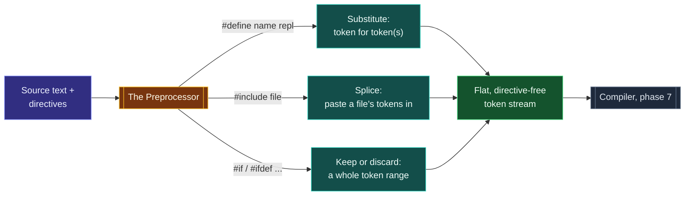
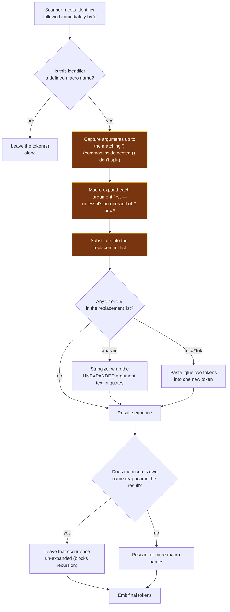

# The Preprocessor

> [!essence]
> The preprocessor is a separate, dumber pass that runs before a single rule of C++ grammar exists: it can cut, paste and substitute tokens, but it cannot see a type, a scope, or an expression. Every well-known quirk of `#define` — that a macro evaluates its argument as many times as it appears, that `assert(x)` can print the very source text of `x` it never parsed, that two unrelated macros with the same name collide across a whole program — falls out of that one restriction.

## The Problem

[[The Compilation Pipeline|The pipeline]] already fixed *where* this happens: phase 4, before phase 7 ("Compiling") applies any C++ grammar rule at all. This note asks what the tool running in that phase can actually do, and why it was built to know so little.

> [!principle] Constraint → Consequence → Requirement → Design → Price
> 1. **Constraint.** C predates `const`, `inline`, `constexpr`, templates and namespaces — and the first C++ compilers inherited its toolchain as-is. There was no language-level way to name a constant without spending real storage, to parameterize a snippet of code without paying a function call, or to compile a source range in or out depending on the target platform.
> 2. **Consequence.** Without such a facility, a programmer wanting the *same five lines* in ten places either retypes them (and they drift out of sync the first time one copy is fixed and the others aren't) or wires it through the one tool that already reads the raw file before anything else does — but only if that tool is kept simple enough to bolt onto a grammar it does not need to understand.
> 3. **Requirement.** The language needs a pass that runs strictly *before* parsing, operates on **tokens** rather than on typed expressions, and can do exactly three mechanical jobs: substitute one piece of text for another (with parameters), splice the contents of another file in verbatim, and keep or discard a whole source range based on a condition decidable from tokens alone.
> 4. **Design.** C++ keeps C's preprocessor unchanged: `#define` for text substitution (object-like and function-like macros), `#include` for file splicing, and the `#if`/`#ifdef`/`#ifndef`/`#elif`/`#endif` family for conditional compilation, all specified purely as **token** manipulation (`[cpp.replace]`) with no reference to C++'s type system or scope rules anywhere in their definition.
> 5. **Price.** Because the design in step 4 deliberately keeps the preprocessor ignorant of scope, types and evaluate-once function-call semantics, every one of macros' famous hazards is not a bug but the direct, unavoidable cost of that ignorance: an argument used twice in a macro body really is evaluated twice, a macro name really does collide with an identically spelled variable anywhere in the translation unit, and no diagnostic ever says "wrong type" — because nothing in the preprocessor has ever heard of a type.

> [!tension] abstraction ⟷ control
> Every later mechanism in this Atlas buys some safety by taking a choice away from you: scope limits what a name can collide with, the type system limits what an expression can mean, a function call guarantees each argument is evaluated exactly once. The preprocessor is what's left when you strip all three away — pure, textual control over the token stream, with none of the abstractions the rest of the language builds on top of it. That trade is exactly why `#define` still exists for jobs abstraction can't reach (conditional compilation, include guards before `import` existed) and exactly why the [[Map — Design & Idioms|C++ style guides]] tell you to reach for it last.

> [!tension] compatibility ⟷ evolution
> The preprocessor is older than C++ itself and every mainstream compiler still ships it unchanged, because decades of headers depend on `#include` splicing text exactly as it always has. [[Modules (C++20)]] is this domain's attempt to retire the parts of the job — sharing declarations, controlling visibility — that a *compiled, checkable* interface can now do better; `#define` and conditional compilation are left standing because nothing else in the language does their job at all. See [[Map — Program Structure & Build]] for the domain-wide version of this tension.

## Mental Model



> [!model] A find-and-replace pass that has never heard of C++
> A text editor's "find and replace" doesn't know that `total` is a variable, that `(a, b)` is an argument list, or that replacing one match might change what a later match means — it just matches characters and substitutes. The preprocessor is that operation, formalized: it matches macro names (not arbitrary text) and substitutes their replacement list, but it still has no notion of a declaration, a scope, or a type.
> **Where it breaks:** an editor's find-and-replace runs once. The preprocessor *rescans* its own output for more macro names to expand — with one safeguard: a macro name is never re-expanded inside its own expansion, which is the only thing standing between `#define f(a) f(a)+1` and an infinite loop (`[cpp.rescan]`).

## Step by Step

This is what happens *inside* the pipeline's "Preprocess" stage (`[[The Compilation Pipeline]]`) for a single function-like macro invocation — the finest-grained view this domain offers.



1. **Recognize.** Input: a token stream with an identifier immediately followed by `(`. Transformation: the preprocessor checks whether that identifier names a function-like macro. Output: either an ordinary token (nothing to do) or the start of an *invocation* to expand.
2. **Capture arguments.** Input: everything up to the matching `)`, treating nested `(...)` as opaque. Transformation: split on top-level commas into one argument per parameter (or one merged *variable argument* for a trailing `...`, `[cpp.replace.general]` ¶16). Output: a list of raw token sequences, one per parameter.
3. **Expand arguments, then substitute.** Input: those raw argument token sequences. Transformation: each argument is itself fully macro-expanded first — *unless* it is the operand of `#` or `##`, which see the argument's raw, unexpanded spelling instead (`[cpp.subst]`). Output: the replacement list with every parameter replaced by its (expanded or raw) argument text.
4. **Apply `#` and `##`.** Input: the substituted replacement list. Transformation: `#param` wraps the raw argument in quotes as a string literal (`[cpp.stringize]`); `left##right` deletes the `##` and glues the token before it to the token after it into one new token (`[cpp.concat]`). Output: a token sequence with no `#`/`##` left in it.
5. **Rescan, but never re-enter.** Input: the fully substituted, pasted-and-stringized token sequence. Transformation: this sequence is rescanned for more macro names, along with the rest of the file — *except* that if the macro's own name reappears anywhere inside its own expansion, that occurrence is permanently marked as ordinary text and never expanded again (`[cpp.rescan]`). Output: the finished, macro-free (or at least this-macro-free) token sequence that phase 4 hands onward.

## Under the Hood

> [!machine] `g++ -E` on a "correctly parenthesized" macro (GCC 11, this vault's toolchain)
> ```cpp
> #define MAX(a, b) ((a) > (b) ? (a) : (b))
> int y = MAX(x++, 10);
> ```
> preprocesses (`g++ -E`) to exactly:
> ```cpp
> int y = ((x++) > (10) ? (x++) : (10));
> ```
> The parentheses around `(x++)` do fix the classic operator-precedence bug — but they do nothing about the fact that the text `x++` now appears **twice** in the expanded source. `MAX` never had one evaluation site for `a`; it had every site the macro body happened to mention.

Nothing here is a compiler bug. `[cpp.replace.general]`'s own example of `#define max(a, b) ((a) > (b) ? (a) : (b))` names this in the Standard itself: the macro "has the disadvantages of evaluating one or the other of its arguments a second time (including side effects)". A real function parameter is a single object, bound once; a macro parameter is a name for *text*, and text pasted in twice runs twice. There is no vtable, no stack frame and no symbol for `MAX` in the object file at all — `nm` on the compiled binary shows nothing named `MAX`, because by the time the assembler ever sees the file, `MAX` has already been gone for three phases (`[[The Compilation Pipeline]]`).

## In Code

**1 · A macro parameter is substituted text, not a bound argument evaluated once**

```cpp
#include <iostream>

#define MAX(a, b) ((a) > (b) ? (a) : (b))   // ① parenthesized "correctly"

int main() {
    int x = 20;
    int y = MAX(x++, 10);                    // ② x++ appears twice in the expansion
    std::cout << "y=" << y << " x=" << x << '\n';
}
// expect: y=21 x=22
```
1. Wrapping every use of `a` and `b` in parentheses is the standard fix for operator-precedence surprises (see [[The Compilation Pipeline]] for the `SQUARE(2) + 3` version of that bug) — but it fixes precedence, not repetition.
2. `x++` is evaluated once inside the condition (`x` becomes 21, the compared value is 20) and, because `20 > 10` is true, a **second** time in the true-branch (`x` becomes 22, `y` is set to 21). A real function `int max(int a, int b)` would evaluate `x++` exactly once, no matter which branch its *body* takes, because binding an argument to a parameter is not the same operation as pasting text into a template.

**2 · `#` stringizes, `##` pastes — both operate on tokens the parser has not seen yet**

```cpp
#include <iostream>

#define CHECK(cond) \
    ((cond) ? void(0) \
            : void(std::cout << "CHECK failed: " #cond << '\n'))   // ① # stringizes the raw argument

#define FIELD(name) int field_##name = 0                        // ② ## builds a new identifier

int main() {
    FIELD(count);               // expands to: int field_count = 0;
    field_count = 3;
    CHECK(field_count == 3);    // condition true: silent
    CHECK(field_count == 99);   // condition false: prints the ORIGINAL source text
}
// prints: CHECK failed: field_count == 99
```
1. `#cond` turns the *unexpanded* argument's own spelling into a string literal — `CHECK` prints `"field_count == 99"` because that is the text the caller wrote, not because `CHECK` understood the comparison.
2. `field_##name` glues the token `field_` to the token `count`, producing the single new identifier `field_count` — a name that exists nowhere in the source until the preprocessor assembles it. This is exactly how the library's own `assert(expr)` reports the condition it "checked" without ever parsing it (Primer §6.5.3, p. 241): `assert` is a preprocessor macro, not a function, and `#expr` is the only reason it can print your exact source text back at you.

**3 · Variadic macros forward an arbitrary tail; `__VA_OPT__` (C++20) fixes the trailing-comma problem**

```cpp
#include <cstdio>

#define LOG(fmt, ...) std::printf("[log] " fmt "\n" __VA_OPT__(,) __VA_ARGS__)

int main() {
    LOG("startup complete");                    // ① no variadic arguments at all
    LOG("loaded %d items in %s", 3, "cache");    // ② two variadic arguments
}
// expect: [log] startup complete
// expect: [log] loaded 3 items in cache
```
1. With zero extra arguments, `__VA_OPT__(,)` vanishes and `__VA_ARGS__` contributes nothing — no dangling comma before an empty argument list, which pre-C++20 code could only avoid with a non-standard `##__VA_ARGS__` compiler extension.
2. With two extra arguments, `__VA_OPT__(,)` expands to a literal comma and `__VA_ARGS__` expands to `3, "cache"` — `LOG`'s single definition adapts to either call shape at the token level, before `std::printf`'s own (unrelated, run-time) variadic mechanism ever runs.

## Consequences

| Observed rule or failure | Explained by |
|---|---|
| A macro argument with a side effect (`x++`, a function call) can run more times than it appears to | Substitution pastes the argument's *text* everywhere the parameter name occurs in the replacement list — there is no single evaluation site to share (*Under the Hood*, *In Code* #1) |
| Two macros with the same name anywhere in a translation unit collide, even across unrelated headers | Macro names live in **one flat, program-wide namespace** with no notion of scope (`[cpp.replace.general]` ¶8) — the reason library headers reserve all-uppercase names and the reserved-name rule forbids `#define`-ing a standard library identifier |
| `assert(expr)` can print the exact text of the condition it "checked" | `#expr` stringizes the *unexpanded* argument spelling before phase 7 ever parses it as an expression (*In Code* #2; Primer §6.5.3, p. 241) |
| A header pasted into 101 translation units is reparsed 101 times, in full | `#include` is textual splicing at phase 4, not a shared compiled artifact — the domain-wide cost this note's prerequisite quantifies with `g++ -E` ([[The Compilation Pipeline]]) |
| `#define SQUARE(x) x*x` silently changes meaning depending on the caller's expression, but parenthesizing every use fixes it | Blind textual substitution has no notion of operator precedence unless parentheses supply it by hand ([[The Compilation Pipeline]]) |
| `__FILE__`, `__LINE__`-based logging reports the *call site*, and moving the call moves the report | These are **preprocessor** predefined macros, re-expanded fresh at each point they're used, not values captured once — [[Header — source_location and stacktrace|`std::source_location`]] (C++20) replaces this with a real, typed language feature (`source_location::current()`) that a default argument captures at the call site instead |
| `#ifndef GUARD_H` / `#define GUARD_H` blocks make a header safe to `#include` twice | Conditional compilation directives are resolved by the same token-level pass, before parsing — the specific idiom is [[Headers and Include Guards]]'s to develop |

## Connections

- **Prerequisites:** [[The Compilation Pipeline]] — fixes *when* (phase 4) this mechanism runs; this note fixes *what* it is allowed to do inside that phase.
- **Enables:** [[Headers and Include Guards]] (conditional compilation as an idiom) · [[Declarations vs Definitions]] (why headers exist to share the latter) · [[assert and static_assert]] (a macro and a language feature solving the same problem two ways) · [[Modules (C++20)]] (replaces the splicing half of this mechanism with a compiled interface).
- **Domain:** [[Map — Program Structure & Build]].
- **Practice:** *Continuum #6 Function Library & Header Refactor* — split a single-file program into headers and sources and add include guards by hand before reaching for `#pragma once`.

## Check Yourself

> [!quiz]- Why does parenthesizing every use of a macro parameter (`((a) > (b) ? (a) : (b))`) fix `MAX(2, 3+4)` but not `MAX(x++, 10)`?
> Parentheses only control how the *pasted text* groups with its neighbors — they stop `3+4` from being torn apart by an outer operator. They do nothing about *how many times* the text is pasted. `x++` still appears at every point the parameter name `a` occurs in the replacement list, and each pasted copy is a separate evaluation.

> [!quiz]- `assert(x == 5)` can print the literal text `"x == 5"` when the assertion fails. How, if the preprocessor doesn't understand expressions?
> `assert` is a function-like macro whose replacement list uses the `#` operator on its argument. `#` doesn't evaluate or parse the argument — it stringizes the *raw token sequence* the caller wrote, before any parser has run. The printed text is a direct copy of your source characters, not a description the library computed.

> [!quiz]- Predict: what does `#define TWICE(x) x x` followed by `TWICE(f())` expand to, and what's wrong with calling it "the function `f` runs twice, just like calling it twice by hand"?
> It expands to `f() f()` — two separate statements, or a compile error if used where only one expression is legal (e.g., inside `int r = TWICE(f());` this becomes `int r = f() f();`, which is ill-formed). Textual repetition is not equivalent to "calling it twice": there is no shared expression context, and if `TWICE` is used as a *sub-expression* rather than a full statement, the second `f()` is very often not where a reader expects a second call to be legal at all.

## Sources

- Primer §2.6.3 "Writing Our Own Header Files" (p. 76–77): the preprocessor introduced as "a program that runs before the compiler," `#define`/`#ifdef`/`#ifndef`/`#endif` and the header-guard pattern built from them.
- Primer §6.5.3 "Aids for Debugging" (p. 240–242): the `assert` preprocessor macro, `NDEBUG`, and the predefined debugging macros `__FILE__`, `__LINE__`, `__TIME__`, `__DATE__`.
- Tour §16.5 "source_location" (p. 222): `std::source_location::current()` as the C++20, type-safe replacement for `__FILE__`/`__LINE__`-based logging macros.
- cppreference, *Preprocessor* · *Replacing text macros*: confirms object-like vs. function-like macros, the `#`/`##` operators, `__VA_ARGS__`/`__VA_OPT__` (C++20), the reserved-macro-name rule, and that preprocessing runs at translation phase 4: https://en.cppreference.com/w/cpp/preprocessor · https://en.cppreference.com/w/cpp/preprocessor/replace
- Draft standard `[cpp.replace.general]` (the `max(a,b)` double-evaluation example, ¶15, is the Standard's own), `[cpp.subst]`, `[cpp.stringize]`, `[cpp.concat]`, `[cpp.rescan]`: https://eel.is/c++draft/cpp.replace
- See [[The Compilation Pipeline]] for the `g++ -E` header-expansion measurement and the `SQUARE(2) + 3` precedence pitfall this note builds on rather than repeats.
