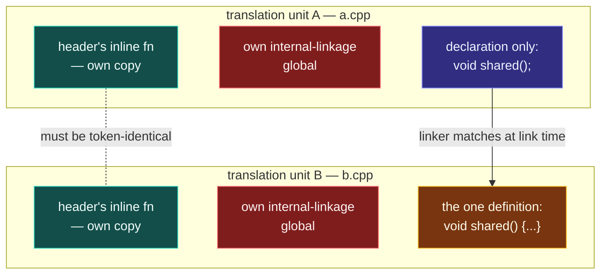

# Translation Units

> [!essence]
> A translation unit is not a source file. It is the flat sequence of declarations a compiler actually type-checks — one primary source file plus every header it pulls in through `#include`, after every macro is gone. A C++ program is nothing more than a set of these units, compiled in total isolation from one another, so almost every rule about sharing a name across files exists only to patch up what that isolation throws away.

## The Problem

[[The Compilation Pipeline]] names the four tools that turn text into an executable. This note is about the one artifact those tools hand each other for most of the trip — and about exactly what a compiler can and cannot know about a name once all it is looking at is that artifact.

> [!principle] Constraint → Consequence → Requirement → Design → Price
> 1. **Constraint.** Phase 4 of translation turns one primary source file — plus every file it `#include`s, each itself recursively run through phases 1–4 — into one flat sequence of tokens before a single C++ grammar rule ever applies. A **translation unit**, precisely, "consists of a sequence of declarations" (`[basic.link]` ¶1). By the time phase 7 starts, the compiler holds exactly one such sequence: it does not know, and does not need to know, which physical file any given token arrived from.
> 2. **Consequence.** Two `.cpp` files that both `#include` the same header do not thereby share one instance of anything that header declares. Each file's phase 4 pastes in its own private copy of the header's text; if that text carries a body — an inline function, a class, a template — the identical source now exists as a *separately compiled* entity in every translation unit that pulled it in. Meanwhile, a name used but never defined in this file must still type-check, purely on the promise that some other translation unit — one this compiler pass may never see — supplies the body.
> 3. **Requirement.** For units built this independently to add up to one coherent program, the language needs a way to say that a name in one unit is the very same entity as a name in another (so the promise above can be kept), and just as importantly, a way to say the opposite: that a name is private to its own unit, and an identically spelled name elsewhere names something else entirely. It also needs a rule for when two independently pasted copies of one definition are allowed to coexist rather than collide.
> 4. **Design.** **Linkage** decides which of the two a name gets. A name with *external* linkage is available for the first job — some other translation unit may declare it and mean the same entity. A name with *internal* linkage gets the opposite guarantee: "all declarations of an entity with a name with internal linkage appear in the same translation unit" (`[basic.link]` ¶2, Note 1). The **One Definition Rule** then governs what "the same entity" is allowed to look like across units: a used, external, non-inline function or variable gets exactly one definition in the *entire program*; an inline function, inline variable (C++17), class type, or template may have one definition *per translation unit that uses it* — but only if every copy is the same sequence of tokens and every name inside it resolves to the same entity everywhere (`[basic.def.odr]`; cppreference, *Definitions and ODR*).
> 5. **Price.** "Token-for-token identical" is not something any compiler pass checks across files — no single compilation ever holds two translation units at once to compare them. A header that expands differently depending on which macros happen to be defined before it is included, or an inline function whose body quietly depends on something with internal linkage, satisfies the letter of "pasted the same text" while violating the rule that actually matters — name lookup finding the same entity — and the result is undefined behavior that nothing in the toolchain is obliged to report. *Under the Hood* shows exactly what that looks like.

> [!tension] safety ⟷ performance
> Compiling each translation unit in total isolation is what makes separate compilation possible at all: change one `.cpp`, recompile only that one, relink. Incremental builds, parallel compilation, and shipping a library as pre-built object code all depend on no translation unit ever needing to see another's internals. The price is that the one property that spans every translation unit — that a name shared between them really does mean the same thing everywhere — is exactly the property no single compilation pass can check. C++ buys build-time scalability by making whole-program consistency a promise the programmer keeps, not one the compiler verifies.

## Mental Model



> [!model] Two islands, one shared customs desk
> Each translation unit is an island: nothing on it was ever inspected by, or even visible to, the compiler pass over the other island. A name with **external linkage** is a passport — it can be presented on either island and, at the customs desk (the linker), matched to the one place that actually issued it. A name with **internal linkage** is a local resident's ID card: valid only on the island that issued it. If the other island happens to print an identically worded card, customs never notices, because it was never asked to compare local IDs — only passports.
> **Where it breaks:** a real customs desk never lets a passport in without checking it belongs to a real, matching person. The linker's check is thinner than that. For the inline/class/template exception it does not compare bodies for genuine equality at all — it just keeps one copy (see [[Name Mangling and extern C]] for how it even recognizes "the same" name) and trusts that whoever wrote both copies was telling the truth.

## Mechanics

| Situation | Rule | Example |
|---|---|---|
| Name has external linkage, is a **non-inline** function or variable, and is used | Exactly one definition is required across the **entire program** — never zero, never two | `int scale(int);` declared in a shared header, defined in exactly one `.cpp` |
| Name has **internal linkage** (`static` at namespace scope, non-`extern` `const`, or a member of an unnamed namespace) | Every translation unit that declares it gets its **own, separate entity** — not a shared copy of one thing | `namespace { int cache; }` pasted into 3 TUs = 3 independent `cache` objects |
| **inline** function or inline variable (C++17) | May be defined in every translation unit that uses it, provided every definition is the same token sequence and every name inside resolves the same way | a member function defined inline, inside a class body, in a header |
| class type / template / templated entity | Same multiple-definitions exception as inline: one definition per translation unit, all token-identical | a class defined in a header and `#include`d everywhere it's used |

> [!standard] What "the same definition" legally means
> Per the One Definition Rule (`[basic.def.odr]`), a class type, template, inline function, or inline variable may have more than one definition in a program only if every definition sits in a *different* translation unit, every definition consists of the *same sequence of tokens*, and name lookup from inside each definition finds the *same entities* after overload resolution. Fail any one of those three and the "copies" are not legally the same entity — even when they look identical on the page (cppreference, *Definitions and ODR*).

## Under the Hood

> [!machine] An "own copy per translation unit" that quietly isn't (GCC 11, this vault's toolchain)
> `counter.hpp` hides a namespace-scope variable with internal linkage inside an `inline` function:
> ```cpp
> namespace { int call_count = 0; }                 // internal linkage
> inline int bump_and_report() { return ++call_count; }
> ```
> `a.cpp` and `b.cpp` both `#include` it and both call `bump_and_report()`. By the *Mechanics* table, `call_count` is a *different entity* in each translation unit — but `bump_and_report` is external and inline, and the ODR only permits that if its two copies name the *same* entities. They don't: A's copy names A's `call_count`; B's copy names B's. Compiling each file separately and linking them anyway, then calling `bump_and_report()` twice from `b.cpp`'s `main` and once from a helper in `a.cpp`, prints:
> ```text
> b.cpp sees call_count = 1
> a.cpp sees call_count = 2
> b.cpp sees call_count = 3
> ```
> One shared counter — not the two independent, each-starting-at-0 counters the *Mechanics* table would suggest. `nm` explains why: `bump_and_report` is emitted as a **weak** symbol (`W`) in *both* object files, so the linker's COMDAT folding keeps only one of the two "identical-looking" definitions and routes every call, from either file, to it. Whichever copy survives, its body's `call_count` is the one object that copy happens to reference. Nothing here is a documented tie-breaker: a different compiler, optimization level, or link order is free to keep the other copy instead, and since the underlying condition genuinely is undefined behavior, is free to do something stranger still. Neither AddressSanitizer nor UndefinedBehaviorSanitizer targets this class of bug — both instrument single-translation-unit checks, and this defect only exists once the linker has merged two.

## In Code

**1 · Declared many times, defined once**

```cpp
#include <iostream>

void greet();          // ①
void greet();          // ②

void greet() {          // ③
    std::cout << "hello\n";
}

int main() { greet(); }
// expect: hello
```
1. A declaration promises only `greet`'s type; the compiler accepts as many repeated declarations as you write.
2. Two declarations of the same entity must agree with each other, but neither one creates a body or storage — this is exactly why a header can be `#include`d into many translation units without duplicating anything *yet*.
3. This is the one line that creates the entity. A second line just like it, in this same translation unit, would be a plain redefinition error; a second line like it in some *other* translation unit is the case the One Definition Rule exists to govern.

**2 · Internal linkage is still one entity — within a single translation unit**

```cpp
#include <iostream>

static int counter = 0;   // ① internal linkage, but ONE entity here

int bump() { return ++counter; }

int main() {
    std::cout << bump() << bump() << bump() << '\n';
}
// expect: 123
```
1. `static` at namespace scope gives `counter` internal linkage: no *other* translation unit may name it. Within *this* translation unit, though, it is exactly one object — three calls, three increments of the same storage. Contrast this with what happens once a second translation unit includes the same source text, in *Under the Hood*.

**3 · One declaration, one definition, split by role**

```cpp
#include <iostream>

extern int shared_total;     // ① "this exists somewhere, type int"
int shared_total = 41;       // ② the one definition, external linkage by default

int main() {
    std::cout << ++shared_total << '\n';
}
// expect: 42
```
1. In a real multi-file build, this line is what a shared header would carry into *every* translation unit that needs `shared_total`.
2. This line is what exactly *one* `.cpp` file provides. The Standard requires precisely one such definition to exist across the whole program for a used, external, non-inline variable. Compiled here as a single translation unit, both lines simply agree they name the same entity — legal within one unit, and mandatory across many.

## Pitfalls

> [!ub] An inline function that quietly isn't ODR-safe
> The One Definition Rule allows one definition per translation unit for an inline function only if every copy resolves every name inside it the same way. A body that touches anything with internal linkage — a namespace-scope `static`, an unnamed-namespace member, a non-`extern` `const` — breaks that guarantee the moment the function is used from a second translation unit. *Under the Hood* shows what that produces in practice; no diagnostic is required, and GCC gave none here.

> [!trap] `#include` does not create shared state
> Pasting the same header into two `.cpp` files does not mean those files see a shared copy of anything the header declares — unless that name has external linkage and exactly one translation unit supplies its definition. A namespace-scope `static` or non-`extern` `const` in a header is silently *duplicated*, one private instance per translation unit that includes it. The resulting bug rarely looks like an ODR violation; it looks like "my cache resets" or "my counter is wrong," because each translation unit's copy really is a separate, correctly-behaving object — just not the *only* one.

## Evolution

See [[Map — Evolution of C++]] for the language-wide timeline this fits into.

| Standard | Change | Why |
|---|---|---|
| C / C++98 | The translation-unit model and the One Definition Rule are inherited wholesale from C; `static` at namespace scope is the only way to give an ordinary name internal linkage | Separate compilation predates C++; the new language needed the same file-level isolation C already had |
| C++98 | Unnamed namespaces added as the general-purpose way to get internal linkage, superseding "file static" for anything beyond plain data (Primer, "Defined Terms," p. 817, s.v. *file static*) | `static` at namespace scope does not extend to types; unnamed namespaces do |
| C++11 | `extern template` lets a translation unit suppress its own implicit instantiation of a template, trusting another unit to supply it | Otherwise every translation unit using a template would redundantly re-instantiate it |
| C++17 | Inline variables (P0386) extend the "one definition per translation unit, all identical" exception from functions to variables | Header-only libraries needed a way to define a variable, not just a function, without a companion `.cpp` |
| C++20 | Modules give an interface a single compiled representation, imported rather than re-parsed as text into every translation unit that needs it | The domain's own answer to the tension this note names — see [[Map — Program Structure & Build]] |

## Connections

- **Prerequisites:** [[The Compilation Pipeline]] — names the pipeline stage (phase 4) that produces the artifact this note is about.
- **Enables:** [[Declarations vs Definitions]] (the two things a translation unit's declaration sequence is built from) · [[The Preprocessor]] (how a header's text actually gets pasted in) · [[Linkage — Internal, External, None]] (the mechanism this note leans on throughout) · [[The One Definition Rule]] (its full statement and exceptions) · [[Namespaces]].
- **Siblings:** [[Modules (C++20)]] — the domain's own rewrite of "share an interface across translation units."
- **Domain:** [[Map — Program Structure & Build]].
- **Practice:** *Continuum #1 Hello, Compiler* — preprocess, compile and link one file by hand before letting the driver hide the stages. *Continuum #6 Function Library & Header Refactor*: split working code across a header and several `.cpp` files, and check which names genuinely need external linkage and which are quietly getting duplicated.

## Check Yourself

> [!quiz]- What, precisely, is a C++ program made of, according to `[basic.link]`?
> One or more translation units, each translated separately and then linked together. Nothing requires a program to be one file, or even to have been written entirely by one person at one time.

> [!quiz]- What exactly does phase 4 of translation hand to phase 7, and what has been removed from it by then?
> The translation unit: one flat token sequence combining the primary source file and everything it `#include`d, recursively. Every `#include` directive and every macro is gone by this point — phase 7's grammar never sees either.

> [!quiz]- Why can two translation units both include a header defining `static int cache;` without triggering a linker error, yet still end up with data that isn't shared?
> Because namespace-scope `static` gives `cache` internal linkage, and `[basic.link]` says all declarations of an internal-linkage name in different translation units name *different* entities — not the same object pasted twice. There is no linker error because there is nothing to reconcile: neither translation unit ever claimed its `cache` was the same object as the other's.

> [!quiz]- In the `counter.hpp` scenario from *Under the Hood*, was a shared counter actually promised by the language?
> No — the opposite. The inline function's body names an internal-linkage variable, so its per-translation-unit copies fail the "same entities" clause of the One Definition Rule. The observed single shared counter is one undefined-behavior-flavored outcome among several a different compiler or link order could have produced just as legally.

## Sources

- Tour §3.2 "Separate Compilation" (p. 32): defines a translation unit as a `.cpp` file compiled on its own, together with whatever headers it pulls in through `#include`, and notes that a real program can run to thousands of such units.
- PPP §4.4 "Link-time errors": a program as several separately compiled parts, and the declare-consistently / define-once obligation that spans them, worked through from a beginner's first link error.
- Primer, "Defined Terms" (p. 817), s.v. *file static*: the pre-Standard, single-translation-unit idiom that unnamed namespaces superseded.
- cppreference, *Phases of translation*, §"Phase 4: Preprocessing" and §"Phase 7: Compiling": https://en.cppreference.com/w/cpp/language/translation_phases
- cppreference, *Definitions and ODR (One Definition Rule)*: https://en.cppreference.com/w/cpp/language/definition
- Draft standard `[basic.link]` ¶1–2 and Note 1 (program and translation unit defined; internal-linkage entities confined to one translation unit): https://eel.is/c++draft/basic.link
- Draft standard `[basic.def.odr]` (the multiple-definitions exception for inline functions, inline variables, class types and templates): https://eel.is/c++draft/basic.def.odr
- See [[Guide — cppreference, the Draft Standard and the Core Guidelines]] for how to navigate these directly.
