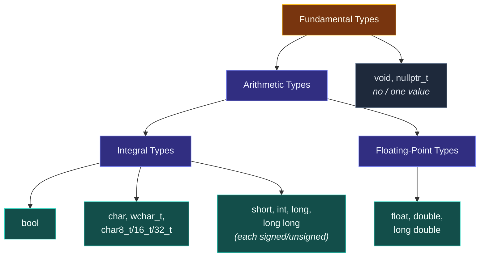

# Fundamental Types

> [!essence]
> The fundamental types are the vocabulary C++ supplies without a single class declaration: `bool`, a family of character types, a family of integer types, a family of floating-point types, and `void`. Each fills in [[What a Type Is|the values/operations/representation triple]] by language definition rather than by programmer declaration, sized to whatever the target hardware does in one instruction — with the Standard fixing only a *lower bound* on that size, never an exact one.

## The Problem

Writing even the simplest class — a loop counter, a flag, a single character — already needs some vocabulary to build with. That vocabulary can't itself be a class, or the language could never get off the ground: a `class`'s constructors and member functions have to be written *in* something.

> [!principle] Constraint → Consequence → Requirement → Design → Price
> 1. **Constraint:** Hardware exposes a fixed menu of operations — add, compare, move a fixed number of bits — over registers of a handful of standard widths. A programmer's *first* type declaration has to be written using something already understood, on both sides of that gap.
> 2. **Consequence:** If truth values, characters and small integers were themselves ordinary library classes, defining the very first one would need the tools (conditionals, loops, comparisons) that only exist once some type is already usable. The bootstrap has no floor to stand on.
> 3. **Requirement:** The language itself — not any programmer, not even the standard library — must supply a minimal, closed set of types that name the hardware's basic operations directly, cheaply enough that using one costs no more than the single instruction it maps to.
> 4. **Design:** C++ defines the **fundamental types**: the *arithmetic types* — **integral types** (`bool`, the character types, the integer types) and the **floating-point types** — plus `void` and `std::nullptr_t` (`[basic.fundamental]`). Primer §2.1 groups them the same way: characters, booleans, and integers on one side, floating-point on the other.
> 5. **Price:** Each type is free to map onto whatever the target hardware does in one instruction, and hardware differs. So the Standard can fix only a *minimum* width for each type, never an exact one, and leaves the exact width, and even the signedness of plain `char`, implementation-defined. A program that assumes `int` is exactly 4 bytes is trusting a guarantee the language never made.

> [!tension] abstraction ⟷ control
> A fundamental type is not a convenience layered on top of the hardware — it *is* the hardware's own vocabulary, given a name. That directness is why `int + int` costs one instruction: there is no abstraction to pay for, because there is no abstraction, only a label on an operation the CPU already had. [[Map — What C++ Is|Zero overhead]] starts here, at the very bottom of the type system.

> [!tension] compatibility ⟷ evolution
> The zoo is this shape because C++ inherited it from C, warts included: `char`'s signedness has always been implementation-defined, and `bool` did not exist as a distinct type until **C++98** — C used a plain `int` convention for truth values, and still does. Every later fix (`char16_t`, `char8_t`, mandatory two's complement) had to arrive as an addition beside the old rules, never a replacement of them.

## Mental Model



> [!model] A pre-built socket set, sized only "at least this big"
> A fundamental type is a socket the language hands you, already shaped to fit one of the hardware's own operations — you don't forge your own wrench to add two numbers.
> **Where it breaks:** a real socket set is exact — a 10 mm socket is 10 mm everywhere. C++'s sockets aren't: the Standard promises only that `int` is *at least* 16 bits, that `long` is *at least* as wide as `int`, and so on. Two conforming compilers can hand you differently sized sockets for the same name, and both are right.

## Mechanics

> [!standard] What `[basic.fundamental]` actually fixes
> The **integral types** are `bool`, the character types (`char`, `wchar_t`, `char8_t`, `char16_t`, `char32_t`), and the signed/unsigned integer type families; together with the **floating-point types** (`float`, `double`, `long double`) they form the **arithmetic types**. `bool`'s object and value representation matches some implementation-defined *unsigned* integer type, but the Standard is explicit that there is no signed, unsigned, short, or long `bool` — it is one type, not a family. Plain `char` is a distinct type from both `signed char` and `unsigned char`, with an implementation-defined choice of one of them as its underlying representation.

| Category | Members | Minimum width (bits) | Note |
|---|---|---|---|
| Boolean | `bool` | not width-specified | Represented as some unsigned integer type; only ever `true`/`false` |
| Ordinary character | `char`, `signed char`, `unsigned char` | 8 | Three *distinct* types; plain `char`'s signedness is implementation-defined |
| Extended character | `wchar_t`, `char8_t`, `char16_t`, `char32_t` | 8 / 16 / 32 (per type) | For wide and Unicode text; each is its own type, not an alias |
| Integer | `short`, `int`, `long`, `long long` (each with an `unsigned` twin) | 16 / 16 / 32 / 64 | Each guaranteed at least as wide as the one before it |
| Floating-point | `float`, `double`, `long double` | not width-specified | Only a minimum number of significant digits is guaranteed; `double` ≥ `float`, `long double` ≥ `double` |

**Choosing among them** — a distilled version of Primer's own advice, restated as situations:

| Situation | Rule | Why |
|---|---|---|
| Need any width-agnostic integer | Use `int`; reach for `long`/`long long` only once you know the values need more than the guaranteed minimum | `int` is the type every other integral type promotes toward — see [[Implicit Conversions and Promotions]] |
| Need a specific width on every platform | Use a `<cstdint>` alias (`std::int32_t`, `std::uint8_t`) instead of a bare fundamental type | Only these names carry an exact-width guarantee; `int` never does |
| Need a tiny numeric byte, not text | Spell it `signed char` or `unsigned char` explicitly | Plain `char`'s signedness varies by platform — see Pitfalls |
| Need a value used only for branching | Use `bool`, and never feed it to arithmetic operators | `bool` has no arithmetic operations of its own — see Pitfalls |

**The ordering guarantee is what actually holds, not the sizes.** `sizeof(char) ≤ sizeof(short) ≤ sizeof(int) ≤ sizeof(long) ≤ sizeof(long long)` is guaranteed; a compiler is free to make several of them the same width (many make `int` and `long` both 32 bits), but never to make one narrower than the type before it.

## Under the Hood

> [!machine] Width picks the register; promotion can override the operand's own type
> Five one-line functions, each just `return a + b`, compiled with GCC 11, `-O2`, x86-64:
> ```nasm
> add_int(int, int):              ; int + int
>     lea eax, [rdi+rsi]          ; 32-bit general-purpose register
>     ret
> add_ll(long long, long long):   ; long long + long long
>     lea rax, [rdi+rsi]          ; 64-bit general-purpose register
>     ret
> add_dbl(double, double):        ; double + double
>     addsd xmm0, xmm1            ; a completely different unit: SSE scalar-double
>     ret
> add_char(char, char):           ; char + char
>     lea eax, [rsi+rdi]          ; STILL a 32-bit register, not 8-bit
>     ret
> widen(char c) -> int32_t:       ; return c;
>     movsx eax, dil              ; sign-extend the 8-bit argument into eax
>     ret
> ```
> `add_int` and `add_ll` pick registers sized exactly to the type. `add_dbl` doesn't even use the same kind of register — floating-point arithmetic lives in the SSE unit, not the general-purpose one. `add_char` is the interesting case: nothing narrower than 32 bits ever appears. Adding two `char`s promotes both operands to `int` first ([[Implicit Conversions and Promotions|integral promotion]]), so the CPU adds two 32-bit values and the compiler truncates the result back to a `char` implicitly on return — the "byte-sized" type never touches an 8-bit arithmetic instruction. `widen` shows the same promotion from the other side: `movsx` sign-extends the incoming `char` into a full register, because this machine's `char` is signed.

## In Code

**1 · The guarantee is a lower bound; the platform picks the actual size**

```cpp
#include <cstdint>
#include <climits>
#include <iostream>

int main() {
    static_assert(sizeof(char) == 1);                                   // ①
    static_assert(sizeof(short)     * CHAR_BIT >= 16);                  // ②
    static_assert(sizeof(int)       * CHAR_BIT >= 16);
    static_assert(sizeof(long)      * CHAR_BIT >= 32);
    static_assert(sizeof(long long) * CHAR_BIT >= 64);
    static_assert(sizeof(char) <= sizeof(short) && sizeof(short) <= sizeof(int)
               && sizeof(int) <= sizeof(long) && sizeof(long) <= sizeof(long long));  // ③

    std::cout << sizeof(int) * CHAR_BIT << " bits\n";                   // ④
    static_assert(sizeof(std::int32_t) * CHAR_BIT == 32);               // ⑤
}
// expect: 32 bits
```
1. The one size the Standard fixes exactly: a `char` is always one byte, because `CHAR_BIT` and `sizeof` are defined in terms of it.
2. `CHAR_BIT` (from `<climits>`, almost always `8`) turns a byte count into a bit count, so the check reads directly against the Standard's own wording — a minimum, not an exact value.
3. The relative ordering is guaranteed even where the widths are not: a compiler may make several of these types the same width, but never narrower than the type before it in the list.
4. On this machine `int` happens to be 32 bits. Nothing in the language promised that — only that it is at least 16.
5. `std::int32_t` (`<cstdint>`) is the escape from "at least": it names a type that is *exactly* 32 bits, or doesn't exist on a platform that can't provide one.

**2 · The operation set differs by category — `%` is integral-only**

**✓ Defined: `%` between two integers**
```cpp
#include <iostream>

int main() {
    int a = 17, b = 5;
    std::cout << a % b << '\n';   // ①
}
// expect: 2
```
1. `%` is declared only for integral operands; it yields the remainder of integer division.

**✗ Ill-formed: `%` between two `double`s**
```cpp
// cc: ill-formed
int main() {
    double x = 17.0, y = 5.0;
    double z = x % y;   // error: no match for 'operator%'
}
```
Both operands are numbers, and the hardware could compute a remainder either way — but `double`'s *declared* operation set never included `%`. The type refuses the operation regardless of what the representation would allow, exactly as in [[What a Type Is]]'s `Meters` example.

**3 · `char`, `signed char` and `unsigned char` are three distinct types, not two**

```cpp
#include <type_traits>
#include <limits>
#include <iostream>

int main() {
    static_assert(!std::is_same_v<char, signed char>);      // ①
    static_assert(!std::is_same_v<char, unsigned char>);
    std::cout << std::boolalpha
              << std::numeric_limits<char>::is_signed << '\n';   // ②
}
// prints: true (implementation-defined — this compiler's plain `char` behaves as signed)
```
1. `char` is a type of its own, even though its representation *coincides* with one of the other two — the Standard states plainly that it has "an implementation-defined choice of `signed char` or `unsigned char` as its underlying type," not that it *is* one of them.
2. Which one it coincides with is implementation-defined, so this line's result varies by platform — it is documented behavior, not a language guarantee, which is exactly why plain `char` is unsafe for arithmetic (see Pitfalls).

## Pitfalls

> [!trap] `bool` has no arithmetic of its own — it borrows `int`'s
> Unary `-` isn't declared for `bool`. The operand is promoted to `int` first (`true` → `1`), negated (`-1`), then converted back to `bool` on assignment — and *any* nonzero value converts to `true`. Negating "true" produces "true" again, which is exactly why Primer's advice is to use `bool` only for truth values and never feed it to arithmetic operators (§2.1.1, p. 34).

```cpp
#include <iostream>

int main() {
    bool b = true;
    bool b2 = -b;                                 // ①
    std::cout << std::boolalpha << b2 << '\n';
}
// expect: true
```
1. `-b` promotes `b` to `int` (`1`), negates it (`-1`), then converts back to `bool` on assignment to `b2` — nonzero converts to `true`, so negating "true" produces "true" again.

> [!trap] Plain `char` is not "a small signed integer" or "a small unsigned integer" — it's whichever the compiler picked
> Two compilers, or the same compiler on two platforms, may give `char` opposite signedness, so a computation that overflows, compares, or sign-extends a plain `char` can silently produce different results on different machines. If you need a byte-sized number rather than text, name `signed char` or `unsigned char` explicitly — never plain `char`. See [[Characters, Encodings and the char Types]] for the full hazard, including why this matters most at the boundary with `<cctype>` functions.

> [!ub] Assigning an out-of-range value behaves differently for signed and unsigned types
> An out-of-range value assigned to an **unsigned** type wraps by taking the value modulo 2^N — well-defined, if occasionally surprising. The same assignment to a **signed** type is undefined behavior: the Standard imposes no requirement on the result at all (Primer p. 35). This is the entry point to [[Signed Integer Overflow]] and to [[Mixing Signed and Unsigned]], both of which this note only opens the door to.

## Evolution

See [[Map — Evolution of C++]] for the language-wide timeline.

| Standard | Change | Why |
|---|---|---|
| C / pre-C++ | No dedicated boolean type; a plain `int` convention (0 = false, nonzero = true) stands in for it | C's type system never separated "a truth value" from "a small integer" |
| **C++98** | `bool` becomes its own fundamental type, with `true`/`false` as keywords | Overload resolution and the type system needed a truth value that wasn't just an `int` in disguise |
| C++11 | `char16_t`, `char32_t` added for fixed-width Unicode code units; `<cstdint>` standardizes exact- and least-width integer aliases (`std::int32_t`, `std::uint_least16_t`, …) | The platform-varying zoo needed a portable escape hatch that didn't require hand-`typedef`ing `int` per compiler |
| **C++20** | `char8_t` added for UTF-8 code units (P0482R6); two's complement mandated as the *only* legal signed-integer representation (P0907R4) | Portable UTF-8 handling, and one fewer implementation-defined choice — see [[Integer Representation and Two's Complement]] |
| C++23 | `<stdfloat>` adds optional exact-width floating-point aliases `std::float32_t`, `std::float64_t`, … (P1467R9) | Extends the `int32_t` idea to floating-point — still conditional on hardware support, unlike the integer aliases |

## Connections

- **Prerequisites:** [[What a Type Is]] — the values/operations/representation triple this note fills in with the language's own built-in vocabulary.
- **Enables:** [[Integer Representation and Two's Complement]] (the real-machine picture behind every integer type here) · [[Implicit Conversions and Promotions]] (how the compiler moves values between this zoo's members) · [[Floating-Point Representation (IEEE 754)]] (the real-machine picture behind `float`/`double`) · [[sizeof, alignof and Alignment]] (what each type costs in bytes and placement).
- **Siblings:** [[Classes as User-Defined Types]] — a user-defined type builds the identical triple by declaration; a fundamental type gets it from the language definition instead. Same shape, different author.
- **Hazards:** [[Signed Integer Overflow]] · [[Mixing Signed and Unsigned]] · [[Characters, Encodings and the char Types]].
- **Domain:** [[Map — Types & Values]].
- **Practice:** *Continuum #2 Unit & Temperature Converter Suite*: choosing `int`, `double`, or a fixed-width alias for a measurement, and watching where an implicit conversion between them quietly changes a value.

## Check Yourself

> [!quiz]- What does the Standard actually guarantee about `int`, and what does it leave open?
> Only that `int` is at least 16 bits wide and at least as wide as `short`. The exact width — 16, 32, or anything else at least that large — is left implementation-defined; on almost every mainstream platform today it happens to be 32.

> [!quiz]- Why can't `bool`, `char`, and `int` be ordinary classes defined in the standard library instead of being built into the language?
> Because writing *any* class at all already requires a vocabulary to build it with — conditionals, loop counters, small integers. If those had to be defined as classes first, there would be nothing left to write the first class in. The language has to supply a starting vocabulary that doesn't itself depend on a class declaration.

> [!quiz]- Predict: `bool ok = true; bool bad = -ok; std::cout << std::boolalpha << bad;` — what prints, and why?
> `true`. Unary `-` isn't defined for `bool`, so `ok` is promoted to `int` (`1`), negated to `-1`, then converted back to `bool` on assignment to `bad` — and any nonzero value converts to `true`.

> [!quiz]- `static_assert(sizeof(long) == 8);` compiles on this machine. Does that mean it would compile on every fully conforming C++ compiler?
> No. The Standard only guarantees `long` is at least 32 bits and at least as wide as `int`; it never promises 64. Windows' mainstream ABI (LLP64), for instance, keeps `long` at 32 bits even on a 64-bit platform, while Linux's (LP64) makes it 64 — both are fully conforming.

## Sources

- Primer §2.1.1 "Primitive Built-in Types" (p. 32): arithmetic types split into integral and floating-point, and Table 2.1's minimum-size guarantees. (p. 33): byte/word representation, and floating types' minimum significant-digit guarantees. (p. 34): the signed/unsigned split, the three distinct character types, and the guaranteed ±127 range of an 8-bit `signed char`. (p. 35): out-of-range assignment — modulo wraparound for unsigned, undefined behavior for signed.
- Primer §4.2 "Arithmetic Operators" (p. 140): unary `-` promotes `bool` to `int` before negating, so `-b` on `true` converts back to `true`.
- Tour §1.4 "Types, Variables, and Arithmetic" (p. 6): the "small zoo" of fundamental types and their examples; implementation-defined sizes obtained via `sizeof`; fixed-width aliases via §17.8.
- PPP §8.1 "User-defined types": a built-in type is one whose representation and legal operations the compiler already knows, without any programmer declaration — the contrast this note draws between the language's vocabulary and a programmer's own.
- cppreference, *Fundamental types*: https://en.cppreference.com/w/cpp/language/types
- Draft standard `[basic.fundamental]` — the integral/floating-point/arithmetic taxonomy, Table 14's minimum-width guarantees, and the exact wording on `char`'s and `bool`'s underlying representation: https://eel.is/c++draft/basic.fundamental
- WG21 P0482R6, *char8_t: A type for UTF-8 characters and strings*: https://wg21.link/p0482r6
- WG21 P1467R9, *Extended floating-point types and standard names*: https://wg21.link/p1467r9
- WG21 P0907R4, *Signed Integers are Two's Complement*: https://wg21.link/p0907r4
