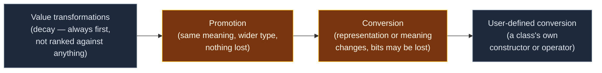
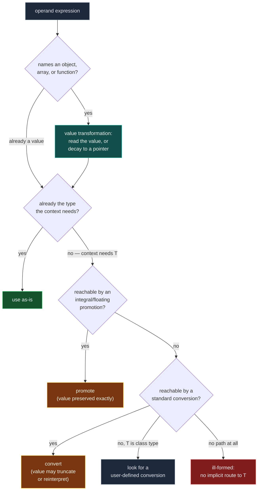

# Implicit Conversions and Promotions

> [!essence]
> An expression's operands rarely arrive in the exact type a context needs, so the compiler inserts a conversion without being asked. Two kinds exist: a **promotion** widens a value into a larger type of the same kind without changing what it means (`char` → `int`, `float` → `double`); a **conversion** changes the representation or the meaning itself, and may throw bits away (`double` → `int`, `int` → `bool`). Both are silent, both fire at fixed points — initialization, assignment, argument passing, operator operands, controlling expressions — and neither asks permission.

## The Problem

A single line like `int total = count + 3.5;` mixes an `int`, a `double` literal, and an `int` target, yet C++ has no built-in instruction that adds an integer to a floating-point number, or that stores a `double` into four bytes reserved for an `int`. Something has to bridge the gap before any of this can run, and the language never asks the programmer to write that bridge by hand.

> [!principle] Constraint → Consequence → Design
> 1. **Constraint:** C++ is statically typed and has a small, fixed catalog of fundamental types, but expressions routinely combine them — arithmetic on mixed operands, a `short` passed where a function takes `int`, a pointer tested where a `bool` is expected. The hardware itself only computes at a handful of register widths (8/16/32/64-bit integer, 32/64-bit float), not at the width of every declared type.
> 2. **Consequence:** If every mismatch were a compile error, ordinary arithmetic would be unusable — you could not add a `char` to an `int` without writing a cast at every site. If the compiler resolved mismatches ad hoc, the same expression could mean different things on different compilers.
> 3. **Requirement:** The language needs one deterministic, compile-time-only rule set that bridges related types automatically, prefers rules that lose nothing when one exists, costs nothing extra at run time beyond the instructions the target type demands anyway, and gives overload resolution an unambiguous way to rank "how far" an argument had to travel.
> 4. **Design:** The Standard defines a fixed catalog of **standard conversions** — value transformations (reading a variable, array/function decay), *promotions* (same meaning, wider type), and *conversions proper* (representation or meaning changes) — and wires each one to specific syntactic contexts: initialization, assignment, function-argument passing, function return, the operands of most operators, and any controlling expression that must become `bool`.
> 5. **Price:** Because the bridge is implicit, it can discard information without comment — a `double` truncates into an `int` the same way a deliberate cast would, with no diagnostic from `=`. `explicit`, `{}`-initialization, and compiler warnings exist specifically to let you opt back out of a convenience the language grants by default.

> [!tension] compatibility ⟷ evolution
> Implicit conversions are one of the Charter's own canonical examples of this tension ([[Charter]] §3.2). C inherited a permissive conversion graph — any arithmetic type reaches any other with no cast — and C++ kept nearly all of it so that C code and C habits would keep compiling. `{}`-initialization ([[Narrowing Conversions and Brace Initialization]]) is the one place C++ later added a check the older `=` syntax still refuses to perform, because changing what `=` does would break every existing program that relies on silent truncation.

## Mental Model

> [!model] A universal adapter plug, not a translator
> Plug a device into a differently shaped socket and an adapter bridges the *shape* without asking the device or the socket anything about meaning. A **promotion** is the adapter that only changes shape: `char` → `int` keeps the exact numeric value, just stored in a wider slot, the way a round-pin plug sits in a wider shell with nothing lost. A **conversion** is the adapter that can also change the *voltage*: the bits a `double` becomes when forced into an `int` represent a different reading, not the same value in a bigger box. **Where it breaks:** a real adapter refuses to connect a device to a voltage that would damage it. C++'s implicit conversions connect by default and let the loss happen without comment — `{}`-initialization is the one socket shaped to reject the dangerous adapters ([[Narrowing Conversions and Brace Initialization]]).



## Step by Step



1. **Value transformations run first, unconditionally.** An lvalue that names a variable is read into a value (*lvalue-to-rvalue conversion*); an array used where a pointer is expected decays to a pointer to its first element; a function name decays to a pointer to that function. These are not ranked against promotions or conversions — they happen whenever the expression's form requires them, before any type-matching question is even asked (Primer §4.11.2, p. 161).
2. **Integral and floating-point promotions try first.** `bool`, `char`, `signed char`, `unsigned char`, `short`, and `unsigned short` promote to `int` if `int` can represent every value of the source type, otherwise to `unsigned int`; `float` promotes to `double` with no change in value (cppreference, *Implicit conversions* → *Integral promotion*; draft `[conv.prom]`). A promotion never changes what the value *means* — it only moves it to a type wide enough to compute in without special-casing the narrower type.
3. **Conversions fire when no promotion reaches the target.** Integral conversions (any integer type to any other), floating–integral conversions, floating-point conversions between `float`/`double`/`long double`, the boolean conversion (any nonzero scalar becomes `true`, zero becomes `false`), and pointer/qualification conversions all live here. Unlike a promotion, a conversion can change the value: `double` → `int` truncates toward zero, and an integer too large for a narrower integer type wraps modulo 2^N (see the callout below). A floating value whose truncated value doesn't fit the integer destination is a different case: that is undefined behavior (`[conv.fpint]`), not wraparound.
4. **Context decides which target type `T` is asked for.** Initialization and assignment convert to the declared type; a function call converts each argument to its parameter's type; most binary operators (`+`, `<`, `==`, …) convert *both* operands to a shared type found by the **usual arithmetic conversions**, a specific algorithm built from exactly the promotions and conversions above ([[Usual Arithmetic Conversions]]); a controlling expression (an `if`, `while`, or `for` condition, or an operand of `!`, `&&`, `||`) converts to `bool`.

> [!standard] Out-of-range integral conversion: well-defined since C++20
> Converting a value that does not fit into the destination integer type — for example a huge `unsigned` forced into a smaller `int` — is **not** undefined behavior in any standard. Through C++17 the result was *implementation-defined*; since C++20 the Standard fixes it exactly: the unique value of the destination type congruent to the source modulo 2^N, where N is the destination's width (draft `[conv.integral]`; cppreference, *Implicit conversions* → *Integral conversions*). This is the same two's-complement arithmetic [[Integer Representation and Two's Complement]] already assumes — C++20 just stopped leaving it to the compiler to say so.

## Under the Hood

> [!machine] Promotion made visible in the instructions (GCC 11.4.0, x86-64 Linux, System V ABI, `-O2`)
> ```nasm
> add_bytes(unsigned char, unsigned char):
>         movzx   edi, dil        ; ① zero-extend a: 8-bit dil -> full 32-bit edi
>         movzx   esi, sil        ; ② zero-extend b: 8-bit sil -> full 32-bit esi
>         lea     eax, [rdi+rsi]  ; ③ ordinary 32-bit add, written as an address computation
>         ret
> ```
> For `int add_bytes(unsigned char a, unsigned char b) { return a + b; }`, both parameters widen to 32 bits *before* the add. That pair of `movzx` instructions is the integral promotion made concrete: the abstract-machine rule says `+` between two `unsigned char`s is really `+` between two promoted `int`s, and the assembly computes exactly that — ordinary 32-bit arithmetic, never an 8-bit addition that could wrap at 256. `lea` is GCC's usual trick for a three-operand add; only the low 32 bits of `rdi`/`rsi` hold meaningful data here, matching the `int` return type.

Promotion costs nothing beyond what the target width always costs: the `movzx` pair is required regardless, because a sub-register argument's upper bits are not guaranteed to start at zero. The promotion rule and the register width the compiler must use agree exactly — there is no separate "promotion instruction" to point at, which is itself evidence that promotion is a rule about meaning, not a run-time operation with its own cost.

## In Code

**1 · Promotion, not truncation: why `unsigned char` arithmetic doesn't wrap at 256**

```cpp
#include <iostream>

int main() {
    unsigned char a = 200, b = 100;
    int sum = a + b;                 // ① both operands promote to int before +
    std::cout << sum << '\n';
}
// expect: 300
```
1. If the addition happened at `unsigned char` width, `200 + 100` would wrap to `44` (`300 mod 256`). It doesn't, because the integral promotion widens both operands to `int` first — the same mechanism the assembly above shows — and only the *assignment* to `sum` (already `int`) needs no further conversion at all.

**2 · Value transformations fire before any promotion or conversion is even asked for**

```cpp
#include <cstddef>
#include <iostream>

bool has_null(const char* list[], std::size_t n) {   // ① parameter type is really const char**
    for (std::size_t i = 0; i < n; ++i)
        if (!list[i])                                  // ② pointer converts to bool: null is false
            return true;
    return false;
}

int main() {
    const char* words[] = {"a", nullptr, "c"};          // ③ array-to-pointer decay happens at the call
    std::cout << std::boolalpha << has_null(words, 3) << '\n';
}
// expect: true
```
1. `const char* list[]` as a parameter is adjusted to `const char**` (Primer §6.2.4 "Array Parameters", p. 214; draft `[dcl.fct]`): arrays cannot be passed by value, so the declaration itself bakes in the decay.
2. `!list[i]` needs a `bool`. `list[i]` is a pointer; the boolean conversion treats a null pointer as `false`, any other address as `true`.
3. `words` names an array; using it as an argument reads it through the same array-to-pointer conversion the parameter declaration anticipated. No cast appears anywhere in this program, yet three different implicit conversions ran.

**3 · Promotion outranks conversion when the compiler picks an overload**

```cpp
#include <iostream>

void describe(int)    { std::cout << "int\n"; }
void describe(double) { std::cout << "double\n"; }

int main() {
    describe('A');   // promotion (char -> int) beats conversion (char -> double)
}
// expect: int
```
1. `'A'` has type `char`. Reaching `describe(int)` costs one promotion; reaching `describe(double)` costs one conversion. The standard conversion sequence ranks a promotion above a conversion, so overload resolution picks `describe(int)` even though a `char` "looks more like a small number" than a precise integer ([[Overload Resolution]]).

## Consequences

| Observed rule or behavior | Explained by |
|---|---|
| `unsigned char` arithmetic never wraps mid-expression | Both operands promote to (at least) `int` before the operator runs — *Step 2* above |
| `a < b` between a negative `int` and an `unsigned` of the same width compares two huge numbers | The *usual arithmetic conversions* convert the signed operand to unsigned using this same promotion-then-conversion ladder: [[Usual Arithmetic Conversions]], [[Mixing Signed and Unsigned]] |
| `int i{3.9};` is ill-formed, but `int i = 3.9;` compiles and silently becomes `3` | List-initialization is the one context that inspects the conversion this note defines and refuses the lossy ones: [[Narrowing Conversions and Brace Initialization]] |
| Overload resolution prefers `f(int)` over `f(double)` for a `char` argument | Promotions rank above conversions in the standard conversion sequence: [[Overload Resolution]], [[Function Overloading]] |
| `static_cast<int>(d)` and friends exist at all | An explicit cast asks for exactly one of this note's conversions on demand, instead of waiting for context to trigger it: [[The Named Casts]] |
| A class object can appear where a different type is expected, with no visible cast | User-defined conversions extend the same ladder with a constructor or conversion operator the class supplies: [[Conversion Operators and explicit]] |

## Connections

- **Prerequisites:** [[Fundamental Types]] — the catalog of built-in types this note moves values between.
- **Enables:** [[Usual Arithmetic Conversions]] (the exact algorithm that applies these rules to both operands of an operator) · [[Narrowing Conversions and Brace Initialization]] (the one context that refuses the lossy half of this ladder) · [[Mixing Signed and Unsigned]] (the pitfall built from the signed/unsigned conversion) · [[The Named Casts]] (asking for one of these conversions explicitly) · [[Overload Resolution]] (ranking candidates by how far their arguments had to travel).
- **Siblings:** [[Integer Representation and Two's Complement]] — the bit-level picture that makes the modulo-2^N conversion rule precise rather than hand-wavy.
- **Domain:** [[Map — Types & Values]].

## Check Yourself

> [!quiz]- Why doesn't adding two `unsigned char` values ever wrap at 256, even though the type's own range stops at 255?
> Because the arithmetic never actually happens at `unsigned char` width. Both operands undergo integral promotion to `int` (or `unsigned int`) before the `+` runs, so the sum is computed — and can be observed — at the wider type's range. Only an explicit cast or assignment back to `unsigned char` would reintroduce the 256-wraparound.

> [!quiz]- `describe(int)` and `describe(double)` are both visible. What does `describe(true)` print, and why not the other overload?
> It prints `int`. `bool` to `int` is an integral *promotion*; `bool` to `double` is a *conversion*. The standard conversion sequence ranks promotions above conversions, so `describe(int)` wins regardless of which type feels "closer" to a boolean conceptually.

> [!quiz]- A function takes `const char* list[]` as a parameter. What implicit conversion must the caller's array argument undergo, and would declaring the parameter as `const char* const list[]` change which conversion fires?
> Array-to-pointer decay: the array argument becomes a pointer to its first element, and the parameter is really `const char**` underneath its array-looking spelling. Adding `const` to the pointer itself only adds a qualification conversion on top of the same decay — the array still decays first; it does not avoid the conversion, it only restricts what the function may do with it afterward.

## Sources

- Primer §4.11 "Type Conversions" (p. 159): when implicit conversions occur, and the arithmetic conversions overview. §4.11.1 "The Arithmetic Conversions" (p. 160): the exact integral-promotion rule. §4.11.2 "Other Implicit Conversions" (p. 161): array-to-pointer decay, pointer-to-bool, and conversion to `const`.
- Tour §1.4.1 "Arithmetic" (p. 7): the usual arithmetic conversions, aimed at preserving precision. §1.4.2 "Initialization" (p. 8): `=` permits narrowing conversions silently; `{}` does not.
- cppreference, *Implicit conversions*: https://en.cppreference.com/w/cpp/language/implicit_conversion
- Draft standard `[conv.prom]` "Integral promotions" and `[conv.integral]` "Integral conversions": https://eel.is/c++draft/conv.prom · https://eel.is/c++draft/conv.integral
