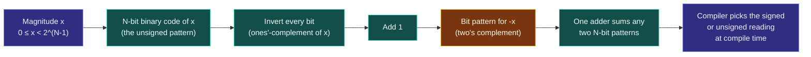

# Integer Representation and Two's Complement

> [!essence]
> A signed integer's bit pattern is **two's complement** — the only representation the Standard has allowed since C++20: negate a value by inverting every bit and adding one, so the very same adder that does unsigned addition also does signed addition, with no sign-magnitude special case and no second bit pattern for zero. That one representational choice is why unsigned arithmetic wraps by definition, why signed overflow is undefined behavior rather than wraparound, and why `-1` and the all-ones unsigned maximum are, bit for bit, the same object.

## The Problem

A CPU's arithmetic unit owns exactly one adder per width. It adds two N-bit patterns and produces an N-bit pattern; it does not ask, and cannot be told at the hardware level, whether either pattern is "supposed to" go negative. [[Fundamental Types|`int` and its signed siblings]] promise ordinary negative-number arithmetic anyway — `x + (-x)` must come out to zero — using hardware that was never built with a separate "negative" code path.

> [!principle] Constraint → Consequence → Requirement → Design → Price
> 1. **Constraint:** A binary adder performs one fixed algorithm on whatever bits it is given; there is no second circuit reserved for "negative" operands.
> 2. **Consequence:** If a negative number were stored as a sign bit plus an ordinary magnitude (*sign-magnitude*), `5 + (-5)` would need the adder to notice the signs disagree and subtract instead of add — a branch the plain adder doesn't have — and the representation would waste a bit pattern on a second zero (`+0` and `-0`).
> 3. **Requirement:** whatever bit pattern is chosen for `-x` must make `x + (-x)` fall out of *ordinary* addition with no special-casing, and exactly one pattern may mean zero.
> 4. **Design:** C++ defines the bit pattern for `-x` as `x`'s bits inverted, then incremented by one — equivalently, `2^N - x` reduced modulo `2^N`. That is **two's complement**. Before C++20, the Standard also permitted two historical alternatives — sign-magnitude and ones' complement — as an implementation-defined choice (`[basic.fundamental]`, pre-2020 wording). Every compiler still in mainstream use had already picked two's complement, so WG21 paper **P0907R4** (2018) didn't invent anything; it wrote down what every real machine already did and removed the other two as legal options, effective **C++20**.
> 5. **Price:** the representable range becomes asymmetric, `-2^(N-1)` to `2^(N-1)-1`, because there is no bit pattern left over for a negative zero — the single most-negative value has no positive counterpart (see Consequences). And mandating the *representation* did not touch what happens when an *operation* overflows that range: the Standard still leaves signed arithmetic overflow completely undefined, so the portability P0907R4 bought is about which bits a value has, never about what happens when you exceed the range those bits can hold.

> [!tension] compatibility ⟷ evolution
> The three-representation legacy came from C, which still permits all three today. C++ inherited it, left it implementation-defined for 22 years, and only closed it once the gap between "legal" and "actually shipped" had become purely theoretical — see [[Map — Types & Values]] for the domain-wide pattern of narrowing C's old latitude without breaking it outright.

> [!tension] safety ⟷ performance
> Two's complement makes the *bits* of signed overflow well-defined — they're whatever the adder produces. The Standard nonetheless keeps the *value* of signed overflow undefined, on purpose: a compiler that may assume `x + 1 > x` always holds for `int` can delete range checks and simplify loop induction that it could never touch for `unsigned`. [[Signed Integer Overflow]] develops this trade fully; *Under the Hood* below shows the compiler actually taking it.

## Mental Model

```text
 ┌─ 3-bit codes, read two ways — SAME bits, different meaning ───┐
 │                                                                │
 │  code:       000  001  010  011  100  101  110  111           │
 │  unsigned:     0    1    2    3    4    5    6    7           │
 │  signed:       0    1    2    3   -4   -3   -2   -1           │
 │                                   ▲                            │
 └───────────────────────────────────┼────────────────────────────┘
                                      │
                       the top half of the unsigned range
                       becomes the negative half, read signed
```

> [!model] An odometer with binary digits
> Counting up, the dial rolls `011 → 100` exactly the way any odometer rolls past its highest digit combination — nothing about the mechanism changes at that instant. Only the *label* changes: read the dial as **unsigned**, and that roll means "bigger," `3 → 4`. Read the identical roll as **signed two's complement**, and the Standard defines it to mean `3 → -4` instead. The wheels don't know which reading you intend; they just turn.
> **Where it breaks:** a real odometer keeps turning forever, and nobody calls that undefined. A signed `int` reaching that same turn *by addition* — `INT_MAX + 1` — is not a defined roll-over at all; the abstract machine simply declines to say what happens (see Consequences). The hardware's wheels turn the same way either time; only the signed abstract machine refuses to watch.

## Step by Step



1. **Fix the unsigned code.** A non-negative magnitude `x` gets the ordinary positional binary code every CS course teaches first: `N` bits, each worth a power of two, summing to `x`. This is also the entire definition of `unsigned` — nothing more is added.
2. **Build the negative code.** Invert every bit of that pattern (the *ones'-complement* of `x`), then add 1. The result is defined to be the bit pattern for `-x`.
   > [!standard] Two different rules the C++20 mandate touches
   > `[basic.fundamental]` now states plainly, with a footnote naming it: for every value `x` of a signed type, the corresponding unsigned type's value *congruent to x modulo 2^N* has the identical bits — "this is also known as two's complement representation." Don't conflate two separate rules that both moved in C++20: **converting** an out-of-range value *to* a signed type was implementation-defined through C++17 and is well-defined (congruent mod `2^N`) from C++20 on (`[conv.integral]`, rewritten by P0907R4); signed **arithmetic overflow** — computing a value that doesn't fit, as opposed to converting one that already exists — was undefined before C++20 and still is after it. Primer, written for C++11, calls both of these "undefined" without the distinction; trust `[conv.integral]` over that paraphrase.
3. **Let one adder serve both readings.** Because `(2^N - x) + x ≡ 0 (mod 2^N)`, feeding the adder `x`'s pattern and `-x`'s pattern and discarding any carry past bit `N-1` always yields the all-zero pattern. Ordinary binary addition, with the overflow bit thrown away, already *is* subtraction — no second circuit, exactly as the Requirement demanded.
4. **Two different "overflows" fall out of the same adder.** A carry past the top bit means different things depending which way you're reading the result. Read unsigned, it means the true sum needed one more bit than you had — `[basic.fundamental]` defines the answer as that sum *reduced* modulo `2^N`, so this is not a malfunction, it's the type's contract. Read signed, the same mismatched-carry pattern means the true mathematical result fell outside `[-2^(N-1), 2^(N-1)-1]` — and here the Standard supplies no reduction rule at all: the result is undefined behavior, full stop.
5. **The compiler decides which reading applies — once, at compile time.** The stored bits carry no runtime tag saying "I am signed" ([[What a Type Is]]); only the compile-time type does. *Under the Hood* shows the compiler choosing different instructions for the identical bit width depending purely on that compile-time choice.

## Under the Hood

> [!machine] GCC 11.4 (Ubuntu 22.04), x86-64, `-O2` — three one-line functions, `cc.py asm`
> ```nasm
> signed_no_overflow(int):            ; return i + 1 > i;
>     mov  eax, 1                     ; ① always true — no comparison emitted at all
>     ret
> unsigned_wraps(unsigned int):       ; return u + 1 > u;
>     cmp  edi, -1                    ; ② edi == UINT_MAX, i.e. the one case where u+1 wraps to 0
>     setne al
>     ret
> neg_one_bits(int):                  ; return (unsigned)x;
>     mov  eax, edi                   ; ③ zero instructions change a single bit
>     ret
> ```

1. For `int`, the compiler is entitled to assume `i + 1` never overflows, because overflowing it is undefined behavior the program is contractually forbidden to trigger. Under that assumption `i + 1 > i` is true for every representable `i`, so the whole comparison collapses to the constant `1` — the UB license is spent as an optimization, not just a warning label. This mirrors the benchmark Pikus walks through in ch. 11 (see Sources): a `signed` loop index let GCC drop a bounds-style check that an `unsigned` index forced it to keep.
2. For `unsigned int`, overflow is defined to wrap modulo `2^32`, so `u + 1 > u` is false exactly when `u == UINT_MAX`. The compiler cannot assume this case away — it isn't UB, it's the type's contract — so it emits a real comparison.
3. `neg_one_bits` converts a signed `int` to `unsigned int` with `static_cast`. Converting is now (C++20) defined as "the congruent value modulo `2^32`" — and because the representation is two's complement, that congruent value already *has* identical bits to the signed input. The compiler emits a bare register move: there is nothing to convert.

On this and virtually every mainstream platform, `sizeof(int)` is 4 bytes (32 bits) — the Standard's guaranteed minimum is only 16; see [[Fundamental Types]]'s width table. With 32-bit `int`, `INT_MIN` is `-2147483648` and `INT_MAX` is `2147483647` — one more negative value representable than positive, the asymmetry the Price step predicted.

## In Code

**1 · The congruence is not a metaphor: `-1` and the unsigned maximum share bits**

```cpp
#include <bitset>
#include <cstdint>
#include <iostream>

int main() {
    std::int32_t neg_one = -1;
    std::uint32_t max_u  = UINT32_MAX;
    std::cout << std::bitset<32>(static_cast<std::uint32_t>(neg_one)) << '\n';  // ①
    std::cout << std::bitset<32>(max_u) << '\n';                                // ②
    std::cout << (static_cast<std::uint32_t>(neg_one) == max_u) << '\n';        // ③
}
// expect: 11111111111111111111111111111111
// expect: 11111111111111111111111111111111
// expect: 1
```
1. Converting `-1` to `uint32_t` is a defined integral conversion: the unique unsigned value congruent to `-1` modulo `2^32`.
2. `UINT32_MAX` is, by definition, the unsigned type's largest representable pattern: all ones.
3. Same bits, confirmed by equality — not an analogy, a verified identity.

**2 · Unsigned wraps on purpose; signed overflow has no defined answer**

```cpp
#include <climits>
#include <iostream>

int main() {
    unsigned int u = UINT_MAX;
    std::cout << (u + 1) << '\n';          // ① defined: wraps to 0, by [basic.fundamental]
}
// expect: 0
```
```cpp
// cc: ub
#include <climits>
#include <iostream>

int main() {
    int i = INT_MAX;
    std::cout << (i + 1) << '\n';          // ② undefined: no modulo-reduction rule applies
}
```
1. `UINT_MAX + 1` is required to equal `0`: unsigned arithmetic is modulo `2^N` by definition, so there is no "overflow" to even name.
2. `INT_MAX + 1` has no defined value. UBSan (GCC 11.4, x86-64 Linux, `-fsanitize=undefined`) reports *"signed integer overflow: 2147483647 + 1 cannot be represented in type 'int'"* and the unsanitized build prints `-2147483648` — the bit pattern the adder happened to produce, not a guarantee.

**3 · The asymmetric range has exactly one value with no positive counterpart**

```cpp
// cc: ub
#include <climits>
#include <iostream>

int main() {
    int x = INT_MIN;
    std::cout << -x << '\n';               // ① naive expectation: a large positive number
}
```
1. `-INT_MIN` would have to equal `2147483648`, which does not fit in `int` — negating the one value with no positive counterpart overflows too. UBSan traces this exact case: *"negation of -2147483648 cannot be represented in type 'int'; cast to an unsigned type to negate this value to itself."* On this toolchain the unsanitized build prints `-2147483648` right back out — the naive expectation (a big positive number) is exactly what fails to happen.

## Consequences

| Observed rule or failure | Explained by |
|---|---|
| Signed overflow is undefined behavior, not wraparound | Mandating the *representation* (P0907R4) left the *overflow rule* untouched; see [[Signed Integer Overflow]] |
| Unsigned arithmetic "never overflows" | `[basic.fundamental]` defines it as arithmetic modulo `2^N`; wraparound *is* the specified answer, not a bug |
| `INT_MIN` has no positive counterpart, and `-INT_MIN` is itself UB | One sign bit, no spare pattern for negative zero: `N` value bits give one more negative code than positive |
| Comparing a negative `int` against an `unsigned` promotes the `int` to a huge value | The usual arithmetic conversions reuse this same congruent-mod-`2^N` rule to convert the signed operand first; see [[Mixing Signed and Unsigned]] |
| Casting an out-of-range value to a signed type stopped being implementation-defined in C++20 | P0907R4 rewrote `[conv.integral]` to the identical congruent-modulo formula already governing unsigned conversions |
| `~x` and `-x` differ by exactly one | `~x` is the ones'-complement step alone (Step 2's first half); two's complement is "ones'-complement, then add 1" |
| A `signed` loop index can compile tighter than an `unsigned` one | The compiler assumes a `signed` index never overflows and prunes checks an `unsigned` index's defined wraparound forbids pruning; Pikus's sort benchmark (Sources) measures the resulting gap |

## Connections

- **Prerequisites:** [[Fundamental Types]] — the integer-type vocabulary this note gives a concrete bit-level representation to.
- **Enables:** [[Signed Integer Overflow]] (the pitfall this mechanism's Price step predicts) · [[Implicit Conversions and Promotions]] (the congruent-modulo-`2^N` rule derived in Step 2 *is* the integral-conversion rule) · [[Mixing Signed and Unsigned]] (reuses the same conversion to explain a comparison bug).
- **Siblings:** [[Floating-Point Representation (IEEE 754)]] — the real-machine picture for the other half of the arithmetic types, with a completely different set of trade-offs.
- **Domain:** [[Map — Types & Values]].
- **Practice:** *Continuum #2 Unit & Temperature Converter Suite* — print the bit pattern of a negative intermediate conversion result with `std::bitset` and confirm it matches the construction in Step 2.

## Check Yourself

> [!quiz]- Why does two's complement let a single adder circuit handle both signed and unsigned addition?
> Because `(2^N - x) + x ≡ 0 (mod 2^N)`: the bit pattern chosen for `-x` is exactly the one that makes ordinary binary addition, with any carry past the top bit discarded, produce zero when added to `x`. No circuit has to notice signs or branch — subtraction falls out of addition for free.

> [!quiz]- Both signed and unsigned `int` are two's complement bits under the hood on every mainstream platform. Why does the Standard still call signed overflow undefined while unsigned overflow is fully defined?
> The *representation* is the same bits either way, but the Standard chose to leave signed overflow unspecified anyway so optimizers can assume it never happens — proven in *Under the Hood*, where `i + 1 > i` collapses to the constant `true` for `int` but needs a real comparison for `unsigned int`. Defining it as wraparound (as unsigned does) would have forced compilers to keep checks they currently delete.

> [!quiz]- Predict: in 8-bit two's complement, what bit pattern represents `-5`?
> `5` is `00000101`. Invert every bit: `11111010`. Add one: `11111011`. Check: reading `11111011` as unsigned is `251`, and `251 ≡ -5 (mod 256)` — consistent with the congruent-modulo-`2^N` definition.

> [!quiz]- Predict: does `int x = INT_MIN; std::cout << -x;` print a large positive number?
> No — it's undefined behavior, not a guarantee of any particular output. `-INT_MIN` would need to equal `2147483648`, one past `INT_MAX`, which doesn't fit in `int`. On this vault's toolchain (GCC 11.4, x86-64 Linux) the unsanitized build happens to print `INT_MIN` right back, and UBSan flags the exact line — but a different compiler, flag set, or optimization level owes you nothing in particular.

## Sources

- Primer §4.2 "Arithmetic Operators" (p. 140): the overflow definition, and a 16-bit `short` wraparound example where the sign bit flips from `0` to `1`.
- Pikus ch. 11 "Undefined Behavior and Performance", §"Undefined behavior and C++ optimization" (pp. 378–381): GCC codegen proving the compiler assumes signed overflow never happens, and the signed-vs-unsigned loop-index benchmark this note's Consequences table cites.
- cppreference, *Fundamental types*: https://en.cppreference.com/w/cpp/language/types
- Draft standard `[basic.fundamental]` (two's complement mandate, the congruent-modulo-2^N footnote): https://eel.is/c++draft/basic.fundamental
- WG21 P0907R4, "Signed Integers are Two's Complement" (the C++20 change, its history, and the implementation survey behind it): http://wg21.link/P0907R4
