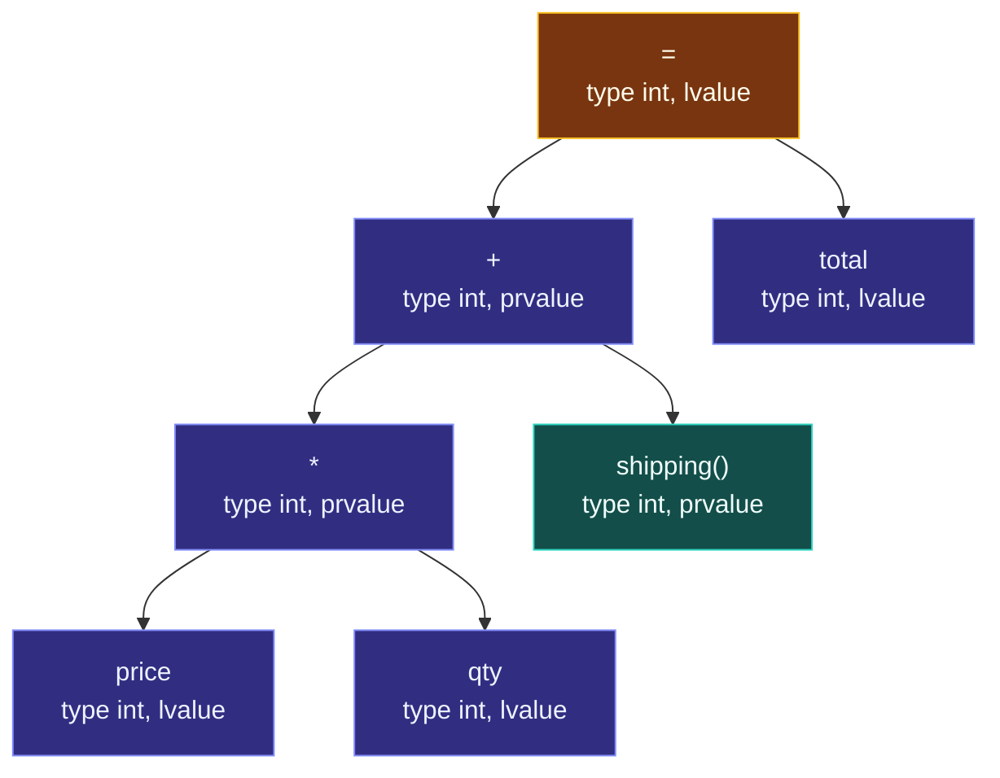

# Anatomy of an Expression

> [!essence]
> An expression is a small machine: it takes operands, applies an operator, and hands back exactly one result — characterized by a type and a value category, and possibly accompanied by a side effect. Every larger computation in C++, from `a + b` to a thousand-line function, is built by nesting these machines inside one another.

## The Problem

> [!principle] Constraint → Consequence → Requirement → Design → Price
> 1. **Constraint.** A program has to combine existing values into new ones — add two numbers, compare two strings, call a function on an argument — and a real processor executes one instruction at a time, in whatever order the compiler and hardware find fastest, as long as the final answer matches what the abstract machine promises ([[The As-If Rule]]).
> 2. **Consequence.** Source code, though, is written as nested combinations with no instruction order visible at all: `total = price * qty + shipping()`. Two different questions hide inside that one line — *which operand belongs to which operator* (a question about shape, answerable by reading the text) and *when does each piece actually run* (a question about time, answerable only by the compiler and the machine). A language that answers both with one rule either ties the optimizer's hands or leaves the programmer guessing.
> 3. **Requirement.** The language needs a unit of computation small enough to nest arbitrarily deep, precise enough that combining two of them is unambiguous, and expressive enough to say, for any such unit, exactly what it hands back.
> 4. **Design.** C++ calls that unit an **expression**: a sequence of operators and operands that specifies a computation. Every expression — no matter how small (`price`) or how deeply nested (`price * qty + shipping()`) — is characterized by exactly two independent properties: a **type** (what kind of value it is) and a **value category** (what may be done with the object or value it denotes: bound to a reference, moved from, addressed). An expression may also produce **side effects**: writing to an object, calling a library I/O function. The grammar fixes which operands belong to which operator; nothing in that grammar fixes *when* each piece is evaluated.
> 5. **Price.** Because the grammar answers the shape question and deliberately under-answers the timing question, an expression that quietly depends on one particular evaluation order compiles without complaint and can still be undefined behavior ([[Undefined Behavior]]) — the shape was legal C++, the timing assumption was not. [[Map — Expressions & Control|The rest of this domain]] is the discipline of knowing which few places the language *does* pin an order down, and treating everywhere else as genuinely unordered.

> [!tension] safety ⟷ performance
> Fixing an evaluation order for every expression would make every program's behavior fully predictable — and would forbid a compiler from reordering loads, hoisting a common subexpression, or evaluating two independent calls in whichever order the pipeline prefers. C++ resolves this in performance's favor almost everywhere: order is unspecified by default, pinned down only at a handful of named points (full-expression boundaries, `&&`, `||`, `?:`, the comma operator, and — since C++17 — a few specific operand pairs). A program that needs a particular order has to ask for it structurally (separate statements, an explicit sequence point), not assume the compiler will pick the order that reads naturally left to right.

## Mental Model

> [!model] The expression as an assembly line
> Picture each operator as a station on an assembly line. A station takes one or two finished parts — the operand values — and bolts them into one new part: the result. That new part always leaves the station with two labels attached: a **type** (what it's made of) and a **value category** (a tag saying whether it's a numbered part still on the belt, ready to be picked up again by name, or a freshly welded piece nobody else has a claim on yet). Nesting expressions is stringing stations together: the output of one station becomes the input to the next, all the way up to one final part that leaves the whole line.
>
> The analogy holds for *shape* — which station feeds which — but breaks for *time*: a real assembly line runs start to finish in one fixed direction. C++'s line doesn't. Which station's work actually happens first, at the CPU level, is mostly the plant manager's call (the compiler and hardware), not the blueprint's, and the blueprint is not obligated to tell you which one it picked.



Reading bottom-up: `price` and `qty` are primary expressions (identifiers); `price * qty` is a subexpression built from them; `price * qty + shipping()` nests that subexpression with a function call; the assignment to `total` is the **full-expression** — the one part that leaves the line, not itself feeding any other station. Every arrow is a "supplies an operand to" edge, fixed the moment the compiler parses the line; nothing in the picture says whether `price * qty` or `shipping()` is computed first.

## Mechanics

| Situation | Rule | Example |
|---|---|---|
| Any expression, however small | Has exactly two independent properties: a type and a value category (`[basic.lval]` ¶2 for the value category, `[expr.type]` for the type; cppreference *Expressions*) | `price` is `int`, lvalue; `price * qty` is `int`, prvalue |
| Operand of an operator | Is itself either a **primary expression** (a literal, an identifier, `this`, or a parenthesized expression) or a **subexpression** built from smaller ones | in `1 + 2 * 3`, `+`'s operands are the primary expression `1` and the subexpression `2 * 3` |
| A parenthesized expression | Is itself classified as a primary expression, and preserves the value, type and value category of what it wraps | `(price)` has the exact same type and value category as `price`; parentheses exist only to force a different grouping, never a different kind of result |
| **Full-expression** | An expression that is not a subexpression of any other expression (plus a few named cases: declarator initializers, a destructor call at the end of an object's lifetime, and — since C++14 — the default member initializers used while building an aggregate) | in `total = price * qty + shipping();`, the whole assignment is the full-expression; `price * qty` and `shipping()` are subexpressions of it, not full-expressions themselves |
| **Expression-statement** | An expression followed by `;`; if the expression yields a result, that result is a *discarded-value expression* — computed, then thrown away, and evaluated only for whatever side effect it has | `qty + 1;` computes one more than `qty` and keeps nothing; `++qty;` has the identical statement shape but is written for its side effect |
| **Unevaluated operand** | The operand of `decltype`, `sizeof`, `noexcept`, or a `requires`-expression is parsed and type-checked but never executed — reading it costs nothing at run time, though the Standard still counts it as a full-expression in its own right (`[expr.context]` ¶1) | `decltype(price)` names `price`'s type without running any code that reads `price`'s value; `sizeof(f())` never calls `f` |

`typeid` is the one exception that proves the rule: its operand is unevaluated for an ordinary expression, but genuinely *evaluated* when the operand is a glvalue of polymorphic class type — determining the dynamic type takes an actual run-time lookup through the object's vptr, so there is no way to answer without running the expression that names the object (`[expr.typeid]` ¶4–5).

> [!standard] Where this is defined
> The Standard fixes the subexpression/full-expression vocabulary in `[intro.execution]`, the value-category half of an expression's two properties in `[basic.lval]`, its type in `[expr.type]`, primary expressions in `[expr.prim]`, and discarded-value and unevaluated operands in `[expr.context]`; cppreference's *Expressions* page (`en.cppreference.com/w/cpp/language/expressions`) restates it without the legal phrasing. Neither source ties any of this to a particular evaluation order — that is a separate rule set, in [[Evaluation Order and Sequencing]].

## Under the Hood

> [!machine] What "the shape is fixed, the order isn't" looks like in codegen
> The parse tree from the Mental Model fixes that `shipping()`'s result and `price * qty`'s result both feed the outer `+`. It does not fix which the compiler computes first — only that both happen before the addition. GCC 14, `-O2`, on `return price * qty + shipping();`:
> ```text
> total_expr():
>   push rbx
>   mov  ebx, DWORD PTR price[rip]
>   imul ebx, DWORD PTR qty[rip]   ; price * qty computed first, kept in a
>   call shipping()                ; callee-saved register across the call
>   add  eax, ebx                  ; the outer +, now that both operands exist
>   pop  rbx
>   ret
> ```
> GCC chose to compute `price * qty` *before* calling `shipping()`, holding the product in a register the call is obliged to preserve (`rbx`). Nothing required that choice — a different compiler, or the same one at a different optimization level, could just as legally call `shipping()` first and multiply after. The Standard fixes only that both are complete before the `+` runs; which one goes first is exactly the freedom the as-if rule ([[Map — What C++ Is]]) grants, and exactly the freedom that turns into undefined behavior the moment `price * qty` or `shipping()` can affect the other ([[Evaluation Order and Sequencing]]).

## In Code

```cpp
#include <iostream>
#include <type_traits>

int main() {
    int price = 3;
    int qty = 4;

    static_assert(std::is_same_v<decltype(price), int>);    // ①
    static_assert(std::is_same_v<decltype((price)), int&>); // ②

    int total = price * qty;    // ③
    std::cout << total << "\n"; // expect: 12
}
```
① `decltype` on the bare identifier reports its declared type, `int`. ② `decltype` on the *parenthesized* identifier reports `int&` instead: `(price)` is an lvalue expression denoting `price`, not merely a stand-in for its name, and `decltype` makes that value-category difference visible as a type. Neither operand actually runs — both `price` and `(price)` are unevaluated operands (Mechanics), so line ① and ② read no value from `price` at all; `decltype` only inspects the type and value category every expression already has. ③ `price * qty` is a subexpression with type `int` and value category prvalue: a freshly computed number, not an alias to any existing object.

```cpp
#include <cstdio>

struct Loud {
    Loud()  { std::puts("build"); }
    ~Loud() { std::puts("die"); }
};

void use(const Loud&) { std::puts("use"); }

int main() {
    use(Loud{});         // ①
    std::puts("after");  // ②
}
// expect: build
// expect: use
// expect: die
// expect: after
```
① The entire statement `use(Loud{});` is one full-expression. The temporary `Loud{}` is a subexpression of it, so it lives through the whole call — it is not destroyed the instant `use` starts running, only when the full-expression ends (see [[Destructors]] for exactly which call that end-of-full-expression boundary triggers). ② Because the full-expression's end is also where the temporary's lifetime ends, `"after"` cannot print until `"die"` already has: the ordering is guaranteed, not coincidental (Primer §13.1, p. 502).

```cpp
#include <iostream>

int main() {
    int hits = 0;

    hits + 1;                    // ①
    ++hits;                      // ②
    std::cout << hits << "\n";   // expect: 1
}
```
① A legal expression-statement: `hits + 1` is computed and its result is a discarded-value expression — thrown away with no side effect, which is exactly why a compiler warns about it (`-Wunused-value`). ② The identical statement *shape* — an expression followed by `;` — but this one is written for its side effect (incrementing `hits`), not its discarded result.

## Pitfalls

> [!trap] Treating "unspecified" as "whichever order I read it in"
> `f(a(), b())` guarantees only that `a()` and `b()` each finish evaluating before the call happens — not that `a()` runs before `b()`. Code that silently depends on one has no defense when a different compiler, or a different optimization level, picks the other. See [[Evaluation Order and Sequencing]] for exactly which four operators are exceptions to this.

> [!ub] Modifying and reading the same object with nothing sequencing the two
> `n = ++i + i;` has no defined result at all: the operands of `+` are unsequenced, so nothing orders `++i`'s write to `i` against the plain read of `i` in the right operand. This is not "compiler-dependent but legal" — it is undefined behavior in every standard ([[Undefined Behavior]]), and the compiler is entitled to assume it never happens while optimizing everything around it. Beware the textbook example `i = i++ + 1;`: it was undefined through C++14, but C++17 sequences an assignment's right operand (including its side effects) before the assignment itself, so it is now well-defined (cppreference, *Order of evaluation* §Undefined behavior). Code that relies on that is still a bad idea — it is UB under any `-std=c++14` build.

## Evolution

| Standard | Change | Why |
|---|---|---|
| C++11 | Value categories refined from a two-way lvalue/rvalue split into the three-way glvalue/prvalue/xvalue taxonomy | a plain rvalue could no longer say whether a resource was safe to steal; move semantics needed a category for "nobody else can reach this" ([[Value Categories]]) |
| C++14 | The definition of *full-expression* was extended to explicitly include the default member initializers used while constructing an aggregate | closed a gap opened by aggregate initialization forms C++11 had newly allowed |
| C++17 | A handful of previously-unspecified operand pairs were pinned to a guaranteed order (e.g. a subscript expression's array operand before its index, an assignment's right-hand side before its left) | removed some of the most common accidentally-UB expressions without changing what "full-expression" or "subexpression" mean — see [[Evaluation Order and Sequencing]] for the complete list |

## Connections
- **Prerequisites:** none beyond [[What a Type Is]] — this note assumes only that a value has a type; the *value category* half of the story is developed in full by [[Value Categories]].
- **Enables:** [[Precedence and Associativity]] (fixes the shape question exactly), [[Evaluation Order and Sequencing]] (fixes how little the timing question is answered), [[Value Categories]] (the value-category half of an expression's two properties, at full depth), [[Control Flow — Selection and Iteration]] (statements that decide which expressions run).
- **Siblings:** [[Map — Expressions & Control]], the domain hub this note opens.
- **Practice:** CPP Project Continuum #2–#3 — any expression-heavy line in early exercises is an opportunity to name its type and value category before trusting what it prints.

## Check Yourself
> [!quiz]- What two properties does *every* C++ expression have, with no exceptions?
> A type and a value category. Every expression has both, independent of each other and independent of whether the expression also produces a side effect.

> [!quiz]- Why is `(price)` classified as a *primary* expression rather than just a parenthesized reference to `price`?
> Because primary expressions are what operators are allowed to take as operands without further reduction, and parentheses need to slot into that same role — a parenthesized expression has to be usable anywhere a literal or identifier is, which is exactly what classifying it as primary guarantees. It preserves `price`'s value, type and value category unchanged; its only effect is overriding the grouping the surrounding operators would otherwise impose.

> [!quiz]- `int i = 0; int r = (i = 5) + (i = 6);` — is `r`'s value defined?
> No. Both assignments modify `i`, and nothing sequences one assignment's side effect against the other's value computation or side effect — this is exactly the "side effect on a memory location unsequenced relative to another side effect on the same location" case, which is undefined behavior. It has nothing to do with `+`'s own operand-evaluation order; even a hypothetical language that fixed left-to-right evaluation here would still need a rule for *this* clash, and C++ simply doesn't provide one.

## Sources
- Primer §4.1.2 "Precedence and Associativity" (p. 136): a compound expression's operands are grouped according to precedence and associativity, fixed independently of when each part runs. §4.1.3 "Order of Evaluation" (p. 138): order of operand evaluation is independent of precedence and associativity, and only `&&`, `||`, the conditional operator and the comma operator guarantee one. §5.1 "Simple Statements" (p. 172): an expression followed by `;` is an expression statement; its result, if any, is evaluated and discarded, so such a statement is written for its side effect. §13.1 "Copy, Assign, and Destroy" (p. 502): a temporary object is destroyed at the end of the full-expression in which it was created.
- Tour §1.4 "Types, Variables, and Arithmetic" (p. 6): expressions built from literals, names and operators, introduced through worked arithmetic examples.
- PPP §3.3 "Expressions": expressions built up from constants and operators before statements are introduced, motivating why the two are different grammatical categories.
- cppreference, *Expressions*: https://en.cppreference.com/w/cpp/language/expressions — the definition used here for primary expressions, full-expressions and discarded-value expressions; confirms the C++14 extension to default member initializers.
- cppreference, *Order of evaluation*: https://en.cppreference.com/w/cpp/language/eval_order — the C++17 defect-report-driven changes to specific operand orderings cited in Evolution.
- Draft standard `[intro.execution]`: https://eel.is/c++draft/intro.execution — the normative definitions of full-expression, subexpression and discarded-value expression.
- Draft standard `[expr.context]`: https://eel.is/c++draft/expr.context — ¶1 lists the unevaluated-operand contexts (`decltype`, `sizeof`, `noexcept`, `requires`-expressions) and states that an unevaluated operand is still a full-expression; ¶2 defines discarded-value expression precisely.
- Draft standard `[expr.typeid]`: https://eel.is/c++draft/expr.typeid — ¶4–5, the source for `typeid`'s split behavior (evaluated only for a glvalue of polymorphic class type).
- See [[Guide — cppreference, the Draft Standard and the Core Guidelines]] for how to navigate `[intro.execution]` directly.
