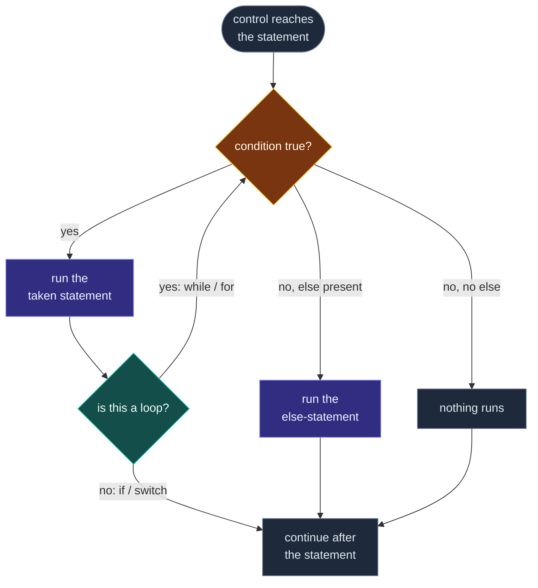
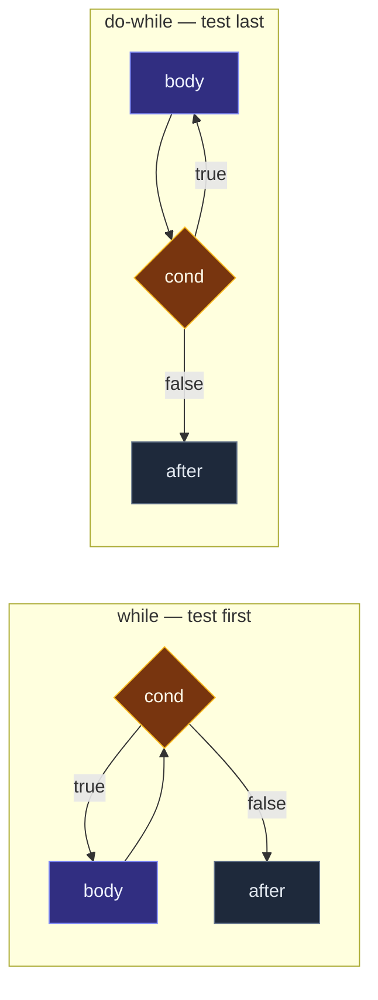

# Control Flow — Selection and Iteration

> [!essence]
> A statement either runs once, runs conditionally, or runs repeatedly — and all three cases reduce to the same primitive: test a condition, then branch. **Selection** (`if`, `switch`) branches once and moves on; **iteration** (`while`, `do`-`while`, `for`) branches, and on the taken side, loops back to test again. Everything in this note is that one mechanism wearing different clothes.

## The Problem

> [!principle] Constraint → Consequence → Requirement → Design → Price
> 1. **Constraint.** [[Anatomy of an Expression|An expression]] only ever combines existing values into a new one. A sequence of expression-statements, executed top to bottom, computes exactly one fixed thing every time the program runs — nothing in an expression can make the *next* statement depend on what a *previous* one just computed.
> 2. **Consequence.** Almost every useful program needs the opposite: skip a step when a value is negative, keep charging a customer's card until it succeeds or a retry limit is hit, process however many rows a file happens to contain. None of that is expressible by nesting expressions more cleverly — it requires deciding, at run time, *which* statement executes next, and *how many times*.
> 3. **Requirement.** The language needs two things a pure expression can't give it: a way to route control to one of several statements based on a runtime value (selection), and a way to re-enter the same statement while a runtime value keeps satisfying a condition (iteration). Both decisions have to happen in an exact, guaranteed order — unlike expression evaluation order, which [[Evaluation Order and Sequencing|the Standard mostly leaves open]], *which branch runs* cannot be left to the optimizer's discretion without changing what the program computes.
> 4. **Design.** C++ inherits C's answer nearly unchanged: **selection statements** (`if`, `switch`) test a condition once and transfer control to exactly one of their substatements; **iteration statements** (`while`, `do`-`while`, `for`) wrap the same test-and-branch in a loop that re-runs it until the condition fails. Every one of these statements evaluates its condition as an ordinary expression — [[Anatomy of an Expression|it has a type and a value category]] like any other — contextually converted to `bool`.
> 5. **Price.** Because the mechanism is one primitive reused five ways, its edge cases repeat across all five: a nested `if` with no braces attaches its `else` to the *wrong* `if` unless you already know the rule; a `switch` that inherited C's design falls through by default instead of stopping; a loop's termination is on the programmer's honor, not the compiler's, so an off-by-one or a wraparound turns "finitely many times" into "forever."

> [!tension] safety ⟷ performance
> A branch is nearly free when the processor predicts it correctly and expensive when it doesn't — the pipeline has already started executing instructions from the guessed path and must discard them on a misprediction ([[Map — Performance & the Machine]]). C++ does nothing to hide this cost: `if`, `while`, and `for` compile to the same comparison-and-jump a hand-written assembly loop would use, with no runtime check that a condition is "safe" to evaluate or that a `switch` value has a matching `case`. The performance is exactly what the hardware gives you; the safety is exactly what you verify yourself.

## Mental Model

> [!model] One test, two endings
> Every selection and iteration statement performs the same act: evaluate a condition, then go one of two ways. What distinguishes them is only what waits at the far end of the "taken" path. For `if` and `switch`, it's a statement that runs once and hands control onward. For `while`, `do`-`while`, and `for`, it's a statement that runs and then hands control *back* to the same test. A loop is not a different mechanism from a branch — it is a branch whose taken side points backward instead of forward.
> **Where the model needs care:** `do`-`while` runs the body *before* the first test, so its "test, then branch" order is reversed relative to the other four. Treat it as the same primitive evaluated in a different position, not an exception to it.



## Mechanics

**Selection.** `if` tests one condition; `switch` tests one value against many constants at once.

| Statement | Form | Rule |
|---|---|---|
| `if (cond) S` | one-armed | Runs `S` when `cond` converts to `true`; otherwise does nothing. |
| `if (cond) S1 else S2` | two-armed | Runs exactly one of `S1`, `S2`. |
| nested `if` with no `else` on the outer | dangling else | An `else` binds to the **nearest preceding `if` that does not yet have one** — never to a visually outer `if`, whatever the indentation suggests (Primer §5.3, p. 177 and Defined Terms p. 199; confirmed unchanged by cppreference, *`if` statement* §Branch selection). |
| `switch (cond) { case c1: ...; case c2: ...; default: ...; }` | multi-way | `cond` (contextually converted to an integral or enum type) is compared against each `case` constant; control jumps to the matching label, or to `default` if present, or to nowhere at all if neither matches. |

> [!standard] `case` labels are jump targets, not scopes
> A `case` label does not open a new block. Control can jump straight past a declaration into the middle of a scope that variable is supposed to live in, which the Standard forbids: a declaration inside one `case` that a later, reachable `case` could jump *over* without initializing it makes the whole `switch` ill-formed (`[stmt.switch]`; cppreference, *`switch` statement* §Notes). Wrap any `case` that declares a variable in its own `{ }` block to give it a scope the jump can legally skip.

**Iteration.** All three loop forms repeat one statement; they differ in *when* the condition is tested and *what else* is bundled into the header.



| Statement | Tests | Runs body at least once? | Scope of any loop-control variable |
|---|---|---|---|
| `while (cond) S` | before each iteration | No — `cond` may be false immediately | Whatever scope the variable already had |
| `do S while (cond);` | after each iteration | **Yes**, always at least once | Whatever scope the variable already had |
| `for (init; cond; inc) S` | before each iteration, like `while` | No | `init`'s variable is scoped to the `for` statement itself: it does not exist before it and does not leak past it |

> [!standard] `for` is sugar over `while` — almost
> `for (init; cond; inc) S` behaves like `{ init; while (cond) { S; inc; } }`, with one difference: **`continue` inside `S`** jumps to `inc` in the `for` version but would skip `inc` entirely in the naively rewritten `while` version (Primer §5.5.2, p. 191, and Defined Terms p. 199: "a `continue` ... transfers [execution] ... to the expression in the header of a traditional `for`"). This is the one place where the "sugar" framing, taken literally, produces a different program — see *In Code*, example 3.

## Under the Hood

> [!machine] A branch is a comparison and a conditional jump — nothing hides that cost
> Pikus describes why there is "no obvious way to convert" a data-dependent branch "into a linear stream of instructions" (Pikus, "Pipelining and branches," p. 88): the processor must guess which side of the branch to start executing before the condition's value is known, and pay a pipeline-flush penalty when the guess (via **branch prediction**) is wrong (Pikus, "Branch prediction," p. 92). `if`, `while`, and `for` give the compiler nothing extra to reason about here beyond what a hand-written comparison and jump would — the abstraction is free to write, not free to run.

Because `for` really does compile to the same loop a `while` produces, GCC (14.2, x86-64, Compiler Explorer, `-O1 -std=c++20`) emits **identical machine code** for the two versions of a summation loop below, differing only in label names:

```text
sum_while(int):                    sum_for(int):
  test edi, edi                      test edi, edi
  jle  .L4                           jle  .L9
  mov  eax, 0                        mov  eax, 0
  mov  edx, 0                        mov  edx, 0
.L3:                              .L8:
  add  edx, eax                      add  edx, eax
  add  eax, 1                        add  eax, 1
  cmp  edi, eax                      cmp  edi, eax
  jne  .L3                           jne  .L8
.L1:                              .L6:
  mov  eax, edx                      mov  eax, edx
  ret                                 ret
.L4:                              .L9:
  mov  edx, 0                        mov  edx, 0
  jmp  .L1                           jmp  .L6
```

`test`/`jle` is the loop's *entry* guard (skip the body if the count is already ≤ 0 — this is the compiler proving the `while`/`for` pre-test can sometimes be checked once, not on every pass); `cmp`/`jne` is the *per-iteration* test-and-branch the Mental Model describes. Nothing here is specific to `for`'s syntax — it is the general shape every test-then-loop-back statement in this note compiles to at `-O1`. (At `-O2`, GCC additionally unrolls this particular loop by two; that is a further optimization on top of the same underlying branch, not a different mechanism.)

## In Code

**1 · The dangling else binds to the nearest `if`, not the one that looks outer**

```cpp
#include <iostream>

void classify(int a, int b) {
    std::cout << "start\n";
    if (a > 0)
        if (b > 0)
            std::cout << "both positive\n";
        else
            std::cout << "a positive, b not\n";           // ①
    std::cout << "end\n";
}

int main() {
    classify(-3, 7);   // ②
}
// expect: start
// expect: end
```
1. The indentation suggests this `else` answers the *outer* `if (a > 0)`. It does not: it is paired with the nearest unmatched `if`, which is `if (b > 0)`.
2. `a` is `-3`, so `a > 0` is false. Because the `else` belongs to the *inner* `if`, the entire `if (b > 0) ... else ...` is a single statement guarded by the outer condition — and that whole statement is skipped. Neither branch prints. A reader expecting the `else` to catch "`a` not positive" is wrong: only `"start"` and `"end"` appear.

**2 · `switch` falls through by default — a `case` is not a separate `if`**

```cpp
#include <iostream>

void describe(int day) {
    switch (day) {
        case 6:
            std::cout << "weekend\n";         // ①
        case 7:
            std::cout << "still weekend\n";
            break;
        default:
            std::cout << "weekday\n";
    }
}

int main() {
    describe(6);
}
// expect: weekend
// expect: still weekend
```
1. There is no `break` after `case 6`. A programmer who treats each `case` as its own `if`-branch expects only `"weekend"`. What actually happens: control falls through the missing `break` straight into `case 7`'s statements, so both lines print. See [[switch and Fallthrough]] for the `fallthrough` attribute (C++17) that documents this as deliberate.

**3 · `for` and its "equivalent" `while` diverge the moment `continue` is involved**

```cpp
#include <iostream>

void for_version() {
    for (int i = 0; i < 5; ++i) {
        if (i == 2) continue;   // ① jumps to ++i, then re-tests
        std::cout << i;
    }
    std::cout << '\n';
}

void naive_while_version() {
    int i = 0;
    while (i < 5) {
        if (i == 2) continue;   // ② jumps straight to the re-test — ++i never runs
        std::cout << i;
        ++i;
    }
    std::cout << '\n';
}

int main() {
    for_version();               // ③ expect: 0134
    // naive_while_version();    // ④ never called: it would hang forever at i == 2
}
// expect: 0134
```
1. In the `for` version, `continue` transfers control to `inc` (`++i`) before the condition is re-tested — exactly the rule from *Mechanics*.
2. In the "equivalent" `while` loop, `continue` jumps to the condition test directly. `++i` sits *after* the `continue`, so it is skipped every time `i == 2`, and `i` is stuck at `2` forever.
3. `for_version()` prints `0`, `1`, skips `2`, then `3`, `4`: the naive claim "a `for` loop is just sugar for a `while` loop" survives here.
4. `naive_while_version` is deliberately never invoked — calling it would be an infinite loop, which is exactly the point: the "sugar" framing breaks precisely where `continue` is involved, disproving the claim that the two forms are unconditionally interchangeable.

**4 · `do`-`while` runs its body once even when the condition starts false**

```cpp
#include <iostream>

int main() {
    int n = 0;

    while (n > 0) {
        std::cout << "while ran\n";
        --n;
    }

    do {
        std::cout << "do-while ran\n";
    } while (n > 0);
}
// expect: do-while ran
```
`n` is `0` before either loop. `while`'s condition is checked first and is already false, so its body never runs — nothing prints for it. `do`-`while` checks *after* running the body once, so `"do-while ran"` prints exactly once despite `n > 0` being false throughout. This is the one structural difference among the three loop forms that no amount of squinting at `for` resolves: only `do`-`while` guarantees at least one execution.

## Pitfalls

> [!trap] Dangling else
> A nested `if` with a missing `else` on the outer branch silently attaches its `else` to the inner `if`, not the outer one — legal C++ that does the wrong thing exactly when the indentation makes it look right. It is not silent everywhere: GCC 11 (this vault's local toolchain) reports "suggest explicit braces to avoid ambiguous 'else'" under `-Wall`'s `-Wdangling-else` for the *In Code* example 1 above, but a warning is not a language guarantee — some compilers stay quiet, and a warning you don't build with doesn't fire at all. Braces around the inner `if` remove the ambiguity entirely: `if (a > 0) { if (b > 0) ...; }`.

> [!trap] `switch` fallthrough is the default, not the exception
> C designed `case` labels as jump targets inside one block, not as separate scopes — a `switch` with no `break`s is one long sequence of statements with entry points sprinkled through it. Every `case` that should *not* continue into the next one needs an explicit `break`, `return`, or the `fallthrough` attribute (C++17) stating that falling through is intentional. GCC 11's `-Wextra` flags the missing `break` in *In Code* example 2 with `-Wimplicit-fallthrough`; the attribute exists precisely to silence that warning where the fallthrough is deliberate. See [[switch and Fallthrough]] for the full discipline this requires.

> [!trap] An always-true loop condition from an unsigned type
> `for (unsigned i = n; i >= 0; --i)` never terminates by counting down to a negative number, because no value of an unsigned type is ever negative — `i >= 0` is true for every representable value, including the huge one `--i` produces after `i` is `0`. The loop does not crash; it silently wraps and keeps going. Prefer counting up, or a signed loop variable, whenever the count can reach zero from above.

## Evolution

| Standard | Change | Why |
|---|---|---|
| C / C++98 | `if`, `switch`, `while`, `do`-`while`, `for`, `break`, `continue`, `goto` — the full set this note covers, unchanged from C | A structured-programming core inherited whole, for source compatibility with C |
| C++11 | The range-based `for` added alongside the traditional three-clause form | A shorter, iterator-safe way to visit every element of a sequence — see [[The Range-Based for Loop]], not developed here |
| **C++17** | `fallthrough` attribute; `if` and `switch` gained an optional *init-statement* before the condition; `if constexpr` added | Lets a deliberate fallthrough say so explicitly, lets a helper variable be scoped to the statement that needs it instead of leaking into the enclosing block, and lets a template discard a branch at compile time — none developed here, see [[if and switch with Initializers, and if constexpr]] |

## Connections

- **Prerequisites:** [[Anatomy of an Expression]] (a condition is an expression, with a type and a value category, contextually converted to `bool`) · [[Precedence and Associativity]] (needed to parse a compound condition like `a > 0 && b < n` correctly before it is ever tested).
- **Enables:** [[switch and Fallthrough]] (the fallthrough discipline this note only introduces) · [[The Range-Based for Loop]] (a fourth iteration form built on the traditional `for`'s scoping rules) · [[if and switch with Initializers, and if constexpr]] (C++17's rewrite of the selection header) · [[Structured Bindings]] (names pieces of an initializer these statements can now scope) · [[The Conditional and Comma Operators]] (the same test-and-branch idea, written as an expression instead of a statement).
- **Explains:** why [[Undefined Behavior|relying on unspecified evaluation order]] inside a loop's own condition or increment is exactly as dangerous as anywhere else — the loop's *structure* is guaranteed; the *expressions* inside it follow the ordinary rules.
- **Domain:** [[Map — Expressions & Control]].
- **Practice:** *Continuum #2–#3* — the first programs that read input and branch on it are built entirely from the five statements in this note.

## Check Yourself

> [!quiz]- What single rule resolves every "dangling else" ambiguity, and where does the Standard-adjacent literature state it?
> An `else` always binds to the nearest preceding `if` that does not already have one — never to an `if` that merely looks outer because of indentation (Primer §5.3, p. 177 and Defined Terms p. 199; cppreference, *`if` statement*, confirms this is unchanged in every standard).

> [!quiz]- If `for (init; cond; inc) S` is "just" `{ init; while (cond) { S; inc; } }`, why does C++ keep `for` as a separate statement instead of leaving programmers to write the `while` form?
> Two reasons the rewrite doesn't fully capture: `init`'s variable is scoped to the `for` statement itself, not to the enclosing block, so it can't leak or collide with anything after the loop; and `continue` inside `S` jumps to `inc` in the real `for`, but would skip `inc` entirely in the hand-written `while` — the two are behaviorally different the moment `continue` appears (see *In Code*, example 3).

> [!quiz]- Predict: what does `describe(6)` print, given `switch (day) { case 6: std::cout << "weekend\n"; case 7: std::cout << "still weekend\n"; break; default: std::cout << "weekday\n"; }`?
> Both `"weekend"` and `"still weekend"`. There is no `break` after `case 6`, so control falls through into `case 7`'s statements before the `break` there finally exits the `switch`.

> [!quiz]- `int n = 0; while (n > 0) { ... } do { ... } while (n > 0);` — which loop's body runs, and why?
> Only the `do`-`while`'s body runs, and only once. `while` tests `n > 0` *before* its first iteration and finds it already false, so it never enters. `do`-`while` tests *after* running the body, so the body executes exactly once regardless of what the condition turns out to be.

## Sources

- Primer §1.4.2 "The `for` Statement" (p. 13) and §1.4.4 "The `if` Statement" (pp. 17–18): the earliest introduction of selection and iteration, built up from a running word-counting example. §5.3 "Conditional Statements" (p. 175), with the dangling-else discussion at p. 177 and its Defined Terms entry (p. 199): "an `else` is always paired with the closest preceding unmatched `if`." §5.3.2 "The `switch` Statement" (p. 178). §5.4 "Iterative Statements" (p. 183): `while` and `for` test before the body, `do`-`while` after. §5.4.1 "The `while` Statement" (p. 183); §5.4.2 "Traditional `for` Statement" (p. 185); §5.4.4 "The `do while` Statement" (p. 189). §5.5.1 "The `break` Statement" (p. 190); §5.5.2 "The `continue` Statement" (p. 191): a `continue` transfers to the loop condition in a `while`/`do`, or to the header expression of a traditional `for`.
- Tour §1.8 "Tests" (p. 14): `if`, `switch`, `while`, `for` introduced together as the conventional set, with the numeric/pointer-to-`bool` contextual conversion shown in the same example.
- PPP ch. 3 §3.7 "Language features": `if`/`else if` chains built up from first principles, with an explicit warning against writing "the most complex program" just because nested conditions allow it.
- Pikus, "Pipelining and branches" (p. 88) and "Branch prediction" (p. 92): why a data-dependent branch cannot be linearized, and what a misprediction costs on real hardware.
- cppreference, *`if` statement*: https://en.cppreference.com/w/cpp/language/if — branch selection and the dangling-else rule confirmed for every standard. *`switch` statement*: https://en.cppreference.com/w/cpp/language/switch — fallthrough is the default; `case` labels are not scopes; the C++17 `fallthrough` attribute and init-statement. *`while`*, *`for`*, *`do-while`*: https://en.cppreference.com/w/cpp/language/while · https://en.cppreference.com/w/cpp/language/for · https://en.cppreference.com/w/cpp/language/do
- Draft standard `[stmt.if]`, `[stmt.switch]`, `[stmt.iter]`: https://eel.is/c++draft/stmt.select · https://eel.is/c++draft/stmt.iter
- C++ Core Guidelines, "ES: Expressions and Statements" section (statement-level rules of thumb, including preferring a `switch` over an `if`-chain when testing one value against many constants): https://isocpp.github.io/CppCoreGuidelines/CppCoreGuidelines
