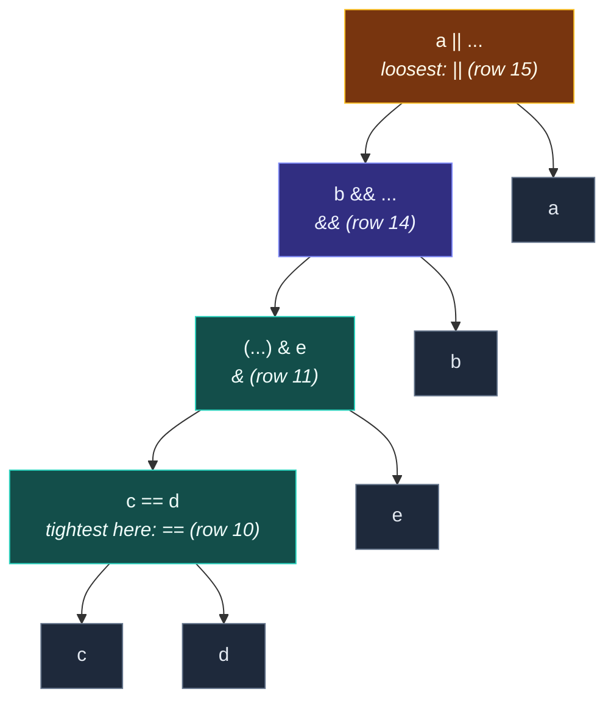

# Precedence and Associativity

> [!essence]
> Precedence decides which operator's operands get grouped first; associativity decides, when two operators of equal precedence sit side by side, which one grouping wins. Together they turn a flat line of operators and operands into exactly one parse tree — a purely compile-time fact, settled before the program computes a single value.

## The Problem

Source code is written flat: `total = base + rate * hours`. Nothing in that line marks which operator's operands are whose — you don't write the nesting, you write a string of tokens and trust the language to nest it consistently the same way every time.

> [!principle] Constraint → Consequence → Requirement → Design → Price
> 1. **Constraint.** [[Anatomy of an Expression|An expression]] is built by nesting smaller expressions inside larger ones, but the surface syntax doesn't require parentheses to mark that nesting. `a + b * c` is legal with none at all.
> 2. **Consequence.** The same flat token sequence is compatible with more than one nesting. `a + b * c` could mean "add, then multiply" or "multiply, then add," and the two groupings generally produce different values — worse, for operands of class type, they can call entirely different overloaded functions, so an unresolved grouping isn't just a wrong number, it's a program with no fixed meaning at all.
> 3. **Requirement.** The grammar needs a **total, fixed ordering** over every pair of operators that can appear next to each other: for any two, it must say unambiguously which one's operands are grouped first (precedence), and for two occurrences of operators tied at the same level, which side gets grouped first (associativity). "Total" is the operative word — the rule can leave *when* something runs unsettled ([[Evaluation Order and Sequencing]]), but it cannot leave *how it's grouped* unsettled for even one combination, or parsing itself would be ambiguous.
> 4. **Design.** C++ doesn't publish precedence as a rule in its own right. `[expr.compound]` lays out the expression grammar as twenty subclauses, from postfix expressions (`[expr.post]`) down to the comma operator (`[expr.comma]`), and each subclause's grammar production takes the *next-tighter* subclause as its operand — a multiplicative expression is built from pm-expressions (the pointer-to-member level) combined with `*`, `/`, `%`; an additive expression is built from multiplicative expressions combined with `+`, `-`; and so on, all the way out to comma. Precedence is nothing but this hierarchy: an operator "has higher precedence" than another exactly when its clause sits closer to the postfix end of that chain. Associativity is a property of how each clause's own grammar rule recurses: a rule that recurses on its *own* left (`multiplicative-expression: multiplicative-expression * pm-expression`) groups repeated operators left to right; a rule shaped to recurse through its right operand instead (assignment's right side is itself allowed to be another assignment) groups right to left. Neither is a separately stated law — both are read off the shape of the grammar.
> 5. **Price.** Because the hierarchy was fixed once, mostly inherited from C, a few relative orderings that read like accidents of history rather than a considered ranking are now effectively permanent. Bitwise AND, XOR and OR bind *looser* than equality and the relational operators — the opposite of what the "AND is like multiplication, OR is like addition" arithmetic analogy would suggest. Fixing it would not make old programs fail to compile; it would make them compile to something *different*, silently, which is a strictly worse failure mode than a compile error. So C++ has never revisited a call C made before `&&` and `||` even existed to tell bitwise `&` apart from logical `&`.

> [!tension] compatibility ⟷ evolution
> A language redesigned from a blank page could rank bitwise AND above equality, matching how most programmers instinctively read `flags & mask == target`. C++ can't: every existing expression that relies on the current ordering would silently change meaning, not fail to build, which is precisely the kind of breakage a compiler can't warn you about after the fact. So the table keeps a mistake its own designer named as one (see Evolution), because the alternative — quietly rewriting the behavior of code nobody is looking at anymore — is worse than living with it.

## Mental Model

> [!model] The silent parenthesizer
> Imagine a step that runs before anything else: the compiler reads your unparenthesized expression once and rewrites it with every grouping parenthesis inserted explicitly, following one fixed rulebook — tighter operators get parenthesized first, and equal-precedence operators are grouped in whichever direction their entry in the rulebook says. What you write as `a || b && c == d & e` is treated, from that point on, as if you had written `a || (b && ((c == d) & e))`. You never see the rulebook applied; you only ever reason about the fully-parenthesized version underneath.
>
> **Where it breaks:** the rulebook fixes *shape*, not *time*. It tells you that `c == d` is `&`'s left operand — it says nothing about whether `c == d`, `e`, or anything else in the expression is evaluated first at run time. Treating "grouped first" as "computed first" is exactly the mistake [[Evaluation Order and Sequencing]] exists to correct.



Reading bottom-up mirrors precedence directly: `==` sits at the deepest, tightest level; `&` wraps it; `&&` wraps that; `||` is the outermost, loosest operator and the last thing grouped. Nothing in this tree says which leaf is evaluated first — only which operator owns which operand.

## Mechanics

| Situation | Rule | Example |
|---|---|---|
| Two operators of different precedence share an operand | The higher-precedence operator's operands group first, regardless of source order | `3 + 4 * 5` groups as `3 + (4 * 5)`, not `(3 + 4) * 5` |
| Two operators of the *same* precedence appear in sequence | Associativity decides the direction; most binary operators are left-to-right | `20 - 15 - 3` groups as `(20 - 15) - 3` = 2, not `20 - (15 - 3)` = 8 |
| Assignment, compound assignment, and the conditional operator | Right-to-left — the rightmost occurrence is grouped first, which is what makes chaining meaningful | `a = b = c` groups as `a = (b = c)`; every variable ends up with `c`'s value |
| Unary prefix operators (`++x`, `-x`, `*p`, `!x`, `sizeof x`) | Always right-to-left, independent of the table row they sit on | `sizeof *p` groups as `sizeof(*p)`, never `(sizeof *)p` |
| Postfix operators and member access (`x++`, `a[i]`, `a.b`, `a->b`) | Always left-to-right | `a[1][2]++` groups as `((a[1])[2])++`; `a.b++` groups as `(a.b)++`, not `a.(b++)` |
| An operator is overloaded for a class type | The overload keeps the *built-in* operator's precedence and associativity — overloading changes what an operator does, never how tightly it binds | `std::cout << a ? b : c` still groups as `(std::cout << a) ? b : c`, because `<<` outranks `?:` regardless of what `operator<<` does |
| Bitwise AND, XOR, OR (`&`, `^`, `\|`) next to equality or relational operators | Bind **looser** — equality and relational group first | `flags & mask == target` groups as `flags & (mask == target)`, not `(flags & mask) == target` |
| Any subexpression wrapped in parentheses | Becomes a single primary expression; the normal rules then apply only *outside* the parentheses | `(a + b) * c` forces the addition to finish before the multiplication starts |

> [!standard] There is no precedence table in the Standard
> `[expr.compound]` never states precedence or associativity as a rule of its own. It defines twenty grammar productions — `[expr.post]` (postfix) through `[expr.comma]` — each one built from the next-tighter production, and the ordering of those subclauses *is* the precedence hierarchy. cppreference's operator-precedence table is a derived summary of that grammar, convenient for lookup, not itself normative. Precedence and associativity are also, explicitly, compile-time facts: they say nothing about [[Evaluation Order and Sequencing|when operands are evaluated]], which is a separate, mostly-unspecified, run-time question.

## Under the Hood

> [!machine] Precedence leaves no trace after parsing
> Once the compiler has built its parse tree, precedence has done its job and disappears — nothing downstream carries a "this used to be `*`-before-`+`" tag. Two source expressions that parse to the *same* tree compile to identical code, even if one used implicit precedence and the other spelled out the grouping by hand. GCC 11, `-O2`, x86-64, on three tiny functions that differ only in parenthesization:
> ```text
> f(int,int,int):     // return a + b * c;      (implicit precedence)
>   imul esi, edx
>   lea  eax, [rsi+rdi]
>   ret
> g(int,int,int):     // return a + (b * c);    (explicit, same grouping)
>   imul esi, edx
>   lea  eax, [rsi+rdi]
>   ret
> h(int,int,int):     // return (a + b) * c;    (different grouping)
>   lea  eax, [rdi+rsi]
>   imul eax, edx
>   ret
> ```
> `f` and `g` emit byte-identical instructions: the front end resolved them to the same parse tree before code generation ever started, so there was never a difference for the backend to preserve. `h`, parsed to a genuinely different tree, computes in the opposite order — addition, then multiplication — and that difference is real, not stylistic. Precedence itself costs nothing at run time; the *grouping it produces* is exactly what determines the arithmetic that runs.

## In Code

**1 · The same default grouping as an explicit one, and a genuinely different one**

```cpp
#include <iostream>

int main() {
    int base = 100, rate = 6, hours = 8, weeks = 2, bonus = 15;

    int pay1 = base + rate * hours / weeks + bonus;     // ①
    int pay2 = base + (rate * hours) / weeks + bonus;   // ②
    int pay3 = (base + rate) * (hours / weeks + bonus); // ③

    std::cout << pay1 << ' ' << pay2 << ' ' << pay3 << '\n';
}
// expect: 139 139 2014
```
1. `*` and `/` share precedence and are left-associative, and both outrank `+`, so this groups as `base + (((rate * hours) / weeks)) + bonus`.
2. The explicit parentheses spell out exactly the grouping precedence already produced — same value, same parse tree, as confirmed under the hood.
3. Forcing addition before multiplication changes which numbers combine with which, and the result is nowhere close: `106 * 19`, not `100 + 24 + 15`.

**2 · Postfix `++` binds tighter than unary `*`, so `*p++` moves the pointer**

```cpp
#include <iostream>

int main() {
    int scores[] = {10, 20, 30};

    int* p = scores;
    std::cout << *p++ << ' ';    // ①
    std::cout << *p << '\n';     // ②

    int* q = scores;
    std::cout << (*q)++ << ' '; // ③
    std::cout << *q << '\n';    // ④
}
// expect: 10 20
// expect: 10 11
```
1. Postfix `++` outranks unary `*`, so `*p++` groups as `*(p++)`: increment the *pointer*, then dereference its old value. Prints the first element.
2. `p` now points one past where it started, so a second dereference reads the second element.
3. Parentheses force the opposite grouping: `(*q)` first, then `++` applies to the `int` it names — the pointer never moves, the pointee does.
4. Reading `*q` again shows the same address, now holding the incremented value.

**3 · Overloading `<<` never touches where `?:` sits in the table**

```cpp
#include <iostream>

int main() {
    int reading = 42, high = 1, low = 0;

    std::cout << reading ? high : low; // ①
    std::cout << '\n';
}
// expect: 42
```
1. `<<` (row 7) outranks `?:` (row 16) no matter what `operator<<` for `std::ostream` actually does, so this is `(std::cout << reading) ? high : low;`, not "print whichever of `high`/`low` the reading selects." The stream write happens and prints `42`; the conditional then runs on the resulting `ostream&` (contextually converted to `bool`) and its result is thrown away. GCC warns here — `-Wunused-value` fires on both the second and third operand of `?:` — because the ternary provably does nothing observable.

## Pitfalls

> [!trap] The masked-bit test that silently checks the wrong thing
> `&`, `^` and `|` bind looser than `==` and the relational operators, so the natural-looking `flags & mask == target` does **not** test whether the masked bits equal `target`.

```cpp
#include <iostream>

int main() {
    unsigned flags = 0b0110, mask = 0b0011, target = 0b0010;
    bool intended = (flags & mask) == target; // ①
    bool trap     =  flags & mask  == target; // ②
    std::cout << std::boolalpha << intended << ' ' << trap << '\n';
}
// expect: true false
```
1. The parenthesized version tests the bits directly: `0b0110 & 0b0011` is `0b0010`, which equals `target`.
2. Without parentheses, `mask == target` (`0b0011 == 0b0010`) evaluates first, to `false`, and `flags & false` collapses to `0`, so the "test" reports failure even though the bits match. GCC's `-Wparentheses` flags exactly this shape ("suggest parentheses around comparison in operand of `&`"); treat that warning as load-bearing, not stylistic.

> [!history] A mistake its own designer named
> Dennis Ritchie's own retrospective on C's development says that, in hindsight, `&`/`|` should have outranked `==` — but by the time `&&` and `||` existed to take over logical AND/OR and free `&`/`|` for bitwise-only use, enough C source already depended on the old ordering that reversing it would have silently changed the meaning of working programs rather than merely failing to compile them. C++ inherited the table as-is, for the same reason: see the Problem's `[!tension]`.

> [!trap] "It parses, so it must mean what I meant"
> None of these examples produce a compile error. A misplaced assumption about precedence is not a syntax error — the expression is perfectly legal C++, it just isn't the expression you intended. `-Wparentheses` and `-Wunused-value` catch the two shapes above; there is no warning that catches every case, so parenthesizing anywhere the grouping isn't obvious on sight is cheaper than reasoning about it every time.

## Evolution

| Standard | Change | Why |
|---|---|---|
| C (1970s) | `&`, `^`, `\|` given lower precedence than `==` and the relational operators | `&&`/`\|\|` didn't yet exist to separate logical from bitwise; once they were added, the "wrong" ordering was already load-bearing in existing source |
| C++98 | Inherits C's expression grammar essentially unchanged; new operators (`::`, `.*`, `->*`, `dynamic_cast`, `new`, `delete`) are slotted into the existing hierarchy | Source compatibility with C, and internal consistency with a table that was already fixed |
| **C++20** | Three-way comparison `<=>` inserted as its own precedence level, between shift and the relational operators (P0515) | A new comparison operator needed a slot that collided with neither the relational nor the equality tier |

## Connections

- **Prerequisites:** [[Anatomy of an Expression]] — this note answers the *shape* half of "every expression has a type and a value category, and combines with others somehow"; the *when* half is [[Evaluation Order and Sequencing]].
- **Enables:** [[Evaluation Order and Sequencing]] (now that grouping is fixed, timing is the only open question left) · [[Prefix vs Postfix Increment]] (built entirely on the unary-vs-postfix associativity split shown in example 2) · [[Operator Overloading]] (must preserve the built-in precedence and associativity shown in the Mechanics table) · [[Control Flow — Selection and Iteration]] (an `if`, `while`, or `for` condition is an ordinary expression, so a compound condition like `a < b < c` is parsed by exactly this table before it is ever tested).
- **Siblings:** [[Map — Expressions & Control]], the domain hub this note belongs to.
- **Practice:** CPP Project Continuum #2–#3 — any compound expression written without parentheses is a chance to write out its silent-parenthesizer form before trusting the output.

## Check Yourself

> [!quiz]- What two independent facts does the Standard's expression grammar fix for every pair of operators, and where does the Standard actually state a "precedence level" as a numbered rule?
> Which operator's operands group first (precedence) and, for equal-precedence operators, which direction wins (associativity). It never states either as a numbered rule: both are read off the order of `[expr.compound]`'s subclauses and the left- or right-recursive shape of each one's grammar production.

> [!quiz]- Why does overloading `operator<<` for a custom type never change whether `std::cout << x << y` needs parentheses around a following `?:`?
> Because overloading changes only what an operator's function body does with its operands, never the operator's precedence or associativity — those are properties of the built-in operator token itself, fixed by the grammar, and every overload of that token inherits them unchanged.

> [!quiz]- Predict: `int a = 1, b = 2, c = 3; std::cout << (a < b < c);` — what prints, and why is this rarely what a programmer means by "is `b` between `a` and `c`"?
> `1` (true). `<` is left-associative, so this groups as `(a < b) < c`: `1 < 2` is `true`, promoted to the integer `1`, and `1 < 3` is `true` again. It happens to print the "right" answer here only because the intermediate promotion stayed small; `<` cannot chain the way it does in mathematical notation, because each `<` compares only two things — one of which is silently a `bool` promoted to `int` — not three.

> [!quiz]- `unsigned flags = 0b0110, mask = 0b0011, target = 0b0010; bool r = flags & mask == target;` — what is `r`, and what single change fixes it to test the masked bits?
> `false`. `==` outranks `&`, so this is `flags & (mask == target)`: `mask == target` is `false` (`0`), and `flags & 0` is `0`. Wrapping the intended sub-test in parentheses — `(flags & mask) == target` — fixes it and evaluates to `true`.

## Sources

- Primer §4.1.2 "Precedence and Associativity" (p. 136): compound expressions require grouping; precedence and associativity determine it; the worked `6 + 3 * 4 / 2 + 2` example showing why the result is 14, not 9, 20 or 36. §4.1.2 (p. 137): precedence and pointer arithmetic (`*(ia + 4)` vs `*ia + 4`); IO chaining depends on left-associativity of `<<`/`>>`. §4.1.3 "Order of Evaluation" (p. 138): precedence and associativity are independent of order of evaluation, illustrated with `f() + g() * h() + j()`. §4.8 "The Bitwise Operators" (p. 155): shift operators are left-associative and have midlevel precedence — lower than arithmetic, higher than relational/assignment/conditional; `cout << 10 < 42;` fails to compile as intended because it groups as `(cout << 10) < 42`. §4.9 "The sizeof Operator" (p. 156): `sizeof` is right-associative. Chapter 14 summary (p. 590): an overloaded operator has the same number of operands, associativity and precedence as the built-in operator.
- PPP §3.7 "Language features": "the usual mathematical rules of operator precedence apply," `length + width * 2` means `length + (width * 2)`, with the first rule of thumb being "when in doubt, parenthesize."
- Tour §1.4 "Types, Variables, and Arithmetic" (p. 6): expressions built from literals, names and operators, precedence assumed rather than restated.
- cppreference, *C++ operator precedence*: https://en.cppreference.com/w/cpp/language/operator_precedence — the derived summary table; states plainly that "the standard itself doesn't specify precedence levels: they are derived from the grammar," that precedence/associativity are compile-time concepts independent of run-time evaluation order, and that overloading never changes an operator's precedence (the `std::cout << a ? b : c` example is drawn from this page).
- Draft standard `[expr.compound]`: https://eel.is/c++draft/expr.compound — the twenty ordered subclauses (`[expr.post]` through `[expr.comma]`) whose sequence *is* the precedence hierarchy; `[expr.mul]`, `[expr.add]`, `[expr.assign]` for the specific left- vs right-recursive grammar shapes behind associativity.
- Dennis M. Ritchie, "The Development of the C Language" (1993), §"Neonatal C": the retrospective on why `&`/`|` were left with lower precedence than `==` after `&&`/`||` were introduced, and why it was never fixed. https://www.bell-labs.com/usr/dmr/www/chist.html
- P0515R3, *Consistent comparison* (the spaceship operator's precedence placement): https://wg21.link/p0515r3
- See [[Guide — cppreference, the Draft Standard and the Core Guidelines]] for navigating `[expr.compound]` directly.
