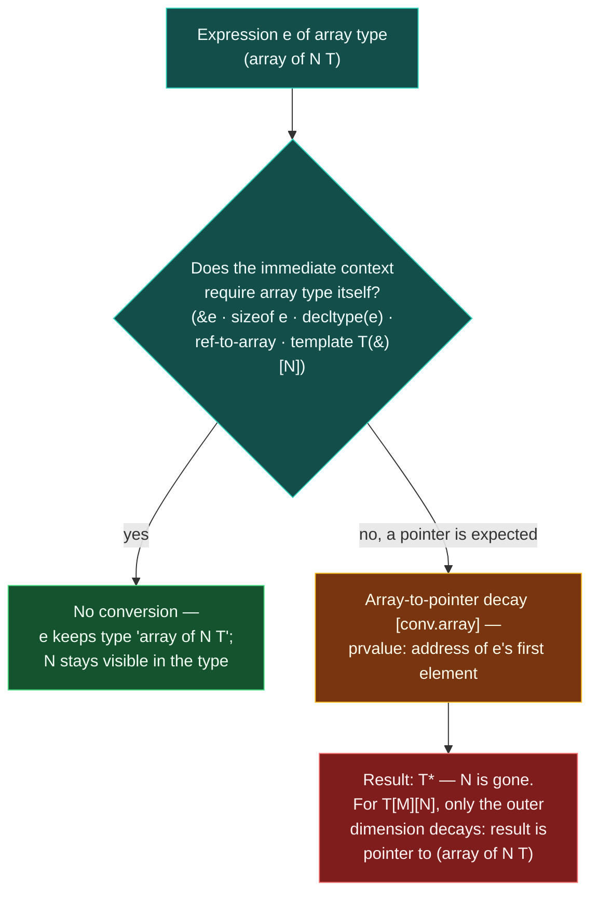

# Built-in Arrays and Array-to-Pointer Decay

> [!essence]
> An array is not a pointer: `int arr[5]` is five contiguous `int`s, with no separate slot anywhere holding "the address of element 0." Yet almost everywhere an array is used, the compiler silently converts it to a pointer to its first element — a standard conversion called **array-to-pointer decay**. The conversion costs nothing, because the address was already implicit in the array's own storage; what it costs is the array's length, which the resulting pointer has no way to carry.

## The Problem

An array's whole appeal is that it has no bookkeeping: `int arr[5]` is 20 contiguous bytes and nothing else ([[Storage Duration]] already fixed *where* those bytes live). Unlike `std::vector`, no hidden member stores "the address of the first element" as data — that address simply *is* the array's own address. But almost every operation a program performs — arithmetic, comparison, passing a value into a function compiled to expect one address in one register — is defined on scalars, not on whole aggregate objects. `arr + 1`, `arr == other`, and `f(arr)` all need a single address to work with, not a 20-byte object.

> [!principle] Constraint → Consequence → Requirement → Design → Price
> 1. **Constraint.** An array object carries its address implicitly (the object's own location) and nothing else; it has no stored pointer member, and the language defines arithmetic, comparison and most calling conventions on scalar addresses, not on aggregate array objects.
> 2. **Consequence.** An expression of array type arriving where a scalar address is expected — a function parameter, one side of `+`, one side of `==` — has no defined meaning yet. Without a rule, every such context would need its own special case for "when the operand happens to be an array."
> 3. **Requirement.** The language needs one uniform, free conversion from "array" to "address of its first element," available wherever a pointer is expected — and, since C++ inherited arrays and this exact convenience from C, it needs to keep behaving the way C programs already assumed.
> 4. **Design.** **Array-to-pointer decay** (`[conv.array]`): an expression `e` of type "array of `N` `T`" implicitly converts to a prvalue of type "pointer to `T`," whose value is the address of `e`'s first element, in any context that expects a pointer and doesn't specifically ask for the array itself. A related but distinct rule, function-parameter adjustment (`[dcl.fct]` ¶5), rewrites an array-typed function *parameter's declared type* to a pointer type at compile time, before any call happens — same practical effect, different trigger, and worth keeping separate in your head (Step by Step §4).
> 5. **Price.** Decay is exactly as cheap as doing nothing: the pointer's value is bits the array already had (Under the Hood). What's gone is `N`. Once an array has decayed, no type-level trace says how many elements it had — every function that receives "an array" through an ordinary parameter must be told the size some other way, and every reader must remember that "pointer" sometimes means "the address a much bigger object used to have."

> [!tension] compatibility ⟷ evolution
> Decay is C++'s clearest inherited compromise: C never had a first-class array type that carried its own length, so "array" and "pointer to its first element" were already nearly interchangeable when C++ adopted arrays wholesale. Breaking that equivalence would have broken enormous amounts of existing code; keeping it means every C++ program still carries C's central array weakness. [[span]] (C++20) and reference-to-array parameters are the language's later, additive fix — they don't remove decay, they give you a way to route around it.

## Mental Model

> [!model] A coupled train, reduced to "the engine is here"
> An array is a train of `N` identical carriages coupled end to end — one object, a fixed length, with no separate manifest anywhere recording how many carriages follow; the length is simply how far the carriages extend past the locomotive. Handing someone "a pointer to the array" is like radioing them the locomotive's coordinates: enough to find carriage 0, but the coordinate alone says nothing about whether nine carriages trail behind it or none.
> **Where it breaks:** a dispatcher who receives only a location still knows to ask "how many cars," because real trains travel with paperwork. The compiler attaches no such paperwork to a decayed pointer — the car count lived only in the sender's own type information, and once decay has fired, nothing forces anyone downstream to ask for it again.

```text
 int arr[5] = {10,20,30,40,50};      ONE array object — 5 contiguous ints, no stored pointer

 address   0x2000   0x2004   0x2008   0x200c   0x2010
          ┌────────┬────────┬────────┬────────┬────────┐
 value    │   10   │   20   │   30   │   40   │   50   │
          └────────┴────────┴────────┴────────┴────────┘
 type: int[5]   sizeof(arr) == 20

 int* p = arr;                       DECAY — a prvalue pointer, formed on the spot

 automatic storage
┌─────────────────────┐
│ p : int*             │
│  value: ●────────────┼────────────▶ 0x2000   (arr's own address — nothing was looked up)
└─────────────────────┘
 type: int*   sizeof(p) == 8   — N is simply gone: nothing in p's type or value says "5"
```

Contrast [[Pointers|an ordinary pointer variable]], which is a second object that *stores* an address someone wrote into it. `p` here is exactly that — but the address it holds came from a conversion, not an assignment someone could audit for "did this used to be an array." The bits are identical either way; only the type system, briefly, knew the difference.

## Step by Step



1. **Start with an array-typed expression.** Usually a named array lvalue (`arr`). Since C++17, an array can also be a *prvalue* (a temporary of array type); converting one first materializes it into an addressable temporary before decay proceeds (`[conv.array]`) — a corner case, not the everyday path.
2. **Ask whether the immediate context needs the array itself.** A short, fixed list of contexts bind to the array's own type and so never trigger decay: the operand of unary `&` (which yields "pointer to array," `T(*)[N]`, a different type from a decayed `T*`); the operand of `sizeof`; the unevaluated operand of `decltype`; the initializer of a reference to array, `T(&)[N]`; and a function-template parameter declared `T (&)[N]`, which deduces `N` as part of the call (cppreference, *Array declaration* §Array-to-pointer decay). A range-for loop over an array reads `N` off `arr`'s own declared type to compute its end bound before the pointer that actually walks the elements gets formed.
3. **Otherwise, decay fires.** Wherever a pointer is expected and an array is offered — assigning to `auto`, calling an ordinary `T*` function, arithmetic, comparison — the compiler applies `[conv.array]`: the result is a prvalue `T*` holding the address of element 0. No computation happens; see Under the Hood.
4. **A function *parameter* declared as an array is a separate rule, not this conversion.** `[dcl.fct]` ¶5 rewrites a parameter's declared type from "array of `T`" to "pointer to `T`" while the function's type is being formed — before the function is ever called, let alone passed an argument. That is why `void f(int a[5])` and `void f(int* a)` declare the *same* function, not two overloads (`[dcl.fct]`'s own example: `void f(char*); void f(char[]) {}` defines the first declaration, it doesn't redeclare it).
5. **Once a `T*` exists — by either route — `N` cannot be recovered from it.** Not by `sizeof`, not by the type system, not at run time. The only way to have `N` later is to have captured it earlier, in step 2, before decay had a chance to discard it.
6. **A multidimensional array decays only one layer.** `int m[2][3]` has type "array of 2 (array of 3 `int`)." Decay strips the outer array, leaving "pointer to (array of 3 `int`)" — written `int (*)[3]` — not `int**`: the inner dimension survives as part of the pointee type, because decay is defined once, on the outermost array, not recursively.

## Under the Hood

> [!machine] Decay is zero instructions — GCC 11.4.0, x86-64 Linux, `-O2`
> ```nasm
> first_element(int (&)[5]):   ; int* first_element(int (&arr)[5]) { return arr; }
>         mov   rax, rdi        ; ① the reference's address, unchanged, returned as int*
>         ret
> ```
> ① The parameter already arrives as an address (a reference is passed as one, same as a pointer). Converting it to `int*` on return changes nothing about the bits in `rax` — decay is a compile-time reinterpretation of a value the program already had, never a runtime lookup or copy.

> [!machine] The compiler's own records say "pointer," not "array" — GCC 11.4.0, x86-64 Linux
> Compiling `void take_array(int a[5]) {}` and reading its mangled symbol back with `c++filt` reports `take_array(int*)` — the linker-visible signature already lost the `[5]`, exactly as `[dcl.fct]` ¶5 requires. Separately, `sizeof(a)` written *inside* `take_array` triggers GCC's own `-Wsizeof-array-argument` diagnostic: *"'sizeof' on array function parameter 'a' will return size of 'int*'"* — the compiler warning about the exact naive expectation this note's first example is built to break.

## In Code

**1 · The naive expectation, broken on purpose**

```cpp
#include <cstdio>

void report_size(int a[5]) {                              // ① really `int* a`
    std::printf("inside function: %zu\n", sizeof(a));      // ② sizeof(int*), not sizeof(int[5])
}

int main() {
    int arr[5] = {1, 2, 3, 4, 5};
    std::printf("in main:          %zu\n", sizeof(arr));   // ③ sizeof(int[5])
    report_size(arr);
}
// expect: in main:          20
// expect: inside function: 8
```
1. `int a[5]` as a parameter is adjusted to `int*` before `report_size` is ever called (`[dcl.fct]` ¶5) — the naive reading, "a 5-element array inside the function too," is exactly what this example disproves.
2. `sizeof(a)` measures the pointer GCC's own layout gives `int*` on this ABI (8 bytes) — see Under the Hood's warning.
3. The *caller's* `arr` is still a real, undecayed array object: `sizeof` here sees `int[5]` directly (`5 * sizeof(int) = 20`), because `sizeof`'s operand is one of the contexts that never triggers decay (Step by Step §2).

**2 · `auto` decays; `decltype` doesn't**

```cpp
#include <cstdio>
#include <type_traits>

int main() {
    int ia[10] = {0,1,2,3,4,5,6,7,8,9};
    auto ia2 = ia;                  // ① auto deduces from the decayed type
    decltype(ia) ia3 = {0};         // ② decltype's operand is unevaluated: no decay

    std::printf("%d %d\n",
        std::is_same_v<decltype(ia2), int*>,
        std::is_same_v<decltype(ia3), int[10]>);
}
// expect: 1 1
```
1. `auto`'s deduction rules treat the initializer as an ordinary expression, so the array-to-pointer conversion applies before deduction sees it: `ia2` is `int*` (Primer §3.5.3, p. 117).
2. `decltype(ia)` never evaluates `ia` as an expression at all — it reads `ia`'s declared type directly, so decay has nothing to act on: `ia3` is a genuine `int[10]`.

**3 · What doesn't decay: `&arr` and a reference-to-array template parameter**

```cpp
#include <cstdio>
#include <type_traits>

template <class T, std::size_t N>
constexpr std::size_t count(T (&)[N]) { return N; }    // ① N deduced from the array's own type

int main() {
    int arr[7]{};
    static_assert(std::is_same_v<decltype(&arr), int(*)[7]>);   // ② pointer-to-array, not decay
    std::printf("%zu\n", count(arr));                            // ③
}
// expect: 7
```
1. Binding `arr` to `T (&)[N]` is reference initialization, one of the contexts that needs the array's own type — so template argument deduction gets to read `N` directly off it, unlike a plain `T*` parameter.
2. `&arr` applied to an array lvalue takes the address of the *whole object*: its type is "pointer to array of 7 `int`," a different type from the `int*` decay would have produced (cppreference, *Array declaration*).
3. `count` recovers `N` because step 2 of Step by Step never let decay happen — the size travelled through the reference intact.

**4 · A multidimensional array decays only its outer dimension**

```cpp
#include <cstdio>
#include <type_traits>

int main() {
    int matrix[2][3] = {{1,2,3},{4,5,6}};
    int (*p)[3] = matrix;             // ① decays to pointer-to-(array of 3 int), not int**
    static_assert(std::is_same_v<decltype(p), int(*)[3]>);
    std::printf("%d %d\n", p[0][0], p[1][2]);   // ②
}
// expect: 1 6
```
1. `matrix` has type "array of 2 (array of 3 `int`)"; decay strips exactly the outer array, leaving `int (*)[3]` — a pointer to one whole row. Writing `int** p = matrix;` is ill-formed: there is no second decay to turn the inner array into a pointer too (cppreference, *Array declaration* §Multidimensional arrays).
2. `p[1]` is the second row (itself `int[3]`, which decays again *here*, in this new expression); `p[1][2]` reaches `matrix[1][2] == 6`.

## Consequences

| What this mechanism explains | Why |
|---|---|
| A function parameter declared `int a[10]` behaves exactly like `int* a`, including inside `sizeof` | `[dcl.fct]` ¶5 adjusts the parameter's declared type at compile time, before any call — Step by Step §4, Under the Hood; see [[Functions and Parameters — The Complete Picture]] |
| `void draw(Shape* p, int n); draw(circles, 10);` compiles for `Circle circles[10]` and reads garbage from `i == 1` on | Decay turns `circles` into `Circle*`; an ordinary derived-to-base conversion then relabels it `Shape*` — but that pointer addresses one `Shape` *subobject*, not an array of them. By the same "a lone object is its own one-element array" rule [[Pointer Arithmetic and Arrays|Pointer Arithmetic]] documents, `p[1]` is already past that one element's bound: undefined behavior, not merely a stride mismatch. See Core Guidelines I.13, and [[Object Slicing]] for the sibling failure hiding in the same line. |
| `arr + n`'s scaling and one-past-end rules operate on a pointer, never on the array itself | This mechanism is what supplies that starting pointer — [[Pointer Arithmetic and Arrays]] |
| A C-style string is a `char` array that has already decayed to `const char*`; its length isn't in the type, so code needs a sentinel (`'\0'`) instead | [[C-Style Strings]] is the full treatment |
| `std::span` (C++20) and a reference-to-array parameter `T (&)[N]` are the two standard fixes for "the size got lost" | Both capture `N` in step 2 of Step by Step, before decay can discard it |

## Connections

- **Prerequisites:** [[Pointers]] (decay's entire output type) · [[Storage Duration]] (why an array's elements are one contiguous object with no stored address of their own).
- **Enables:** [[Pointer Arithmetic and Arrays]] (the operations this mechanism's output pointer supports) · [[C-Style Strings]] (a `char` array, permanently viewed through its decayed form) · [[Functions and Parameters — The Complete Picture]] (why array parameters silently become pointer parameters).
- **Siblings:** [[References]] (`T (&)[N]` is the access path that captures `N` instead of losing it) · [[span]] (the C++20 type built specifically to carry the length decay throws away) · [[array]] (the library's fixed-size replacement: identical layout and cost, but no decay rule applies to it at all).
- **Hazards:** [[Object Slicing]] (compounds with decay in the classic `draw(Circle[], n)` bug) · [[Buffer Overruns and Out-of-Bounds Access]] (a decayed pointer carries no bound for a sanitizer or a reader to check against).
- **Domain:** [[Map — Objects, Memory & Lifetime]].
- **Practice:** *Continuum #11 Pointer & Array Internals Lab* — print `sizeof` of the same array both in `main` and inside a function that receives it by a plain array parameter, and confirm the two numbers disagree exactly as Example 1 predicts.

## Check Yourself

> [!quiz]- Why does `int* p = arr;` need no instruction to "look up" an address — what would decay even be copying?
> An array has no stored pointer member: the address a decayed pointer ends up holding is simply the array object's own address, which the compiler already knows at compile time. Converting is a change of static type, not a run-time action — see Under the Hood's single `mov`.

> [!quiz]- `void f(int a[5])` and `void f(int* a)` are not overloads — they declare the same function. Why doesn't the compiler complain about "redefinition" when both appear?
> `[dcl.fct]` ¶5 adjusts an array-typed parameter to a pointer type while the function's type is being formed, before the parameter list is compared against anything else. Both declarations produce the identical function type `void(int*)`, so defining the second is completing the first's declaration, not conflicting with it.

> [!quiz]- Predict: what does the program in Example 1 print, and why do the two `sizeof` calls disagree?
> `20` then `8` (on this LP64 toolchain). `sizeof(arr)` in `main` sees a genuine `int[5]` (`sizeof` is one of the contexts that never triggers decay); `sizeof(a)` inside `report_size` sees the parameter's true, already-adjusted type, `int*`.

> [!quiz]- Why does `&arr` have type `int(*)[7]` rather than `int**` or a decayed `int*`?
> Unary `&` applied directly to an array lvalue takes the address of the whole array object, not of some element — that is simply a different operation from decay, and it was never in decay's list of triggering contexts to begin with (Step by Step §2). The result names a pointer to the entire 7-`int` object.

## Sources

- Primer §3.5.3 "Pointers and Arrays" (pp. 117–118): the core conversion, the `auto` vs. `decltype` divergence, pointers as iterators over an array. Primer §6.2.4 "Array Parameters" (pp. 217–219): why an array parameter's declared bound is ignored, and the reference-to-array alternative.
- Tour §1.7 "Pointers, Arrays, and References" (pp. 11–13): arrays and pointers introduced side by side, including a C-string function that relies on decay to accept a string literal.
- cppreference, *Array declaration* §Array-to-pointer decay, §Multidimensional arrays: https://en.cppreference.com/w/cpp/language/array
- Draft standard `[conv.array]` (the conversion itself, incl. the C++17 prvalue-materialization case): https://eel.is/c++draft/conv.array · `[dcl.fct]` ¶5 (function parameter type adjustment, a separate rule with the same practical effect): https://eel.is/c++draft/dcl.fct
- C++ Core Guidelines I.13 "Do not pass an array as a single pointer": https://isocpp.github.io/CppCoreGuidelines/CppCoreGuidelines#Ri-array
