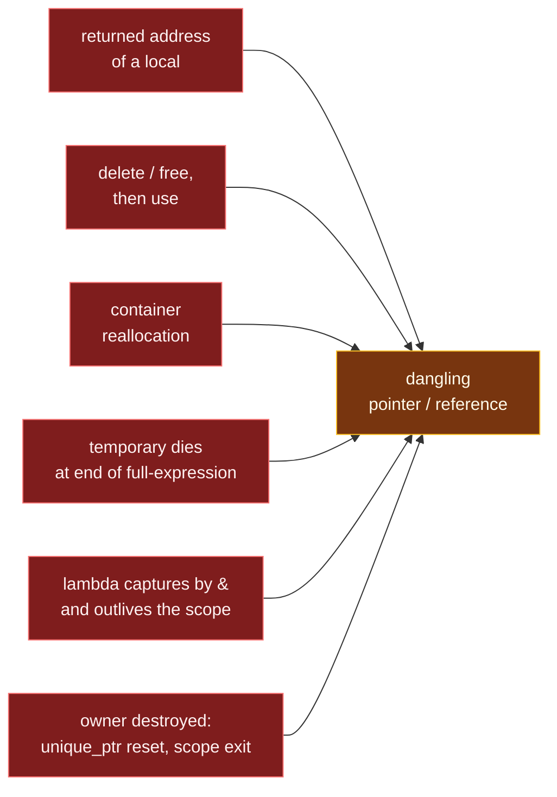

# Dangling Pointers and References

> [!essence]
> A pointer or reference **dangles** when the object it refers to has ended its lifetime while the pointer lives on. Using it is **undefined behavior**. C++ never tracks *who still looks at* an object, only *when it dies*. Keeping every observer inside the lifetime of what it observes is therefore the programmer's job.

## Symptom

Dangling bugs are the most deceptive family in C++ because the program usually *seems* to work:

- The value is **right in debug builds and wrong in release**, or right until an unrelated line is added. The dead object's bytes still hold the old value until something reuses the memory.
- A crash or corrupted value appears **far from the cause**: in a different function, later in time, inside the allocator.
- **Nondeterminism:** it depends on input size, timing, or which thread allocated last.
- In security terms, a *use-after-free* is one of the most exploited vulnerability classes in C and C++ software.

## Root Cause

> [!principle] Why the language allows it
> 1. **Constraint:** Tracking every pointer to every object at run time (as garbage collectors or reference counts do) costs time and memory on *every* access.
> 2. **Design:** C++ ties object lifetime to scope or explicit `delete` ([[RAII]]) and lets pointers and references be plain addresses at zero overhead ([[Zero-Overhead Principle]]) — the trade the whole language commits to (see [[Map — What C++ Is]]).
> 3. **Price:** An address carries no information about whether its object is alive. Once the object's lifetime ends, `[basic.life]` already forbids almost every use of the pointer. Once its *storage* is released as well, the pointer's value becomes an *invalid pointer value* (`[basic.stc.general]`), and indirection through it is undefined behavior.

The failure always has the same shape. **The observer's lifetime extends past the observed object's lifetime:**

```text
 time ─────────────────────────────────────────────────────────────────▶
 object        ├───────────── lifetime ─────────────┤  ✝ destroyed / freed
 pointer/ref   ├──────────── valid ─────────────────┤╌╌╌╌╌ dangling ╌╌╌╌╌╌▶
                                                            ▲
                                                 any read/write here = UB
```

Almost every dangling bug comes from one of six ways an object's life ends while someone still looks at it:



## Minimal Reproduction

**1 · A reference into a vector that reallocates** (heap use-after-free)

```cpp
// cc: ub
#include <iostream>
#include <vector>

int main() {
    std::vector<int> scores{90, 85};
    int& best = scores[0];          // ① refers into the vector's heap buffer
    scores.push_back(70);           // ② capacity exceeded: buffer reallocated, old one freed
    std::cout << best << '\n';      // ③ UB: reads freed memory
}
```
1. `best` refers to an element, and the element lives in a heap block the vector owns.
2. `push_back` beyond capacity allocates a new block, moves the elements, and frees the old block. See [[How vector Grows — Capacity and Amortized Cost]] and [[Iterator Invalidation]].
3. ASan reports `heap-use-after-free`. Without it, this often prints `90` *by accident*.

**2 · A view of a temporary** (the modern classic)

```cpp
// cc: ub
#include <iostream>
#include <string>
#include <string_view>

std::string make_greeting() { return std::string(40, '*') + " welcome"; }

int main() {
    std::string_view view = make_greeting();   // ① temporary string dies at the ';'
    std::cout << view << '\n';                 // ② UB: the characters were freed
}
```
1. `string_view` is a non-owning (pointer, length) pair. Initializing it from a temporary `std::string` does **not** extend the string's lifetime: lifetime extension applies only when a *reference* binds directly to the temporary ([[Temporaries and Lifetime Extension]]).
2. A heap-allocated buffer (40+ characters: beyond the small-string buffer) makes ASan report the bug deterministically.

**3 · Returning a reference to a local** (stack use-after-return)

```cpp
// cc: ub
#include <iostream>

const int& larger(int a, int b) {
    return a > b ? a : b;           // ① reference to a parameter: dead by the next statement
}

int main() {
    const int& r = larger(3, 7);
    std::cout << r << '\n';         // ② UB: the callee's frame is gone
}
```
1. Parameters are local objects of the callee. Whether a parameter dies when the function returns or at the end of the caller's full-expression is implementation-defined (`[expr.call]`). Either way it is gone before `r` is next used. GCC warns (`-Wreturn-local-addr`).
2. The stack slot is reused by the next call (here, the `operator<<` machinery), so the value is garbage or the program crashes.

## Detection

| Tool | Catches it? | How |
|---|---|---|
| **Compiler warnings** (`-Wall -Wextra`) | ~ some | GCC: `-Wreturn-local-addr`, `-Wdangling-pointer` (12+), `-Wdangling-reference` (13+). Clang: `-Wreturn-stack-address`, `-Wdangling`, `-Wdangling-gsl` (catches `string_view` from a temporary). Local, pattern-based: misses most real cases. |
| **AddressSanitizer** (`-fsanitize=address`) | ✓ at run time | Poisons freed and out-of-scope memory: `heap-use-after-free`, `stack-use-after-scope`, `stack-use-after-return` (with `ASAN_OPTIONS=detect_stack_use_after_return=1`). Only on executed paths. |
| **Static analysis** | ~ some | clang-tidy `bugprone-dangling-handle`, `bugprone-use-after-move`, Clang Static Analyzer `cplusplus.NewDelete` (use after delete). |
| **Valgrind memcheck** | ~ heap only | Invalid reads of freed heap blocks; ~20–50× slowdown. |
| **Code review heuristic** | ✓ if you ask the question | For every pointer, reference, view, iterator and by-reference capture: *"who owns the target, and do they outlive me?"* |

## Fix

The fix is always one of three moves: **own it** (copy or move the value in), **shorten the observer** (use it only inside the target's lifetime), or **lengthen the target** (share ownership deliberately).

**✗ Observer outlives the target → ✓ observer owns a copy or indexes**

```cpp
#include <iostream>
#include <string>
#include <vector>

std::string make_greeting() { return std::string(40, '*') + " welcome"; }

int main() {
    std::vector<int> scores{90, 85};
    std::size_t best = 0;                    // ① an index survives reallocation
    scores.push_back(70);
    std::cout << scores[best] << '\n';

    const std::string greeting = make_greeting();   // ② own the characters
    std::cout << greeting.size() << '\n';
}
// expect: 90
// expect: 48
```
1. Indices (or a `reserve` done before taking references) remain valid across growth. References and iterators do not.
2. Store an owning `std::string` whenever the data must outlive the expression that produced it. Keep `string_view` for *parameters*, where the caller's argument outlives the call.

## Prevention Rules

> [!rule] Return values, not addresses of locals
> Never return a pointer or reference to a local variable or parameter. Return by value: [[Copy Elision and RVO|copy elision]] makes it free. *(Core Guidelines F.43)*

> [!rule] Non-owning types are for parameters and short scopes
> `T&`, `T*`, `std::string_view`, `std::span`, iterators: use them as function parameters, or inside a scope visibly shorter than their target's. Don't store them in members unless the owner's lifetime is documented and enforced.

> [!rule] Capture by value when the lambda escapes
> A lambda stored, returned, or passed to another thread must not capture locals by `&`. *(Core Guidelines F.53)*

> [!rule] Don't hold references into a container you mutate
> Know each container's invalidation rules ([[Iterator Invalidation]]), or hold indices or keys instead.

> [!rule] Test under AddressSanitizer
> Run every test suite with `-fsanitize=address,undefined` in CI ([[Sanitizers — ASan, UBSan, TSan]]). Most dangling bugs that survive review die here.

## Connections

- **Root concept:** [[Object Lifetime]] · [[Storage Duration]] · [[Undefined Behavior]].
- **Special cases with their own files:** [[Iterator Invalidation]] · [[Temporaries and Lifetime Extension]] · [[The Moved-From State]] · [[Double Free and Mismatched new-delete]].
- **Structural cures:** [[RAII]] (who releases) · [[Owning vs Observing Pointers]] (who merely looks) · [[weak_ptr and Reference Cycles]] (an observer that can check).
- **Siblings:** [[Pointers vs References]] (both can dangle) · [[string_view]] · [[span]].
- **Domain:** [[Map — Objects, Memory & Lifetime]].
- **Practice:** *Continuum #11 Pointer & Array Internals Lab* (reproduce all three bugs under ASan) · *#13 Linked List Library* · *#25 Smart Pointer Refactor Lab*.

## Check Yourself

> [!quiz]- The vector example often prints the right number without sanitizers. Why is that *not* evidence the code is correct?
> Freeing memory doesn't erase it. The old bytes stay until the allocator reuses the block. Undefined behavior includes "appears to work", and a different allocation pattern, optimization level or platform changes the result.

> [!quiz]- Spot the bug: `struct Config { std::string_view name; }; Config load() { std::string n = read_name(); return Config{n}; }`
> `Config::name` views `n`'s characters, and `n` is destroyed when `load` returns. Every use of the returned `Config` reads freed memory. Store `std::string name;` in the struct.

> [!quiz]- Why does `const std::string& r = std::string("abc");` *not* dangle, while `std::string_view v = std::string("abc");` does?
> A reference binding directly to a temporary extends the temporary's lifetime to the reference's. `string_view` is a class object, not a reference. The conversion (`std::string`'s `operator std::string_view`) is called on the temporary and returns a view of its characters, so no extension happens, and the string dies at the `;`.

## Sources

- Primer §2.3.2 "Pointers" (p. 52): valid vs invalid pointer states.
- Primer §12.1.2 "Managing Memory Directly" (pp. 458–464; dangling pointers after `delete` on p. 463).
- Primer §9.3.6 "Container Operations May Invalidate Iterators" (p. 353).
- Tour §15.2 "Pointers" (p. 196): owning vs non-owning pointers and the ownership discipline.
- cppreference, *Lifetime*: https://en.cppreference.com/w/cpp/language/lifetime
- AddressSanitizer documentation (Clang): https://clang.llvm.org/docs/AddressSanitizer.html
- C++ Core Guidelines F.43, F.53, ES.65, and the Lifetime safety profile: https://isocpp.github.io/CppCoreGuidelines/CppCoreGuidelines
