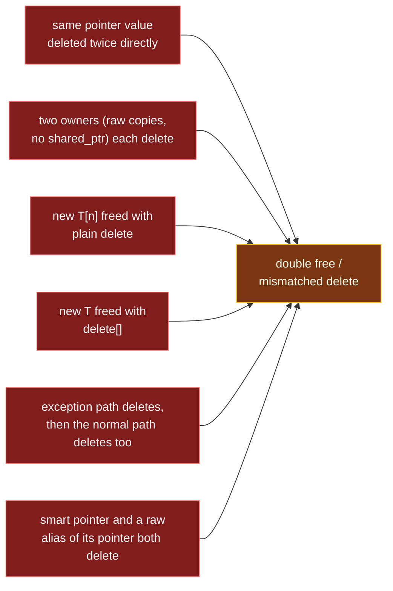

# Double Free and Mismatched new-delete

> [!essence]
> `delete` and `delete[]` carry **no memory of having run**: nothing stops a second `delete` of the same pointer, and nothing checks that the bracket form matches the `new` that produced the pointer. Both are **undefined behavior**, not an error the implementation is required to catch, because catching either would mean every pointer secretly tracks its own liveness and allocation form at run time — a cost the zero-overhead design refuses to impose on every pointer for the sake of the few that get this wrong.

## Symptom

A double free or a mismatched `delete` rarely crashes where it happens:

- The program **runs fine for a while, then corrupts or crashes somewhere unrelated** — often inside a later, completely different `new` or container operation that happens to reuse the same bytes.
- Behavior **changes with the allocator, the build, or an unrelated code edit** elsewhere in the program, because it depends on how the heap happens to be laid out at that moment.
- On glibc-based Linux, a direct double free is sometimes caught immediately with an abort and a message such as `free(): double free detected in tcache 2`; on other allocators (and for the array/scalar mismatch specifically) nothing is checked at all, and the corruption surfaces later or never visibly at all.
- Security-wise, a double free is a classic path to a **heap exploitation primitive**: corrupting the allocator's own bookkeeping can make it hand the same block to two unrelated live objects.

## Root Cause

> [!principle] Why neither mistake is required to be caught
> 1. **Constraint:** `delete p` must mean "the storage `p` denotes is no longer in use; the implementation may reuse it." Checking that claim — *is this address still live, and was it allocated with the matching form of `new`?* — would require every pointer, or every allocation, to carry a run-time tag that `delete` consults before doing anything else.
> 2. **Consequence:** C++ pointers are addresses, not tagged handles ([[Zero-Overhead Principle]]): nothing in the object itself records whether it is still alive, and nothing in a raw `T*` records whether it came from `new T` or `new T[n]`. `delete`/`delete[]` have no way to check what the Standard does not require them to store.
> 3. **Requirement:** The caller — the code that writes `delete p`, not the language — must independently know two things every delete relies on: *this pointer's object has not already been destroyed by a `delete` of the same value*, and *this is the bracket form that matches the `new` that produced it*.
> 4. **Design:** `[expr.delete]` states the contract directly: the operand of a non-array `delete` must be a null pointer or a pointer to a non-array object created by `new` (or a base subobject of one, with a virtual destructor); the operand of `delete[]` must be a null pointer or a pointer previously returned by the array form of `new`. Anything else — including a pointer already freed, or one obtained from the *other* form of `new` — makes the behavior undefined ([cppreference, *delete expression*](https://en.cppreference.com/w/cpp/language/delete)).
> 5. **Price:** Two distinct ways to violate the same contract collapse into the same hazard class. A **double free** destroys an already-dead object again and frees its storage a second time; a **form mismatch** runs the wrong deallocation function — and, for class types, the wrong number of destructor calls — on a block whose real size and layout only the matching `new` form recorded. [[RAII]] exists specifically to move this bookkeeping off the programmer and onto the compiler.

Six ways code ends up here, all variations on "two deletes think they're the only owner" or "the delete doesn't match the new":



A double free doesn't just touch one object — it corrupts the allocator's own records, which every future allocation trusts:

```text
 FREE LIST (a generic fixed-block allocator; Pikus ch. 9 describes the design)

 after the FIRST delete of block A:
   head ──▶ [ A ] ──▶ [ C ] ──▶ nil

 the SECOND delete of the same pointer links block A onto the
 list again — the allocator cannot tell A is already there:
   head ──▶ [ A ] ──▶ [ C ] ──▶ [ A ] ╌╌▶ (A now appears twice)
                ▲                    │
                └────────────────────┘

 the next two unrelated `new` calls each pop the head of the
 list — the SAME block A is handed out twice, to two different,
 unrelated live objects, which now silently alias one another.
```

This is the generic shape of the hazard; a real allocator may add consistency checks that catch some of this (as glibc's tcache sometimes does), but `[expr.delete]` does not require any implementation to.

## Minimal Reproduction

**1 · Deleting the same pointer twice**

```cpp
// cc: ub
int main() {
    int* p = new int(42);
    delete p;               // ① first delete: object destroyed, storage released
    delete p;                // ② UB: p no longer denotes a live new-expression object
}
```
1. The first `delete` is the one legitimate release: it ends `*p`'s lifetime and returns the storage.
2. `p`'s *value* is unchanged — `delete` does not null the pointer it is given — so the second `delete` compiles and looks identical to the first, but its operand is no longer "a pointer to a non-array object created by `new`" per `[expr.delete]`. AddressSanitizer reports this as `attempting double-free`, naming both the original allocation site and the first `delete`'s site; without a sanitizer, the second call instead hands the same address back into the allocator's free list a second time (see the diagram above).

**2 · Freeing an array with the scalar form**

```cpp
// cc: ub
int main() {
    int* scores = new int[5];   // ① array form: new[]
    scores[0] = 90;
    delete scores;               // ② UB: scalar delete on a pointer from new[]
}
```
1. `new int[5]` returns a pointer to the first `int`, not to some array object — but the allocation function that served it, and the record of how many elements to destroy, belong to the *array* form.
2. `delete` (without brackets) is only well-defined for a pointer that `new T` (no brackets) produced. Here it instead gets a pointer from `new T[n]`, which `[expr.delete]` rules out explicitly. AddressSanitizer reports this as `alloc-dealloc-mismatch (operator new [] vs operator delete)`; nothing in `-Wall -Wextra` is guaranteed to catch this plain a case — GCC 11's `-Wmismatched-new-delete` targets calls that go through named allocation/deallocation functions and annotated factories more than this direct a `new[]`/`delete` pairing.

## Detection

| Tool | Catches it? | How |
|---|---|---|
| Compiler warnings (`-Wall -Wextra`) | ~ narrow | GCC 11+ ships `-Wmismatched-new-delete` and `-Wmismatched-dealloc` (both in `-Wall`), aimed at calls routed through `operator new`/`operator delete` or `malloc`-attributed functions; a direct `new T[n]` paired with a plain `delete` in the same function, as in example 2 above, produced no warning from GCC 11 even with both flags enabled explicitly. Don't rely on `-Wall` alone to catch the direct case. |
| AddressSanitizer (`-fsanitize=address`) | ✓ at run time | Reports `attempting double-free` for example 1 and `alloc-dealloc-mismatch` for example 2, each with the allocation and (first) deallocation call stacks. Only catches paths actually executed. |
| Static analysis (clang-tidy) | ~ some | Clang Static Analyzer's `cplusplus.NewDelete` checker flags some double-free and use-after-delete paths it can trace; it does not exhaustively cover every control-flow path. |
| Valgrind memcheck | ✓ heap only | Reports `Invalid free()` for a repeated free of the same block and a distinct `Mismatched free() / delete / delete []` diagnostic for form mismatches, each with both relevant stacks; roughly 20–50× slower to run. |
| Code review heuristic | ✓ if you ask | For every `delete`/`delete[]`: *which exact `new`/`new[]` does this undo, and is there any other code path — including an exception path — that could already have deleted this same pointer value?* |

## Fix

Both mistakes disappear once exactly one piece of code is responsible for one allocation, and that code never has to spell out which bracket form to use.

**✗ Manual `new`/`delete`, duplicated or mismatched → ✓ one owner, deleter chosen for you**

```cpp
#include <iostream>
#include <memory>

int main() {
    auto value = std::make_unique<int>(42);     // ① single owner; destructor deletes once
    std::cout << *value << '\n';

    auto scores = std::make_unique<int[]>(5);    // ② unique_ptr<T[]> always pairs with delete[]
    scores[0] = 90;
    std::cout << scores[0] << '\n';
}
// expect: 42
// expect: 90
```
1. `std::make_unique<int>` (C++14) pairs one `new` with exactly one eventual `delete`, run by the destructor when `value` goes out of scope. There is no second code path that could call `delete` on the same pointer, so a double free of `value`'s object is no longer expressible.
2. `std::unique_ptr<int[]>` (C++11) records in its *type* that the pointee is an array, so its destructor always calls `delete[]`, never plain `delete`. The bracket-form decision is made once, at the type, instead of being re-typed correctly at every `delete` site.

## Prevention Rules

> [!rule] Give every allocation exactly one release path
> If you can point to more than one place in the code that might call `delete` on the same pointer value — including an exception-handling path next to the normal one — you have a candidate double free whether or not it has fired yet.

> [!rule] Let the type remember the bracket form
> Prefer `std::unique_ptr<T[]>` or `std::vector<T>` over a bare `T*` from `new T[n]`. A raw pointer forgets whether it came from `new` or `new[]`; the smart-pointer or container type never does. *(Core Guidelines R.11, R.15)*

> [!rule] Treat "naked `new`/`delete`" as a design smell, not just a style complaint
> Keep `new` and its matching `delete` inside the implementation of one resource-owning type ([[RAII]]), not spread across ordinary application code. *(Tour §5.2, p. 58: "naked new operations" and "naked delete operations" should both be avoided; Core Guidelines ES.60)*

> [!rule] Don't trust "set it to `nullptr` after delete" as the fix
> Deleting a null pointer is safe, but nulling `p` only protects the variable `p`. Any other variable, member, or captured copy that still holds the old address is untouched and will double-free independently when it is deleted. The fix is one owner, not a defensive reset.

> [!rule] Test under AddressSanitizer in CI
> Most double frees and form mismatches that survive review are caught the moment the failing path actually executes under `-fsanitize=address` ([[Sanitizers — ASan, UBSan, TSan]]).

## Connections

- **Root concept:** [[Object Lifetime]] · [[Pointers]] · [[Dynamic Memory — new and delete]] · [[Zero-Overhead Principle]].
- **Related hazards:** [[Dangling Pointers and References]] (the same contract, violated by *reading* instead of *freeing* a dead object) · [[Memory Leaks]] (the opposite failure: an allocation nobody ever frees).
- **Structural cures:** [[RAII]] (one owner, one release, chosen by the type) · [[unique_ptr]] (the array-aware form that fixes example 2 by construction).
- **Domain:** [[Map — Objects, Memory & Lifetime]].
- **Practice:** *Continuum #11 Pointer & Array Internals Lab* (reproduce both forms under ASan) · *#25 Smart Pointer Refactor Lab* (replace naked `new`/`delete` with owners).

## Check Yourself

> [!quiz]- Why is `delete p; delete p;` undefined rather than simply a safe no-op the second time, the way deleting a null pointer is?
> `delete` on a null pointer is explicitly carved out by `[expr.delete]` as doing nothing. A second `delete` of a *non-null* value that has already been freed is a different case: the Standard requires the operand to point to a live `new`-allocated object, and after the first `delete` it no longer does. Nothing checks this at the second call site, so the implementation runs the destructor and the deallocation function on storage that is no longer "an object created by `new`."

> [!quiz]- Does setting `p = nullptr;` right after `delete p;` eliminate the double-free risk in a program with several pointers to the same allocation?
> Only for `p` itself. `delete nullptr` is safe, so re-deleting *that variable* is harmless. But any other variable, struct member, or lambda capture that holds a copy of the old (now-dangling) address is unaffected by resetting `p`, and deleting it independently is still a double free of the same block. The real fix is giving the allocation a single owner, not nulling every alias you remember to reset.

> [!quiz]- Spot the bug: `int* a = new int[3]{1,2,3}; int* b = a; delete[] a; delete[] b;`
> `b` is a copy of the pointer value `a`, not an independent allocation — both names denote the same array. `delete[] a` is the one legitimate release; `delete[] b` is a second `delete[]` of that same already-freed pointer value, i.e. a double free, even though it is spelled with a different variable name and the correct bracket form.

## Sources

- Primer §12.1 "Dynamic Memory and Smart Pointers" (p. 460): deleting the same pointer value more than once is undefined.
- Primer §12.2.1 "Freeing Dynamic Arrays" (p. 479): omitting or adding the brackets when deleting mismatches the allocation form and is undefined; the compiler is unlikely to warn.
- Tour §5.2 "Concrete Types" (p. 58): "naked new operations" and "naked delete operations" should both be avoided.
- cppreference, *delete expression*: https://en.cppreference.com/w/cpp/language/delete — operand requirements for both forms ([expr.delete]).
- Pikus ch. 9 "Avoiding memory fragmentation" (p. 340): free-list allocator design, the mechanism a double free corrupts.
- AddressSanitizer documentation (Clang): https://clang.llvm.org/docs/AddressSanitizer.html — `attempting double-free` and `alloc-dealloc-mismatch` diagnostics.
- C++ Core Guidelines R.11, R.15, ES.60: https://isocpp.github.io/CppCoreGuidelines/CppCoreGuidelines
