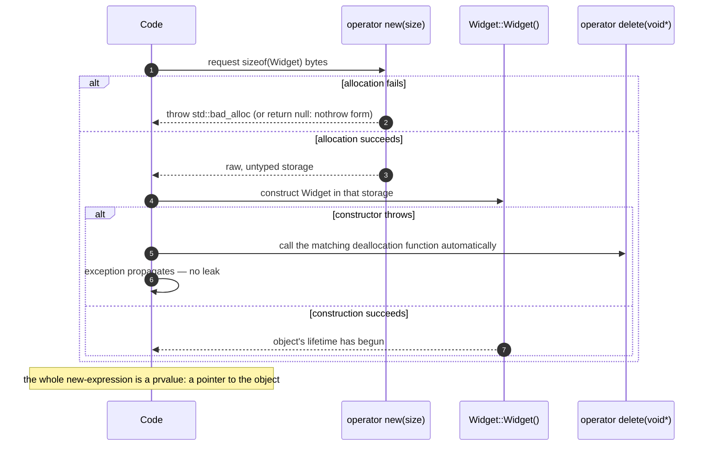

# Dynamic Memory — new and delete

> [!essence]
> A `new`-expression is two actions fused into one: it **allocates** raw storage from the free store, then **constructs** an object in it. A `delete`-expression reverses them in the opposite order: **destroy**, then **deallocate**. Between those two moments, the object's lifetime is exactly what [[Object Lifetime]] promises — except now nothing but a programmer-written `delete`, on every path, ever ends it.

## The Problem

[[Storage Duration]] settles automatic and static storage's lifetime questions at compile time: an automatic object's storage begins and ends at its block's entry and exit; a static object's spans the whole program. Both answers are fixed the moment the source is written — but plenty of real programs need an object whose count or extent isn't known until the program is already running, or whose lifetime must outlast the function that creates it: a buffer sized from user input, a node added to a list one insertion at a time, an object a factory function hands back to a caller who will keep using it long after the factory has returned.

> [!principle] Constraint → Consequence → Requirement → Design → Price
> 1. **Constraint.** Automatic and static storage duration are both fixed at compile time by *where* an object is declared — a decision the source text makes once, before the program ever runs.
> 2. **Consequence.** Neither can express "however many objects this run of the program turns out to need" or "an object that outlives the block that creates it." A function that returns the address of a local, automatic-duration object returns a pointer into storage that is already gone by the time the caller reads it.
> 3. **Requirement.** The language needs a storage duration that a *running program* decides to begin and end, by executing code — not one read off a declaration — with nothing about it tied to any enclosing scope.
> 4. **Design.** Dynamic storage duration: a `new`-expression asks an allocation function, `operator new`, for exactly the bytes an object of that type needs (`operator new[]` for an array), then runs the type's constructor directly inside the returned storage. A `delete`-expression runs the destructor, then hands the same bytes back through `operator delete`.
> 5. **Price.** Nothing about scope and nothing about the program's block structure ever calls `delete` for you. Every `new` must be paired, on *every* path out of the function — including exception paths — with exactly one `delete` of the matching form, and the language performs no check that the pairing happened, happened once, or used the right spelling. Get it wrong and the failure is either silent (a leak) or undefined behavior (the wrong pointer, the wrong form, or a second `delete` of the same address).

> [!tension] safety ⟷ performance
> Dynamic storage is [[Storage Duration|the one duration that's a run-time choice]] instead of a compile-time one, and that flexibility is bought by giving up every safety net the other three durations provide for free: no scope destroys it, no compiler enforces the pairing, and no runtime check catches a wrong one. [[RAII]] is the structural answer this domain gives to that price — binding the `new`/`delete` pair to a constructor/destructor pair so a *scope* ends up choosing the moment after all, just indirectly.

## Mental Model

> [!model] A two-step act: rent the plot, then build the house
> `new` doesn't hand you a finished object — it performs two separate acts back to back. First it **rents a plot**: `operator new` marks off a chunk of raw, untyped storage from the free store. Only then does it **build the house**: the constructor runs *inside* that plot, and only from that instant does an actual `Widget` exist there. `delete` runs the same two acts in reverse: **demolish the house** (the destructor runs) before **returning the plot** (`operator delete` gives the bytes back). Until the house is built, or after it's demolished, the plot is just land — bytes with no object living in them.
> **Where it breaks:** a landlord doesn't evict you automatically when your lease *should* end. Nothing here does either — the plot stays rented, uselessly, until *something* executes a matching `delete`. Automatic storage's implicit "the lease ends when you leave the room" ([[Storage Duration]]) has no counterpart on the free store at all.

```text
 BEFORE new                                AFTER new: two acts already happened
                                            HEAP (dynamic storage duration)
                                           ┌────────────────────────────┐
  automatic storage               ┌──────▶│ Widget                     │
 ┌───────────────────┐            │       │  x = 1.0                   │
 │ w : Widget*        │           │       │  y = 2.0                   │
 │  value: (garbage)  │           │       │  z = 3.0                   │
 └───────────────────┘            │       └────────────────────────────┘
        after: w = new Widget{1.0,2.0,3.0};
                                    1. operator new(24) rented these 24 bytes
                                    2. Widget's constructor built the object in them
                                    w's VALUE is the address the rental returned
```

Contrast this with an automatic-duration `Widget w{1.0,2.0,3.0};`: there, renting and building are invisible, and a third, equally invisible act — demolish-and-return — is scheduled for you at `}`. Here, only the first two acts are automatic; the third is a debt the programmer must remember to pay.

## Step by Step



1. **Choose the call (compile time).** The `new`-expression's own spelling — not anything about the type — fixes which allocation function runs: plain `new T` calls `operator new(size_t)`; `new T[n]` calls the array form `operator new[](size_t)`. A type whose alignment exceeds the platform default adds a `std::align_val_t` argument to the call (C++17).
2. **Allocate (run time obtains storage).** The allocation function returns a pointer to at least the requested number of bytes, suitably aligned — or signals failure by throwing `std::bad_alloc`, or by returning a null pointer if the `nothrow` form was used (`new (std::nothrow) T`). For an array, the address `operator new[]` returns can sit slightly earlier than the address the `new`-expression ultimately yields: the Standard permits an unspecified allocation *overhead*, in practice used to hide an element count the implementation needs later (`[expr.new]` ¶17, ¶21; *Under the Hood* shows this for real).
3. **Construct (the object's lifetime begins).** The `new`-expression direct-initializes the object in that storage — running a constructor, or leaving a built-in-typed object default-initialized with an indeterminate value if no initializer was given at all; `new T()` or `new T{}` instead value-initializes it, zeroing a built-in-typed object rather than leaving it indeterminate ([[The Forms of Initialization]] covers exactly this choice of spelling). If construction throws, the `new`-expression itself calls the matching deallocation function before letting the exception continue to propagate, *provided one can be unambiguously found* (`[expr.new]` ¶27). A `new` that fails partway through building its object does not, on its own, leak.
4. **Yield.** The whole `new`-expression is a **prvalue**: a pointer to the object (non-array form) or to its first element (array form) — never a name, because nothing was declared. Losing that one pointer without saving a copy is what turns step 2's rental into a permanent one.
5. **Match the deallocation function.** `delete p` looks up `operator delete` in the scope of `*p`'s type. If `p`'s static type has a virtual destructor, the *dynamic* type's destructor and its class-specific `operator delete` are the ones actually reached — which is exactly why deleting a derived object through a `Base*` whose destructor isn't virtual runs the wrong destructor and the wrong deallocation function ([[Virtual Functions]]).
6. **Destroy, then deallocate.** The destructor runs first — once, or for the array form once per element **in reverse order**, last element first — and only then does the deallocation function reclaim the bytes. Reverse order matters when elements refer to their neighbors' having already been constructed; it mirrors the reverse order automatic-duration members and bases are already destroyed in ([[Object Lifetime]]).

## Under the Hood

> [!machine] A single object: one call out, one call back — GCC 11.4, x86-64 Linux, `-O2`
> ```nasm
> // struct Widget { double x, y, z; };  Widget* make_widget() { return new Widget{1.0,2.0,3.0}; }
> make_widget():
>         sub   rsp, 8
>         mov   edi, 24                          ; ① sizeof(Widget) == 24, computed at compile time
>         call  operator new(unsigned long)      ; ② the only call — construction is just these stores
>         movapd xmm0, XMMWORD PTR .LC0[rip]
>         movq  rdx, QWORD PTR .LC1[rip]
>         mov   QWORD PTR [rax+16], rdx
>         movups XMMWORD PTR [rax], xmm0          ; ③ writes 1.0, 2.0, 3.0 straight into the rented bytes
>         add   rsp, 8
>         ret
> // void free_widget(Widget* w) { delete w; }
> free_widget(Widget*):
>         test  rdi, rdi
>         je    .L4                               ; ④ delete on null: skip the call entirely
>         mov   esi, 24                            ; ⑤ the size travels back to operator delete (C++14)
>         jmp   operator delete(void*, unsigned long)
> .L4:    ret
> ```
> ① `sizeof(Widget)` needs no run-time computation — the allocation function's argument is baked in. ② `Widget` has no user-written constructor, so "construct" is nothing more than the four stores that follow: the Mental Model's two acts are both real, but the second one is sometimes just arithmetic, not a function call. ③ note there is **no null check after `operator new`** — the default, throwing form never returns null, so the compiler doesn't need to guard the stores. ④ `delete` on a null pointer is required to do nothing, so the compiler checks first rather than pay for a call that would no-op. ⑤ passing the freed block's size back to `operator delete` is *sized deallocation* (C++14): the allocator no longer has to recover the size from its own bookkeeping.

> [!machine] An array of a non-trivial type: the hidden count and the reverse loop — GCC 11.4, x86-64 Linux, `-O2`
> ```nasm
> // void free_strings(std::string* p, int n) { delete[] p; }
> free_strings(std::string*, int):
>         test  rdi, rdi
>         je    .L1
>         mov   rbx, QWORD PTR [rdi-8]        ; ① the element count, stored just BEFORE the pointer
>         sal   rbx, 5                        ;    ×32 (sizeof(std::string) on libstdc++/x86-64)
>         add   rbx, rdi                      ;    rbx = one-past-the-last element
> .L5:    sub   rbx, 32                        ; ② step backward: destroy last element first
>         ⋮       (that element's ~basic_string body — frees its heap buffer if not SSO)
>         cmp   rbp, rbx
>         jne   .L5                           ;    loop until every element is destroyed
>         jmp   operator delete[](void*, unsigned long)   ; ③ one deallocation call for the whole block
> .L1:    ret
> ```
> ① Confirms `[expr.new]`'s array *allocation overhead*: the compiler asked `operator new[]` for `n * sizeof(std::string) + 8` bytes and hid the element count in that extra 8, right before the pointer the `new`-expression actually returned — code never sees this cookie, only `delete[]` reads it back. ② The loop counts *down*, destroying the highest-indexed element first, exactly as *Step by Step* §6 states — a naive reader who expects forward, index-0-first order would predict the opposite of what the compiler actually emits. ③ Every element's destructor runs individually, but the freed **storage** is returned in one call: destruction is per-element, deallocation is per-block.

Both listings are this vault's toolchain (GCC 11.4) at `-O2`; a different compiler, version, or optimization level can legally emit different code for the same source, and the C++ Standard requires none of these specific instructions — only the *behavior* `[expr.new]`/`[expr.delete]` describe.

**What the call itself costs.** `operator new`/`operator delete` are, by default, thin wrappers over the platform allocator (typically `malloc`/`free` on Linux, or an equivalent). That allocator maintains its own bookkeeping — free lists or size-class arenas — to answer a request of *any* size at *any* time, and in a multi-threaded program that bookkeeping is usually guarded by a lock or a slower lock-free path (Pikus ch. 9, "Memory management in concurrent programs," pp. 337–338). None of that machinery exists for automatic storage, whose "allocation" is one instruction adjusting the stack pointer. **Fragmentation** is the other cost specific to dynamic storage: repeatedly allocating and freeing differently-sized blocks can leave the free store holding plenty of *total* free memory in pieces too small individually to satisfy the next request (Pikus, "Avoiding memory fragmentation," pp. 338–339) — the reason pool allocators and `std::pmr` resources exist ([[Allocators and pmr Memory Resources]]).

## In Code

**1 · Matching forms — and the destruction order the array form guarantees**

```cpp
#include <cstdio>

struct Cell {
    int id;
    Cell(int id) : id{id} { std::printf("build %d\n", id); }
    ~Cell() { std::printf("raze  %d\n", id); }
};

int main() {
    Cell* one = new Cell(1);              // ① single object: operator new, then one constructor
    delete one;                           //    one destructor, then operator delete

    Cell* many = new Cell[3]{1, 2, 3};    // ② array: operator new[], then 3 constructors, low to high
    delete[] many;                        //    3 destructors, HIGH TO LOW, then operator delete[]
}
// expect: build 1
// expect: raze  1
// expect: build 1
// expect: build 2
// expect: build 3
// expect: raze  3
// expect: raze  2
// expect: raze  1
```
1. A single `new`/`delete` pair: exactly one construction, exactly one destruction, in that order.
2. The naive expectation is that an array built low-to-high tears down the same way. It doesn't: elements are destroyed **last-to-first** — `raze 3`, then `2`, then `1` — the same reverse order *Under the Hood*'s asm loop counts down through, and the same rule automatic-duration array members follow.

**2 · A throwing constructor does not leak — because `new` cleans up after itself**

```cpp
#include <cstdio>
#include <cstdlib>
#include <new>

struct Loud {
    static inline int live_allocations = 0;
    struct Fails { };
    explicit Loud(bool ok) {
        if (!ok) throw Fails{};             // ① throws mid-construction, after storage exists
    }
};

void* operator new(std::size_t n) {
    ++Loud::live_allocations;
    return ::malloc(n);
}
void operator delete(void* p) noexcept {
    --Loud::live_allocations;
    ::free(p);
}
void operator delete(void* p, std::size_t) noexcept {   // ② sized overload: silences a compiler warning
    --Loud::live_allocations;                            //   (this delete pairs with sized new, see Under the Hood)
    ::free(p);
}

int main() {
    try {
        Loud* p = new Loud(false);          // ③ allocation succeeds; construction then throws
        delete p;                           //    never reached
    } catch (const Loud::Fails&) {
        std::printf("allocations still outstanding: %d\n", Loud::live_allocations);
    }
}
// expect: allocations still outstanding: 0
```
1. `Loud`'s constructor throws *after* storage for it already exists — the case the Mental Model calls "the plot is rented but the house collapses mid-build."
2. Both a sized and an unsized `operator delete` are defined because *Under the Hood* showed the compiler prefers the sized overload; only one of the two actually runs for a given `delete`, but both must exist to keep the count honest regardless of which one the implementation picks.
3. The overridden `operator new`/`operator delete` make the claim in *Step by Step* §3 observable: without any `delete` ever executing, `live_allocations` still returns to `0`. The `new`-expression found the matching (global, since `Loud` declares no class-specific one) deallocation function itself and called it before the exception left `main`.

## Consequences

The rule that release is never automatic is the source of most of this domain's other named failures — and of the idiom built to escape it:

| Observed rule or failure | Explained by |
|---|---|
| A memory leak: a program's usage grows without bound | No scope, and no implicit action of any kind, calls `delete` when a raw pointer to dynamic storage goes out of scope — only an explicit, matching `delete` returns the bytes: [[Memory Leaks]] |
| Use-after-free / double free | `delete` doesn't null the pointer or record that the bytes were freed; a second `delete` of the same address, or any later dereference, is undefined the instant it happens: [[Double Free and Mismatched new-delete]], [[Dangling Pointers and References]] |
| `delete[] p` where `p` came from non-array `new`, or `delete p` where `p` came from `new[]`, is UB | The two forms call different allocation/deallocation function pairs and (for class types) run a different destructor sequence; `[expr.delete]` requires the form to match the `new` that produced `p` exactly — see *Step by Step* §1 |
| `delete basePtr` runs the wrong destructor unless `~Base` is `virtual` | Deallocation-function lookup and the destructor actually invoked both follow the *dynamic* type only through a virtual destructor; without one, the *static* type's non-virtual destructor and its (possibly wrong-sized) `operator delete` are used instead: [[Virtual Functions]] |
| Every RAII wrapper — `unique_ptr`, `vector`, `string` — exists | Wrapping exactly one `new`/`delete` pair inside a constructor/destructor pair is the only way to make the *scope* choose the release moment, since nothing in this mechanism will choose it for you: [[RAII]], [[unique_ptr]] |
| A throwing constructor doesn't leak the storage it was given, but a throwing *initializer expression evaluated before* the `new` can still leak an already-completed sibling allocation | `[expr.new]`'s automatic cleanup covers *this* `new`-expression's own construction step only; two independent `new`s in one full expression (`f(new A, new B)`) are not guaranteed to be sequenced so that `B`'s allocation failing unwinds `A`'s — a `[!ub]`-adjacent surprise ([[Exception Safety Guarantees]]) that motivates never writing raw `new` in an argument list at all |
| Frequent allocation and deallocation of varied sizes costs more than the byte count suggests | The allocator's own bookkeeping (locking, free-list search, fragmentation) is real, measured cost that automatic storage never pays: *Under the Hood*, [[Allocators and pmr Memory Resources]] |

## Connections

- **Prerequisites:** [[Pointers]] — a pointer is exactly what `new` returns and `delete` consumes; nothing else in the language names dynamically allocated storage at all.
- **Sits between:** [[Storage Duration]] (the abstract-machine category this mechanism realizes) and [[Object Lifetime]] (the clock this mechanism starts and stops by hand instead of by scope).
- **Enables / motivates:** [[RAII]] (the idiom built specifically to make this mechanism's release automatic) → [[unique_ptr]] · [[Rule of Zero, Three and Five]] (RAII applied to this exact pair) → [[Placement new and Manual Lifetime]] (constructing without also allocating — the two acts of *Mental Model* pulled apart on purpose).
- **Explains the hazards:** [[Memory Leaks]] · [[Double Free and Mismatched new-delete]] · [[Dangling Pointers and References]].
- **Machine level:** [[Allocators and pmr Memory Resources]] (replacing the free store's own allocator) · [[Process Memory Layout — Stack, Heap, Static]] (where these bytes physically sit).
- **Domain:** [[Map — Objects, Memory & Lifetime]].
- **Practice:** *Continuum #12 Build-Your-Own Dynamic Array* — implement a growable buffer with your own `new[]`/`delete[]` calls, and reconcile your destructor's loop order with the reverse-order loop in *Under the Hood*.

## Check Yourself

> [!quiz]- What two actions does a single `new`-expression perform, and in what order? What does `delete` do, and in what order relative to those?
> `new` allocates raw storage (`operator new`) and then constructs the object in it. `delete` runs the reverse: it destroys the object first, then deallocates the storage (`operator delete`). See *Step by Step* and the Mental Model's "rent, then build" / "demolish, then return."

> [!quiz]- A constructor throws partway through building an object that `new` is creating. Does the storage `new` had already obtained leak?
> No — provided a matching deallocation function can be unambiguously found, the `new`-expression itself calls it before the exception propagates further (`[expr.new]` ¶27). *In Code*, Example 2 makes this observable: the allocation counter returns to zero even though no `delete` ever ran. This guarantee is about *this* `new`-expression's own construction step; it does not extend to sibling allocations elsewhere in the same full expression.

> [!quiz]- Predict: what happens if `Cell* many = new Cell[3]{1,2,3};` is destroyed with plain `delete many;` instead of `delete[] many;`?
> Undefined behavior. `[expr.delete]` requires the array form of `new` to be matched with the array form of `delete`; using the non-array form on a pointer from `new[]` is explicitly called out as UB, not merely "probably wrong" — the deallocation function called (and, for a class type, how many destructors run) no longer matches what was actually allocated. See *Consequences*.

## Sources

- Primer §12.1 "Dynamic Memory and Smart Pointers" (pp. 458–462): `new`/`delete` mechanics, the three common failure modes (leak, use-after-free, double free), why the Primer recommends smart pointers exclusively once Chapter 13 is reached. §12.2 "Dynamic Arrays" (pp. 477–479): `new[]`/`delete[]`, the hidden pointer-to-element-type nature of a "dynamic array," why the brackets must match.
- Tour §12.7 "Allocators" (p. 167): `operator new`/`operator delete` as the *general* free-store mechanism every container is built on by default, and why specialized allocators (pool allocators, `pmr`) exist — motivated by a real fragmentation incident the author reports.
- PPP ch. 18 §18.4–18.5 "Resources and exceptions" / "Resource-management pointers" (ch. 18 "Vectors and Arrays"): manual `new`/`delete` pairing as a resource-leak hazard once exceptions are in the picture, and RAII as the fix.
- Pikus ch. 9, "Memory management in concurrent programs" (p. 337) and "Avoiding memory fragmentation" (pp. 338–340): what a general-purpose allocator's bookkeeping and locking actually cost, and why fragmentation happens.
- cppreference, *`new` expression*: https://en.cppreference.com/w/cpp/language/new · *`delete` expression*: https://en.cppreference.com/w/cpp/language/delete
- Draft standard `[expr.new]` (allocation, construction, the automatic cleanup on a throwing constructor, array allocation overhead, alignment-aware overload selection): https://eel.is/c++draft/expr.new · `[expr.delete]` (form-matching requirement, deallocation-function selection, the null-pointer no-op guarantee): https://eel.is/c++draft/expr.delete — paragraph numbers are the current working draft's.
- C++ Core Guidelines R.10 ("Avoid `malloc()` and `free()`"), R.11 ("Avoid calling `new` and `delete` explicitly"), R.12 ("Immediately give the result of an explicit resource allocation to a manager object"): https://isocpp.github.io/CppCoreGuidelines/CppCoreGuidelines
