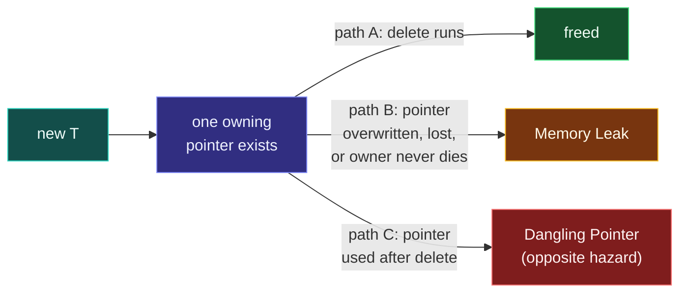

# Memory Leaks

> [!essence]
> A memory leak is dynamic storage whose owning pointer is gone while the object it addresses is still allocated: nothing will ever call `delete` on it. Unlike a dangling pointer, this is **not undefined behavior** — the bytes just sit there, correctly out of reach, until the process ends and the operating system reclaims everything at once.

## Symptom

A leak rarely looks like a bug at first:

- **Resident memory climbs** over the life of a long-running process — a server, a daemon, a game loop — with no corresponding growth in work done.
- **Nothing crashes and no value is wrong.** A leaked object is never read after it's lost, so there is no incorrect output to notice, only a slow loss of capacity.
- The failure surfaces **far downstream**: pages, allocation calls or whole requests start failing once the process exhausts its address space or the machine exhausts physical memory, often hours or days after the leaking code ran.
- Short-lived programs rarely show it at all — the OS reclaims every byte when the process exits, leak or not — which is exactly why leaks hide in tools, scripts and tests and only bite in servers.

## Root Cause

> [!principle] Why the language allows it
> 1. **Constraint:** `new` asks for storage and returns an address; nothing else in the abstract machine is obliged to happen afterward. The language tracks *lifetime rules*, not *who still has the address*.
> 2. **Consequence:** If every path that holds that address is overwritten, returned past, or simply never followed by a matching `delete` ([expr.delete]), the object's lifetime never ends and its storage is never returned to the allocator ([basic.stc.dynamic]) — yet the object is perfectly well-formed the whole time. Nothing is violated; the address is just lost.
> 3. **Price:** No runtime check can tell "this pointer is the last one" from "this pointer is a copy" without tracking every copy ([[shared_ptr and Reference Counting|reference counting]], or a full garbage collector) — exactly the cost the language chooses not to pay by default ([[Map — Objects, Memory & Lifetime|D04's safety-vs-performance tension]]). A leak is the price of that choice landing on the wrong side: an owner that forgot to own.

This is the precise contrast with [[Dangling Pointers and References]]: a dangling pointer is an observer that outlived its object (read it: UB); a leak is an object that outlived every observer that could have freed it (read nothing: wasted storage, not UB). Both come from the same cause — an unclear answer to "who releases this?" — pointed in opposite directions.



The picture is the mirror image of a dangling pointer's: there the *pointer* survives its object; here the *object* survives every pointer to it.

```text
 Dangling (the opposite hazard)          Leak (this hazard)
┌───────────────────────┐               ┌───────────────────────┐
│ p : T*            ●───┼──╌╌▶ freed    │ (no pointer reaches   │
│                        │     block    │  this block at all)   │
└───────────────────────┘               │                       │
  pointer outlives                      │  [ live object ]  ✓   │
  the object                            └───────────────────────┘
                                           object outlives
                                           every pointer to it
```

Three everyday ways the "one owning pointer" gets lost before `delete` runs:

1. **An early return or thrown exception** skips over the `delete` that was written further down the function.
2. **The only pointer to an object is overwritten** — reassigned, or a local that goes out of scope — with no `delete` first.
3. **A cycle of owners.** [[shared_ptr and Reference Counting|`shared_ptr`]]'s count reaches zero only when every owner releases it; two objects that own each other keep each other's count at one forever, so neither is ever destroyed (Core Guidelines R.24).

## Minimal Reproduction

**1 · An early return skips the matching `delete`**

```cpp
#include <iostream>

// This demo's whole point is to leak, so it tells LeakSanitizer not to
// flag its own proof; Detection quotes what LeakSanitizer reports when
// a program *doesn't* suppress it this way.
extern "C" int __lsan_is_turned_off() { return 1; }

struct Tracked {
    static inline int live = 0;
    Tracked() { ++live; }
    ~Tracked() { --live; }
};

void process(bool fail_fast) {
    Tracked* t = new Tracked();     // ① allocated: live becomes 1
    if (fail_fast) {
        return;                    // ② skips the delete below: t's address is lost
    }
    delete t;
}

int main() {
    process(true);
    std::cout << "live objects: " << Tracked::live << '\n';
}
// expect: live objects: 1
```
1. `Tracked::live` counts constructions minus destructions — a destructor that never runs leaves it above zero forever, which is how a leak is *shown* without reading freed memory (there's nothing UB to trigger).
2. The naive expectation is that `process` cleans up whatever it allocates. It doesn't: the early `return` reaches the function's end without ever reaching `delete t`, so `t`'s value — the only address anyone had — disappears with the stack frame. The allocation itself remains, unreachable and un-freed, for the rest of the program.

**2 · A reference cycle of `shared_ptr`s**

```cpp
#include <iostream>
#include <memory>

// Same suppression as Example 1: the cycle below is the point, not a bug
// to be caught mid-demo. Detection shows the unsuppressed report's shape.
extern "C" int __lsan_is_turned_off() { return 1; }

struct Node {
    std::shared_ptr<Node> next;              // ① owns the next node
    int id;
    explicit Node(int i) : id(i) {}
    ~Node() { std::cout << "destroying " << id << '\n'; }
};

int main() {
    auto a = std::make_shared<Node>(1);
    auto b = std::make_shared<Node>(2);
    a->next = b;                             // ② a owns b: b's count becomes 2
    b->next = a;                             // ③ b owns a: a's count becomes 2
    std::cout << "a.use_count = " << a.use_count() << '\n';
}
// expect: a.use_count = 2
```
1. `next` is an *owning* pointer, so assigning it is a second owner, not just a second name for the same owner.
2. Naively, `a` and `b` going out of scope at the end of `main` should destroy both nodes — `shared_ptr` is supposed to make that automatic. It doesn't here: step ② makes `b`'s count 2 (local `b` plus `a->next`), and step ③ makes `a`'s count 2 (local `a` plus `b->next`).
3. When `main` returns, the local variables drop each count from 2 to 1 — never to 0. Neither destructor ever runs: no `"destroying 1"` or `"destroying 2"` is printed, and both nodes outlive the program's only path to them. `shared_ptr` automates *finding* when the count hits zero; it cannot automate *noticing* a count that structurally never will.

## Detection

| Tool | Catches it? | How |
|---|---|---|
| **Compiler warnings** (`-Wall -Wextra`) | ✗ essentially never | Whether an allocation is eventually freed is undecidable in general (reduces to the halting problem on the owning pointer's control flow); GCC/Clang do not attempt it. |
| **LeakSanitizer** (`-fsanitize=address` or standalone `-fsanitize=leak`) | ✓ at process exit | Walks every live allocation at exit and reports any block unreachable from registered roots and thread stacks. Observed directly in this vault's sandbox (GCC 11.4.0, x86-64 Linux) on Example 1: `==…==ERROR: LeakSanitizer: detected memory leaks` / `Direct leak of 1 byte(s) in 1 object(s) allocated from: … in process(bool)`. **Linux and macOS only** — LeakSanitizer does not support Windows, so it cannot run on this vault's MinGW builds; on an unsupported platform the check is simply unavailable, not silent. |
| **Valgrind memcheck** | ✓ at process exit | Classifies each unfreed block as *definitely lost* (reproduces Example 1's shape), *still reachable* (a pointer to it exists somewhere, e.g. in a global — often intentional), or *possibly lost* (only an interior pointer survives). ~20–50× slowdown. |
| **Clang Static Analyzer** (`clang-analyzer-cplusplus.NewDeleteLeaks`) | ~ some | Path-sensitive analysis flags a `new` with no `delete` on some path *without running the program*; prone to both false negatives (across translation units) and false positives (ownership transferred through a container or lambda it can't model). |
| **Code review heuristic** | ✓ if you ask the question | For every `new`, `make_unique`, `make_shared`, and owning raw-pointer-returning call: *trace every path out of this scope — does each one reach exactly one release?* A cycle of owning pointers needs a second question: *does releasing A require B to still exist, and B require A?* |

## Fix

**✗ Manual `new`/`delete` with an early-exit path → ✓ RAII makes release unconditional**

```cpp
#include <iostream>
#include <memory>

struct Tracked {
    static inline int live = 0;
    Tracked() { ++live; }
    ~Tracked() { --live; }
};

void process(bool fail_fast) {
    auto t = std::make_unique<Tracked>();    // ① ownership lives in t, not in a bare delete call
    if (fail_fast) {
        return;                              // ② t's destructor still runs here, on every path
    }
}

int main() {
    process(true);
    std::cout << "live objects: " << Tracked::live << '\n';
}
// expect: live objects: 0
```
1. [[unique_ptr|`unique_ptr`]]'s destructor is the `delete`; there is no second statement to forget.
2. A `return`, a thrown exception, a `break` out of a loop — every path out of the scope runs `t`'s destructor during stack unwinding ([[RAII]]). The function no longer has a "normal path" and a "leaky path": it has one path, with one release, guaranteed by the type system rather than by remembering to write it.

**✗ Two owning edges form a cycle → ✓ one edge observes instead of owning**

```cpp
#include <iostream>
#include <memory>

struct Node {
    std::shared_ptr<Node> next;              // owns forward
    std::weak_ptr<Node> prev;                // ① observes backward: adds no count
    int id;
    explicit Node(int i) : id(i) {}
    ~Node() { std::cout << "destroying " << id << '\n'; }
};

int main() {
    auto a = std::make_shared<Node>(1);
    auto b = std::make_shared<Node>(2);
    a->next = b;
    b->prev = a;                             // ② weak: a's use_count stays 1
    std::cout << "a.use_count = " << a.use_count() << '\n';
}
// expect: a.use_count = 1
// expect: destroying 1
// expect: destroying 2
```
1. `weak_ptr` holds the same control block as `shared_ptr` but is never counted as an owner (Core Guidelines R.24): breaking the cycle only requires that *one* of its two edges stop being an owner.
2. At scope exit, `b` (constructed later) is destroyed first: it drops Node 2's count from 2 to 1, so nothing happens yet. Then `a` is destroyed: Node 1's count drops from 1 to 0, running `~Node()` for id 1 — which, as it destroys its own `next` member, drops Node 2's count from 1 to 0 and runs `~Node()` for id 2. The identical graph that leaked in Example 2 now unwinds cleanly, in a fixed order, because exactly one direction was ever an owner.

## Prevention Rules

> [!rule] Prefer `make_unique`/`make_shared` to a bare `new`
> *(Core Guidelines R.21–R.23)* Pairing every allocation with an owner in the same expression leaves no window where the raw pointer exists unowned — and before C++17, writing the `new` and the smart-pointer wrapper as two separate expressions inside one function call could itself leak: `f(shared_ptr<T>(new T), g())` risked running `new T` and `g()` before the `shared_ptr` constructor ever took ownership, so if `g()` threw, `T` leaked. Function-call arguments only became indeterminately — rather than un­sequenced, and so no longer interleaved — relative to each other in C++17 (`[intro.execution]`, rule tightened by P0145R3); the pre-C++17 interleaving was real but never guaranteed to reproduce on any given compiler, which is exactly why `make_unique`/`make_shared` were the rule rather than a one-off fix.

> [!rule] One acquisition, one release, bound by a destructor
> If a resource is acquired with `new`, `malloc`, `fopen`, or similar, its release belongs to exactly one destructor ([[RAII]]), reached from every path out of the owner's scope — not to a line written after the code that uses it.

> [!rule] Break every owning cycle with a `weak_ptr`
> *(Core Guidelines R.24)* Wherever two objects can reach each other through `shared_ptr`, at least one direction — typically "child points back to parent" — must be `weak_ptr`.

> [!rule] Run LeakSanitizer or Valgrind in CI, on a platform that supports them
> A leak that never shows up in a short test run shows up in production after enough hours. Catch it before then, on Linux or macOS ([[Sanitizers — ASan, UBSan, TSan]]); on Windows-only development, Valgrind and LeakSanitizer are both unavailable and a different leak-detection tool is needed.

## Connections

- **Root concept:** [[Dynamic Memory — new and delete]] · [[Object Lifetime]] · [[Map — Objects, Memory & Lifetime]].
- **Opposite hazard:** [[Dangling Pointers and References]] (an observer that outlives its object, vs. an object that outlives every observer) · [[Double Free and Mismatched new-delete]] (the third way manual ownership goes wrong).
- **Structural cures:** [[RAII]] · [[unique_ptr]] · [[shared_ptr and Reference Counting]] · [[make_unique and make_shared]].
- **Tooling:** [[Sanitizers — ASan, UBSan, TSan]] · [[Compilers and Essential Flags]].
- **Practice:** *Continuum #11 Pointer & Array Internals Lab* (reproduce Example 1 under LeakSanitizer and watch the report name the allocating line) · *#25 Smart Pointer Refactor Lab* (find and break a `shared_ptr` cycle).

## Check Yourself

> [!quiz]- Why is a memory leak not undefined behavior, when a dangling pointer is?
> UB comes from using a pointer after what it addresses is no longer valid. A leaked object is never used after its owner is lost — it just sits there, fully valid and never read again. Nothing in the abstract machine is violated; the program is simply wasting storage it will never return.

> [!quiz]- In Example 2, why does `a.use_count()` read `2` right after the two assignments, when only `a` and `b` are in scope?
> `next` is a `shared_ptr` member, so storing one node's address in another's `next` creates a second owner, exactly like a second local variable would. `a`'s owners are the local `a` and `b->next`; `b`'s owners are the local `b` and `a->next`. Scope alone doesn't count owners — every `shared_ptr` copy does, wherever it's stored.

> [!quiz]- Spot the bug: a `Cache` class stores raw `Entry*` pointers in a `std::vector`, and its destructor calls `cache_.clear()`.
> `clear()` destroys the `vector<Entry*>`'s own elements — the pointers themselves — not what they point to. None of the `Entry` objects are ever `delete`d, so every entry the cache ever held leaks. The destructor needed `for (auto* e : cache_) delete e;` before (or instead of) `clear()`, or the vector should hold `unique_ptr<Entry>` so it does that automatically.

## Sources

- Primer §12.1 "Dynamic Memory and Smart Pointers" (p. 462): naming the three classic `new`/`delete` errors, memory leak first among them.
- Primer §12.1.2 (p. 463): a reset raw pointer protects only itself, not other pointers that still address the same freed memory — the same "who else holds this address" question that a reference cycle answers wrong.
- Tour §5.5.3 "Avoiding Resource Leaks" (p. 67): a leak defined as acquiring a resource and failing to release it; the `Shape*` example with two early-exit paths that each skip the one `delete`.
- Tour §6.3 "Resource Management" (p. 79): "Do not litter" — eliminating leaks structurally (resource handles) rather than relying on a garbage collector.
- PPP §18.4 "Resources and exceptions" (potential resource-management problems; no printed page labels in this edition): code that explicitly uses `new` and assigns the result to a local "with great suspicion," motivating RAII.
- cppreference, *Order of evaluation*: https://en.cppreference.com/w/cpp/language/eval_order — rule 11 (allocation sequenced before constructor args, since C++17) and rule 14 (function arguments indeterminately sequenced, since C++17/P0145R3).
- cppreference, *new expression*: https://en.cppreference.com/w/cpp/language/new
- LeakSanitizer documentation (Clang): https://clang.llvm.org/docs/LeakSanitizer.html — usage, supported-platforms list (Android, Fuchsia, Linux, macOS, NetBSD; no Windows).
- C++ Core Guidelines R.1, R.21–R.24: https://isocpp.github.io/CppCoreGuidelines/CppCoreGuidelines
