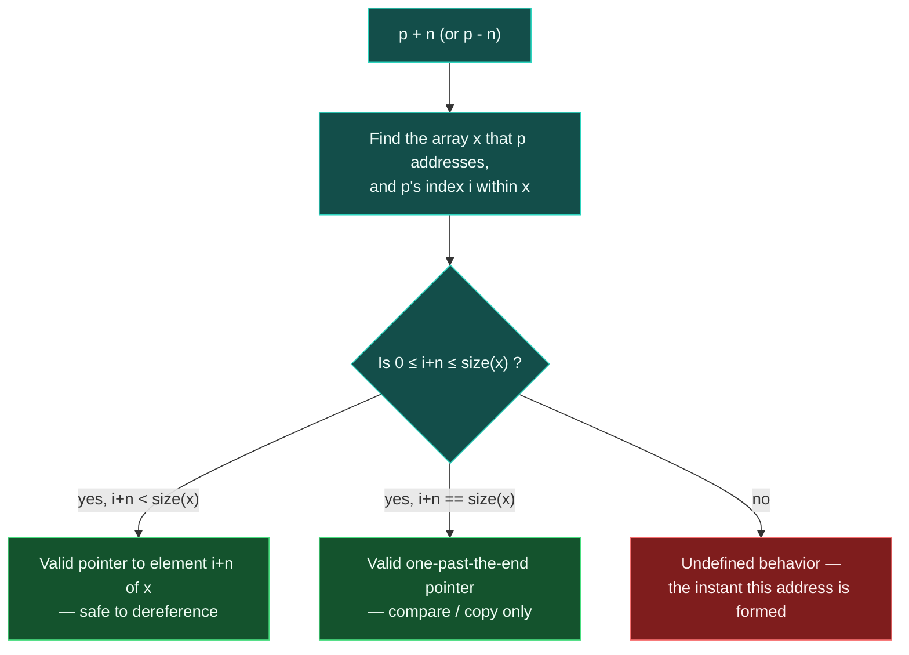

# Pointer Arithmetic and Arrays

> [!essence]
> `p + n` does not move an address forward by `n` bytes. It moves `p` by `n` *elements* of whatever type `p` points to, and the result is legal only while it stays inside — or exactly one step past — the single array object `p` already addresses. Step further, and the address is undefined the instant it is computed, whether or not anything ever reads it.

## The Problem

An array is cheap precisely because it has no per-element bookkeeping: `int arr[5]` is five `int`s laid end to end, and nothing else ([[Storage Duration]] already fixed *where* those bytes live). Walking such a structure — printing every element, searching it, copying a range — needs a value that can step from one element to the next without being told the array's size or its own position in it. The hardware, though, only knows how to add raw byte offsets to an address; it has no notion of "the next `int`" as opposed to "the next four bytes," and it certainly has no notion of "still inside the array."

> [!principle] Constraint → Consequence → Requirement → Design → Price
> 1. **Constraint.** The machine adds byte offsets to addresses. A [[Pointers|pointer]]'s only payload beyond that address is its compile-time pointee type `T`.
> 2. **Consequence.** If `p + n` meant "add `n` to the address," it would land `n` *bytes* away: still inside the same `int` for small `n`, or straddling two unrelated objects for a packed array of anything larger than one byte. Neither is "the next element."
> 3. **Requirement.** `p + n` must mean "`n` elements further," scaled automatically by `T`'s size — and because nothing tracks at run time which array a pointer came from, the operation needs a boundary the language can hold the programmer to, even without a check it can actually perform.
> 4. **Design.** The Standard defines `p + n` and `p - n` only relative to the specific array object `x` that `p` is known to address: the only legal results are the addresses of elements `i+n` for `0 ≤ i+n ≤ size(x)` — including the address exactly one element past the last, which exists solely to be compared against, never read through (`[expr.add]` ¶4; paragraph numbers are the current working draft's). A lone, non-array object counts as its own one-element array for this rule, which is why `&x + 1` is legal even though `x` isn't inside any array.
> 5. **Price.** Legality is defined purely in terms of "the array `x` that `p` addresses" — information the type system doesn't carry and the running program doesn't check. Forming `p + n` outside that window is undefined the moment the address is computed (`[expr.add]` ¶4.3), independent of whether anyone ever dereferences it. Pointer arithmetic is exactly as fast as adding an integer, and exactly as safe as the programmer's own bookkeeping.

> [!tension] safety ⟷ performance
> A loop written with pointer arithmetic compiles to the same handful of instructions whether the array holds 3 elements or three million, because no bound is threaded through it — none is stored. [[Iterators]] wrap this same arithmetic behind a type that *can* be range-checked in a debug build; raw pointer arithmetic never can. See [[Map — Objects, Memory & Lifetime]].

## Mental Model

> [!model] A finger on a filmstrip, not a walk down a street of houses
> Picture the array as one filmstrip, each frame the width of one element. A pointer is a finger resting on a frame; `p + 1` slides the finger exactly one frame over, however wide that frame is, because the projector — the compiler — already knows the frame width from `p`'s type. Reading the frame under the finger is separate from sliding to it.
> **Where it breaks:** two filmstrips can sit end to end on the editing table with no visible seam, but a finger that slides off the end of the first one is now on a *foreign strip*, not "still on the reel." The compiler does not remember where one array ended and the next began, and the model must not pretend otherwise.

```text
int arr[5] = {10, 20, 30, 40, 50};        one array object: 5 contiguous ints, 4 bytes each

 address   0x1000   0x1004   0x1008   0x100c   0x1010   0x1014
          ┌────────┬────────┬────────┬────────┬────────┬─── ···
 value    │   10   │   20   │   30   │   40   │   50   │  ?    (not part of arr)
          └────────┴────────┴────────┴────────┴────────┴─── ···
 index      [0]      [1]      [2]      [3]      [4]    [5] = one-past-end
             ▲                          ▲                 ▲
 arr ────────┘            arr+3 ────────┘     arr+5 ──────┘  compare / copy only — never dereference
                                                        arr+6, arr+9, … ── UB the instant the address forms
```

Contrast [[References|a reference]], which has no address arithmetic at all: there is exactly one referent, fixed at binding, and no notion of "the next one." Pointer arithmetic exists because a pointer, unlike a reference, is a full object that can be re-aimed — this mechanism is what re-aiming *along an array* means.

## Step by Step

1. **Fix the element type and its size (compile time).** From `p`'s type `T*`, the compiler already knows `sizeof(T)`. Nothing about this stage needs the array's size.
2. **Identify which array.** The abstract machine treats `p` as addressing element `i` of some array `x` — a real declared array, or, per `[basic.compound]`, the hypothetical one-element array formed by any non-array object, or a null pointer.
3. **Check the bound.** `p + n` is defined only if `0 ≤ i+n ≤ size(x)`. Reaching `size(x)` exactly is the one legal one-past-the-end case.
4. **Form the address.** If the check passes, the result names element `i+n` of `x`, real or hypothetical. If it fails, undefined behavior happens *here* — at formation — regardless of what happens next.
5. **Only then, maybe, dereference.** `*` on the result is separately legal only when `i+n < size(x)` strictly; the one-past-end pointer from stage 4 may be compared or copied, never read through.
6. **Subtraction reverses the same arithmetic.** `q - p`, both addressing elements of the same `x`, yields their index difference as `std::ptrdiff_t` (`[expr.add]` ¶5). Subtracting pointers into two different arrays is undefined too, with nothing in the syntax to distinguish it from the legal case.



## Under the Hood

> [!machine] Scaling is real and lives in one instruction — GCC 11.4.0, x86-64 Linux, `-O2`
> ```nasm
> advance_int(int*, long):        ; int* advance_int(int* p, long n) { return p + n; }
>         lea   rax, [rdi+rsi*4]   ; ① scale n by sizeof(int) == 4, add to the address
>         ret
> advance_double(double*, long):  ; double* advance_double(double* p, long n) { return p + n; }
>         lea   rax, [rdi+rsi*8]   ; ② same shape, scaled by sizeof(double) == 8 instead
>         ret
> distance(int*, int*):           ; long distance(int* p, int* q) { return p - q; }
>         sub   rdi, rsi
>         mov   rax, rdi
>         sar   rax, 2             ; ③ byte difference ÷ sizeof(int): undoes the scaling from ①
>         ret
> ```
> `[expr.add]` never mentions bytes or `sizeof` — it defines the operation purely in terms of *elements* of `x`. That every mainstream ABI realizes "`n` elements further" as `n * sizeof(T)` bytes is an implementation reality, not a requirement; it's also exactly why the scale factor tracks `T` (① vs ②) while the source line `p + n` never changes.

> [!machine] Bounds checking needs the array's *type*, not just an address — observed with GCC 11.4.0, x86-64 Linux
> `arr[idx]` compiled with `-fsanitize=bounds -O1`, with `arr` an `int[3]` and `idx` a non-constant `5`, reports `runtime error: index 5 out of bounds for type 'int [3]'` at run time — the compiler can still see `arr`'s declared type at the access site. The identical index reached through a function parameter `int* base` (the array already decayed to a pointer), or through raw arithmetic `arr + n` that is never dereferenced, produces **no diagnostic at all** under `-fsanitize=bounds,pointer-overflow,address,undefined` on this same toolchain: the type information the check needs was lost the moment the array decayed to `T*`. `pointer-overflow` catches address wraparound, not "this address is outside the array it came from."

The same "the compiler may assume no UB" reasoning licenses a subtler optimization one level up: a loop index used only to offset a pointer gets folded straight into the pointer arithmetic, but only if the index's own overflow is already undefined. Compiling two near-identical string-scanning loops on this toolchain (GCC 11.4.0, `-O2`) —

```cpp
bool cmp_unsigned(const char* s1, const char* s2) {
    for (unsigned i = 0;; ++i)
        if (s1[i] != s2[i]) return s1[i] > s2[i];
}
bool cmp_signed(const char* s1, const char* s2) {
    for (int i = 0;; ++i)
        if (s1[i] != s2[i]) return s1[i] > s2[i];
}
```

— produces `lea edx, 1[rax]` (a narrow 32-bit increment kept separate from the address) for the `unsigned` version, but `add rax, 1` folded directly into the 64-bit pointer computation for the `int` version. Pikus ch. 11 (pp. 379–380) reports the identical effect on GCC 9. Because signed overflow is undefined, the compiler may assume `i` never wraps and reuse it as the same 64-bit quantity driving the address; unsigned overflow is *defined* (it wraps), so the compiler cannot make that assumption and must keep a separate, narrower counter.

## In Code

**1 · Walking an array one element at a time**

```cpp
#include <cstdio>

int main() {
    int arr[5] = {10, 20, 30, 40, 50};
    int* begin = arr;          // ① arr decays to a pointer to its first element
    int* end   = arr + 5;      // ② one past the last element: legal, never dereferenced
    for (int* p = begin; p != end; ++p)
        std::printf("%d\n", *p);
}
// expect: 10
// expect: 20
// expect: 30
// expect: 40
// expect: 50
```
1. The full decay story — *why* `arr` alone already means "pointer to `arr[0]`" — belongs to [[Built-in Arrays and Array-to-Pointer Decay]]; this note only uses the result.
2. `arr + 5` is exactly the one-past-end address Step 3 permits for a 5-element array. The loop condition only ever compares it to `p`.

**2 · Subtraction counts elements, not bytes — until you force it to**

```cpp
#include <cstdio>

int main() {
    int arr[3] = {1, 2, 3};
    int* p = arr;
    std::printf("%td\n", (p + 1) - p);                                    // ①
    std::printf("%td\n",
        reinterpret_cast<char*>(p + 1) - reinterpret_cast<char*>(p));     // ②
}
// expect: 1
// expect: 4
```
1. Subtracting two `int*` values yields their index difference — always `1` here — per `[expr.add]` ¶5, never a byte count.
2. Reinterpreting both sides as `char*` first exposes the byte distance the hardware actually computed: exactly `sizeof(int)` on this LP64 toolchain. A pointee of a different size would scale by its own `sizeof` instead — nothing else in the arithmetic changes.

**3 · Past one-past-the-end is UB the moment it's formed, dereferenced or not**

```cpp
// cc: ub
#include <cstdio>

int main() {
    int arr[3] = {1, 2, 3};
    volatile int n = 7;        // ① hide the offset from compile-time bounds analysis
    int* one_past = arr + 3;   // ② legal: the defined one-past-end address
    int* far      = arr + n;   // ③ undefined right here — far is never read
    std::printf("%p %p\n", (void*)one_past, (void*)far);
}
```
1. A literal `arr + 7` would trip GCC's own `-Warray-bounds` at compile time here, because the offset and the array's size are both visible together — a compiler diagnostic from constant folding, not a sanitizer. Reading it through `volatile` removes that visibility, which is the realistic case: real offsets come from runtime data, not literals sitting next to the array.
2. Matches `[expr.add]` ¶4's boundary case exactly: `i+n = 3 = size(arr)`.
3. `i+n = 7 > size(arr) = 3`: undefined the instant the address is computed. On this toolchain, built and run with `-fsanitize=bounds,pointer-overflow,address,undefined`, this program compiles, runs and exits `0` with no diagnostic — see Under the Hood.

**4 · Arithmetic through a reinterpreted type is a second, separate hazard**

```cpp
// cc: ub
#include <cstdio>

int main() {
    int values[5] = {1, 2, 3, 4, 5};
    auto* reinterpreted = reinterpret_cast<unsigned int*>(values + 1);  // ①
    unsigned int ok      = *reinterpreted;                             // ②
    unsigned int* stepped = reinterpreted + 1;                         // ③
    std::printf("%u %p\n", ok, (void*)stepped);
}
```
1. `values + 1` is itself perfectly ordinary pointer arithmetic on an `int` array.
2. Reading `values[1]`'s bytes through an `unsigned int*` is explicitly permitted: the aliasing rules carve out the signed/unsigned counterpart of an object's real type (`[basic.lval]`).
3. Stepping *that* pointer is a different question from reading through it: `[expr.add]` ¶6 requires the pointer's type to be "similar" to the array's actual element type for arithmetic specifically — `unsigned int` isn't `int` — so `stepped` is undefined even though `ok` was fine. [[Strict Aliasing and Type Punning]] is the full treatment of this second hazard.

## Consequences

| What this mechanism explains | Why |
|---|---|
| A [[Buffer Overruns and Out-of-Bounds Access|buffer overrun or off-by-one]] is undefined the instant the out-of-range address is formed, not only once something reads it | `[expr.add]` ¶4.3 attaches UB to computing `p + n`, not to dereferencing it — Step by Step §3–4 |
| `-fsanitize=bounds` catches `arr[idx]` but stays silent through a decayed pointer or raw `arr + n` | The check needs the array's static type at the access site; both decay and arithmetic erase it — Under the Hood |
| Two pointers may be subtracted, or ordered with `<`/`>`, only when they address the same array | `[expr.add]` defines both purely in terms of indices `i`, `j` of one array `x`; "how far apart" two unrelated objects are has no defined meaning |
| `std::vector`/`std::string` iterators feel like pointers because they generalize exactly this stepping model behind a type a debug build can range-check | [[Iterators]] |
| A C-style string is walked by this same arithmetic, one `char` at a time, stopped by a sentinel value rather than a remembered length | [[C-Style Strings]] |
| Arithmetic through a pointer reinterpreted to an unrelated type is UB even when a read through it is explicitly allowed | `[expr.add]` ¶6's "similar type" requirement is stricter than the aliasing-read exception — In Code, Example 4, [[Strict Aliasing and Type Punning]] |

## Connections

- **Prerequisites:** [[Pointers]] (the value this mechanism steps) · [[Storage Duration]] (why an array's elements are contiguous at all).
- **Enables:** [[Iterators]] (the same stepping model, generalized behind a checkable interface) · [[C-Style Strings]] (a null-terminated array walked one element at a time) · [[Built-in Arrays and Array-to-Pointer Decay]] (the conversion that supplies this mechanism's starting pointer).
- **Siblings:** [[Pointers vs References]] (only a pointer supports this at all — a reference has no "next").
- **Hazards:** [[Buffer Overruns and Out-of-Bounds Access]] (the failure this mechanism produces when the bound check in Step by Step §3 is skipped) · [[Strict Aliasing and Type Punning]] (arithmetic through a reinterpreted pointer type) · [[Dangling Pointers and References]] (an in-bounds address whose target's lifetime has already ended is a different unchecked claim than an out-of-bounds one).
- **Domain:** [[Map — Objects, Memory & Lifetime]].
- **Practice:** *Continuum #11 Pointer & Array Internals Lab* — print `p`, `p+1` and `p-arr` side by side and confirm the scale factor changes with the pointee type, exactly as in Under the Hood.

## Check Yourself

> [!quiz]- Why does `p + 1` move a `double*` twice as far in memory as it moves an `int*`, on the same machine?
> `[expr.add]` defines the operation as "one element further," and every mainstream compiler realizes that as `n * sizeof(T)` bytes. `sizeof(double)` is 8 and `sizeof(int)` is 4 on this toolchain, so the same source expression `p + 1` compiles to a different scale factor for each — see Under the Hood's `lea` instructions.

> [!quiz]- In Example 3, `far` is computed but never dereferenced, yet the note calls the program's behavior undefined. Why isn't "never read" good enough to make it safe?
> `[expr.add]` ¶4.3 attaches undefined behavior to *computing* an out-of-range pointer value, not to reading through it. The rule exists because the address itself is the thing with no defined meaning once it names no element of any array — there's nothing left to "not read safely," since the value was never a valid address to begin with.

> [!quiz]- Predict: what does `std::printf("%d %d\n", arr[2], 2[arr]);` print, given `int arr[3] = {7, 8, 9};`?
> `9 9`. `E1[E2]` is defined as `*((E1)+(E2))` (`[expr.sub]` ¶2), and addition is commutative, so `arr[2]` and `2[arr]` are the exact same expression, `*(arr + 2)`, spelled two ways.

> [!quiz]- Why does `-fsanitize=bounds` catch `arr[idx]` written directly in `main`, but stay silent once `arr` is passed into a function as `int* base`?
> The check needs to see the array's declared type (`int[3]`, say) at the point of access to know the legal range. A function parameter's type is just `int*` — the array has already decayed, and with it the size information the check depended on. See Under the Hood.

## Sources

- Primer §3.5.3 "Pointer Arithmetic" (pp. 119–121): the element-scaled add/subtract rules, the off-the-end pointer, `ptrdiff_t`, and pointer arithmetic on a non-array object.
- PPP §16.1 "Arrays" (ch. 16, "Pointer arithmetic"): the same rules built up alongside `span` and `array` as the safer modern alternative.
- Pikus ch. 11 "Undefined Behavior and Performance" (pp. 379–380): the signed-vs-unsigned loop-index codegen difference, independently reproduced above on GCC 11.4.0.
- cppreference, *Arithmetic operators* §Pointer arithmetic: https://en.cppreference.com/w/cpp/language/operator_arithmetic#Pointer_arithmetic
- Draft standard `[expr.add]` ¶4–6 (pointer addition, subtraction, the "similar type" requirement): https://eel.is/c++draft/expr.add · `[expr.sub]` ¶2 (`E1[E2]` ≡ `*((E1)+(E2))`): https://eel.is/c++draft/expr.sub · `[basic.compound]` (the non-array-object-as-1-element-array rule): https://eel.is/c++draft/basic.compound — paragraph numbers are the current working draft's, not necessarily C++23's.
