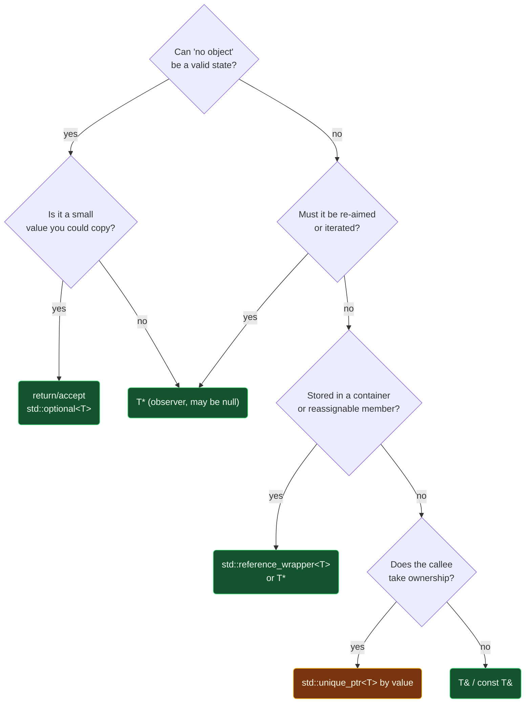

# Pointers vs References

> [!essence]
> Both let code reach an object without copying it, and both usually compile to the same machine address. The difference is in the **contract**. A **reference** is a permanent *alias*: another name for one existing object, never null, never reseated. A **pointer** is an *object holding an address*: it can be null, can be re-aimed, can do arithmetic, and has an address of its own. Use the weakest tool that expresses your intent. That is a reference unless you need something only a pointer can do.

## The Question

Every time a function takes, returns or stores "access to an object that lives elsewhere", you choose between `T&` and `T*`. The machine doesn't care: both are an address in a register. The **reader** of the code cares, and so do the compiler's checks, because each choice promises different things about **nullability**, **reseating** and **ownership**.

> [!principle] Why C++ has both
> 1. **Constraint:** C had only pointers. A pointer parameter forces every caller to write `&x` and every callee to guard against null, even when "no object" is meaningless.
> 2. **Consequence:** Operator overloading (`a + b` for user types) was impossible to write naturally. `operator+(const Matrix*, const Matrix*)` would force `&a + &b`.
> 3. **Design:** Stroustrup added references to early C++ (mid-1980s, long before C++98): an alias that is syntactically the object, bound once, never null. Operators and pass-by-reference read like pass-by-value but cost like a pointer.
> 4. **Price:** Two ways to do similar things, plus an asymmetry: references are not objects, so there are no arrays of references, no references to references, and no reseating.

## At a Glance

| Criterion | `T&` reference | `T*` pointer |
|---|---|---|
| **Can be null / "no object"** | ✗ never (a null reference would require UB to create) | ✓ `nullptr`: must be checked |
| **Must be initialized** | ✓ at declaration | ✗ may be uninitialized (dangerous) |
| **Can be re-aimed** | ✗ bound for life: `r = x` assigns *through* it | ✓ `p = &other` |
| **Is an object** (has its own address, `sizeof`) | ✗ no: `&r` is the referent's address | ✓ yes: `&p` is a `T**` |
| **Arithmetic / iteration** | ✗ | ✓ `p + 1`, `p[i]` (within arrays) |
| **Arrays of them / in containers** | ✗ (use `std::reference_wrapper`) | ✓ |
| **Syntax at use site** | ✓ like the object: `r.f()` | ~ `p->f()`, `*p` |
| **Can dangle** | ✓ yes | ✓ yes |
| **Expresses ownership** | ✗ never owns | ~ raw: *should* not own (use smart pointers) |
| **Typical machine code** | an address | an address |

## Deep Dive

### References: an alias with a fixed binding

A reference is not a separate object with its own value. It is **another name** for an existing object (`[dcl.ref]`). Everything done to the reference is done to the referent: assignment, address-of, member access. That's why a reference must be bound when declared (there is nothing to name otherwise) and can never be rebound (no syntax could mean "rebind", since `r = x` already means "assign `x` to the referent"). Whether a reference occupies storage is **unspecified**. As a function parameter or member it is usually implemented as a pointer. As a local alias it often compiles away entirely.

`const T&` adds a special power: it binds to **temporaries** and extends their lifetime ([[Temporaries and Lifetime Extension]]). That's what makes `void print(const std::string&)` accept `print("hi")`. `T&&` binds only to rvalues and powers [[Move Semantics]].

Because a reference is not an object, C++ forbids compounding it directly: there are no arrays of references, no pointers to references, and no references to references (`int& &r;` is ill-formed) — `[dcl.ref]` ¶5. The one loophole is indirect, through a `typedef` or a template parameter: form a "reference to a reference" that way and *reference collapsing* resolves it instead of rejecting it — every combination collapses to `T&` except `T&& &&`, which stays `T&&` (`[dcl.ref]` ¶7, since C++11). That single rule is what lets `std::forward` exist; see [[Forwarding References and Reference Collapsing]].

A reference can never be null, but it can still **dangle**: if the object it names reaches the end of its lifetime, evaluating the reference afterward is undefined behavior, not a null-like sentinel (cppreference, *Reference declaration* §*Dangling references*). The reference doesn't know its referent is gone — the bytes may still be readable garbage — so the danger is silent. See [[Dangling Pointers and References]] for how this happens in real code.

A reference member is also a promise the compiler cannot keep automatically. Copy-assigning an object would have to either reseat the member's binding (impossible: a reference is bound for life) or assign through it (silently rewriting an unrelated object) — so the language refuses to choose. A defaulted copy assignment operator is defined as **deleted** for any class with a non-static data member of reference type (`[class.copy.assign]` ¶7.2; Primer §13.1, p. 508–509) — *In Code* §3 compiles this and shows the exact diagnostic.

### Pointers: an object that stores an address

A pointer is a full object. It has a value (an address, or null), it can be copied and assigned, it can be `const` itself (`T* const`) independently of its target (`const T*`) (see [[Top-Level vs Low-Level const]]), and it supports arithmetic *within an array*. These powers are exactly why pointers are riskier. Every pointer might be null, uninitialized, one past the end, or dangling, and the type system tracks none of this.

Pointer arithmetic has one legal boundary: a pointer may address an array element or the single position one past the array's last element, and computing anything further than that is undefined behavior — "unlikely" for the compiler to catch, per the Primer (Primer §3.5, p. 120). Even the legal one-past-the-end pointer may only be compared, never dereferenced; that narrow contract is exactly what `end()` iterators rely on.

In modern C++, **raw pointers should not own** (`delete` belongs to [[unique_ptr]] and friends). A raw `T*` therefore means "an optional, re-aimable observer", which keeps both types' meanings sharp.

### Under the Hood: same address, different contract

Compile a function taking `const Big&` against one taking `const Big*`, at `-O2`:

```nasm
sum_ref(Big const&):                sum_ptr(Big const*):
  movdqu xmm1, [rdi+16]               movdqu xmm1, [rdi+16]
  movdqu xmm0, [rdi]                  movdqu xmm0, [rdi]
  paddq  xmm0, xmm1                   paddq  xmm0, xmm1
  ...                                  ...
  ret                                  ret
```
*(GCC, Compiler Explorer, `-O2 -std=c++20`; the two function bodies are byte-for-byte identical.)*

Both parameters arrive in `rdi` as one 8-byte address, and neither prologue tests it for null: the compiler isn't allowed to doubt what the reference's contract already promised. The same equivalence shows up in layout. Whether a reference needs storage at all is **unspecified** (`[dcl.ref]` ¶4) — a local reference is often optimized away entirely — but as a *member*, the compiler must store the alias somewhere, and it costs precisely a pointer's worth: `sizeof(struct{int& r;})` equals `sizeof(struct{int* p;})` (8 bytes on a 64-bit ABI), because "a non-static data member of reference type usually increases the size of the class by the amount necessary to store a memory address" (cppreference, *Reference declaration*). Same bits, different rules about what you're allowed to do with them.

### Corner Cases: same address, sharper edges

**Dynamic dispatch doesn't care which one you used.** A common misreading of "pointers enable polymorphism" is that only a pointer can reach a derived class's override. That can't be right: a virtual call dispatches on the object's **dynamic type**, and a reference tracks the dynamic type exactly like a pointer does — only a **by-value** parameter loses it, by copying just the base slice ([[Object Slicing]]). cppreference's own worked example for the `virtual` specifier calls through both a `Base&` and a `Base*` bound to the same `Derived` object and gets the derived override either way (*virtual function specifier* §Explanation). The Primer's own definition of polymorphism names both access paths without favoring either: type-specific behavior chosen by the object's dynamic type, reached through a reference *or* a pointer (Primer §15.3, p. 605; *Defined Terms*, p. 650) — the mechanism could just as well have been called "reference dispatch" as "pointer dispatch". See [[Virtual Dispatch — vptr and vtable]] for what either access path actually triggers.

**Comparing references compares values, not identity.** `p1 == p2` on two pointers asks "same address?" for free, because a pointer *is* an address. A reference has no `operator==` of its own: `r1 == r2` calls the *referent* type's `operator==` (or fails to compile if there isn't one), because a reference reads exactly like the object it names. To ask "do `r1` and `r2` name the same object?", compare addresses explicitly — `&r1 == &r2` — which is the "is an object" row of *At a Glance* showing up at a call site instead of in a table.

**Pointer ordering across unrelated objects is *unspecified*, not undefined.** `p < q` for pointers into the same array is well-defined: the higher subscript is required to compare greater (`[expr.rel]` ¶4.1). For pointers into unrelated objects — the common assumption is that this is UB — the current working draft says the result is merely **unspecified**: some unstated but non-catastrophic answer, not licence for anything to happen (`[expr.rel]` ¶5). That is exactly why ordered containers of raw pointers are still well-defined: `std::less<T*>` is specified to follow an "implementation-defined strict total order over pointers" that stays consistent for the program's run (cppreference, *std::less*; guaranteed since the LWG 2562 defect report), so `std::set<T*>` and `std::map<T*, ...>` don't rely on `<` meaning anything for `p` and `q` on its own.

## Decision Guide



In words:

1. **Default to `const T&`** for read-only access to anything larger than a couple of machine words. Use `T&` for "the function modifies the caller's object" (an *out* or *in-out* parameter).
2. Use **`T*`** when *absence is meaningful* (an optional parent, "not found"), when the observer must be **re-aimed** (a cursor, a current node), or for pointer arithmetic in low-level code.
3. Transfer **ownership** with smart pointers by value, never with `T*` or `T&` ([[Owning vs Observing Pointers]]).
4. For "maybe a value" results of small copyable types, **`std::optional<T>`** beats a nullable pointer ([[optional]]).
5. For reference semantics inside containers, use **`std::reference_wrapper<T>`** (`std::ref`).

> [!rule] The Core Guidelines' summary
> *F.60: Prefer `T*` over `T&` when "no argument" is a valid option.* · *F.17: For in-out parameters, pass by reference to non-const.* · *R.3: A raw pointer (a `T*`) is non-owning.*

## In Code

**1 · The contract difference, observed**

```cpp
#include <iostream>

struct Node { int value; Node* next; };

int main() {
    int a = 1, b = 2;
    int& r = a;          // ① r IS a from now on
    r = b;               // ② assigns 2 to a; r still names a
    int* p = &a;         // ③ p is an object holding a's address
    p = &b;              // ④ p now points to b; a is untouched
    std::cout << a << ' ' << *p << ' ' << (&r == &a) << '\n';

    Node third{3, nullptr}, second{2, &third}, first{1, &second};
    int sum = 0;
    for (const Node* cur = &first; cur != nullptr; cur = cur->next)   // ⑤
        sum += cur->value;
    std::cout << sum << '\n';
}
// expect: 2 2 1
// expect: 6
```
1. Binding happens once, at initialization.
2. The classic misreading: this is *not* "rebind r to b". It copies `b`'s value into `a`.
3. The pointer has its own storage (`&p` is valid and differs from `&a`).
4. Re-aiming is what pointers are for.
5. A cursor walking a linked structure must be re-aimed *and* must be able to reach "no next node". Only a pointer expresses both. See *Continuum #13*.

**2 · Signatures that say what they mean**

```cpp
#include <optional>
#include <string>
#include <vector>

struct Employee { std::string name; Employee* manager; };   // ① may be null: CEO has none

double average(const std::vector<double>& xs);               // ② read-only, no copy
void normalize(std::vector<double>& xs);                     // ③ modifies the caller's vector
const Employee* find(const std::vector<Employee>& staff,
                     const std::string& name);                // ④ "not found" = nullptr
std::optional<double> parse(const std::string& text);        // ⑤ absence without pointers

int main() {}
```
1. A raw pointer member that can be null, and is non-owning: someone else owns the employees.
2. `const&`: the default for inputs that are expensive to copy.
3. Non-const `&`: the call site `normalize(v)` reads innocently, so name such functions with verbs.
4. Returning an *observer* into the caller's container. It dangles if the vector reallocates ([[Dangling Pointers and References]]).
5. For a small value type, `optional` states "maybe" without any addresses.

**3 · A reference member deletes copy assignment**

```cpp
// cc: ill-formed
struct Binder {
    int& target;   // ① bound once; nothing can rebind it
};

int main() {
    int a = 1, b = 2;
    Binder x{a};
    Binder y{b};
    x = y;         // ② error: use of deleted function Binder::operator=
}
```
1. `target` is fixed for the object's whole life, exactly like any other reference.
2. Copy-assigning `x` from `y` would have to reseat `target` (impossible) or write through it into `a` (silently changing an unrelated object, and not what "copy `x`" should mean). The compiler picks neither: it deletes `Binder::operator=` instead of guessing.

**4 · A reference dispatches virtually too — it isn't a pointer-only power**

```cpp
#include <iostream>

struct Shape {
    virtual double area() const { return 0.0; }
    virtual ~Shape() = default;
};

struct Circle : Shape {
    double r;
    explicit Circle(double r) : r(r) {}
    double area() const override { return 3.14159 * r * r; }   // ①
};

double describe(const Shape& s) { return s.area(); }             // ② reference parameter

int main() {
    Circle c{2.0};
    Shape& sref = c;    // ③ Shape&, bound to a Circle
    Shape* sptr = &c;   // ④ Shape*, same object
    std::cout << sref.area() << ' ' << sptr->area() << ' ' << describe(c) << '\n';
}
// expect: 12.5664 12.5664 12.5664
```
1. The override that both access paths must reach.
2. `describe` never sees a pointer, yet its call is exactly as virtual as one written with `const Shape*`.
3. A reference to the base, bound to a derived object: the dynamic type is `Circle`, not `Shape`.
4. Same object, same dynamic type, same dispatch — the two access paths are interchangeable for this purpose. What *would* lose the dynamic type is `Shape s = c;` (a by-value copy: see [[Object Slicing]]).

## Connections

- **Prerequisites:** [[Pointers]] · [[References]].
- **Deeper:** [[Parameter Passing — Value, Reference, Pointer]] · [[Owning vs Observing Pointers]] · [[Top-Level vs Low-Level const]] · [[nullptr and Null Pointers]] · [[Forwarding References and Reference Collapsing]] (what a "reference to a reference" collapses into).
- **Hazards shared by both:** [[Dangling Pointers and References]] · [[Object Slicing]] (loses the dynamic type that both a reference and a pointer preserve).
- **Same dispatch, either access path:** [[Virtual Dispatch — vptr and vtable]].
- **Alternatives:** [[optional]] · [[span]] (pointer + length) · [[unique_ptr]] (ownership).
- **Domain:** [[Map — Objects, Memory & Lifetime]].
- **Practice:** *Continuum #6 Function Library & Header Refactor* (choose each parameter's form deliberately) · *#11 Pointer & Array Internals Lab* · *#13 Linked List Library*.

## Check Yourself

> [!quiz]- Given `int x = 1, y = 2; int& r = x; r = y; y = 5;`, what are `x` and `r`?
> Both are `2`. `r = y` copied 2 into `x`, and `r` is still `x`. Changing `y` afterwards affects neither.

> [!quiz]- Why can't you create a `std::vector<int&>`, and what do you use instead?
> Container elements must be objects that can be assigned and have addresses. A reference is not an object and can't be reseated by assignment. Use `std::vector<std::reference_wrapper<int>>` (a copyable, re-aimable, never-null wrapper) or `std::vector<int*>`.

> [!quiz]- A function signature is `void attach(Widget* parent)`. What three questions does it leave the reader asking that `void attach(Widget& parent)` would not?
> Can `parent` be null (and what happens then)? Does `attach` take ownership (will it `delete` it)? Might `attach` store it and re-aim it later? A reference answers the first two by type: never null, never owning.

> [!quiz]- `void render(const Shape& s) { std::cout << s.area(); }` is called as `render(circle)`. Does it call `Shape::area` or `Circle::area`, and would the answer differ if the parameter were `const Shape*`?
> `Circle::area`, in both cases. Dispatch is decided by the object's dynamic type, which a reference preserves exactly as a pointer does; changing the parameter to `const Shape*` (called as `render(&circle)`) changes nothing about which override runs. Only a **by-value** `const Shape s` parameter would lose it, by slicing the object down to its `Shape` part.

> [!quiz]- Is `p < q` for two `int*` pointing into unrelated arrays undefined behavior?
> No — the Standard calls the result *unspecified* (`[expr.rel]` ¶5): no diagnostic is required, but nothing catastrophic is licensed either, unlike a true UB construct. `std::less<int*>` gives a consistent, implementation-defined total order over any pointers of that type, which is what ordered containers such as `std::set<int*>` actually rely on.

## Sources

- Primer §2.3.1 "References" (p. 50) and §2.3.2 "Pointers" (p. 52): binding rules and pointer states. Primer §3.5 "Arrays" (p. 120): the one-past-the-end arithmetic limit. Primer §13.1 "Copy, Assign, and Destroy" (p. 508–509): why a reference (or `const`) member deletes copy assignment. Primer §15.3 "Virtual Functions" (p. 605) and *Defined Terms* (p. 650): polymorphism defined by the dynamic type of a reference *or* pointer.
- Tour §1.7 "Pointers, Arrays, and References" (p. 11): the designer's short comparison.
- PPP §16.2 "Pointers and references" (ch. 16 "Arrays, Pointers, and References"): pointer vs reference from first principles.
- cppreference, *Reference declaration* (incl. §*Reference collapsing*, §*Dangling references*): https://en.cppreference.com/w/cpp/language/reference · *Pointer declaration*: https://en.cppreference.com/w/cpp/language/pointer · *Copy assignment operator*: https://en.cppreference.com/w/cpp/language/copy_assignment · *`virtual` function specifier* §Explanation (dispatch through `Base&` and `Base*` alike): https://en.cppreference.com/w/cpp/language/virtual · *`std::less`* (implementation-defined strict total order over pointers): https://en.cppreference.com/w/cpp/utility/functional/less
- Draft standard `[dcl.ref]` ¶4–7 (storage, no references to references, collapsing): https://eel.is/c++draft/dcl.ref · `[class.copy.assign]` ¶7.2 (deleted copy assignment): https://eel.is/c++draft/class.copy.assign · `[expr.rel]` ¶4–5 (same-array pointer ordering is defined; unrelated-object ordering is unspecified, not undefined): https://eel.is/c++draft/expr.rel
- C++ Core Guidelines F.60, F.17, R.3: https://isocpp.github.io/CppCoreGuidelines/CppCoreGuidelines
