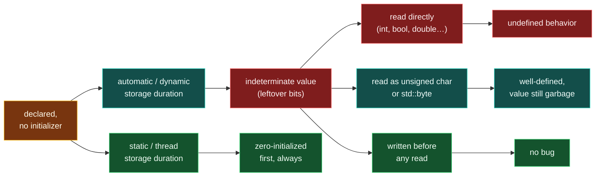

# Reading Uninitialized Variables

> [!essence]
> A variable declared with no initializer does not start at zero. It starts as whatever bits already occupy its storage, and for almost every type, *reading* that value before writing one is undefined behavior — not "the wrong number," but a claim the Standard makes no promise about at all. The bug is invisible in the source: the line that misbehaves is the line that reads, not the line that forgot to write.

## Symptom

This bug belongs to the same deceptive family as [[Dangling Pointers and References]]: the program frequently *looks* correct.

- The answer is **plausible but wrong** — off by some amount that has nothing to do with the input, because it came from memory that has nothing to do with the input.
- The result **changes with optimization level**, with an unrelated code change nearby, or between debug and release builds, because each of those changes what happens to occupy the variable's storage beforehand.
- **No crash, no warning, no sanitizer report** is guaranteed. A read of an indeterminate value is legal to execute; the Standard simply attaches no meaning to what comes back.
- It is a **top entry in real vulnerability catalogs**: an uninitialized read that flows into a size, an index, or a branch condition is a standard way to turn "wrong answer" into "exploitable."

## Root Cause

> [!principle] Why the language allows it
> 1. **Constraint:** Giving every variable a value the instant it's declared — the way a garbage-collected or bytecode-checked language does — costs an instruction (or a whole memset) at *every* declaration, even the overwhelming majority that are about to be written to anyway.
> 2. **Design:** For a scalar with automatic or dynamic storage duration, **default-initialization does nothing at all** (`[dcl.init.general]`). The bytes already there — leftover from whatever last used that memory — become the object's value: an [[Undefined Behavior|**indeterminate value**]]. Only static- and thread-duration objects are exempted: the language zero-initializes those unconditionally before anything else runs, because nothing may ever legitimately need their prior contents ([[Storage Duration]]).
> 3. **Price:** The compiler is licensed to treat "read before write" as a promise the programmer made and broke. It may assume that promise holds, and it is then free to generate code that only makes sense if it does — see the asm below for exactly this happening, not merely "leftover garbage" but a deliberate consequence of the freedom UB grants.

This is the same [[Map — Objects, Memory & Lifetime|safety ⟷ performance]] trade that produces dangling pointers, applied one step earlier: dangling is a value that *was* valid and stopped being; this pitfall is a value that *never started* being valid.



> [!standard] This rule has moved, but not for this vault's toolchain
> Through C++23, every read of an indeterminate scalar is undefined behavior in the general case (`[dcl.init.general]`; CWG 616/1787 carve out `unsigned char`/`std::byte`/`char`-if-unsigned as the one "uninitialized-friendly" exception — you can read those without UB, you just get an unspecified value). **Since C++26** (P2795R5, adopted Tokyo 2024), the same read of an *automatic*-duration scalar is instead **erroneous behavior**: the bytes get an implementation-chosen *erroneous value*, the read is well-defined, and a conforming implementation is encouraged to diagnose it — unless the declaration is marked `\[\[indeterminate\]\]`, or the object has dynamic storage duration, in which case it is still plain indeterminate-value UB (`[basic.indet]`). This vault's toolchain (GCC 11.4.0) predates that change; every example below is plain, pre-C++26 undefined behavior, which remains exactly as undefined on any C++98–C++23 compiler.

## Minimal Reproduction

**1 · A branch that's never taken still changes the answer**

```cpp
// cc: ub
#include <cstdio>

int total(int n, bool includeBonus) {
    int sum;                          // ① default-initialized: indeterminate
    if (includeBonus) sum = 100;      // ② only this path ever writes sum
    for (int i = 1; i <= n; ++i)
        sum += i;                     // ③ every path reads sum here, written or not
    return sum;
}

int main() {
    std::printf("%d\n", total(5, false));   // ④ includeBonus is false: naive expectation is 15
}
```
1. `sum` gets no initializer, so it holds whatever bits were already in that storage.
2. `includeBonus` is `false` in `main`'s call, so this assignment never executes.
3. The loop unconditionally reads and updates `sum`, regardless of which path was taken.
4. A reader who has never met this bug expects `1+2+3+4+5 = 15`, every time, on every compiler.

That expectation is wrong, and it is wrong in a way that depends on flags you didn't ask about:

| Build | `-Wall -Wextra` warning | Printed result |
|---|---|---|
| GCC 11.4.0, x86-64 Linux, `-O0` | none | `15` |
| GCC 11.4.0, x86-64 Linux, `-O1` | none | `115` |
| GCC 11.4.0, x86-64 Linux, `-O2` / `-O3` | none | `115` |

(Observed directly in this vault's build sandbox; every row uses the same source, the same compiler, and only the optimization level changes.) At `-O0` the leftover bits in `sum`'s stack slot happen to read as zero, so the "wrong" program accidentally prints the "right" answer — the single most dangerous outcome a bug can have, because it passes a casual test. At `-O1` and above, the compiler does something more interesting than leaving garbage: it *proves* the false branch is free to do anything, and it chooses to make it do the same thing the true branch does.

```text
GCC 11.4.0, -O1 -std=c++20, x86-64 (via `cc.py asm`)
 total(int, bool):
   test edi, edi
   jle   .L4
   add edi, 1
   mov eax, 1
   mov edx, 100        ; ⑤ true-branch value, materialized here
 .L3:
   add edx, eax
   add eax, 1
   cmp eax, edi
   jne .L3
 .L1:
   mov eax, edx
   ret
 .L4:
   mov edx, 100        ; ⑥ false branch: compiler assigns 100 too — nothing forbids it
   jmp .L1
```
5–6. Nothing in the Standard says what `sum` is worth on the `includeBonus == false` path, so the compiler is free to pick a value — and here it picked the *same* constant the other path uses, because that lets both branches share one loop instead of two. The 100 isn't "leftover garbage happening to survive"; it is the optimizer *choosing* 100, legally, because your program handed it that freedom. `-Wall -Wextra` stays silent at every one of the four optimization levels tested. AddressSanitizer and UndefinedBehaviorSanitizer (`-fsanitize=address,undefined`) also ran this exact binary and stayed silent, exiting `0` and printing `115` — neither instruments a plain scalar read; that is MemorySanitizer's job (Clang-only, `-fsanitize=memory`, not available in this toolchain), reported to track every byte's initialized/uninitialized shadow state and flag the first read.

**2 · A struct with no constructor doesn't zero its members either**

```cpp
// cc: ub
#include <cstdio>

struct Config {
    int retries;
    bool verbose;
};

int main() {
    Config cfg;                                          // ① aggregate: default-init, no member touched
    if (cfg.verbose) std::puts("verbose mode armed");     // ② UB: reads an indeterminate bool
    std::printf("retries=%d\n", cfg.retries);             // ③ UB: reads an indeterminate int
}
```
1. `Config` has no user-declared constructor, so it is an aggregate; `Config cfg;` with no braces at all is default-initialization, and for a class type with nothing to construct with, default-initialization does nothing to `retries` or `verbose`. This is the exact mechanism [[The Forms of Initialization]] derives in full; `Config cfg{};` (value-initialization) would zero both members instead, because empty braces force zero-initialization first.
2–3. Two more reads of indeterminate values, one of them feeding a branch condition — the shape every real security advisory about this bug class shares.

## Detection

| Tool | Catches it? | How |
|---|---|---|
| **Compiler warnings** (`-Wall -Wextra`) | ~ some | GCC's `-Wuninitialized`/`-Wmaybe-uninitialized` reliably flags the self-referential form (`int x = x;`; see [[Scope]]) but, verified above, missed Example 1's branch-dependent form completely at `-O0` through `-O3`. It is a heuristic, not a proof: it warns when its flow analysis is confident, and stays silent otherwise. |
| **AddressSanitizer / UndefinedBehaviorSanitizer** | ✗ no | Verified silent on Example 1 (exit `0`, prints `115`). Neither tool instruments a plain read of an uninitialized scalar; ASan poisons freed/out-of-scope *memory regions*, and UBSan checks a different, enumerated list of UB. See [[Undefined Behavior]] §Pitfalls. |
| **MemorySanitizer** (Clang, `-fsanitize=memory`) | ✓ reliably (reported) | Documented to track an initialized/uninitialized shadow bit per byte and abort at the first read of an uninitialized one — not run here (Clang-only; this toolchain is GCC). |
| **Valgrind memcheck** | ✓ reliably (reported) | Documented "conditional jump or move depends on uninitialised value(s)" report, at the cost of roughly the same 20–50× slowdown [[Dangling Pointers and References]] cites for its heap checks. |
| **Static analysis** (clang-tidy, cppcheck) | ~ some | clang-tidy's `cppcoreguidelines-init-variables` and `bugprone-uninitialized-*` checks flag missing initializers lexically; both miss cases that need real data-flow, same as the compiler warning. |
| **Code review heuristic** | ✓ if you ask | For every scalar and aggregate: *"does every path through this scope give it a value before the first read?"* — the question a branch-blind linter cannot ask. |

## Fix

The fix is always the same move: give the variable a value at the point of declaration, so there is no window during which it can be read unwritten.

**✗ Declared, then maybe assigned → ✓ initialized, then maybe reassigned**

```cpp
#include <cstdio>

int total(int n, bool includeBonus) {
    int sum = 0;                     // ① value present from the first instruction
    if (includeBonus) sum = 100;
    for (int i = 1; i <= n; ++i) sum += i;
    return sum;
}

struct Config {
    int retries = 0;                 // ② default member initializer: no constructor can skip this
    bool verbose = false;
};

int main() {
    std::printf("%d\n", total(5, false));
    Config cfg;
    std::printf("retries=%d\n", cfg.retries);
}
// expect: 15
// expect: retries=0
```
1. `int sum = 0;` is copy-initialization from a literal; the compiler no longer has a branch where `sum` lacks a defined value, so there is nothing left for it to legally exploit.
2. A **default member initializer** (C++11) sits in the class body itself, so it applies however the object is created — `Config cfg;`, `Config cfg{};`, and every constructor all see `retries` and `verbose` already set, with nothing left to the initialization form chosen at the call site.

## Prevention Rules

> [!rule] Give every scalar a value at its declaration
> *(Core Guidelines ES.20)* Prefer brace initialization (`int n{};`, `Config cfg{};`) over a bare declaration: `{}` cannot be typed by accident the way a forgotten `= 0` can, and it value-initializes rather than default-initializing, so it zeros even class types with no user-provided constructor. See [[The Forms of Initialization]] for exactly which spelling zeros what.

> [!rule] Default-member-initialize scalar fields
> `int retries = 0;` in the class body closes the gap for good: no constructor, present or future, can forget to mention that member and leave it indeterminate.

> [!rule] Don't trust `-Wall -Wextra` as a proof of absence
> It is real evidence for what it catches ([[Compilers and Essential Flags]]) and no evidence at all for what it doesn't. Verified above: it caught nothing in Example 1 at any of four optimization levels.

> [!rule] Use a tool built to catch this specific bug
> ASan and UBSan are the wrong instrument. Run MemorySanitizer (Clang) or Valgrind memcheck in CI at least occasionally ([[Sanitizers — ASan, UBSan, TSan]]); most uninitialized-read bugs that survive review and `-Wall` die there.

> [!rule] State genuine "no value yet" on purpose, don't leave it implicit
> C++26's `\[\[indeterminate\]\]` attribute lets you mark a variable as intentionally left unset, keeping its own reads plain UB instead of the new erroneous-behavior default — a way to say "I meant this," never a substitute for initializing before the first real use.

## Connections

- **Root concept:** [[Object Lifetime]] · [[The Forms of Initialization]] · [[Undefined Behavior]] · [[Storage Duration]] (why static/thread objects are exempt).
- **Related hazards:** [[Dangling Pointers and References]] (a value that stopped being valid, versus one that never started) · [[Pointers]] (an uninitialized pointer is this exact bug with an address in place of a number).
- **Tooling:** [[Compilers and Essential Flags]] · [[Sanitizers — ASan, UBSan, TSan]].
- **Domain:** [[Map — Objects, Memory & Lifetime]].
- **Practice:** *Continuum #11 Pointer & Array Internals Lab* (reproduce the branch-dependent case under `-O0`/`-O1` and confirm ASan/UBSan stay silent).

## Check Yourself

> [!quiz]- Why does `-O0` printing the "correct" answer in Example 1 not mean the code is fine at `-O0`?
> The bug is still there; `-O0` is simply the one build where the leftover bits in `sum`'s storage happen to read as zero. Undefined behavior includes "looks right by accident," and nothing guarantees the next unrelated change, compiler upgrade, or optimization flag keeps it looking right.

> [!quiz]- AddressSanitizer catches use-after-free reliably. Why does it stay silent on an uninitialized read?
> ASan's poisoning tracks memory regions that have been freed or gone out of scope — it answers "is this address still valid to touch?" An uninitialized read touches perfectly valid, currently-live storage; the question it raises is "does this bit pattern mean anything?", which is MemorySanitizer's shadow-tracking, not ASan's.

> [!quiz]- Spot the bug: `struct Config { int retries; bool verbose; }; Config cfg; if (cfg.verbose) startVerbose();`
> `Config` is an aggregate with no constructor, so `Config cfg;` default-initializes it — which does nothing to a scalar member. `cfg.verbose` is indeterminate, and reading it in the `if` is undefined behavior. Fix with `Config cfg{};` (zeros both members) or default member initializers on the struct itself.

## Sources

- Primer §2.2 "Variables" (p. 45): "An uninitialized variable has an indeterminate value... What happens when we use an uninitialized variable is undefined."
- PPP §7.2 "Declarations and definitions": the branch-dependent uninitialized-read example ("this looks innocent enough, but...").
- cppreference, *Default-initialization*: https://en.cppreference.com/w/cpp/language/default_initialization
- eel.is C++ draft, *Indeterminate and erroneous values*: https://eel.is/c++draft/basic.indet
- P2795R5, "Erroneous behaviour for uninitialized reads" (adopted for C++26): https://www.open-std.org/jtc1/sc22/wg21/docs/papers/2024/p2795r5.html
- C++ Core Guidelines ES.20 "Always initialize an object": https://isocpp.github.io/CppCoreGuidelines/CppCoreGuidelines#es20-always-initialize-an-object
- MemorySanitizer documentation (Clang): https://clang.llvm.org/docs/MemorySanitizer.html
