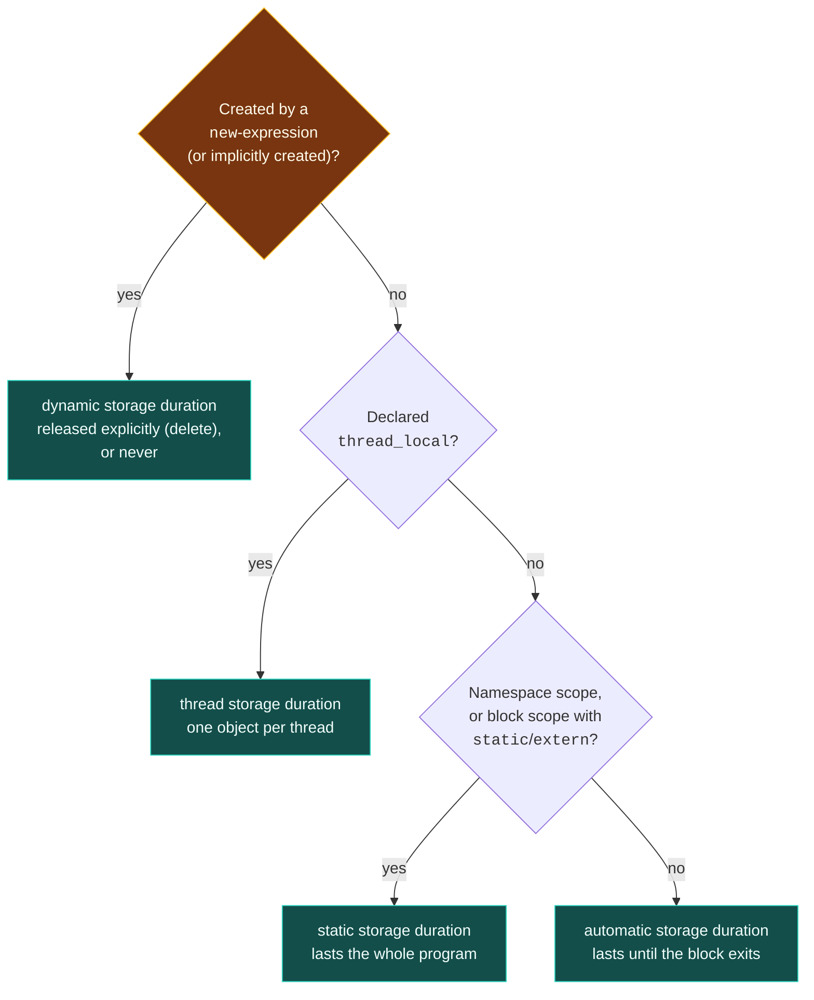

# Storage Duration

> [!essence]
> **Storage duration** is the property that says *when* an object's storage begins and ends, independent of its type, its value, or where in memory it happens to sit. The Standard names exactly four: static, thread, automatic, and dynamic — and every object gets one, fixed the instant it is created by nothing more than *how it was declared or created*.

## The Problem

[[The C++ Object Model — What an Object Is|An object]] is a region of storage, and storage is finite: a running program shares one address space with everything else it will ever create. Two policies fail immediately. Give every object storage for the whole run, and a program that calls a million functions needs a million objects' worth of memory sitting idle at once. Release every object's storage the moment its declaration's block ends, and there is no way to write a global counter, a per-thread cache, or a buffer whose size and lifetime only a file on disk can decide.

> [!principle] Constraint → Consequence → Requirement → Design → Price
> 1. **Constraint.** Storage is a shared, finite resource, and different objects genuinely need it for wildly different spans: some for the whole program, some for one function call, some for exactly as long as a programmer's own bookkeeping says.
> 2. **Consequence.** A single storage policy cannot serve every one of those needs. Universal persistence wastes memory and forces a global teardown order across the whole program; universal scope-binding makes a global logger, a per-thread request ID, or a heap-sized-at-runtime buffer simply inexpressible.
> 3. **Requirement.** The language needs a small, closed set of storage policies, each answering *when does this storage begin, and when does it end?* — decidable, for most objects, from the declaration alone, with no run-time bookkeeping at all.
> 4. **Design.** `[basic.stc.general]` fixes exactly four: **static** (storage for the whole program), **thread** (storage for the whole thread, one copy per thread), **automatic** (storage bound to a block's execution), and **dynamic** (storage bound to nothing but an explicit request and an explicit release). Which of the first three an object gets is settled by *where it is declared and which keyword, if any, precedes it* — a compile-time fact. Dynamic storage is different in kind: a `new`-expression asks for it at a moment only the running program decides.
> 5. **Price.** Three of the four categories are so tightly coupled to *scope* and *keywords* that the same keyword, `static`, does two unrelated jobs depending on where it appears — and getting that distinction wrong is the single most common confusion this topic produces (see Mechanics and Pitfalls).

> [!tension] compile-time ⟷ run-time
> Static, thread and automatic storage duration are never a run-time decision: the compiler can read them off the declaration, before the program ever executes. Dynamic storage duration is the opposite in kind — *nothing* about a `new`-expression's storage is fixed at compile time; the program decides how much, when, and whether at all, purely as an execution-time act. Most of C++'s storage story is compile-time discipline; dynamic storage is the deliberate escape hatch for what compile time cannot know.

## Mental Model

> [!model] The lease is signed at declaration, except for one kind
> Static storage is a lease signed for the life of the building: it starts before the tenants arrive and ends only when the building is torn down. Thread storage is the same lease, but one is signed per employee, valid only for their shift, torn up when they clock out. Automatic storage is a day-pass tied to being in a particular room: it expires the moment you leave, no matter what you're carrying. Dynamic storage is the only lease *you* sign yourself, on paper, whenever you want it, for as long as you keep paying — and the landlord (the allocator) enforces nothing else.
> **Where it breaks:** real leases are negotiated; storage duration is read off a declaration by a fixed rule, with no negotiation and no exceptions. The landlord analogy also can't explain *linkage* — a second, independent question about the same declaration that this note keeps separate below.



The four boxes are exhaustive and mutually exclusive: every declared object, reference, and temporary lands in exactly one (`[basic.stc.general]` ¶1–2).

## Mechanics

| Situation | Rule | Example |
|---|---|---|
| Namespace-scope variable | **Static** storage duration, always — this is fixed by scope alone, before any keyword is considered | `int g_counter;` |
| Block-scope variable, no specifier | **Automatic**: storage lasts until the enclosing block exits | `int n = 0;` inside a function |
| Block-scope variable, `static` | **Static**, but initialized only once — the first time control reaches the declaration ("magic static"; thread-safe since C++11) | `static int calls = 0;` inside a function |
| Any variable, `thread_local` | **Thread**: one distinct object per thread; `static` may accompany it but never changes the duration | `thread_local int request_id;` |
| Function parameter | **Automatic**: storage lasts until immediately after the parameter's own destruction | `void f(std::string s)` |
| Class non-static data member | Storage duration of its **complete object** — a subobject has no duration of its own (`[basic.stc.general]` ¶4) | `p.x` takes `p`'s duration |
| Class `static` data member | **Static**: exactly one instance total, whether zero or a million objects of the class exist (`[class.static.data]`) | `Account::next_id` |
| `new`-expression | **Dynamic**: created explicitly; released only by a matching `delete`, or never | `new int(5)` |
| Temporary object | **Automatic** by default; extended to match a reference's own storage duration only when bound directly to that reference | a returned prvalue bound to `const T&` |

> [!standard] The four categories, and nothing else
> `[basic.stc.general]` defines storage duration as "the minimum potential lifetime of the storage containing the object," fixed by "the construct used to create the object," and states there are exactly four: static, thread, automatic, dynamic. Static, thread and automatic durations attach to declared objects and to temporaries (`[class.temporary]`); dynamic duration attaches only to objects from a *new-expression* or to objects the implementation creates implicitly (`[intro.object]`) — never to an ordinary declaration.

> [!standard] Storage duration and linkage are independent properties
> A declaration's scope and specifiers control **two separate things**: storage duration (this note) and *linkage* — whether a name can be redeclared in another translation unit (`[basic.link]`). They are entangled only because the same keyword often sets both at once. A namespace-scope `int g;` already has static storage duration from scope alone; adding `static` there changes nothing about *when* its storage exists — it gives the name **internal** linkage instead of external. See the Under the Hood section for what that difference actually looks like to the linker.

> [!standard] Local statics are initialized exactly once, and (since C++11) thread-safely
> A block-scope `static` (or `thread_local`) variable is initialized the first time control passes through its declaration; later calls skip the initialization entirely (`[stmt.dcl]`). Before C++11 the Standard said nothing about two threads racing to be "first"; since C++11, concurrent first arrivals are required to block until initialization completes exactly once — "magic statics," implemented on mainstream compilers with a double-checked guard variable.

## Under the Hood

> [!machine] `static` at namespace scope changes the symbol, not the lifetime — GCC 11.4.0, x86-64 Linux, `nm` on the object file
> Compiling `int global_var = 1;` and `static int file_var = 2;` from Example 3 below produces two data symbols with **identical storage duration** but different linkage, visible directly in the symbol table:
> ```text
> $ g++ -std=c++20 -c linkage.cpp -o linkage.o && nm linkage.o
> 0000000000000004 d _ZL12file_counter
> 0000000000000000 D global_counter
> 0000000000000000 T main
> ```
> Uppercase `D` marks a symbol in the initialized-data section with **external** linkage — visible to the linker from other translation units. Lowercase `d` marks the same section but **internal** linkage — GCC even mangles the name (`_ZL...`, the `L` marks "local") so it can never collide with another file's symbol of the same spelling. Both objects were fixed in the program image before `main` ran; only their visibility to the linker differs. This is GCC's Itanium-ABI convention, not a language guarantee — the Standard only requires the linkage difference to be observable at link time, not that it look like this.

> [!machine] A `thread_local` read is not always "just a global" — GCC 11.4.0, x86-64 Linux, `-O2`
> Compiling a plain global and a `thread_local` of the same type shows the real cost is not fixed, but depends on how the translation unit is linked:
> ```nasm
> ; static storage duration (no -fPIC): one instruction, RIP-relative
> read_global(): mov  eax, DWORD PTR global_var[rip]
>                ret
> ; thread storage duration (no -fPIC, executable): one instruction too — segment-relative
> read_tls():    mov  eax, DWORD PTR fs:tls_var@tpoff
>                ret
> ; thread storage duration, compiled -fPIC (e.g. inside a shared library): a real call
> read_tls():    lea  rdi, tls_var@tlsgd[rip]
>                call __tls_get_addr@PLT
>                mov  eax, DWORD PTR [rax]
> ```
> Without position-independent code, x86-64 Linux's *local-exec* TLS model resolves a `thread_local` read to a single segment-relative load through `%fs`, no cheaper than a global's direct load only in instruction count, not in mechanism. Compiled `-fPIC` — the ordinary case for a shared library — the compiler cannot assume it knows the thread's TLS layout at link time, so it falls back to the *general-dynamic* model: a genuine function call to `__tls_get_addr` on every access, unless the toolchain optimizes it further. Never assume "thread-local" means "as cheap as global" without checking which model applies to your build.

## In Code

**1 · Four declarations, four storage durations**

```cpp
#include <cstdio>
#include <memory>

int g_calls = 0;                          // ① static: namespace scope

void tally() {
    static int local_calls = 0;           // ② static: block scope, `static` keyword
    int this_call = ++g_calls;            // ③ automatic: ordinary local
    ++local_calls;
    std::printf("call %d, local_calls seen so far: %d\n", this_call, local_calls);
}

int main() {
    tally();
    tally();
    auto owned = std::make_unique<int>(99);   // ④ dynamic: explicit new, explicit release
    std::printf("heap value: %d\n", *owned);
}
// expect: call 1, local_calls seen so far: 1
// expect: call 2, local_calls seen so far: 2
// expect: heap value: 99
```
1. `g_calls` exists before `main` runs and after it returns; there is exactly one, ever.
2. `local_calls` is declared inside a function but is **not** automatic: it is initialized once, on the first call, and keeps its value across every later call.
3. `this_call` is a fresh automatic object every call — its storage does not survive past `tally`'s closing brace.
4. `make_unique` obtains dynamic storage. Nothing about *when* it is released is tied to any scope; `unique_ptr`'s destructor happens to call `delete` when `owned` goes out of scope, but that is a design choice ([[RAII]]), not a property of dynamic storage itself.

**2 · Thread storage duration: one object, one copy per thread**

```cpp
#include <cstdio>
#include <thread>

thread_local int ticket = 0;   // ① thread storage duration

void issue(int n) {
    ticket = n;                 // writes only this thread's own copy
    std::printf("thread got ticket %d\n", ticket);
}

int main() {
    std::thread a(issue, 1);
    std::thread b(issue, 2);
    a.join();
    b.join();
    std::printf("main's ticket is still %d\n", ticket);   // ②
}
// expect: thread got ticket 1
// expect: thread got ticket 2
// expect: main's ticket is still 0
```
1. `ticket` is one *name* but not one *object*: `[basic.stc.thread]` guarantees a distinct object per thread.
2. `main` never touched `ticket` after the two threads ran, so its own copy is untouched — proof that the writes in `issue` never reached it. (The two "thread got ticket" lines can print in either order; both are guaranteed to appear.)

**3 · Static storage duration says nothing about linkage**

```cpp
#include <cstdio>

int global_counter = 1;        // ① static storage duration, external linkage
static int file_counter = 2;   // ② static storage duration, internal linkage

int main() {
    std::printf("%d %d\n", global_counter, file_counter);
}
// expect: 1 2
```
1. Namespace scope alone already gives `global_counter` static storage duration; it is visible to every translation unit that declares `extern int global_counter;`.
2. `file_counter` has exactly the same storage duration — fixed before `main`, released at program exit — but `static` restricts its *name* to this translation unit. See Under the Hood for the linker-visible difference `nm` reveals.

**4 · At most one storage-class specifier (thread_local excepted)**

```cpp
// cc: ill-formed
void f() {
    static extern int x;   // error: conflicting specifiers
}
int main() { f(); }
```
`static` and `extern` each claim a different linkage for the same block-scope name, and a *decl-specifier-seq* may name at most one storage-class specifier other than `thread_local` (which alone may combine with `static` or `extern`). The compiler rejects the contradiction outright rather than picking one.

## Pitfalls

> [!trap] `static` does one job at namespace scope and a different one at block scope
> At namespace scope, every variable already has static storage duration; adding `static` there only restricts linkage (Example 3). At block scope, adding `static` is what *grants* static storage duration in the first place — the variable would otherwise be automatic. Reading "static" as "lives forever, once" is right at block scope and half-wrong at namespace scope, where it never touched lifetime at all.

> [!trap] "Thread-local" is not a synonym for "cheap"
> A `thread_local` read compiles to as little as one instruction under the local-exec TLS model, or to a real function call (`__tls_get_addr`) under the general-dynamic model that position-independent code (most shared libraries) requires — see Under the Hood. Treating every `thread_local` access as free is an unverified assumption, not a rule.

> [!trap] Storage duration is not lifetime
> An object's *lifetime* ends when its destructor starts running (`[basic.life]`); its *storage duration* can outlast that moment — the bytes may sit released-but-unreleased, or reused, well after. [[Object Lifetime]] develops this distinction; this note only fixes *where the storage comes from*, not *how long the object built in it is valid*.

> [!ub] A pointer or reference into automatic storage does not survive the block
> Returning the address of a block-scope local hands the caller a pointer whose target's storage has already been released the instant the function returns. [[Dangling Pointers and References]] covers the mechanism and its detection in full; this note is why the storage disappears at all — automatic duration is bound to the block, unconditionally.

## Evolution

See [[Map — Evolution of C++]] for the language-wide timeline.

| Standard | Change | Why |
|---|---|---|
| C++98 | Three durations existed as we'd recognize them today — static, automatic, dynamic — plus `register` as a (mostly ignored) hint toward automatic storage in a CPU register | No threads in the language yet, so no fourth category was needed |
| **C++11** | `thread_local` adds **thread storage duration** (`[basic.stc.thread]`); local-static initialization is guaranteed thread-safe ("magic statics", `[stmt.dcl]`) | Standardizing `<thread>` required a duration for genuinely per-thread state; concurrent first-touch races on local statics needed one defined outcome instead of a race |
| C++17 | `register` is removed as a storage-class specifier and reserved, unused | The hint had been meaningless to optimizers for years; every mainstream compiler already ignored it |
| C++20 | *Implicitly created objects* (P0593R6) extend dynamic storage duration to objects the implementation creates without an explicit `new`-expression at all (e.g. after `std::malloc` or `std::memcpy`) | Gave long-standing low-level idioms a defined storage-duration story instead of relying on undefined behavior compilers happened not to punish |

## Connections

- **Prerequisites:** [[The C++ Object Model — What an Object Is]] — storage duration is one of the six properties that note says every object has, elaborated here.
- **Enables:** [[Object Lifetime]] (storage duration bounds lifetime, but the two clocks are not the same) → [[References]] · [[Pointers]] (every access path is a claim that its target's storage duration hasn't ended) · [[Dynamic Memory — new and delete]] (the mechanism behind the one duration that's a run-time choice).
- **Siblings:** [[Process Memory Layout — Stack, Heap, Static]] — the real-machine picture (stack, heap, static regions) that mainstream implementations use to realize these four abstract-machine categories.
- **Explains:** [[Dangling Pointers and References]] (automatic storage released while a pointer still claims it) · [[Static Initialization Order Fiasco]] (the unspecified cross-translation-unit order in which static-duration objects with dynamic initializers are constructed).
- **Domain:** [[Map — Objects, Memory & Lifetime]].
- **Practice:** *Continuum #11 Pointer & Array Internals Lab* — print the address of a static, an automatic, and a dynamic object side by side and account for which region each falls in.

## Check Yourself

> [!quiz]- What are the four storage durations, and which one alone is chosen at run time rather than read off a declaration?
> Static, thread, automatic, and dynamic. Static, thread and automatic are all fixed by where and how an object is declared — a compile-time fact. Dynamic storage duration is chosen by executing a `new`-expression (or an equivalent implicit creation), a genuinely run-time act.

> [!quiz]- A namespace-scope variable is declared `static int cache_size = 64;`. Does removing the word `static` change its storage duration? Does it change anything else?
> No change to storage duration: namespace scope alone already gives it static storage duration, with or without the keyword. Removing `static` changes its **linkage** from internal to external, making the name visible to other translation units that declare it `extern`.

> [!quiz]- Predict: eight threads each call a function containing `static Logger log;` for the first time concurrently. How many `Logger` objects get constructed, and what guarantees that?
> Exactly one. `[stmt.dcl]`, since C++11, requires that concurrent first arrivals at a local static's initialization block until it completes exactly once — "magic statics" — rather than leaving the race undefined or duplicating the construction.

> [!quiz]- A function returns a raw pointer to one of its own `int` parameters. What storage duration does the parameter have, and why is the returned pointer already unsafe the instant the function returns?
> Automatic. `[basic.stc.auto]` gives function parameters automatic storage duration, and states that a parameter's storage lasts only "until immediately after its destruction" at the call's end — so the pointer's target storage is already gone by the time the caller can use it.

## Sources

- Primer §6.1.1 "Function Basics" (pp. 205–206): automatic objects created and destroyed with their block, and local `static` objects initialized once and destroyed only at program termination — the C++11-era statement of the automatic/static split this note generalizes.
- Tour §19.2.1 "C++11 Language Features" (p. 264): `thread_local` listed among the C++11 additions, alongside the memory model it depends on.
- PPP §7.4 "Function call implementation": the activation record built per call, the real-machine counterpart of automatic storage duration this note's Mental Model deliberately keeps abstract.
- cppreference, *Storage class specifiers*: https://en.cppreference.com/w/cpp/language/storage_duration — the four durations, the specifier table, the independent linkage rules, and "static block variables" (magic statics).
- Draft standard `[basic.stc.general]`, `[basic.stc.static]`, `[basic.stc.thread]`, `[basic.stc.auto]`, `[basic.stc.dynamic.general]`: https://eel.is/c++draft/basic.stc
- Draft standard `[stmt.dcl]`: thread-safe initialization of block-scope statics: https://eel.is/c++draft/stmt.dcl
- cppreference, *`register` keyword*: deprecated storage-duration specifier until C++17, reserved and unused since: https://en.cppreference.com/w/cpp/keyword/register
- WG21 P0593R6, *Implicit creation of objects for low-level object manipulation*: https://wg21.link/p0593r6 — the C++20 change cited in Evolution.
- See [[Map — Objects, Memory & Lifetime]] for how this note's four-way vocabulary connects to lifetime, the real-machine layout, and the access-path notes.
