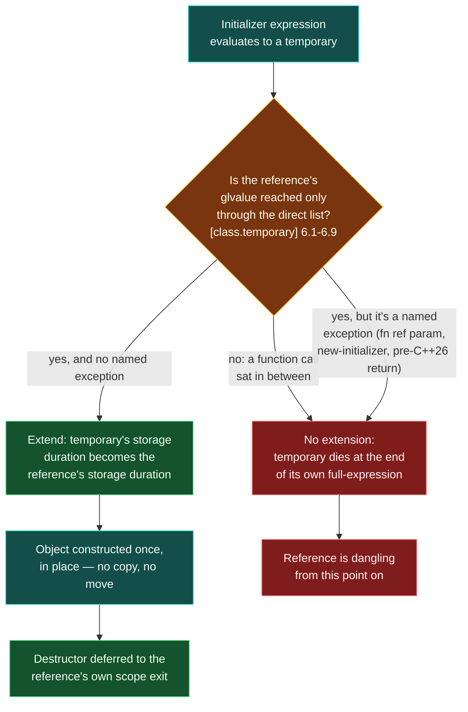

# Temporaries and Lifetime Extension

> [!essence]
> A reference bound **directly** to a temporary stretches that temporary's lifetime to match the reference's own, instead of letting it die at the end of the statement that created it. The rule is syntactic, not semantic: route the temporary through so much as one function call — even a one-line getter that returns a reference to its own member — and the stretching never happens. The reference compiles, and dangles.

## The Problem

A temporary normally dies at the end of the **full-expression** that creates it ([[Object Lifetime]]): the point of the semicolon, or the end of whatever enclosing expression the compiler can see. That rule alone would make half of idiomatic C++ illegal-by-accident. `const std::string& greeting = make_greeting();` and `const Shape& s = Circle{1.0};` both bind a reference to an object that, by the ordinary rule, is scheduled to disappear immediately.

> [!principle] Constraint → Consequence → Design
> 1. **Constraint:** A temporary's default lifespan is the full-expression that creates it — often less than one statement.
> 2. **Consequence:** A reference bound to that temporary on the same line would start dangling before the very next statement ran. `const T&` and by-value returns would be unusable as read-only handles to anything.
> 3. **Requirement:** For some well-defined, compiler-checkable set of *direct* bindings, the temporary's death must be tied to the reference's own lifetime instead of the enclosing expression's.
> 4. **Design:** C++ draws the line **syntactically**. `[class.temporary] ¶6` lists the exact expression shapes that count as "binding directly": a materialized prvalue, a parenthesized wrapper `(e)`, a built-in `a[n]` into an array, `.` to a non-static data member, a qualifying cast, or a glvalue `?:`/comma passthrough. A reference reached through nothing but that list keeps the temporary alive for as long as the reference itself.
> 5. **Price:** The list is shallow by design. It does **not** follow a temporary through a function call — not even a trivial accessor that hands back a reference to its own field. It is also switched off entirely in three named contexts the committee judged too dangerous to extend into: a function's own reference *parameter*, a `new`-initializer, and (until C++26) a `return` statement. Outside the list, you get a legal, silently dangling reference.

> [!tension] safety ⟷ performance
> Lifetime extension buys safety for free: see *Under the Hood*, it costs **zero** instructions, because it is implemented as a storage-duration relabeling at compile time, never a tracked reference count or a runtime check. That cheapness is exactly why the rule stays narrow. Following a temporary through an arbitrary function call would require the compiler to prove what the function does with its argument — alias analysis that is undecidable in general — so C++ instead defines extension by a fixed, local grammar it can check without looking inside any function body. The price of a free mechanism is a mechanism that only sees one syntactic step at a time.

## Mental Model

```text
 Ordinary temporary: dies at ';'         Direct binding: dies with r
┌─────────────────────────────┐        ┌─────────────────────────────┐
│ make_probe();                │        │ const Probe& r = make_probe();│
│   [constructed]  ──┐         │        │   [constructed in r's slot] │
│   [destroyed]    ◀─┘ ;       │        │   r ●─▶ same slot, reused    │
└─────────────────────────────┘        │   ... rest of the block ...  │
                                        │ }   ◀── r's scope ends HERE: │
                                        │        destructor runs NOW   │
                                        └─────────────────────────────┘
```

> [!model] A direct handoff, not a delivery
> In [[Value Categories]], a prvalue was furniture on a truck, not yet at an address. Binding a reference straight to that furniture is the one case where C++ lets it move into the reference's own house, for as long as that house stands.
> **Where it breaks:** send the furniture through a middleman first — pass it into a function, or ask a member function for a reference back to it — and the direct handoff is gone. The furniture is still hauled off on the truck's original schedule, while the address plate (the reference) is already hung on an empty lot.

## Step by Step



1. **Evaluate the initializer.** A prvalue materializes into a temporary, or a glvalue already names one ([[Value Categories]]).
2. **Check the binding path.** The compiler asks whether the reference's initializer-glvalue is reached from that temporary through nothing but the "transparent" forms in `[class.temporary] ¶6.1–6.9`: parentheses, a built-in array subscript, `.` to a non-static data member, a qualifying cast, or a glvalue `?:`/comma. A function call anywhere in the chain breaks this — a function's return type encodes a *new* expression, not a transparent view of the old one.
3. **Extend, if the path qualifies and no exception applies.** The temporary's storage duration is reassigned to match the reference's: automatic if the reference is local, static if the reference is static or thread-local ([[Storage Duration]]).
4. **Nothing moves.** The object was already going to be constructed in that spot — extension changes only *when the destructor runs*, never the object's address (see *Under the Hood*).
5. **Destroy at the reference's own scope exit.** Whatever would normally destroy a local of that storage duration — block exit, function return, program end — now also destroys the extended temporary, in reverse order of construction among anything that shares the moment.
6. **If an exception applies, nothing is extended.** A temporary bound to a function's own reference *parameter* dies at the end of the full-expression containing that call regardless of what the function does with it (`¶6.10`). A temporary bound to a reference member of an aggregate built with **parenthesized** initialization, `S(1, {2,3})`, dies the same way — only brace syntax, `S{1, {2,3}}`, extends (`¶6.11`, C++20). A temporary bound to a reference inside a `new`-initializer dies at the end of that full-expression, leaving the freshly built object holding a reference to nothing (`¶6.12`).

## Under the Hood

> [!machine] Extension is not a separate mechanism — it's a different answer to "when does the destructor run?" (GCC 11.4.0, x86-64 Linux, `-O0`, System V ABI; observed with `-S`)
> ```nasm
> ; const Probe& r = make_probe();
>         leaq  -40(%rbp), %rax
>         movq  %rax, %rdi
>         call  _Z10make_probev     ; ① result object constructed directly into r's slot
> ; ... two printf calls using r ...
>         leaq  -40(%rbp), %rax
>         movq  %rax, %rdi
>         call  _ZN5ProbeD1Ev       ; ② the ONLY destructor call: at the end of main, not after ①
> ```
> There is a second `call _ZN5ProbeD1Ev` in the exception-landing pad for the same slot, registered the same way a normal local's cleanup would be. No flag, no counter, no second object exists anywhere: `make_probe()`'s result is constructed once, straight into the memory that becomes `r`'s backing storage (the same direct-construction the caller sets up for any by-value return, per [[Copy Elision and RVO]]), and the compiler simply schedules the one destructor call at the end of `r`'s block instead of right after the call. **Cost: zero instructions.** Extension is a compile-time decision about *where to put a `call` instruction*, not a runtime facility.

## In Code

**1 · Extension working: the destructor waits for `r`, not for `make_probe()`**

```cpp
#include <cstdio>

struct Probe {
    const char* name;
    explicit Probe(const char* n) : name(n) { std::printf("ctor %s\n", name); }
    ~Probe() { std::printf("dtor %s\n", name); }
};

Probe make_probe() { return Probe("temp"); }        // returns a prvalue

int main() {
    std::printf("before\n");
    const Probe& r = make_probe();                    // ① direct binding: extension applies
    std::printf("using %s\n", r.name);
    std::printf("end of main\n");
}                                                      // ② r's scope ends here
// expect: before
// expect: ctor temp
// expect: using temp
// expect: end of main
// expect: dtor temp
```
1. `r` binds directly to the result object of `make_probe()` — the prvalue materializes right into `r`'s storage.
2. The destructor fires only when `r` goes out of scope, confirmed by `dtor temp` printing *last*, after both other lines that use `r`.

**2 · One member-function call is enough to break the chain**

```cpp
// cc: ub
#include <cstdio>
#include <string>

struct Wrapper {
    std::string s;
    const std::string& get() const { return s; }   // ① returns a reference, not the object
};

Wrapper make_wrapper() { return Wrapper{"hello, extension"}; }

int main() {
    const std::string& r = make_wrapper().get();      // ② looks identical to Example 1...
    std::printf("[%s]\n", r.c_str());                 // ③ ...but r is already dangling here
}
```
1. `get()` returns `const std::string&`: a *new* glvalue expression, not a transparent view of the temporary `Wrapper`.
2. The chain from `r` back to the `Wrapper` temporary passes through a function call, so `[class.temporary] ¶6.1–6.9` never matches. The `Wrapper` temporary dies at the semicolon, taking its `std::string` member with it.
3. **Observed:** GCC 11.4.0, x86-64 Linux, `-fsanitize=address,undefined` reports `stack-use-after-scope` here, deterministically, because `get()`'s result is a reference into memory ASan has already poisoned. Without a sanitizer this often "works" by accident — the bytes are usually still sitting on the stack, which is the dangerous part.

**3 · The standard's own contrast: brace aggregate-init extends, `new` never does**

```cpp
#include <cstdio>

struct Loud {
    int v;
    explicit Loud(int v) : v{v} { std::printf("ctor %d\n", v); }
    ~Loud() { std::printf("dtor %d\n", v); }
};
struct Holder { const Loud& ref; };                 // reference member

int main() {
    Holder a{Loud{1}};                 // ① brace direct-list-init: extended to match a
    std::printf("a.ref.v = %d\n", a.ref.v);

    Holder* p = new Holder{Loud{2}};   // ② [class.temporary] ¶6.12: never extended
    std::printf("p->ref is already dangling\n");
    delete p;
}                                       // ③ a's temporary (Loud 1) is destroyed only now
// expect: ctor 1
// expect: a.ref.v = 1
// expect: ctor 2
// expect: dtor 2
// expect: p->ref is already dangling
// expect: dtor 1
```
1. `a`'s temporary `Loud{1}` is bound through brace-init to a reference member and lives as long as `a` does.
2. `new Holder{Loud{2}}` builds the same shape on the heap — but a `new`-initializer is a named exception. `Loud{2}` is destroyed at the end of its own full-expression, immediately, before the `new` expression even finishes returning its pointer.
3. `dtor 1` prints last, confirming `a`'s extension lasted exactly until `a`'s own scope ended, well after `p`'s heap object (with its already-dangling reference) was deleted.

## Consequences

| Observed rule or failure | Explained by |
|---|---|
| `std::string_view sv = some_string_returning_call();` dangles immediately | A view is not a reference: nothing in `[class.temporary]` extends for a class that merely *stores* a pointer. See [[string_view]], [[Dangling Pointers and References]]. |
| `const Base& b = Derived{};` is a safe, common way to hold a polymorphic temporary read-only | `Derived{}` materializes and `b` binds directly to its `Base` subobject (`[class.temporary] ¶6.4`-style access): one of the few idioms that legitimately relies on extension. |
| A getter that returns `const T&` to its own member is unsafe to chain off a temporary | The getter call is a function call, which is never on the transparent list — Example 2. |
| `for (auto& x : make_container())` is safe for one loop, but `auto& r = make_container(); for (auto& x : r)` is not | The range-based `for` has its *own* dedicated extension clause for its range-initializer (`[stmt.ranged] `), separate from and narrower than ordinary reference binding — it doesn't carry over if you first stash the container in your own reference. See [[The Range-Based for Loop]]. |
| The extended object is never a copy of the temporary | Extension works on the exact result object a by-value return already constructs in place; see [[Copy Elision and RVO]] for why no copy exists to begin with. |

## Evolution

| Standard | Change | Why |
|---|---|---|
| **C++98** | Core rule: a reference to `const` may bind to a temporary, and that temporary's lifetime extends to the reference's. | Without it, `const T&` could not safely hold the result of a converting constructor or a by-value return. |
| C++11 | Rvalue references (`T&&`) add a second binding form that also triggers extension; several defect reports (e.g. CWG 391) were applied retroactively to stop *unnecessary* temporaries from being created in the first place when a reference binds directly to a same-type object. | Move semantics needed `T&&` to behave consistently with `const T&` for this purpose. |
| C++17 | Value categories are reframed around prvalues as "recipes," and the rule is restated in terms of the *temporary materialization conversion* rather than "a temporary that already exists." | Matches the broader P0135 shift described in [[Value Categories]]; the observable extension behavior is unchanged. |
| **C++20** | Parenthesized aggregate initialization (P0960) adds a new way to initialize a reference member — `S(expr)` — and the committee explicitly did **not** extend through it (`¶6.11`), even though the brace form `S{expr}` already did. | Keeps the new parenthesized form consistent with ordinary function-call argument passing, where extension never applies, rather than silently inventing a second, inconsistent rule. |
| **C++26** | P2748 makes a `return` statement that binds the returned reference directly to a temporary **ill-formed** — a compile error — instead of the historical silent dangling reference. | Before C++26, `const T& f() { return T{...}; }` compiled and always produced a dangling reference; the committee judged this pattern to have no legitimate use. |

## Connections

- **Prerequisites:** [[Value Categories]] (what a temporary is, as a property of an expression) · [[Object Lifetime]] (the default rule this mechanism overrides for one specific case).
- **Explains:** [[Dangling Pointers and References]] (the failure mode the moment extension doesn't fire) · [[Copy Elision and RVO]] (why the extended object is the real result object, not a copy).
- **Does not cover:** [[string_view]] (a view is not a reference, so it never gets this protection) · [[The Range-Based for Loop]] (its own, narrower, dedicated extension rule for the range-initializer).
- **Siblings:** [[References]] · [[Storage Duration]] (extension is literally a storage-duration reassignment).
- **Domain:** [[Map — Objects, Memory & Lifetime]].

## Check Yourself

> [!quiz]- What has to be true about how a reference's initializer reaches a temporary for lifetime extension to apply?
> The reference's glvalue must be reached from the temporary through nothing but the "transparent" forms in `[class.temporary] ¶6.1–6.9` — parentheses, a built-in array subscript, non-static member access via `.`, a qualifying cast, or a glvalue `?:`/comma — with no function call anywhere in the chain, and the context must not be one of the three named exceptions (a function's own reference parameter, a `new`-initializer, or, until C++26, a `return` statement).

> [!quiz]- Why doesn't lifetime extension follow a temporary through a function call, even a one-line getter that just returns a reference to its own member?
> Because the rule is defined syntactically, not by what the function actually does. Making it follow function calls would require the compiler to analyze the callee's body (or trust an annotation) to know whether the returned reference still points into the original temporary — undecidable in general, and far more expensive than the zero-cost, purely local check the grammar-based rule allows.

> [!quiz]- Predict: in Example 3, if `Holder* p = new Holder{Loud{2}};` were replaced with `Holder a2(Loud{3});` (parenthesized direct-init instead of braces), when would `dtor 3` print relative to the rest of `main`?
> Immediately — at the end of the full-expression that initializes `a2`, not at the end of `main`. `[class.temporary] ¶6.11` specifically excludes parenthesized aggregate initialization from extension, even though the brace form one line above it (`Holder a{Loud{1}};`) does extend.

> [!quiz]- Before C++26, what does `const std::string& f() { return std::string("x"); }` do, and what changes in C++26?
> Before C++26 it compiles cleanly and always returns a dangling reference: a `return` statement never extends the lifetime of a temporary it binds the returned reference to. Under P2748 (C++26), this pattern becomes **ill-formed** — the program fails to compile instead of compiling into guaranteed undefined behavior.

## Sources

- Primer §2.4.1 "References to const" (pp. 61–62): a reference to `const` binding to a compiler-generated temporary, and why a non-`const` reference may not.
- Primer §13.6.1 "Rvalue References" (pp. 532–533): rvalue references bind only to temporaries, and what that guarantees about the referred-to object.
- PPP §7.4 "Function call and return" (ch. 7 "Technicalities: Functions, etc."): pass-by-const-reference creating a compiler-generated temporary when the argument's type doesn't match exactly.
- cppreference, *Reference initialization* § "Lifetime of a temporary": https://en.cppreference.com/w/cpp/language/reference_initialization
- Draft standard `[class.temporary]` ¶6 (the direct-binding list and its three exceptions): https://eel.is/c++draft/class.temporary
- P2748R5, *Disallow Binding a Returned Glvalue to a Temporary* (adopted for C++26): https://isocpp.org/files/papers/P2748R5.html
