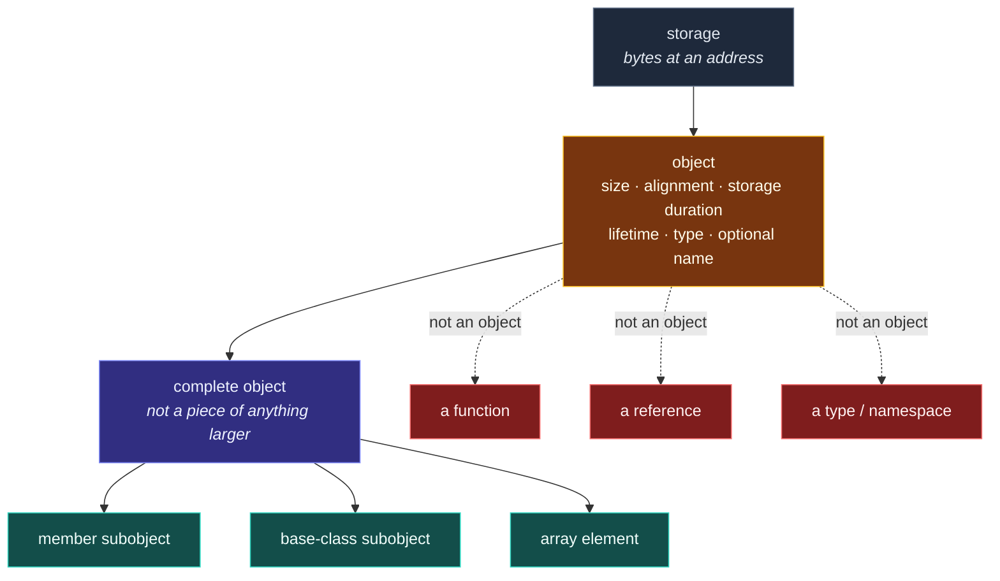

# The C++ Object Model — What an Object Is

> [!essence]
> An **object** is a region of storage, established when it is created, that has a size, an alignment, a storage duration, a lifetime, a type, and — optionally — a name. Everything the abstract machine says about "what a program does" is a claim about objects: which ones exist, what they may be read as, and when they stop being there.

## The Problem

[[The C++ Abstract Machine|The abstract machine]] promises to reproduce a program's observable behavior, but "behavior" has to be behavior *of something*. Hardware itself offers no such unit: a CPU has registers and an address space, and nothing at address `0x7ffd…` announces "here is one thing." Bytes are bytes.

> [!principle] Constraint → Consequence → Requirement → Design → Price
> 1. **Constraint:** Storage is just an array of bytes at addresses. A byte carries no marker saying where "the thing" it belongs to starts or ends, what type governs it, or how long it is meant to last.
> 2. **Consequence:** Without a unit smaller than "the whole address space" and larger than "one byte," the language has nothing to attach a type to, nothing whose lifetime a destructor could end, and no way to say that a pointer and a name refer to *the same* thing.
> 3. **Requirement:** The language needs a precisely defined unit — carved out of storage, bounded in extent, tagged with a type — that every rule about initialization, access, aliasing, and destruction can be stated in terms of.
> 4. **Design:** The Standard calls that unit an **object** (`[intro.object]`) and fixes exactly what every object has: a size, an alignment requirement, a storage duration, a lifetime, a type, and optionally a name. Composite objects are built from smaller **subobjects** — member subobjects, base-class subobjects, array elements — and the one that is not itself a piece of anything larger is the **complete object**.
> 5. **Price:** "Object" now means something narrower than the English word and stranger than the object-oriented one. A function is not an object. A reference is not an object. A `namespace`, a `type`, and an unbound non-static data member are not objects either. Getting this vocabulary exactly right is the price of every later rule — about lifetime, aliasing, and value categories — having an unambiguous subject to talk about.

> [!tension] abstraction ⟷ control
> The abstract machine's rules are stated entirely in terms of objects — abstract, paper-only units — yet every object a program creates ultimately *is* some bytes at some address on real hardware. The object model is the seam where those two pictures are forced to agree: the Standard's "object" and the compiler's "bytes it emitted a store to" must denote the same thing, or none of the language's guarantees mean anything.

> [!tension] value ⟷ identity
> A complete object and its subobjects are, in one sense, one piece of storage — but in another sense, several distinct objects that happen to overlap. `p.x` has its own address, its own type, and its own lifetime rules, even though it can never exist apart from `p`. Deciding when two expressions denote "the same object" (so that aliasing rules and pointer comparisons make sense) is this note's version of the value/identity question that [[Value Categories]] later asks of *expressions*.

## Mental Model

> [!model] A storage locker, not what's inside it
> An object is like a rented storage locker: it has an **address** (which locker), a **size and shape** fixed the moment it's built, a **lease term** during which the rental is active (storage duration bounds lifetime), and a **manifest** — the type — saying what may legally be kept there and how to interpret it. The nameplate on the door is optional: plenty of lockers (array elements, temporaries) are never given one.
> **Where it breaks:** a locker can sit empty between tenants. A C++ object can't meaningfully be "empty" — before initialization completes there is only storage, not yet an object with a value ([[Object Lifetime]] makes this precise). The locker analogy also hides composition: a locker doesn't normally contain smaller lockers that are separately rentable, but an object's subobjects are separately nameable, addressable things in their own right.



## Mechanics

The Standard fixes these facts about every object in `[intro.object]`. The table gives the rule and a concrete instance of each.

| Situation | Rule | Example |
|---|---|---|
| **Size** | Every non-bit-field object with nonzero size occupies one or more bytes, queryable with `sizeof` | `sizeof(Sensor)` |
| **Alignment** | Every object type has an alignment requirement: a power-of-two byte count its objects must start on | `alignof(Sensor)` |
| **Storage duration** | Fixes *when* storage is obtained and released: automatic, static, thread, or dynamic (elaborated in [[Storage Duration]]) | a local variable vs. one returned by `new` |
| **Lifetime** | Begins once storage exists and initialization completes; ends when destruction starts (elaborated in [[Object Lifetime]]) | the span in which `s.reading` holds a meaningful value |
| **Name (optional)** | A *named* object is a variable; many objects are never named | array elements, temporaries, the object a `new`-expression returns |
| **Complete object vs. subobject** | An object not contained in any other is the *complete object*; member subobjects, base-class subobjects, and array elements are pieces of one | `p` is complete; `p.x` is a member subobject of `p` |
| **Address sharing** | Two objects with overlapping lifetimes normally have distinct addresses; a *nested* object may share its container's address | For a standard-layout `struct`, the complete object and its first data member share an address (`[class.mem]`) |
| **Not objects** | Functions, references, types, non-static members used alone, `this`, and enumerators are excluded from "object" | `int& r = n;` — `r` itself is not an object; see Pitfalls |

> [!standard] A standard-layout object shares its first member's address
> `[class.mem]` guarantees that a pointer to a *standard-layout* class object can be `reinterpret_cast` to a pointer to its first non-static data member, and back — in other words, **no padding is allowed before the first member**. That is a language guarantee, not an implementation habit, and it is exactly what Example 2 below checks. It does not extend to classes with virtual functions, multiple access sections mixed with data, or non-standard-layout bases; those may (and typically do) place hidden data before the first declared member.

> [!standard] Polymorphic objects carry extra, compiler-managed state
> `[intro.object]` note 2 observes that some objects are **polymorphic**: a class that declares or inherits a virtual function. The implementation attaches extra information to each such object — in every mainstream ABI, one hidden pointer — that lets `dynamic_cast` and virtual calls recover the object's real type at run time. This note only flags that the state exists; how it is laid out and used is [[Virtual Dispatch — vptr and vtable]]'s subject, once [[Virtual Functions]] introduces the mechanism it serves.

## Under the Hood

> [!machine] Layout, GCC 11, x86-64 Linux (Itanium C++ ABI), `-O2`
> `Sensor` below has two data members, `int id` and `double reading`. `reading` needs 8-byte alignment, so the compiler inserts 4 bytes of padding after `id` to satisfy it — bytes that belong to the object's representation but to no member's value:

```text
struct Sensor { int id; double reading; };   // sizeof == 16, alignof == 8

  offset  0        4        8                16
          ┌────────┬────────┬────────────────┐
  Sensor  │   id   │ padding│    reading      │
          │ 4 bytes│ 4 bytes│    8 bytes      │
          └────────┴────────┴────────────────┘
          ▲                 ▲
       &s == &s.id       &s.reading == &s + 8

  &s and &s.id are the same address (offsetof(Sensor, id) == 0, [class.mem]);
  the compiler is free to place padding anywhere the Standard doesn't forbid —
  here, only "after id" satisfies reading's 8-byte alignment at a 16-byte total size.
```

`offsetof(Sensor, id)` reports `0` and `offsetof(Sensor, reading)` reports `8` (verified: GCC 11.4, x86-64 Linux, this vault's toolchain). The complete object `s`, its first member `s.id`, and the padding are all real bytes the compiler reserves; only `id` and `reading` ever hold a value a program can read without invoking undefined behavior.

## In Code

**1 · An object's properties are real even when its value is uninteresting**

```cpp
#include <cstdio>

struct Sensor {
    int id;
    double reading;
};

int main() {
    Sensor s{7, 98.6};                                       // ①
    std::printf("size    = %zu\n", sizeof(s));                // ②
    std::printf("align   = %zu\n", alignof(Sensor));
    std::printf("address = %p\n", static_cast<void*>(&s));    // ③
}
// prints: size    = 16
// prints: align   = 8
// prints: address = 0x... (a real address; varies every run)
```
1. `s` is a named, automatic-duration object: it has all six properties from the Mechanics table the moment this line finishes.
2. Size and alignment are fixed facts about `Sensor` the type, not about this particular `s` — every `Sensor` object has them.
3. The address is genuinely unpredictable from one run to the next, but it is not *meaningless*: at this exact moment, `s` occupies exactly this address, for exactly `sizeof(s)` bytes. GCC 11.4, x86-64 Linux; the printed size and alignment are this platform's numbers, not a language guarantee (`sizeof(int)` and `double`'s alignment are implementation-defined).

**2 · A standard-layout object shares its first member's address**

```cpp
#include <cassert>
#include <cstdio>

struct Point { int x, y; };   // standard-layout: no bases, no virtuals, one access section

int main() {
    Point p{3, 4};
    void* whole = static_cast<void*>(&p);
    void* first = static_cast<void*>(&p.x);   // ①
    assert(whole == first);                    // ②
    std::puts(whole == first ? "same address" : "different address");
}
// expect: same address
```
1. `p.x` is a member subobject of the complete object `p`.
2. This is not luck: `[class.mem]` guarantees it for any standard-layout type, which is why the `assert` cannot fail on a conforming implementation.

**3 · A reference is not an object — it has no identity of its own**

```cpp
#include <cstdio>

int main() {
    int n = 42;
    int& r = n;                                       // ①
    std::printf("%d\n", &r == &n);                     // ②
    std::printf("%zu %zu\n", sizeof(n), sizeof(r));     // ③
}
// expect: 1
// expect: 4 4
```
1. `r` binds to `n`; no new object is created — `[intro.object]` explicitly excludes references from "object."
2. `&r` denotes `n`'s address, because there is no separate reference-object to take the address *of*.
3. `sizeof(r)` reports the size of `n` (4 bytes, typical for `int` on this platform), never "the size of a reference" — there is no such object to measure.

**4 · Creating an object in under-aligned storage is undefined behavior**

```cpp
// cc: ub
#include <cstdint>
#include <cstdio>
#include <new>

struct alignas(8) Aligned { std::int64_t v; };

void f() {
    alignas(1) unsigned char buffer[sizeof(Aligned) + 1];
    Aligned* p = new (buffer + 1) Aligned{42};   // ①
    std::printf("%lld\n", static_cast<long long>(p->v));
}

int main() { f(); }
```
1. `buffer + 1` satisfies no particular alignment, but `Aligned` requires 8-byte alignment. `[intro.object]` states plainly that constructing an object in storage that doesn't meet its type's alignment requirement is undefined behavior. This vault's toolchain (GCC 11.4, x86-64 Linux, `-fsanitize=address,undefined`) observes UBSan's alignment check fire on both accesses to `p->v`: a runtime error naming the exact misaligned address and the 8-byte requirement — printed, not aborted, since UBSan diagnoses and continues by default. The program still prints `42` and exits normally. Never treat a `cc: ub` block's behavior, caught or silent, as a language guarantee either way.

## Pitfalls

> [!trap] C++'s "object" is not the object-oriented one
> Everyday and OOP usage of "object" usually means "an instance of a class, with methods." C++'s object model is broader and stricter at once: an `int`, a `double`, and a plain `struct` with no member functions are all fully objects, while a `class`, a `namespace`, or a template — the things OOP jargon calls "types" or "modules," not instances — are never objects themselves. Read "object" in this vault as the Standard's term (storage + size + alignment + duration + lifetime + type), not as "a class instance."

> [!ub] Misaligned storage is undefined behavior, sanitizer or not
> Example 4 constructs an `Aligned` object one byte off its required 8-byte boundary. `[intro.object]` gives that no defined meaning at all — the compiler is entitled to assume every `Aligned` object is properly aligned and to vectorize or reorder accordingly. UBSan happens to catch this particular case (see Example 4); plenty of alignment violations produce no diagnostic on any build and only misbehave on hardware that actually enforces the requirement.

> [!trap] "Same bytes" is not "same object"
> Two non-overlapping objects of the same type at different addresses are always distinct objects, even with identical values — `Point{3,4}` in one variable and `Point{3,4}` in another never compare equal *as objects* (only their values might, if you write `operator==`). Conversely, `p` and `p.x` genuinely share bytes and, for a standard-layout first member, an address — yet they are still two objects, with two independent lifetimes bound by containment. "Same address" and "same object" line up for a complete object and its first member; they are not the same question in general.

## Evolution

See [[Map — Evolution of C++]] for the language-wide timeline.

| Standard | Change | Why |
|---|---|---|
| **C++98** | The object model — object, subobject, complete object — formalized in the Standard's own terms (`[intro.object]`), building on C's simpler "region of storage" | Class composition (bases, members, arrays of objects) needed precise rules for what a pointer or reference could denote |
| C++11 | `alignas`/`alignof` let code query and request the alignment leg of the model directly, rather than relying on the compiler's default choice | Libraries needed portable control over object placement (SIMD types, lock-free structures) |
| C++17 | Guaranteed copy elision: a prvalue is no longer a temporary object but a recipe that initializes its target directly ([[Value Categories]], `[conv.rval]`) | Removed a needless object (and a copy/move requirement) from every `return`-by-value |
| **C++20** | *Implicit-lifetime types* and rules for objects implicitly created by `malloc`, `memcpy`, and `std::bit_cast` (P0593R6) | Gave long-standing low-level idioms (`malloc`-then-populate, byte-copying a struct) a defined object-model story instead of relying on undefined behavior compilers happened not to punish |
| C++26 (working draft) | Further generalizes implicit object creation and adds `std::start_lifetime_as`-style vocabulary; through C++23 the rules covered fewer operations | Ongoing work to make low-level storage reuse fully specified rather than "usually fine" |

## Connections

- **Prerequisites:** [[The C++ Abstract Machine]] — objects are the units the abstract machine's rules (initialization, access, destruction) are stated about.
- **Enables:** [[Storage Duration]] (the *where* leg, elaborated) → [[Object Lifetime]] (the *how long* leg, elaborated) → [[References]] · [[Pointers]] (access paths to objects) → [[Virtual Functions]] (what a polymorphic object's hidden state serves).
- **Siblings:** [[What a Type Is]] — a type is the values/operations/representation triple; an object is the region of storage that holds a value *of* a type. Neither exists usefully without the other.
- **Explains:** [[Value Categories]] (C++17's rule that a prvalue is not yet an object) · [[Virtual Dispatch — vptr and vtable]] (the mechanism behind a polymorphic object's extra state).
- **Domain:** [[Map — Objects, Memory & Lifetime]].
- **Practice:** no Continuum project is registered against this note yet; it underlies #11 (Pointer & Array Internals Lab), where printing `&obj` and `&obj.member` side by side is exactly Example 2.

## Check Yourself

> [!quiz]- What six properties does the Standard say every object has, and which one is optional?
> Size, alignment, storage duration, lifetime, type, and — optionally — a name. A named object is a variable; array elements, temporaries, and the object behind a `new`-expression's pointer are objects with no name at all.

> [!quiz]- Why isn't a function an object, even though machine code for it occupies storage in the executable?
> `[intro.object]` defines "object" as a specific kind of construct with a type, a storage duration, and a lifetime governed by `[basic.life]`; a function has none of these in the object-model sense — it isn't created, doesn't have a lifetime that ends, and isn't assigned a storage duration from `[basic.stc]`. It occupies bytes the way code does, not the way an object does.

> [!quiz]- `struct Widget { char tag; int id; };` on a platform where `int` needs 4-byte alignment. Predict `offsetof(Widget, id)`, and say whether `&w == &w.tag` is guaranteed.
> `offsetof(Widget, id)` is `4`: one byte for `tag`, then three padding bytes so `id` starts on a 4-byte boundary. `&w == &w.tag` *is* guaranteed, because `Widget` is standard-layout and `tag` is its first data member — `[class.mem]` forbids padding before the first member, no matter how much padding appears after it.

> [!quiz]- A colleague says "that class doesn't have any objects, it's just a namespace of static functions." Is "object" the right word for what they mean, and what would you say instead?
> They mean something closer to "no instances are ever created" — plain, everyday usage. In the Standard's sense every one of that class's *static* data members, if it had any, would still be full objects; "object" in this vault always means the `[intro.object]` construct (storage + size + alignment + duration + lifetime + type), which has nothing to do with whether a class is used for grouping functions.

## Sources

- PPP §2.1 "Input" (ch. 2 "Objects, Types, and Values"): introduces an object as a piece of memory tagged with a type that governs what may be stored there, and a named object as a variable — the starting vocabulary this note formalizes.
- Primer §2.1 "Primitive Built-in Types" (p. 33): bytes have addresses, and giving meaning to memory at an address requires knowing the type stored there — the constraint this note's derivation opens with.
- Primer §15.2 "Defining Base and Derived Classes" (p. 597): a derived object "contains multiple parts" — a subobject for its own members plus one for each base class — the book's own encounter with subobjects, in inheritance terms.
- cppreference, *Object*: https://en.cppreference.com/w/cpp/language/object — size, alignment, storage duration, lifetime, type, optional name; subobjects, complete objects, polymorphic objects; and its Notes section contrasting C++ "object" with the OOP term.
- cppreference, *Non-static data members* §Standard-layout: https://en.cppreference.com/w/cpp/language/data_members — the reinterpret_cast-to-first-member guarantee this note's Example 2 verifies.
- Draft standard `[intro.object]`: https://eel.is/c++draft/intro.object — the formal definition of object, subobject, complete object, and address-sharing rules.
- Draft standard `[class.mem]`: https://eel.is/c++draft/class.mem — standard-layout address-sharing guarantee.
- WG21 P0593R6, *Implicit creation of objects for low-level object manipulation*: https://wg21.link/p0593r6 — the C++20 change cited in Evolution.
