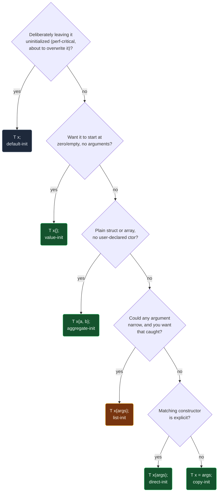

# The Forms of Initialization

> [!essence]
> Every object gets its first value at one specific moment, and C++ spells that moment six different ways: `T x;` (default), `T x{};` (value), `T x(v);` (direct), `T x = v;` (copy), `T x{v};` (list), and `T x{a, b};` on a plain struct or array (aggregate). These are not six mechanisms racing at run time — the compiler picks exactly one path at compile time, and the spelling you write is what selects it. The forms differ in three concrete ways: whether an `explicit` constructor is even considered, whether a narrowing conversion is an error or a warning, and what a built-in type with no supplied value ends up holding — garbage, or zero.

## The Question

Every declaration with an initializer, every function argument, every `new`-expression, every member in a constructor's initializer list asks the same question: *how, exactly, does this object acquire its first value?* The six named forms above are the six answers the grammar recognizes. Get the wrong one and the visible failure ranges from a compile error to a silently uninitialized `int` that happens to work in testing and crashes in production.

> [!principle] Why there are six, not one
> 1. **Constraint.** C++ inherited C's two spellings — `T x = v;` for scalars, and `{...}` for arrays and plain structs — and then added **constructors**, a class's own function that must run to build it. A function call needs parentheses, so `T x(v);` had to exist as its own form, separate from copy's `=`.
> 2. **Consequence.** Two new problems appeared immediately. First, `T x(v);` is grammatically identical to a function declaration when `v` looks like a type — an ambiguity the grammar resolves in favor of *declaration*, silently, whatever the programmer meant ([[The Most Vexing Parse]]). Second, generic code (templates) needed one spelling that means "initialize a `T` from these arguments" regardless of whether `T` is a scalar, an aggregate, or a class with constructors — and none of the existing forms worked uniformly across all three.
> 3. **Requirement.** The language needed a syntax that (a) works on every kind of type without the writer knowing which kind it is, and (b) could, for once, *refuse* a conversion that silently drops information — something none of the four older forms ever did.
> 4. **Design.** C++11 added **list-initialization**: `T x{v};` and `T x = {v};`, defined to route to whichever of direct- or copy-initialization applies, plus two rules of its own — it also initializes aggregates and raw arrays, and it makes narrowing conversions (`double` to `int`, wider integer to narrower) **ill-formed**, not merely suspicious.
> 5. **Price.** Six ways to write "give this object a value," each legal in different contexts, each with its own exceptions to memorize: which forms `explicit` blocks, which forms tolerate narrowing, and which historical spelling still means "declare a function" instead of what you typed.

## At a Glance

| Criterion | Default `T x;` | Value `T x{};` | Direct `T x(v);` | Copy `T x = v;` | List `T x{v};` | Aggregate `T x{a,b};` |
|---|---|---|---|---|---|---|
| **Needs an initializer** | ✗ none given | ✗ empty braces/parens | ✓ | ✓ | ✓ | ✓ |
| **Built-in scalar, no value supplied** | ✗ indeterminate | ✓ zero | — | — | — | ✓ leftover members zero |
| **Considers `explicit` constructors** | — | ~ default ctor only | ✓ | ✗ excluded | ~ only without `=` | ✗ no constructor exists |
| **Narrowing conversion (`double`→`int`)** | — | — | ✓ allowed (silent under `-Wall`) | ✓ allowed (silent under `-Wall`) | ✗ ill-formed | ✗ ill-formed (since C++11) |
| **Most-vexing-parse risk** | ✗ | ✗ | ✓ with `T x(SomeType());` | ✗ | ✗ | ✗ |
| **Applies to a plain struct/array with no user-declared ctor** | ✓ | ✓ (aggregate-init, see below) | ~ parenthesized form only since C++20 | ✓ | ✓ | ✓ — this *is* the aggregate form |

## Deep Dive

### Default-initialization: whatever the type's own rule says, or nothing

`T x;` with no initializer at all. For a class type, this calls the default constructor. For a built-in type (or an array of them) with automatic or dynamic storage duration, it does *nothing* — the bits already in that memory become the object's value, which the Standard calls an **indeterminate value** (`[dcl.init.general]`, def:default-initialization; Primer §2.2.1, p. 43). Reading that value before writing one is undefined behavior in the general case ([[Undefined Behavior]] covers exactly this). Object Lifetime's own account of **vacuous initialization** — a no-op that still counts as "complete" the instant the declaration is reached — is this same rule seen from the lifetime side ([[Object Lifetime]] §Mechanics).

A non-local variable with static or thread storage duration is the one exception worth remembering: the language never lets a `static` or namespace-scope object hold garbage, so default-initialization there is preceded by zero-initialization regardless of which form you wrote ([[Storage Duration]]; see *Zero-initialization*, below).

### Value-initialization: zero it first, unless a constructor already promised to

`T x{};`, `T()`, `new T()`, or an empty member initializer `member() {}` — always an *empty* pair of braces or parentheses. Its effect on a class type depends on one precise fact: does the class have a **user-provided** default constructor?

- **No** (no constructor at all, or only compiler-generated/defaulted ones): the object is zero-initialized *first*, then default-initialized. Every member starts at zero even if the (implicit) default constructor never touches it.
- **Yes** (a constructor with a body, even an empty one, written by the class author): zero-initialization is skipped entirely. Only default-initialization runs, so any member the constructor doesn't mention is left indeterminate — the same fate as default-init's own scalars.

This exact split is a corrected rule, not the original one: before a defect-report fix (CWG 1368), *any* user-**declared** constructor — even a `= default`'d one — skipped the zeroing step, which is the version distinction to keep straight when reading code or advice written against C++98's original wording. *In Code* §4 compiles both branches. For an array type, value-initialization value-initializes each element in turn; for anything else, it's plain zero-initialization. One overlap to note: if `T` is an [[#Aggregate initialization: no constructor exists, so the compiler fills the members itself|aggregate]], empty braces trigger *aggregate*-initialization instead of this rule — each member is separately value-initialized, which usually looks identical but is a different path through the grammar (cppreference, *Value-initialization*).

> [!standard] Zero-initialization is a sub-step, not something you spell
> **Zero-initialization** means: arithmetic types become `0` (or `0.0`), pointers become `nullptr`, and a class or array is zero-initialized member/element-wise, recursively. You never request it directly — it happens as the first half of value-initialization for a no-user-provided-ctor class, and it happens to every non-local static/thread-duration object before any dynamic initializer runs, which is exactly why relying on the *order* of two such objects' dynamic initializers across translation units is the static-initialization-order fiasco rather than a crash on uninitialized memory ([[Storage Duration]]).

### Direct-initialization: call a constructor, holding nothing back

`T x(v);`, `T x{v};` written without `=`, a `new`-expression's parenthesized arguments, a function-style cast `T(v)`, a `static_cast<T>(v)`, and a constructor's own member-initializer-list entries all funnel into direct-initialization. Its defining feature: **every** constructor is a candidate, including ones marked `explicit`, and overload resolution picks the best match exactly as it would for an ordinary function call ([[Constructors]]).

That permissiveness is also the source of the form's one famous trap. Because `T x(arg);` and a function declaration share the same grammar, the compiler resolves any ambiguity in favor of *declaring a function* — silently, in the general case. `Widget w(std::string());` does not construct a `Widget` from a temporary string; it declares a function named `w` returning `Widget`. *In Code* §2's annotation shows GCC's modern `-Wvexing-parse` catching this — a diagnostic added well after the rule itself, which is why older code and older advice never mention it. The trap is common enough to have its own name and its own note: [[The Most Vexing Parse]].

Since C++17, direct-initializing `T` from a **prvalue of that exact same class type** skips constructing a temporary at all — the prvalue's result object *is* the destination object, guaranteed, not merely permitted as an optimization. `T x(makeT());` never runs a move constructor to relocate the result; there is nothing to move. See [[Copy Elision and RVO]] for the mechanism and [[Value Categories]] for what changed about prvalues to make this guarantee possible.

### Copy-initialization: the same search, with `explicit` vetoed

`T x = v;`, passing an argument by value, returning by value, throwing a value, and catching by value are all copy-initialization. The rule is direct-initialization's overload resolution with one restriction added: only **non-explicit** constructors and non-explicit conversion functions are considered. `explicit Meters(double);` is exactly why `Meters m = 3.5;` is ill-formed while `Meters m(3.5);` compiles (Primer §7.5.4, p. 296; §13.1, p. 498) — *In Code* §3 compiles both sides of that line.

Narrowing is where copy-initialization is more permissive than its list-initialized cousin: `int n = 3.9;` truncates to `3` and compiles cleanly under `-Wall -Wextra`; only `-Wconversion`/`-Wfloat-conversion` reports it (verified locally, GCC 11.4.0, x86-64 Linux). Nothing about copy-initialization's own grammar forbids the narrowing — the restriction is list-initialization's alone.

### List-initialization: one spelling for (almost) everything, with narrowing outlawed

`T x{v};`, `T x{a, b, ...};`, and `T x = {v};` (C++11) route to whichever of direct- or copy-initialization the presence or absence of `=` selects — **direct-list-initialization** without `=` still considers `explicit` constructors; **copy-list-initialization** with `=` excludes them, exactly mirroring the non-list rule one level up (`[dcl.init.list]`). List-initialization adds two behaviors no other form has: it is the syntax that reaches [[#Aggregate initialization: no constructor exists, so the compiler fills the members itself|aggregate-initialization]] and empty-brace value-initialization, and it makes a **narrowing conversion of a scalar initializer-clause ill-formed** — not a warning, a hard error, even where copy-initialization would silently truncate (Tour §1.4, p. 8 introduces the brace form precisely for this guarantee; *In Code* §3 compiles the copy-init line and fails to compile the list-init line in the same translation unit). When a class has both an ordinary constructor and one taking `std::initializer_list<T>`, braced arguments prefer the `initializer_list` overload if any viable one exists — the reason `std::vector<int> v{10}` makes a one-element vector, not a ten-element one (Primer §3.3, p. 100). The C++ Core Guidelines' own summary is ES.23: *prefer the `{}` syntax*.

### Aggregate initialization: no constructor exists, so the compiler fills the members itself

An **aggregate** — an array, or a class with no user-declared/inherited constructor, no private or protected direct data members, no virtual functions, and (since C++17) no private, protected, or virtual base classes — has no constructor to call at all, so `T x{a, b};` copy-initializes each **element** (each base class, in declaration order, then each data member, since C++17; only members before C++17) directly from the corresponding initializer clause (`[dcl.init.aggr]`; Primer §7.5.5, p. 298). Extra members with no initializer clause are value-initialized, not left indeterminate — the same "leftover members zero" row from *At a Glance*.

> [!standard] The exact definition of "aggregate" has moved twice
> **Until C++11:** no user-declared constructors of any kind, and no base classes. **C++11 to C++20:** no user-**provided**, inherited, or `explicit` constructor — a class with only a `= default`'d or `= delete`'d constructor still qualified, and C++17 additionally allowed public base classes. **Since C++20:** tightened back to *no user-declared or inherited constructor at all*, closing the gap where a merely-declared-but-not-provided constructor kept a type "accidentally" aggregate (cppreference, *Aggregate initialization* §Aggregate). Code relying on the C++11–17 window compiling under C++20 should be checked against this table, not assumed.

C++20 added two more spellings for the same rule: **designated initializers**, `T x{.member = v, ...}` (members named, in declaration order — C's out-of-order and nested forms are not legal in C++), and, separately, **parenthesized aggregate initialization**, `T x(a, b);` — legal for the first time, because before C++20 an aggregate simply had no constructor for the parenthesized form to call. The parenthesized form is not a drop-in replacement for braces: it permits narrowing, performs no brace elision, and does not extend a reference member's lifetime the way the braced form does (cppreference, *Direct-initialization*). *In Code* §5 and §6 verify both the new syntax and its version boundary directly.

## Decision Guide



In words: default the reflex to `{}` (Core Guidelines ES.23) — it is the one spelling that works on scalars, classes, and aggregates alike, and it is the only one that refuses a narrowing conversion instead of truncating quietly. Reach for parentheses only when a matching constructor is `explicit` and you are deliberately calling it directly, or when narrowing is intentional and already understood at the call site.

## In Code

**1 · The six spellings, one type at a time**

```cpp
#include <cassert>
#include <string>

int main() {
    int n1;             // ① default-init: indeterminate, never read
    int n2{};            // ② value-init: zero
    int n3(5);            // ③ direct-init
    int n4 = 5;            // ④ copy-init
    int n5{5};              // ⑤ list-init
    (void)n1;
    assert(n2 == 0);
    assert(n3 == 5 && n4 == 5 && n5 == 5);

    std::string s1;           // default-init: ""
    std::string s2("hi");      // direct-init
    std::string s3 = "hi";      // copy-init
    std::string s4{"hi"};        // list-init
    assert(s1.empty());
    assert(s2 == "hi" && s3 == "hi" && s4 == "hi");
}
```
1. Left alone on purpose: an `int` with automatic storage has no default constructor to fall back on, so this is genuinely indeterminate.
2. The only one of the five that guarantees zero for a scalar with no value written.
3–5. Three different grammars, the same 32-bit value — the point is that all three *can* agree, not that they always must (see §2 and §3 for where they diverge).

**2 · `explicit` blocks copy-initialization, not direct-initialization**

```cpp
// cc: ill-formed
struct Meters {
    explicit Meters(double v) : value(v) {}
    double value;
};

int main() {
    Meters a(3.5);       // ① direct-init: explicit constructors are candidates
    Meters b{3.5};       // ② direct-list-init (no '='): also a candidate
    Meters c = 3.5;      // ③ error: copy-init excludes explicit constructors
    Meters d = {3.5};    // ④ error: copy-list-init excludes them too
    (void)a; (void)b; (void)c; (void)d;
}
```
1. Full overload resolution, `explicit` included — this is what "direct" means.
2. Braces without `=` follow the direct rule, not the copy rule.
3. `Meters(double)` is a candidate, but `explicit` removes it from copy-initialization's shortened list, and nothing else can convert `3.5` to `Meters`.
4. Confirms the rule applies to the braced copy form too: the `=` is what selects copy-initialization, not the presence of braces.

**3 · Narrowing: a warning in copy-init, an error in list-init**

```cpp
// cc: ill-formed
int main() {
    int a = 3.9;    // ① copy-init: compiles under -Wall -Wextra; a becomes 3
    int b{3.9};      // ② list-init: narrowing is ill-formed, not a warning
    (void)a; (void)b;
}
```
1. GCC 11.4.0 with `-Wall -Wextra` reports nothing here; only `-Wconversion`/`-Wfloat-conversion` (not in `-Wall`) flags the silent truncation (verified locally).
2. The exact same conversion, spelled with braces, fails to compile outright — `[dcl.init.list]`'s narrowing rule, not a stricter warning level.

**4 · Value-initialization's hidden first step: zero, then default**

```cpp
#include <cassert>
#include <string>

struct Counter {              // ① no user-declared constructor at all
    int hits;
    std::string label;
};

struct Logger {                // ② user-provided default constructor
    Logger() {}                  // never mentions `hits`
    int hits;
    std::string label;
};

int main() {
    Counter c{};                  // value-init: zero-inits every member first
    assert(c.hits == 0);
    assert(c.label.empty());

    Logger l{};                    // value-init: Logger() runs; it never zeroes hits
    assert(l.label.empty());        // label is default-initialized by its own type's rule
    (void)l;                          // l.hits is indeterminate — reading it would be UB
}
```
1. `Counter` has only a compiler-generated default constructor, so it is **not** "user-provided": value-init zero-initializes the whole object first.
2. `Logger`'s constructor is user-provided — even though its body is empty — so the zero-initialization step is skipped entirely, and `hits` is left exactly as default-initialization would leave it: indeterminate.

**5 · Aggregates: braces since C++98, parentheses only since C++20**

```cpp
#include <cassert>

struct Point {              // ① aggregate: no user-declared ctor, no private members
    int x;
    int y;
};

int main() {
    Point a{1, 2};                  // ② aggregate-init via braces — always legal
    Point b(1, 2);                   // ③ aggregate-init via parentheses — C++20 only
    Point c{.x = 1, .y = 2};           // ④ designated initializers — C++20
    assert(a.x == 1 && a.y == 2);
    assert(b.x == 1 && b.y == 2);
    assert(c.x == 1 && c.y == 2);
}
```
1. No constructor exists at all, public data members, no bases: every requirement for an aggregate.
2. The original spelling: copy-initializes each member from the corresponding clause, in declaration order.
3. Same effect, new grammar: before C++20 this was a hard error (`Point::Point(int, int)` doesn't exist and never did).
4. Names replace position; still no out-of-order or nested designators, unlike C.

**6 · Confirming the C++20 boundary directly**

```cpp
// cc: ill-formed
// cc: std=c++17
struct Point { int x; int y; };

int main() {
    Point b(1, 2);   // error under C++17: Point has no matching constructor
}
```
Compiled locally at `-std=c++17` (GCC 11.4.0): this fails with exactly the "no matching function for call to `Point::Point(int, int)`" diagnostic — the same program that *In Code* §5's line ③ compiles cleanly at the vault's default `-std=c++20`. The feature is P1975R0; nothing about `Point` itself changed between the two blocks.

## Connections

- **Prerequisite:** [[Object Lifetime]] — initialization completing is the second half of what starts an object's lifetime; every form above is one way to satisfy that half.
- **What runs underneath:** [[Constructors]] (direct-, copy-, value-, and non-empty aggregate-initialization all eventually resolve to a constructor call, or to none at all for a true aggregate).
- **Interacts with:** [[Value Categories]] and [[Copy Elision and RVO]] (C++17's guaranteed elision when direct-initializing from a same-type prvalue) · [[Conversion Operators and explicit]] (exactly which conversions copy-initialization is allowed to use) · [[Storage Duration]] (zero-initialization of non-local static/thread-duration objects) · [[Undefined Behavior]] (reading a default-initialized scalar's indeterminate value) · [[Dynamic Memory — new and delete]] (a `new`-expression direct-initializes the object it allocates for).
- **Named trap:** [[The Most Vexing Parse]] — direct-initialization's parenthesized form, misread by the grammar as a function declaration. [[Reading Uninitialized Variables]] is the full treatment of what default-initialization's "does nothing" leaves behind.
- **Domain:** [[Map — Objects, Memory & Lifetime]].

## Check Yourself

> [!quiz]- `int n;` and `int n{};` — what does each guarantee about `n`'s value, and which one is default-initialization?
> `int n;` is default-initialization: for a built-in scalar it does nothing, so `n` holds an indeterminate value. `int n{};` is value-initialization: it guarantees zero. Only the second is safe to read immediately.

> [!quiz]- Why does `Meters m = 3.5;` fail to compile when `Meters`'s constructor is `explicit Meters(double)`, while `Meters m(3.5);` succeeds?
> `explicit` removes a constructor from the set copy-initialization (the `=` form) is allowed to search. Direct-initialization (`Meters m(3.5);`) performs full overload resolution, `explicit` constructors included, so it finds and calls it.

> [!quiz]- `struct Empty { Empty() {} int n; }; Empty e{};` — is `e.n` guaranteed to be `0`?
> No. `Empty`'s default constructor is user-provided (it has a body, even though the body is empty), so value-initialization's zero-first step is skipped. `e.n` is left exactly as default-initialization would leave it: indeterminate.

> [!quiz]- `int a = 3.9;` and `int b{3.9};` — which one fails to compile, and why does the other one not even warn under `-Wall -Wextra`?
> `int b{3.9};` fails: list-initialization makes narrowing conversions ill-formed. `int a = 3.9;` compiles silently truncating to `3` because copy-initialization's own grammar never restricted narrowing — catching it needs `-Wconversion`, which `-Wall -Wextra` does not enable.

> [!quiz]- `Point p(1, 2);` for `struct Point { int x, y; };` — does this compile, and has the answer always been the same?
> It compiles under C++20 and later. Before C++20 it was ill-formed: `Point` has no constructor (it's an aggregate), and the parenthesized form had no rule for aggregates until P1975R0 added one. The braced form `Point p{1, 2};` has worked since C++98.

> [!quiz]- What is a plain struct with two public `int` members required to have *zero* of, to qualify as an aggregate, and what did C++20 change about that requirement?
> Zero user-declared or inherited constructors (also zero private/protected data members, virtual functions, and — since C++17 — private/protected/virtual base classes). C++20 tightened the constructor rule: from C++11–17 a class with only a `=default`'d or `=delete`'d constructor still counted as an aggregate; since C++20 any user-declared constructor at all disqualifies it.

## Sources

- Primer §2.2.1 "Variable Definitions" (p. 43): the four-forms framing and default-initialization's indeterminate scalar. §3.3 "Library `vector` Type" (p. 100): `initializer_list` constructors winning over ordinary ones in list-init. §3.2/§13.1 "Direct and Copy Forms of Initialization" (p. 84, p. 497–498) and §7.5.4 "Suppressing Implicit Conversions" (p. 296): why `explicit` blocks copy- but not direct-initialization. §7.5.5 "Aggregate Classes" (p. 298): the pre-C++17 aggregate definition. §12.1 "Dynamic Memory and Smart Pointers" (p. 459, p. 464): value-initialization via `new T()`, and why smart-pointer construction must use the direct form.
- Tour §1.4 "Types, Variables, and Arithmetic" (p. 8): the brace-initialization form introduced specifically for its narrowing guarantee.
- cppreference, *Initialization* (the six-form grammar table): https://en.cppreference.com/w/cpp/language/initialization · *Default-initialization*: https://en.cppreference.com/w/cpp/language/default_initialization · *Value-initialization* (the user-provided-vs-not split, CWG 1368): https://en.cppreference.com/w/cpp/language/value_initialization · *Direct-initialization* (most vexing parse, C++17 same-type prvalue rule): https://en.cppreference.com/w/cpp/language/direct_initialization · *Copy-initialization*: https://en.cppreference.com/w/cpp/language/copy_initialization · *List-initialization*: https://en.cppreference.com/w/cpp/language/list_initialization · *Aggregate initialization* (the moving definition of "aggregate", designated initializers, parenthesized aggregate init since C++20): https://en.cppreference.com/w/cpp/language/aggregate_initialization
- Draft standard `[dcl.init.general]` (def:default-initialization, def:value-initialization, def:zero-initialization): https://eel.is/c++draft/dcl.init.general · `[dcl.init.aggr]` (aggregate element order, base classes since C++17): https://eel.is/c++draft/dcl.init.aggr · `[dcl.init.list]` (narrowing conversions ill-formed in list-initialization): https://eel.is/c++draft/dcl.init.list
- C++ Core Guidelines ES.23 "Prefer the `{}`-initializer syntax": https://isocpp.github.io/CppCoreGuidelines/CppCoreGuidelines#es23-prefer-the--initializer-syntax
